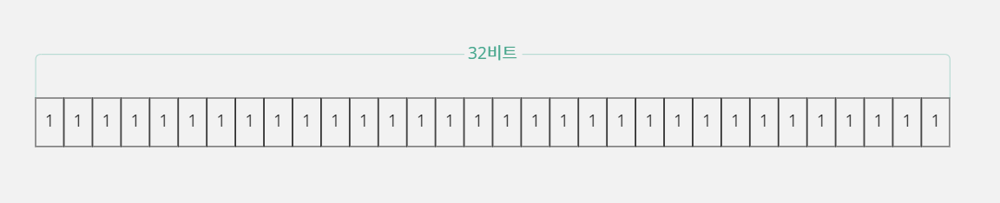

# 6. 표준 출력 함수

## 6-1. 라이브러리

### 라이브러리란 무엇일까?

- C 언어 프로그램은 함수 단위로 구성되는데, 이렇게 만들어진 함수들 중에는 내용이 거의 변경되지 않는 함수들도 있다.
- C 언어에서는 좀 더 효과적으로 함수를 관리할 수 있도록 라이브러리(Library) 기술을 제공한다.
- 지속적으로 업데이트가 필요한 함수들만 소스 파일에 유지하고 나머지 함수들은 라이브러리 파일에 넣어서 관리할 수 있도록 만든 것이다.

### 라이브러리 파일(*.lib)이 등장한 이유

- 목적 파일(Object File)은 소스 파일을 컴파일해서 만들어지고, 소스 코드가 변경되지 않았다면 컴파일 과정 없이 전에 만들어 놓은 목적 파일을 그대로 사용해서 실행 파일이 만들어진다.
- 하지만 프로그래밍을 하다 보면 '소스 전체 저장' 또는 '소스 전체 컴파일' 기능을 사용하는 경우가 있다.
- 이 경우에 프로그래머가 소스 코드를 변경하지 않았어도 소스 파일 전체가 다시 컴파일 될 것이다.
- 자신이 작업하는 소스 파일 목록 중에서 변경 가능성이 없는 파일들을 다른 곳에 보관해 두고, 소스 파일 대신 목적 파일을 소스 목록에 포함시켜 작업하면 효율성을 높일 수 있다.
- 그런데 목적 파일에는 치명적인 단점이 있다.
- 목적 파일에 포함되어 있는 함수의 내용이 실제 사용 여부와 상관없이 모두 실행 파일에 포함된다는 점이다.
- 그래서 C 언어는 이를 개선하기 위해 '라이브러리' 개념을 제공한다.

#### 라이브러리 파일은 '실제 사용하는 내용'만 실행 파일에 포함한다

- 라이브러리 파일(*.lib)은 자신이 가지고 있는 함수들 중에서 실제로 다른 소스 파일에서 사용한 함수의 기계어만 분리할 수 있도록 목적 파일을 재구성한 것이다.
- 그래서 보통 라이브러리 파일은 목적 파일을 변환해서 만들어진다.
- 이렇게 만들어진 라이브러리 파일을 프로그래머가 목적 파일 대신에 소스 목록에 넣어 두면 링크할 때 실제로 사용되는 함수들만 실행 파일에 포함시킨다.
- 즉 라이브러리 파일에 10개의 함수 코드가 있어도 프로그램에서 그중 1개만 사용한다면 해당 함수의 코드만 실행 파일에 포함된다.

### 소스 파일? 목적 파일? 라이브러리 파일?

- 프로그램을 만들 때 프로젝트에서 소스 파일을 사용할지, 목적 파일을 사용할지, 라이브러리 파일을 사용할지는 전적으로 프로그래머가 선택할 사항이다.
- 목적 파일과 라이브러리 파일은 이미 컴파일된 파일이기 때문에 기계어로 변환된 상태라 소스 코드를 볼 수 없다.
- 따라서 자신이 만든 소스 코드를 다른 사람에게 공개하지 않고 함수들을 사용할 수 있게 하는 좋은 기술이기도 하다.

### 라이브러리 파일은 어디에 사용할까?

- C 언어는 상황에 따라 자신에게 영향을 줄 수 있는 요소들을 분리해서 교체할 수 있도록 함수라는 개념을 제공하고 있다.
- 프로그램에서 사용할 함수는 라이브러리 형태로 제공 받을 수 있으므로 C 언어 문법 자체를 변경하지 않고도 라이브러리를 교체하여 기능을 확장하거나 변경할 수 있다.

## 6-2. 라이브러리 사용 설명서, 헤더 파일

### 헤더 파일은 왜 필요할까?

- 함수들을 만들고 이것을 라이브러리 파일로 만들어 동료들에게 주었을때, 동료들은 해당 파일에 포함된 함수를 사용할 수 없다.
- 호출할 때 오류가 발생하기 때문이다.
- 그 이유는 서로 다른 소스(목적 파일, 라이브러리 파일)파일에 있는 함수를 참조하려면 함수 원형을 알아야 컴파일할 수 있기 때문이다.
- 따라서 이러한 함수들을 사용하기 위해서는 사용하기 전에 각각의 함수 원형을 먼저 선언해주어야 한다.
- `main.c`에서 라이브러리 파일에 있는 함수를 사용하려면, 사용할 함수의 원형을 일일이 선언해야 하는 불편함이 있다.
- 그래서 함수 원형들을 특정 파일에 미리 선언해 두고 사용하는데, 이것을 헤더 파일(Header File, *.h)이라고 한다.

### 헤더 파일의 형태

- 라이브러리 파일에 있는 함수를 사용할 수 있도록 각 함수 원형을 헤더 파일에 선언한다.
- `main.c`소스 파일에서 각 함수를 사용하기 전에 컴파일러에 헤더 파일을 먼저 읽도록 지시해야 한다.
- 어떻게 해야 `main`함수에서 헤더 파일을 참조할 수 있을까?
- 헤더 파일을 컴파일러에서 읽도록 지시하는 방법은 전처리기 부분을 공부하자.
- 참고로, 헤더 파일에 함수 원형만 선언되는 것은 아니다.
- 그 외 여러 가지 문법도 헤더 파일에 들어 있다.

## 6-3. 전처리기

- 프로그래머가 원하는 사항을 컴파일러에 직접 지시하는 문법을 전처리기(Preprocessor)라고 한다.
- 전처리기 문법은 # 기호로 시작하며 기계어로 번역되는 명령문이 아니기 때문에 문법 끝에 ;(세미콜론)을 사용하지 않는다.
- 컴파일러에 지시할 수 있는 사항은 굉장히 다양하기 때문에 전처리기 역시 종류가 다양하고 기능도 세분화되어 있다.

### #include 전처리기

- `#include` 전처리기는 컴파일러에 자신이 명시한 파일을 읽도록 지시한다.
- 대부분 헤더 파일(*.h)을 읽을 때 사용하며 `#include "읽을 파일 이름"`으로 표기한다.
- 파일 이름을 ""로 명시하면 컴파일러는 작업 경로(소스 파일이 있는 폴더의 경로)에서 해당 파일을 찾는다.
- 따라서 읽고자 하는 헤더 파일은 소스 파일과 같은 작업 경로에 함께 있어야 한다.
- 만약 헤더 파일이 작업 경로에 없다면 해당 경로를 직접 명시해주어야 한다.

#### #include를 사용하는 두 가지 방식

- 컴파일러를 만드는 회사에서 프로그래머들의 편의를 위해 다양한 함수들을 라이브러리 파일과 헤더 파일 형태로 제공하고 있다.
- 일반적으로 제공되는 헤더 파일과 라이브러리의 경로는 컴파일러가 이미 알고 있다.
- 따라서 `stdio.h`같은 헤더 파일은 현재 작업 경로에 없더라도 다음과 같이 사용할 수 있다.

```c
#include <stdio.h>
```

- 이렇게 컴파일러가 경로를 알고 있는 경우는 특별한 사용법이기 때문에 ""(큰따옴표) 대신에 <>(꺾쇠괄호)를 사용한다.
- 물론 헤더 파일의 전체 경로를 사용해도 되고, 전체 경로가 아닌 `"stdio.h"`만 사용해도 정상적으로 컴파일된다.
- 이것은 컴파일러가 먼저 현재 자신이 작업하는 경로에서 해당 파일을 찾고, 만약 파일이 현재 작업 경로에 없으면 이미 설치된 헤더 파일 경로에서 파일을 찾기 때문이다.
- 하지만 프로그래머들은 관습적으로 ""는 사용자가 만든 헤더 파일이라고 생각하고, <>는 기본적으로 제공되는 헤더 파일이라고 생각하기 때문에 가능하면 <>를 사용하는 것이 좋다.

### #define 전처리기

- `#define` 전처리기는 상수나 명령문을 치환하는 문법이다.

#### #define 문법으로 상수 치환하기

- 다음 예시에서 `#define`문법을 적용하면 컴파일러는 소스 파일에서 `MAX_COUNT`라는 단어가 나올 때마다 모두 3으로 바꾸어서 번역한다.

```c
#define MAX_COUNT 3
```

- `#define`으로 치환하는 이름은 변수와 구별하기 위해서 모두 대문자로 적는 것이 좋다.
- 다음과 같이 선언하고 코드를 작성하면 `data`변수에는 3이 대입된다.

```c
#define MAX_COUNT 3  // 3이라는 상수를 MAX_COUNT로 치환
int data = MAX_COUNT;
```

- 만일 소스 코드에 3이라는 상수를 그냥 적는다면 이 3이라는 숫자가 무엇을 의미하는지 알기 어려울 것이다.
- 그러나 3 대신에 `MAX_COUNT`라고 적으면, 이 숫자가 최대값을 의미한다는 것을 어느 정도 예상할 수 있다.
- 따라서 의미 전달이 훨씬 잘 되고, 소스 코드를 이해하는데 더 좋다.
- 프로그램의 소스 코드 관리를 좀 더 편하게 하려면 의미 있는 상수들을 `#define`을 사용하여 최대한 치환해 주는 것이 좋다.

#### #define 문법으로 명령 치환하기

- `#define`은 상수뿐만 아니라 명령도 치환할 수 있다.
- 다음 코드에서 `#define`은 명령 치환 형식으로 사용되었으며 `POW_VALUE`에 3이 들어가면 3*3으로 치환되어 `data`변수에는 9가 대입된다.

```c
#define POW_VALUE(a) (a * a)
int data = POW_VALUE(3);  // int data = (3 * 3)으로 번역됨
```

- 이렇게 명령을 치환해서 사용하는 것이 함수를 호출하는 것과 유사하기 때문에 `POW_VALUE`를 매크로 함수라고 이야기한다.
- 매크로라는 용어는 '자주 사용하는 명령을 묶어서 하나의 명령으로 사용한다'는 뜻이다.

## 6-4. C 표준 라이브러리와 표준 출력 함수

- C 언어는 상황에 따른 변화에 대처할 수 있도록 C 표준 라이브러리(C Standard Library)를 제공한다.
- 표준 라이브러리를 이용하면 서로 다른 환경의 운영체제에서 문법을 변화시키지 않고도 잘 동작하는 프로그램을 만들 수 있다.

### 표준 라이브러리는 왜 필요할까?

- 운영체제의 종류는 매우 다양하며, 운영체제는 기술적 기반이 비슷한 것도 있지만 완전히 다른 것도 많다.
- 기술적 기반이 다르다는 것은 컴퓨터 하드웨어를 관리하고 제어하는 방식이 다르다는 뜻이기 때문에 똑같은 기능을 구현하더라도 기계어 코드가 다를 수 밖에 없다.
- 예를 들어 윈도우 운영체제와 리눅스(LINUX) 운영체제는 기술적 기반이 많이 다르기 때문에 화면에 문자 A를 출력하는 과정과 방법이 다를 수 밖에 없다.
- C 언어는 문자를 출력하는 것과 같이 시스템에 영향을 받는 요소들은 고정된 문법으로 제공하지 않는다.
- C 언어 컴파일러를 만든 회사들은 프로그래머들을 위해 운영체제별로 다양한 기능을 구현한 함수를 만들어서 제공하는데, 이들을 C 언어 표준 함수(C Standard Function)라고 한다.
- 이렇게 운영체제에 영향을 받는 기능들을 표준 라이브러리를 이용해서 프로그래밍했다면 운영체제가 바뀌어도 소스 코드를 변경할 필요 없이 해당 운영체제에서 컴파일만 다시 한 후 실행할 수 있다.

### 표준 출력 함수 살펴 보기

- 표준 출력이란 해당 시스템이 가장 기본으로 사용하는 출력 방식을 말한다.
- 이 표준 출력 함수들은 stdio.h(Standard Input Output Header)파일에 정의되어 있다.

#### 단일 문자 출력 함수 putchar, putc

- 단일 문자를 출력하는 함수로 '놓다'라는 의미의 'put'과 문자를 의미하는 character의 'char'를 합친 `putchar`가 있다.
- 이 함수는 하나의 매개변수를 가지는데 이 매개변수에 출력할 문자의 아스키(ASCII)값을 명시하면 된다.

```c
putchar(65);  // 아스키 값 65에 해당하는 문자 A가 출력됨
```

- 하지만 프로그래머가 아스키 값을 모두 외우는 것은 불가능하다.
- 그래서 출력하고 싶은 문자를 `putchar`함수에 ''(작은따옴표)를 사용해 문자 상수로 지정하면, 컴파일러가 번역할 때 알아서 해당 문자의 아스키 값으로 변환해 준다.

```c
putchar('A');  // 문자 A가 출력됨
```

- `putchar`함수가 성공적으로 문자를 출력하면 출력된 문자의 아스키 값을 반환하고, 오류가 발생하여 출력에 실패하면 EOF(End Of File, -1)값을 반환한다.

> #### stdio.h 헤더 파일에서 putchar 함수를 보면...
>
> - 다음과 같은 `#define` 전처리기 문장이 있다.
> ```c
> #define putchar(c) putc((c), stdout)
> ```
> - `#define` 전처리기는 치환하는 문법이기 때문에 `putchar('A');`는 다음처럼 번역된다.
> ```c
> putc('A', stdout);
> ```
> - 결국 `putchar`함수는 `putc`함수를 호출하도록 작성된 매크로(Macro)함수이다.
> - `putc`는 여러 가지 형식을 출력할 수 있는 함수인데, 표준 출력용으로 사용할 때는 두 번째 매개변수에 표준 출력을 의미하는 `stdout`값을 함께 사용해야 한다.
> - 매번 `stdout`을 사용하려면 번거롭기 때문에, 좀 더 편하게 사용할 수 있도록 매크로 함수인 `putchar`를 만들어 놓은 것이다.

```c
#include <stdio.h>

void main() {
    putchar('H');
    putchar('i');
    putchar('~');
}
```

#### 문자열 출력 함수 puts

- `putc`함수처럼 '놓다'라는 의미의 'put'과 문자열을 의미하는 `string`의 's'를 합친 `puts`함수가 있다.
- `puts`함수의 매개변수는 큰따옴표를 사용해 출력할 대상을 전달한다.

```c
#include <stdio.h>

void main() {
    puts("Hi~");
}
```

- 이 함수는 한 개의 매개변수를 가지는데, 이 매개변수에 출력하려는 '문자열 상수'또는 '문자열이 저장되어 있는 메모리의 시작 주소'를 명시하면 된다.
- 그리고 이 함수는 줄 바꿈 기능을 포함하고 있기 때문에 매개변수에 명시한 문자열을 출력하고 나면 자동으로 캐럿(Caret)이 다음 줄로 이동한다.

## 6-5. 문자열 출력 함수 printf

- 이 함수의 이름은 '출력하다'라는 의미의 print와 형식을 의미하는 'format'의 첫 자 f를 합쳐서 만들어졌다.
- 표준 출력 함수 중에서 `printf`함수를 가장 많이 사용하는 이유는 형식화된 문자열을 출력할 수 있기 때문이다.
- 즉 변수가 가지고 있는 값을 사용자가 지정한 형태로 출력하는 것이 가능하다.

### printf 함수를 사용하는 방법

- `printf`함수에서 문자열을 명시할 때 `%`서식 지정 키워드를 사용한다.
- 그 뒤에 자신이 출력할 변수 값을 어떤 형식으로 출력할 것인지를 명시하면 되는데, 자주 사용하는 키워드의 종류는 다음과 같다.

| 키워드   | %d       | %f  | %c  | %s  |
|-------|----------|-----|-----|-----|
| 출력 형식 | 정수(10진수) | 실수  | 문자  | 문자열 |

```c
int data = 5;
printf("%d", data);  // 출력하려는 형식과 일치하는 키워드(%d)
```

```c
int data1 = 3;
int data2 = 5;
printf("%d %d", data1, data2);
```

```c
int step = 5;
int value = 3 * step;
// 첫 번째 %d는 step과 짝이 되고 두 번째 %d는 value와 짝을 이룸
printf("3 * %d = %d", step, value);
```

- 자신이 출력하고 싶은 변수는 `printf`함수의 두 번째 매개변수부터 원하는 개수만큼 ,(쉼표)로 구분하여 사용하고, 출력하고 싶은 변수의 개수만큼 `%`키워드를 사용하여 출력 형태를 짝지어주면 된다.

### % 키워드 중심의 출력 특성 확인하기

#### %c는 변수가 가지고 있는 값을 아스키 표에 대응하는 문자로 출력한다

- `%c`키워드는 `%d`키워드 다음으로 많이 쓰인다.
- `%c`를 사용하면 뒤에 짝을 이루는 값을 아스키 코드 값으로 대치하여 해당 문자를 출력한다.

```c
#include <stdio.h>

void main() {
    printf("65이 ASCII 값은 %c입니다.", 65);
}
```

- `%`와 함께 사용하는 키워드는 변수의 자료형과 일치하지 않아도 된다.

```c
#include <stdio.h>

void main() {
    char data = 65;
    // 첫 번째 data는 %c와 짝이 되고 두 번째 data는 %d와 짝을 이룸
    printf("%c의 ASCII 값은 %d입니다.", data, data);
}
```

- `data`변수가 가지고 있는 65라는 값은 `%c`로 출력하라고 지시하면 컴파일러는 65를 아스키값으로 간줗여 아스키 표에서 65에 대응하는 문자 'A'를 화면에 출력한다.
- `%d`로 출력하라고 지시하면 65를 10진 정수로 간주하여 숫자 '65'를 화면에 출력한다.

#### 실수와 정수는 숫자를 표현하는 방식이 다르다

- `%f`키워드는 다음과 같이 변수 값을 실수 형식으로 출력할 때 사용한다.

```c
#include <stdio.h>

void main() {
    float value = 2.1f;
    printf("%f", value);
}
```

> #### 2.1f에서 f는 무엇인가?
>
> - C 언어는 실수형인 상수를 적으면 기본적으로 `double` 자료형으로 처리한다.
> - 따라서 다음과 같이 `float`자료형으로 변수를 선언하고 실수 형식의 상수를 적으면 8바이트 크기의 `double`값이 4바이트 크기의 `float`공간에 저장되기 때문에 데이터가 손실될 수 있다는 경고가
    발생한다.
> ```c
> float value = 2.1;  // 2.1은 double 형식으로 처리되기 때문에 경고 발생함
> ```
> - 그래서 C 언어에서 `float`형식의 실수 상수를 사용하고 싶다면 끝에 f를 함께 적어주어야 한다.
> ```c
> float value = 2.1f;  // 2.1f는 float 형식으로 정상적으로 처리됨
> ```

- 실수와 정수가 숫자를 표현하는 방식이 다르기 때문에, 키워드를 선택할 때 항상 주의해야 한다.
- 실수 값은 부동소수점 표현 방식으로 비트 값이 결정되기 때문에, 일반 정수의 비트 값과 차이가 있다.
- 따라서 실수 값을 `%d`또는 `%c`로 출력하거나 정수 값은 `%f`로 출력하면 정상적인 결과 값을 얻을 수 없다.

```c
#include <stdio.h>

void main() {
    float value = 2.1f;
    // value 변수 값을 실수 형식과 정수 형식으로 출력함
    printf("%f, %d", value, value);
}
```

```text
2.100000, -1073741824
```

- 실수를 표현하는 키워드인 `%f`로 실수를 출력하면 기본적으로 소수점 6자리까지 값을 출력해 준다.
- 그래서 `2.1f` 값을 `%f`로 출력하면 2.100000이 출력된ㄷ.
- 그러나 만약 `2.1f` 값을 정수 값으로 출력하고 싶어서 정수를 표현하는 키워드인 `%d`로 출력하면 실수가 정수로 보정되지 않고 엉뚱한 숫자인 -1073741824가 출력된다.
- 여기서 -1073741824 값은 오류를 표시하는 0xC0000000 이며 `printf`함수가 실수형 변수를 `%d`로 출력하는 것을 잘못 사용했다는 뜻이다.
- 즉 `printf`함수로 값을 출력했는데 자신이 원하는 값이 아니라 -1073741824(%d), C0000000(%x), 3221225472(%u) 라고 출력된다면 출력 옵션을 잘못 지정해서 `printf`
  함수가 오류 값을 출력한 것이라고 생각하면 된다.

#### %u는 변수 값을 부호를 고려하지 않는 10진 정수 형태로 출력한다

- C 언어 프로그램에서 다루는 자료형의 종류는 부호를 고려하는 것(signed)과 고려하지 않는 것(unsigned)으로 나뉘어 있다.
- 출력해서 확인하는 정수 값도 부호를 고려하는 10진 정수 `%d`와 부호를 고려하지 않는 10진 정수 `%u`로 나뉘어 있다.
- 이 키워드들은 자료형과는 무관하게 사용할 수 있다.
- 즉 자료형이 무엇이든 간에 그 변수가 가지고 있는 값을 출력할 때 부호를 고려해서 출력하고 싶으면 `%d`를 사용하고 부호를 고려하지 않겠다면 `%u`를 사용하면 된다.

> #### -1 값과 최대값은 같은 비트 패턴을 가진다.
>
> - 부호 있는 32비트 정수형에서 -1은 음수 최대값이다.
> - 부호 비트가 1이고 음수 최대값이기 때문에 나머지 31개의 비트가 모두 1이 된다.
> - 결과적으로 모든 비트가 1인 값이 -1이다.
    > <br><br>
> - 부호가 있는 4바이트(32비트) 정수형에서 음수 최대값 -1의 비트 패턴
    > 
    > <br><br>
> - 부호가 없는 4바이트(32비트) 정수형에서 최대값 4,294,967,295의 비트 패턴
    > 
    > <br><br>
> - 부호 없는 4바이트(32비트) 정수형에서 4,294,967,295 값은 최대값을 의미하기 때문에 32개의 비트가 모두 1인 값이다.
> - 결론적으로 부호를 고려하는 -1값과 부호를 고려하지 않는 4,294,967,295값이 같은 비트 패턴이라는 뜻이다.
> ```c
> #include <stdio.h>
>
> void main() {
>     int data1 = -1;
>     unsigned int data2 = 4294967295;
>     printf("%d, %u, %d, %u", data1, data1, data2, data2);
> }
> ```
> ```text
> -1, 4294967295, -1, 4294967295
> ```
> - 출력하려는 변수의 자료형과 상관없이 `%`키워드를 어떻게 사용하는가에 따라 값이 다르게 출력된다.

#### %d와 %u는 변수 크기를 4바이트 값으로 변환해서 출력한다

- `signed char`이 범위는 -128~127이고 `unsigned char`의 범위는 0~255이다.
- -1과 255는 비트 패턴이 동일하다


- -1 값을 가진 `signed char`변수 값을 `%u`로 출력하면 255가 나올 것이라고 예상하지만, 아래의 코드를 작성해 보면 전혀 다른 값이 출력된다.
- 이것은 `%d`또는 `%u`가 4바이트(32비트) 크기의 정수를 기반으로 값을 출력하기 때문이다.
- 어떤 크기의 정수가 오든지 4바이트 크기의 값으로 변환해 놓고 출력하기 때문에, 1바이트 크기의 -1 값이 4바이트 크기의 -1로 변경되고 255가 아닌 4,294,967,295값이 출력된다.

```c
#include <stdio.h>

void main() {
    char data = -1;
    printf("%d, %u", data, data);
}
```

```text
-1, 4294967295
```

#### %o는 8진수 %x는 16진수 형태로 정수를 출력한다

- `printf`함수는 정수를 10진수 외에도 8진수와 16진수로 출력할 수 있다.
- 8진수는 octal(8진법)의 o를 의미하는 `%o`로, 16진수는 hexadecimal(16진법)의 x를 의미하는 `%x`로 출력한다.

```c
#include <stdio.h>

void main() {
    int data1 = 10;    // 10진수 -> 10진수로 10
    int data2 = 010;   // 8진수 -> 10진수로 8
    int data3 = 0x10;  // 16진수 -> 10진수로 16
    // data1은 16진수, data2는 10진수, data3은 8진수로 출력함
    printf("%x, %d, %o", data1, data2, data3);
}
```

```text
a, 8, 20
```

#### %e는 실수를 지수 형태로 출력한다

- 실수도 소수점으로 표현하는 것 외에 exponential(지수)의 e를 의미하는 `%e`를 사용해서 지수 형태로 출력할 수 있다.
- 지수 표현에서도 e라는 문자를 사용하기 때문에 `%E`를 사용하면 해당 문자가 대문자 E로 출력된다.

```c
#include <stdio.h>

void main() {
    float data = 12.34f;
    printf("%f, %e, %E", data, data, data);
}
```

```text
12.340000, 1.234000e+01, 1.234000E+01
```

### 출력 문자열 정렬하기

- 문자열을 출력할 때는 사용자가 해당 문자열을 잘 이해할 수 있도록 일정한 형식을 갖춰서 출력해야 한다.
- 예를 들어 어떤 변수가 0~99,999 범위의 값을 가질 때 [50], [1992], [7]처럼 값을 그대로 출력할 수도 있지만, 숫자와 빈칸을 함께 사용해서 [___50], [_1992], [____7]이라고
  출력하면 전체 범위에서 해당 값이 어느 정도의 범위를 차지하는 건지 한 눈에 알아볼 수 있다.

#### 출력 칸 수 조절하기

- 출력할 문자의 개수보다 칸을 더 사용하는 경우도 있다.
- `printf`함수를 사용하면 다음 예제처럼 `%`와 키워드 사이에 숫자를 사용하여 출력 칸을 조절할 수 있다.
- 숫자는 출력에 필요한 칸 수를 의미하며, 실제 출력되는 문자의 수보다 칸 수가 많으면 오른쪽 정렬로 문자가 출력된다.
- `%출력 칸의 수d`

```c
#include <stdio.h>

void main() {
    int data = 7;
    // 자리수 확인을 위해 []문자를 사용함
    printf("[%d] [%5d]", data, data);
}
```

```text
[7] [    7]
```

#### 오른쪽 정렬과 왼쪽 정렬

- `printf`함수는 출력 칸 안에 있는 숫자를 `+`키워드를 사용하여 오른쪽으로 정렬하거나 `-`키워드를 사용하여 왼쪽으로 정렬할 수 있다.
- 위의 예제에서 `%5d`라고 적었을 때 오른쪽 정렬이 된 이유는 `%+5d`에서 `+`가 생략되었기 때문이다.
- 오른쪽 정렬에서는 빈칸에 공백 문자(Space)가 채워지는데, 공백 문자 대신에 0으로 채우고 싶다면 칸 수를 명시할 때 0을 하나 더 적어주면 된다.

```c
#include <stdio.h>

void main() {
    int data = 7;
    // 자리수 확인을 위해 []문자를 사용함
    printf("[%5d] [%05d] [%-5d]", data, data, data);
}
```

```text
[    7] [00007] [7    ]
```

### 실수의 소수점 자릿수 지정하기

- 실수는 출력할 칸을 지정하는 것 외에도 .(마침표)를 사용하여 소수점 이하 자리수를 몇 자리까지 출력할 것인지 명시할 수 있다.
- 예를 들어 `%f`로 실수를 출력하면 소수점 여섯째 자리까지 출력되는데, 소수점 셋째 자리까지 출력하고 싶다면 `%.3f`라고 사용하면 된다.

> % + 전체 칸 수 + . + 소수점 자릿수 + f

- 단, 출력할 때 .(마침표)도 출력 칸 수에 포함되기 때문에 전체 자릿수를 명시할 때 칸 수를 잘 계산해야 한다.

```c
#include <stdio.h>

void main() {
    double data = 3.141592;
    // 자릿수를 확인하기 위해 []문자를 사용함
    printf("[%f] [%.4f] [%8.4f] [%-8.4f]", data, data, data, data);
}
```

```text
[3.141592] [3.1416] [  3.1416] [3.1416  ]
```

- `%.4f`를 사용해서 출력한 값이 3.1415가 아니라 3.1416이 된 것을 보면 알 수 있듯이 .1415 다음의 숫자가 9이기 때문에 반올림하여 .1416이 출력된 것이다.
- 소수점 자릿수를 변경할 때는 반올림이 적용된다는 점에 주의하자.
- 그리고 .(마침표)도 전체 출력 칸 수에 포함되기 때문에 `%8.4f`로 출력될 때 앞쪽에 공백이 2개만 들어간다.
- 마지막으로 `printf`함수에서 `%`자체를 출력하고 싶은 경우에는 `%`를 두 번 연속 사용하면 된다.
- `95%`라고 출력하고 싶다면 다음과 같이 적어 준다.

```c
printf("95%%");
```

### 제어 코드 사용하기

- 아스키 표를 살펴보면 알파벳, 숫자 그리고 기호에 대한 코드 값 뿐만 아니라 소리를 내거나 콘솔의 출력과 입력의 현재 위치를 알려 주는 캐럿(Caret, _문자로 깜빡임) 위치를 변경할 수 있는 제어 코드도
  있다.
- 표준 출력에 사용하는 문자열에는 캐럿 위치를 조절하기 위해 제어 문자를 포함시키는 경우가 많다.
- 그런데 제어 코드는 키보드에 있는 문자가 아니라서 제어 코드를 직접 입력할 수 있는 방법이 없다.
- 그래서 C 언어는 \(백슬래시)와 키워드로 제어 코드를 사용할 수 있는 문법을 제공한다.
  <br><br>
- 제어 코드 종류와 기능

| 제어 코드 | 기능                                 |
|-------|------------------------------------|
| \n    | 캐럿을 다음 줄로 이동(Line Feed)            |
| \r    | 캐럿을 해당 줄의 처음으로 이동(Carriage Return) |
| \t    | 캐럿을 한 탭만큼 이동                       |
| \b    | 캐럿을 바로 앞 칸으로 이동                    |
| \a    | 시스템 스피커로 경고음 발생                    |
| \\"   | 큰따옴표 출력                            |
| \\'   | 작은따옴표 출력                           |

- 제어 코드는 모든 표준 출력 함수에서 사용 가능하다.
- 예를 들어 `putc`함수와 `puts`함수에서도 제어 코드를 사용할 수 있다.

#### \n 제어 코드: 캐럿을 다음 줄로 이동

- `\n`을 사용하면 현재 출력된 문자열이 있는 다음 줄로 캐럿이 이동한다.

```c
#include <stdio.h>

void main() {
    printf("Hello~ jerok-kim.github.io\n");
}
```

#### \r 제어 코드: 캐럿을 해당 줄의 처음으로 이동

- `\r`를 사용하면 현재 출력된 문자열이 있는 줄의 처음 위치에 캐럿을 놓는다.
- 만약 `\r`를 사용한 이후에 문자를 출력한다면 해당 위치에 출력된 문자를 덮어쓰게 된다.

```c
#include <stdio.h>

void main() {
    printf("Hello~ jerok-kim.github.io\n");
    printf("Hello~ jerok-kim.github.io\rHi!!!!");
}
```

```text
Hello~ jerok-kim.github.io
Hi!!!! jerok-kim.github.io
```

#### \t 제어 코드: 캐럿을 한 탭만큼 이동

- `\t`를 사용하면 키보드에서 [Tab]키를 입력한 것처럼 캐럿이 이동한다.
- 보통 4칸 또는 8칸 이동하는데 특별한 설정을 하지 않은 콘솔이라면 캐럿이 8칸씩 이동된다.
- 하지만 8칸을 이동한다는 것은 캐럿이 있던 위치에서 무조건 8칸을 이동한다는 것이 아니라 핻ㅇ 줄에서 8의 배수에 해당하는 가장 가까운 위치로 이동한다는 뜻이다.

```c
#include <stdio.h>

void main() {
    // 탭의 위치 이동을 확인하기 위해서 8의 배수로 출력함
    printf("12345678123456781234567812345678\n");
    printf("a\tbc\tdef\tg");
}
```

```text
12345678123456781234567812345678
a       bc      def     g
```

#### \b 제어 코드: 캐럿을 바로 앞 칸으로 이동

- `\b`제어 코드의 b는 'back'을 의미한다.
- `\b`를 사용하면 캐럿은 한 칸 앞으로 이동한다.

```c
#include <stdio.h>

void main() {
    printf("1234567\b");
}
```

- 그 외에도 `\a`가 있다.
- Alert의 약자로 이 제어 문자를 사용하면 스피커로 짧은 경고음이 발생한다.

### 그 밖의 제어 코드

- \(백슬래시)는 키워드의 원래 의미를 없애는 용도로도 사용한다.
- 화면에 큰따옴표(")도 같이 출력하고 싶을때 `\"`와 같이 \를 사용하여 단순 문자로 의미를 변경한다.
- 작은따옴표(')를 출력하고 싶을 때에도 `\'`와 같이 사용한다.
- `\`도 키워드로 사용되기 때문에 \를 출력하고 싶을 때는 `\\`와 같이 두 개를 연속해서 사용한다.
- 이와 마찬가지 방법으로 %를 출력하고 싶을 때도 `%%`라고 두 개를 연속해서 사용하면 된다.
