# 10. 시프트 연산자와 비트 연산자

## 10-1. 비트 단위 연산과 비트 패턴

### 비트 단위 연산자가 필요한 이유

- 비트는 0 또는 1을 저장할 수 있는 공간이다.
- 이 장에서 배울 것들은 이 '비트'를 다루는 데 필요한 연산자이다.
- C 언어는 왜 비트 단위의 연산자를 제공하는 것일까?
- 프로그램이 다루는 데이터 중에 두 가지 상황 중 한 가지를 선택하거나 저장하는 경우가 많다.
- 예를 들어 '전등의 상태'를 프로그램에 저장해야 한다면, 이런 상태를 '꺼짐', '켜짐'이라고 문자 그대로 저장하면 프로그램의 처리 효율이 낮아질 수 밖에 없다.
- 따라서 문자가 아닌 숫자로 저장해 효율을 높이는 것이 좋다.
- 0이면 '꺼짐'을 의미하고 1이면 '켜짐'을 의미하도록 약속해서 사용하는 것이다.
- 이런 상황에서 우리는 '1비트'에 0 또는 1 중 한 가지 값을 저장할 필요를 느낀다.
- 하지만 C 언어에서 제공하는 자료형의 최소 단위는 1바이트(8비트)이다.
- 0, 1 중에 하나를 저장하더라도 무조건 1바이트 저장 공간을 사용하는 `char`형 변수를 선언하고 사양해야 하는 것이다.

```c
unsigned char lamp_state = 0;  // 기본값은 전등이 꺼져 있음
lamp_state = 1;                // 전등이 켜지면 1로 변경함
```

- 0과 1로 자료를 저장할 수 있는 프로그램을 만들 때 비트 단위로 연산한다면 메모리를 많이 절약할 수 있다.
- 이렇게 비트 단위로 어떤 작업을 하고 싶다면 시프트 연산자와 비트 연산자를 반드시 알아야 한다.

### 비트 패턴과 16진법

- C 언어는 2진법 상수 표현을 제공하지 않아서 소스 코드에서는 2진법으로 변환하기 쉬운 16진법으로 사용하자.
- 다음 표는 꼭 외워라.
- 2진법 ↔ 16진법 변환표

| 0000 : 0     | 0001 : 1     | 0010 : 2     | 0011 : 3     |
|--------------|--------------|--------------|--------------|
| 0100 : 4     | 0101 : 5     | 0110 : 6     | 0111 : 7     |
| 1000 : 8     | 1001 : 9     | 1010 : A(10) | 1011 : B(11) |
| 1100 : C(12) | 1101 : D(13) | 1110 : E(14) | 1111 : F(15) |

- 예를 들어 부호 없는 1바이트 `data`변수를 선언하고 그 변수에 16진수 값 5A로 초기화하는 코드를 다음과 같이 명시한다.
```c
unsigned char data = 0x5A;
```
- 16진수 한 자리는 4비트를 의미하기 때문에 다음과 같이 1바이트(8비트) 크기의 `data`변수는 4자리씩 나뉜 2진법으로 표현한다.
```text
data : 0101 1010
```
- 비트를 그림으로 그려서 설명할 때 비트 번호는 다음과 같이 명시한다.
- 오른쪽에서 왼쪽으로 갈수록 비트 번호가 커진다.

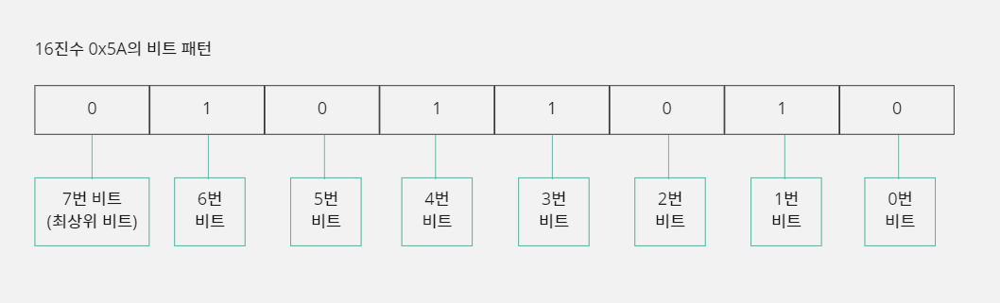

## 10-2. 시프트 연산자

### 시프트 연산자의 기능

- 시프트 연산자(<<, >>)는 변수의 값을 지정한 비트 수만큼 왼쪽 또는 오른쪽으로 비트를 이동 시키는 기능을 한다.
```c
오른쪽에서 왼쪽으로 이동
변수 << 이동할 비트 수

unsigned char data = 0x1A;
// 이동 전: 0001 1010
data = data << 2;
// 이동 후: 0110 1000
```
```c
왼쪽에서 오른쪽으로 이동
변수 >> 이동할 비트 수

unsigned char data = 0x1A;
// 이동 전: 0001 1010
data = data >> 2;
// 이동 후: 0000 0110
```
- `data = data << 2`는 축약해서 `data <<= 2`로 표현할 수도 있다.
- 이동한 비트들이 변수를 위해 할당된 메모리 공간(자료형)의 크기를 벗어나면 해당 비트들은 사라지고, 비트가 이동한 빈자리에는 0이 채워진다.
- 비트가 왼쪽으로 이동해서 사라지는 것을 오버플로(Overflow)라 부르고, 오른쪽으로 이동해서 사라지는 것을 언더플로(Underflow)라고 부른다.

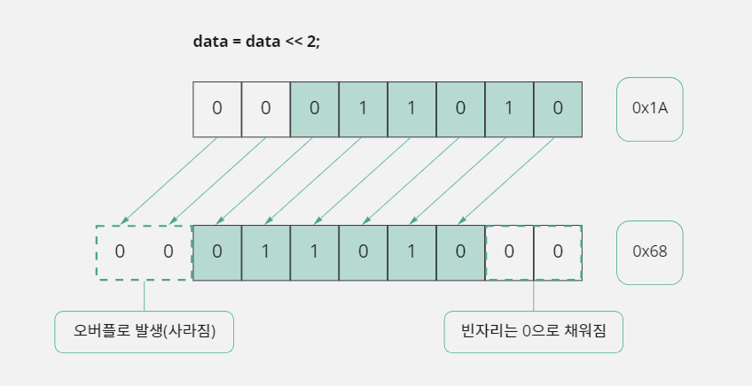

### 시프트 연산자의 특성 이용하기

- 이렇게 비트를 이동시키면 어떤 효과가 있을까?
- 1이 왼쪽으로 1칸씩 이동할 때마다 2를 곱한 만큼 숫자가 커지고, 오른쪽으로 1칸씩 이동할 때마다 2를 나눈 만큼 숫자가 작아진다.
- 결국 `<<` 연산을 사용하여 n개의 비트를 오른쪽에서 왼쪽으로 이동하면 2<sup>n</sup>을 곱한 것과 같은 효과가 있다.
- `>>` 연산을 사용하여 n개의 비트를 왼쪽에서 오른쪽으로 이동하면 2<sup>n</sup>을 나눈 것과 동일한 효과가 있다.

#### 시프트 연산자로 곱셈과 나눗셈 대체하기

- 시프트 연산은 속도가 빠른 명령인데 반해 곱셈이나 나눗셈 연산자는 속도가 느린 명령이다.
- 따라서 2의 제곱(2, 4, 8, 16, ⋯)으로 곱하거나 나눌 때 시프트 연산으로 대체하는 것이 더 효율적이다.
- 물론 컴파일러가 번역할 때 최적화 옵션을 '수행 속도'로 설정해 주면 어느 정도 알아서 연산 방식을 변환해 주지만, 프로그래머가 직접 명시적으로 변환해 주는 것이 더 좋다.
- 하지만, 곱셈과 나눗셈을 모두 시프트 연산자로 대체할 수는 없다.
- 비트 패턴이 2진수로 되어 있기 때문에 비트 이동 효과가 2의 제곱만 적용되기 때문이다.

### 시프트 연산자를 사용할 때 주의할 점

#### 연산자 우선순위가 낮다

- 시프트 연산자의 우선순위가 덧셈(+) 연산자보다 낮다.
- 그래서 곱셈(*)과 나눗셈(/), 덧셈(+) 연산자로 이루어진 수식을 그대로 시프트 연산자로 변환하는 경우에 잘못된 결과가 나올 수 있다.
- 이 문제를 해결하려면 괄호를 사용하자.

#### 변수에 부호가 있는 경우

- 부호가 있는 변수에 시프트 연산을 하면 연산 특성이 달라지기 때문에 주의해야 한다.
- `signed char`로 선언한 변수라면 최상위 비트가 부호 비트로 사용되기 때문에 음수 값을 시프트 연산할 때 `unsigned char`와 다른 방식으로 처리된다.
```c
char data = 0x85;  // 10진수 -123
data = data >> 3;
```

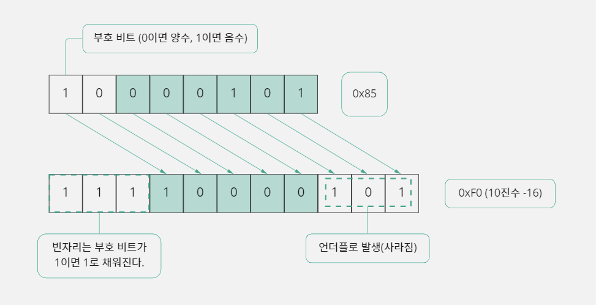

- `unsigned`형식으로 선언된 변수들은 시프트 연산으로 비트가 이동해서 생긴 빈 공간에 무조건 0을 채우게 된다.
- `signed`변수들은 `>>`를 사용하여 '왼쪽에서 오른쪽으로 이동할 때' 자신의 부호를 유지하기 위해서 부호 비트가 1이면 비트가 이동한 빈 공간에 1을 채우고 부호 비트가 0이면 0으로 채운다.
- 하지만 여기에 더 큰 문제가 있다.
- -123을 8로 나누면 -15가 나오는데, 시프트 연산자를 사용하여 나눗셈을 하려고 `>> 3`으로 연산하면 -16이 나온다는 것이다.
- `data`변수가 가지는 음수 값이 8의 배수인 경우에는 `>> 3`과 같은 결과가 나오지만 8의 배수가 아닌 경우에는 1만큼 더 적은 값이 나온다.
- 따라서 음수를 다루는 경우에는 나누어지는 숫자가 나누는 숫자의 배수인지를 체크해서 사용하거나, 나눗셈을 `>>`연산자로 대체하지 말고 그냥 사용하는 것이 좋다.

## 10-3. 비트 연산자

### 비트 연산자란?

- 비트 연산자는 비트 단위로 AND, OR, NOT, XOR(Exclusive OR, 배타적 논리합) 연산을 수행 한다.
- 논리 연산자와 구별하기 위해서 AND 연산은 &, OR 연산은 |, NOT 연산은 ~, XOR 연산은 ^ 기호를 사용한다.
- AND 연산은 연산에 참여하는 A, B값이 둘 다 1이어야 결과 값이 1이 나오고,
- OR 연산은 A, B값이 둘 다 0인 경우에만 결과 값이 0이 나온다.
- NOT 연산은 현재 비트 패턴이 반전(0이면 1, 1이면 0)되며,
- XOR 연산은 A, B값이 같으면 0, 다르면 1이 된다.

#### AND(&) 연산

- 두 값을 비트 단위로 AND 연산을 수행하며, 연산하는 A 비트의 값이 0이면 B 비트의 값에 상관없이 0이 된다.
- A 비트의 값이 1이면 B 비트의 값에 따라 0 또는 1이 되기 때문에, 두 비트가 모두 1일 때만 1이 된다.
```text
  0000 1111 (0x0F)
& 0011 1100 (0x3C)
-------------------
  0000 1100 (0x0C)
```

#### OR(|) 연산

- 두 값을 비트 단위로 OR 연산을 수행하며, 연산하는 A 비트의 값이 1이면 B 비트의 값에 상관없이 1이 된다.
- 반대로 A 비트의 값이 0이면 B 비트의 값에 따라 0 또는 1이 되기 때문에, 두 비트 중 하나라도 1이면 1이 된다.
```text
  0000 1111 (0x0F)
| 0011 1100 (0x3C)
-------------------
  0011 1111 (0x3F)
```

#### XOR(^) 연산

- 두 값을 비트 단위로 XOR 연산을 수행하며, 연산하는 두 비트이 값이 같으면 0이 되고 다르면 1이 된다.
- 즉 두 비트가 서로 다른 값일 때 1이 된다.
```text
  0000 1111 (0x0F)
^ 0011 1100 (0x3C)
-------------------
  0011 0011 (0x33)
```

#### NOT(~) 연산

- 각 비트의 값을 반전시키는 작업을 수행한다.
- 따라서 비트가 0이면 1이 되고 1이면 0이 된다.
```text
~ 0000 1111 (0x0F)
-------------------
  1111 0000 (0xF0)
```

#### 비트 연산자 단축 표현

- 연산자를 단축해서 사용하는 것은 단순히 표현만 단축하는 것이기 때문에 결과에 차이점은 없다.
- 하지만 단축 표현에 사용된 연산자들은 연산자 우선순위가 낮기 때문에 다른 연산자와 연산할 때 연산자 우선순위에 주의해야 한다.
- `A = A & B;` : 단축 표현 `A &= B;`
- `A = A | B;` : 단축 표현 `A |= B;`
- `A = A ^ B;` : 단축 표현 `A ^= B;`

### 비트 단위로 데이터를 다루는 방법

- 비트 연산자가 비트 단위의 연산을 제공하지만 한 개의 비트만 연산하는 것이 아니다.
- 비트 단위라고 해도 최소 1바이트(8비트) 단위로 연산이 이루어지기 때문에, 비트 연산자를 사용하면 자신이 변경하려는 비트를 포함하는 바이트는 모두 연산이 이루어진다.
- 하지만 프로그램을 만들다 보면 바이트 단위가 아닌 비트 단위로 데이터를 다뤄야 할 때도 있다.
- 만약 지정한 비트에만 0 또는 1을 설정하고 싶거나, 특정 비트가 가지고 있는 값을 가져오고 싶다면 그 기능은 비트 연산자의 연산 특징을 잘 응용하여 프로그래머가 직접 구현해서 사용해야 한다.

### 지정한 비트를 0으로 설정하기

- 변수의 비트 패턴에서 지정한 비트만 0으로 설정하고 다른 비트는 자신의 값을 유지하려면 비트 AND 연산자 `&`를 사용한다.

#### 1단계: 2번 비트를 0으로 설정하기

- 비트 AND 연산자는 연산하는 한쪽 비트가 0이면 다른 쪽 비트 값에 상관없이 결과 값이 0이 나오는 특징을 가지고 있다.
- 즉 기존 값을 유지해야 하는 비트는 1과 AND 연산하고, 0으로 설정해야 하는 비트는 0과 AND 연산을 하는 것이다.

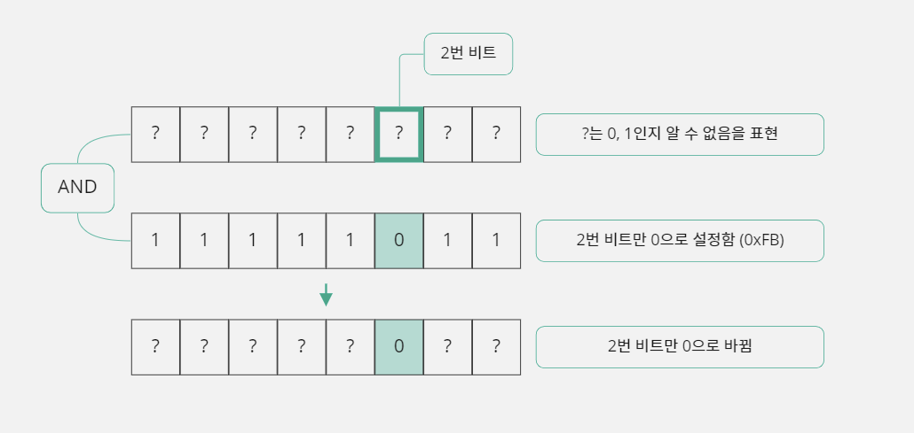

```c
unsigned char lamp_state;        // lamp_state에 어떤 값이 있는지 알 수 없음
lamp_state = lamp_state & 0xFB;  // lamp_state의 2번 비트만 0으로 변경함
```

#### 2단계: 임의의 비트를 0으로 설정하기

- 2번 비트를 0으로 설정할 때 사용하는 `& 0xFB`를 직접 명시하지 않고 2번이라는 정보만 가지고 만들어 보자.

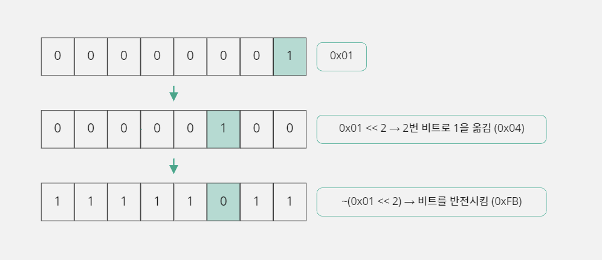

```c
unsigned char lamp_state;                 // lamp_state에 어떤 값이 있는지 알 수 없음
unsigned char bit_num = 2;                // 0으로 만들 비트의 번호
unsigned char mask = ~(0x01 << bit_num);  // 0xFB
lamp_state = lamp_state & mask;           // lamp_state의 2번 비트만 0으로 변경함
```
- 이렇게 하면 `bit_num`변수에 비트 번호만 적어 주면 해당 비트를 0으로 만들 수 있다.

#### 3단계: 함수로 만들어 보기

- 변수의 특정 비트를 0으로 만드는 예제
```c
#include <stdio.h>

unsigned char ResetBit(unsigned char dest_data, unsigned char bit_num) {
    // 1바이트 변수라서 비트 이동은 0~7까지 가능함
    if (bit_num < 8) dest_data = dest_data & ~(0x01 << bit_num);
    // 변경된 값을 반환함
    return dest_data;
}

void main() {
    unsigned char lamp_state = 0x7F;  // 16진수 0x7F는 2진수 0111 1111
    printf("%X -> ", lamp_state);  // 변경 전 값을 출력함
    // lamp_state 변수의 3번 비트를 0으로 설정함
    lamp_state = ResetBit(lamp_state, 3);  // 16진수 0x77은 2진수 0111 0111
    printf("%X\n", lamp_state);  // 변경 후 값을 출력함
}
```
```text
7F -> 77
```
- `ResetBit`함수는 `dest_data`변수의 `bit_num`번 비트를 0으로 설정하는 함수로 해당 비트가 0으로 설정된 값을 반환한다. 

### 지정한 비트를 1로 설정하기

- 변수의 비트 패턴에서 지정한 비트만 1로 설정하고 다른 비트는 자신의 값을 유지하려면 비트 OR 연산자를 사용하면 된다.

#### 1단계: 2번 비트를 1로 설정하기

- 비트 OR 연산자는 연산하는 한쪽 비트가 1이면 다른 쪽 비트 값에 상관없이 결과 값이 1이 나오는 특징을 가지고 있다.
- 즉 기존 값을 유지해야 하는 비트는 0을 넣고 1로 설정해야 하는 비트에는 1을 넣어서 숫자를 만든 후 연산하려는 값과 이 값을 OR 연산하면 된다.

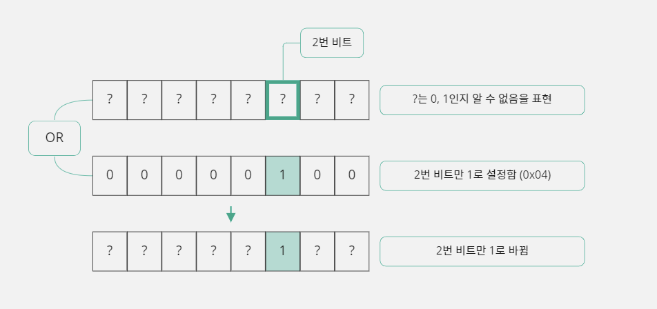

```c
unsigned char lamp_state;  // lamp_state에 어떤 값이 있는지 알 수 없음
lamp_state = lamp_state | 0x04;  // lamp_state의 2번 비트만 1로 변경함
```

#### 2단계: 임의의 비트를 1로 설정하기

- 2번 비트를 1로 설정할 때 사용하는 `| 0x04`를 직접 명시하지 않고 2번 비트라는 정보만 가지고 만들어 보자.

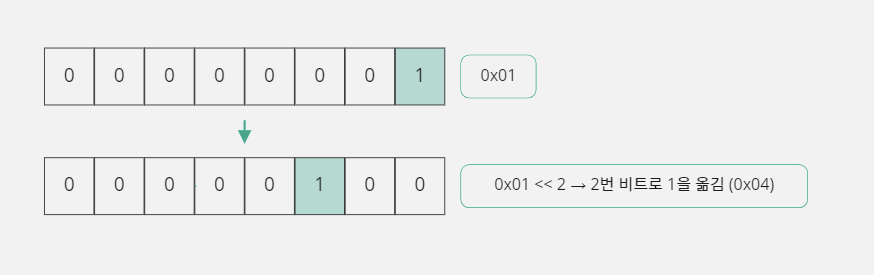

```c
unsigned char lamp_state;  // lamp_state에 어떤 값이 있는지 알 수 없음
unsigned char bit_num = 2;  // 1로 만들 비트의 번호
unsigned char mask = 0x01 << bit_num;  // 0x04
lamp_state = lamp_state | mask;  // lamp_state의 2번 비트만 1로 변경함
```
- 이렇게 하면 `bit_num`변수에 비트 번호만 적어 주면 해당 비트를 1로 만들 수 있다.

#### 3단계: 함수로 만들어 보기

```c
#include <stdio.h>

unsigned char SetBit(unsigned char dest_data, unsigned char bit_num) {
    // 1바이트 변수라서 비트 이동은 0~7까지 가능함
    if (bit_num < 8) dest_data = dest_data | (0x01 << bit_num);
    // 변경된 값을 반환함
    return dest_data;
}

void main() {
    unsigned char lamp_state = 0x77;  // 0x77은 2진수로 0111 0111
    printf("%X -> ", lamp_state);  // 변경 전 값을 출력함
    // lamp_state 변수의 3번 비트를 1로 설정함
    lamp_state = SetBit(lamp_state, 3);
    // 변경 후 값을 출력함
    printf("%X\n", lamp_state);
}
```
```text
77 -> 7F
```
- `SetBit`함수는 `dest_data`변수의 `bit_num`번 비트를 1로 설정하는 함수로 해당 비트가 1로 설정된 값을 반환한다.

### 특정 비트의 값 얻기

- 변수의 비트 패턴에서 특정 비트의 값을 얻고 싶다면 비트 AND 연산자를 사용한다.

#### 1단계: 2번 비트 값 얻기

- 비트 AND 연산자는 연산하는 한쪽 비트가 1일 때 다른 쪽 비트 값이 1이면 1이 나오고 0이면 0이 나온다.
- 따라서 얻고 싶은 비트 값만 1로 넣고 나머지 비트는 모두 0을 넣어서 숫자를 만들고 AND 연산을 하면 된다.
- 이렇게 하면 자신이 지정한 비트만 값이 유지되고 나머지 비트는 모두 0이 된다.

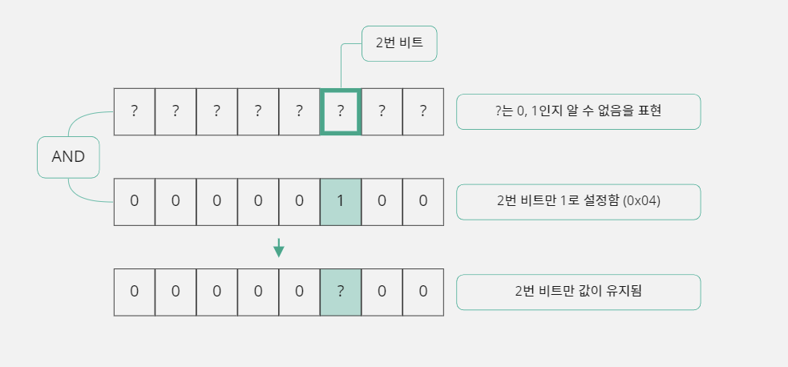

- 하지만 이렇게 하면 자신이 얻고자 하는 비트가 0번 비트인 경우에만 0, 1로 값이 나오고 다른 비트이면 그 비트의 2의 제곱만큼 큰 값으로 나온다.
- 따라서 이 값을 0 또는 1로 얻고 싶다면 ? 값을 0번 비트로 이동시켜야 한다.

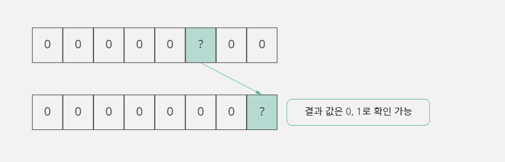

```c
unsigned char lamp_state;  // lamp_state에 어떤 값이 있는지 알 수 없음
unsigned char bit_state;  // 2번 비트의 값을 저장할 변수
bit_state = lamp_state & 0x04;  // lamp_state의 2번 비트만 값을 유지한 상태로 bit_state에 저장함.
                                // lamp_state는 변경되지 않음
bit_state = bit_state >> 2;  // bit_state의 값을 0 또는 1로 확인 가능
```
- 비트에 값을 0 또는 1로 설정할 때와 달리 `bit_state`변수를 추가로 선언해서 사용한 이유는 `lamp_state`에 직접 연산을 해 버리면 자신의 상태 값을 잃어버리기 때문이다.

#### 2단계: 임의의 비트 값 얻기

- 2번 비트를 확인할 때 사용하는 `& 0x04`와 `>> 2`를 직접 명시하지 않고 2번이라는 정보만 가지고 만들어 보자.

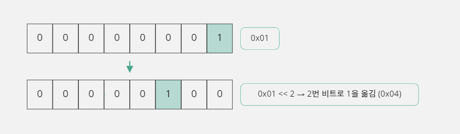

```c
unsigned char lamp_state;  // lamp_state에 어떤 값이 있는지 알 수 없음
unsigned char bit_num = 2;  // 1로 만들 비트의 번호
unsigned char bit_state;  // 비트의 값을 저장할 변수
unsigned char mask = 0x01 << bit_num;  // 비트 옮긴 후 값은 0x04
bit_state = lamp_state & mask;  // lamp_state의 2번 비트만 값을 유지한 상태로 bit_state에 저장함
                                // lamp_state는 변경되지 않음
bit_state = bit_state >> bit_num;  // bit_state의 값을 0 또는 1로 확인 가능
```
- 이렇게 하면 `bit_num`변수에 비트 번호만 적어 주면 해당 비트의 값이 `bit_state`에 저장된다.

#### 3단계: 함수 만들어 보기

```c
#include <stdio.h>

unsigned char GetBit(unsigned char dest_data, unsigned char bit_num) {
    unsigned char bit_state = 0;

    // 1바이트 변수라서 비트 이동은 0~7까지만 가능함
    if (bit_num < 8) {
        bit_state = dest_data & (0x01 << bit_num);
        bit_state = bit_state >> bit_num;
    }

    // bit_num에 지정한 비트 값을 반환함
    return bit_state;
}

void main() {
    unsigned char lamp_state = 0x75;  // 16진수 0x75는 2진수로 0111 0101
    unsigned char bit_state;
    int i;

    printf("%X -> ", lamp_state);  // 16진법으로 현재 값을 출력함
    // 8개의 비트 값을 모두 출력하기 위해 8번 반복함
    for (i = 0; i < 8; i++) {
        // 비트를 표시할 때 최상위 비트(7번 비트)부터 순차적으로 보여주기 위해서 7, 6, 5, ... 순으로
        // 비트 값을 얻는다.
        bit_state = GetBit(lamp_state, 7 - i);
        // 비트 값을 출력함
        printf("%d", bit_state);
    }

    // 비트 값이 모두 출력되면 줄 바꿈을 함
    printf("\n");
}
```
```text
75 -> 01110101
```
- `GetBit`함수는 `dest_data`변수의 `bit_num`번 비트 값을 반환하는 함수이다.
- 이렇게 기능을 구현하면 직접 특정 비트의 값을 읽거나 저장하는 연산자가 없더라도 비트 단위로 정보를 처리할 수 있다.

> #### SetBit 함수와 ResetBit 함수가 비슷해 보이는가?
> 
> - 위의 예제에서 사용한 `SetBit`함수와 `ResetBit`함수는 기능이 유사한 함수이고 함께 사용할 확률이 높아서 다음과 같이 하나의 함수로 합쳐도 된다.
> - 변수의 특정 비트를 0 또는 1로 변경하는 예제
> ```c
> #include <stdio.h>
> 
> unsigned char ModifyBit(unsigned char dest_data, unsigned char bit_num, char value) {
>     unsigned char mask;
> 
>     // 1바이트 변수라서 비트 이동은 0~7까지만 가능
>     if (bit_num < 8) {
>         // bit_num번 비트에 값을 설정하는 데 사용할 숫자를 구성함
>         mask = 0x01 << bit_num;
>
>         if (1 == value) dest_data = dest_data | mask;  // 1로 설정하는 경우
>         else dest_data = dest_data & ~mask;  // 0으로 설정하는 경우
>     }
>
>     // 변경된 값을 반환함
>     return dest_data;
> }
>
> void main() {
>     unsigned char lamp_state = 0x7F;  // 16진수 0x7F는 2진수 0111 1111
>     printf("%X -> ", lamp_state);  // 변경 전 값을 출력함
>
>     // lamp_state 변수의 3번 비트를 0으로 설정함
>     lamp_state = ModifyBit(lamp_state, 3, 0);  // 16진수 0x77은 2진수 0111 0111
>     printf("%X -> ", lamp_state);  // 변경 후 값을 출력함
>    
>     // lamp_state 변수의 3번 비트를 1로 설정함
>     lamp_state = ModifyBit(lamp_state, 3, 1);  // 16진수 0x7F는 2진수 0111 1111
>     printf("%X\n", lamp_state);  // 변경 후 값을 출력함
> }
> ```
> ```text
> 7F -> 77 -> 7F
> ```

### 비트 연산자를 활용하는 방법

#### 보수를 이용해 덧셈으로 뺄셈 구현하기

- 부호를 고려하지 않는 1바이트(8비트, unsigned char) 메모리는 정수 값을 저장할 때 0~255의 값만 저장할 수 있다.
- 이런 1바이트 메모리는 255보다 더 큰 값이 들어오면 오버플로가 발생하고 그만큼의 값을 잃어버리게 된다.

```c
unsigned char data = 255;  // 255는 부호 없는 1바이트 변수가 가질 수 있는 최대값
data++;  // 255 + 1 = 256이 되어야 하지만 오버플로가 발생하여 0이 되어 버림
data++;  // 0이 되었으므로 이 단계에서는 1이 됨
```

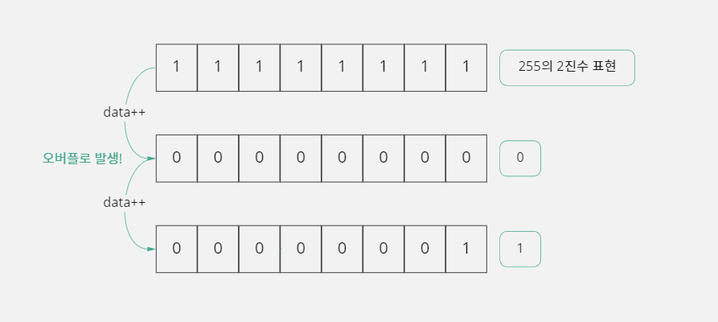

- 이러한 메모리 특성 때문에 `data`변수에 들어 있는 값을 0으로 만들 수 있는 방법이 두 가지 있다.
- 예를 들어 `data`변수 값이 255라면 255를 빼서 0을 만들 수도 있고 1을 더해서도 0으로 만들 수도 있다.
- 즉 덧셈으로 뺄셈을 구현할 수 있다는 뜻이다.
- `data`값이 198인 경우에 198을 빼거나 58을 더하면 된다.
- 결국 `data`변수에 들어있는 값을 0으로 만들기 위해 255나 198에 대응하는 1이나 58을 찾는 방법은 이 숫자들을 2진수로 바꿔 보면 이해할 수 있다.

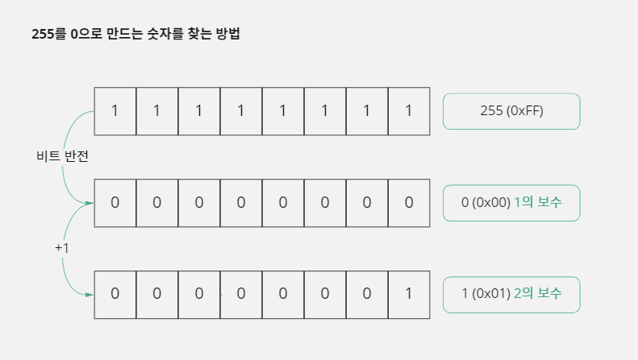

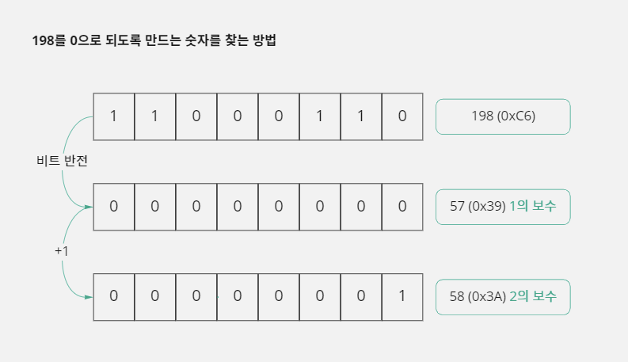

- 뺄셈에 사용할 숫자를 비트 NOT(~) 연산자를 사용하여 비트를 반전시키고 그 값에 1을 더하면 대응하는 숫자를 구할 수 있다.
- 위와 같은 상황에서 비트를 반전시켜 얻은 값을 '1의 보수'라고 하고, 1의 보수에 1을 더해서 얻은 값을 '2의 보수'라고 한다.
- 결과적으로 B에 대한 2의 보수를 구해서 덧셈을 하면 B를 뺀 것과 같은 결과가 나온다.
- 이렇게 덧셈으로 뺄셈을 대신할 수 있다는 것은 하드웨어 입장에서 볼 때 뺄셈 회로를 하나 줄일 수도 있다는 뜻이다.
- 따라서 컴퓨터에서 뺄셈 회로가 없다고 이야기하는 것이 바로 이 개념 때문이다.

#### 데이터 암호화하기

- 비트 연산자에는 XOR(^)연산자가 있다.
- 이 연산자는 연산되는 비트 값이 서로 같으면 0이고 다르면 1이 되는 특성을 가지고 있다.
- 다음 그림처럼 0x56이 있는데 이 값과 0x37을 XOR 연산하면 0x61이라는 전혀 새로운 값이 나온다.
- 그런데 0x61과 0x37을 다시 XOR 연산하면 처음 값인 0x56이 나온다.

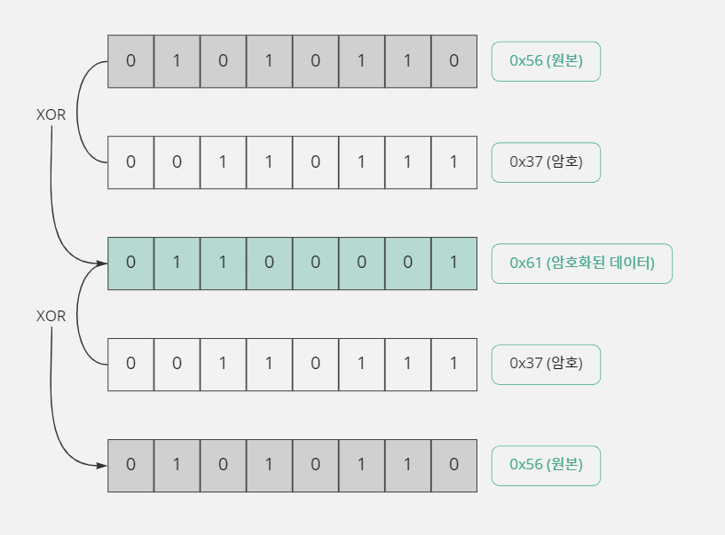

- XOR 연산자는 이런 연산 특징 때문에 간단한 암호화 데이터를 만들 때 많이 사용된다.
- 위와 같이 암호화하는 것을 '8비트 암호화'라고 한다.
- 보안성을 더 높이고 싶다면 암호에 사용하는 비트 개수를 더 늘리면 된다.