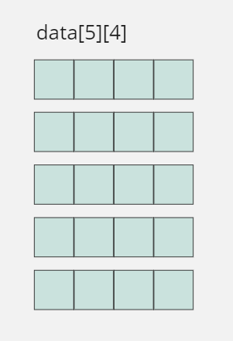
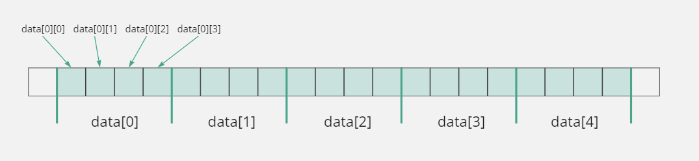
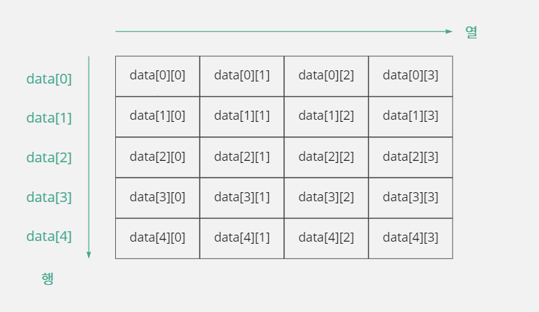
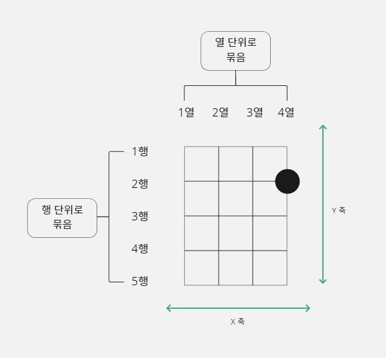
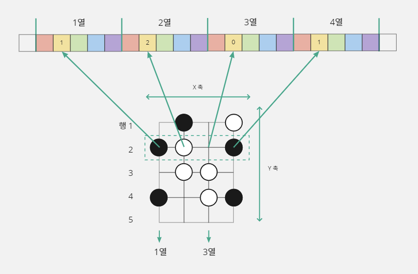
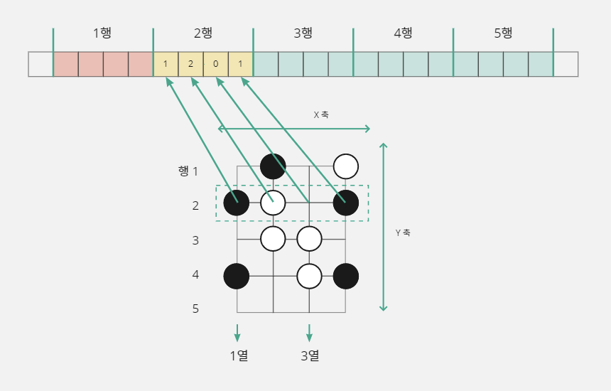
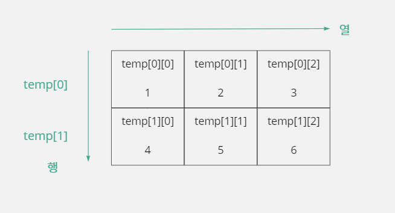
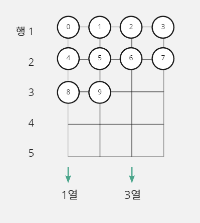

# 12. 배열과 문자열

## 12-1. 배열

### 배열이란?

- 똑같은 자료형으로 많은 수의 변수를 선언하고 사용할 때는 나열식 표현에 한계가 있다.
- 그래서 C 언어는 데이터를 그룹으로 묶어서 표현하는 '배열'(Array)문법을 사용한다.

### 배열 선언하고 사용하기

- 학생 20명의 성적을 저장하기 위해 다음과 같이 배열을 선언한다

```c
short student[20];
```

- `short student[20];`은 2바이트 정수형 데이터 20개를 저장할 수 있는 배열을 `student`이름을 선언한다는 뜻이다.
- 배열을 선언하는 방법은 변수를 선언하는 방법과 비슷하다.
- 다만 `[]`기호(대괄호)를 사용하여 저장 공간을 몇 개 만들 것인지 명시하는 것만 다르다.
- 이때 데이터를 저장할 요소 개수는 반드시 숫자 상수로 명시해야 한다.
- 배열은 그룹으로 묶인 데이터를 하나의 변수로 관리한다
- 여기에서 `student`는 `short`형 변수 20개를 선언한 것과 같다.
- `short`형은 2바이트이므로 `student`변수는 총 40바이트 크기로 만들어진다.
- 개별 요소에 접근하기 위해서는 변수 이름 뒤에 `[]`를 적고 자신이 사용하고 싶은 요소의 색인(Index)을 명시하면 된다.
- 색인은 0부터 시작해서 1씩 증가한다.
- 만약 요소가 5개라면 색인을 0, 1, 2, 3, 4까지 사용할 수 있다.
- 따라서 `student`배열의 첫 번째 저장 공간은 `student[0]`이 된다.

#### 배열의 특정 요소에 값 대입하기

- 배열에 값을 저장하려면 `[]`기호를 사용해서 특정 요소의 위치를 명시해주어야 한다.
- 예를 들어 배열의 두 번째 항목에 10을 넣고 싶다면 다음과 같이 대입 명령문을 써주면 된다.

```c
student[1] = 10;
```

```c
#include <stdio.h>

void main() {
    short student[20];

    student[1] = 10;  // 배열의 두 번째 요소에 10을 대입한다
    printf("%d\n", student[1]);
}
```

```text
10
```

> #### 배열을 선언할 때 주의할 점은 무엇일까?
>
> - 일반 변수는 변수 크기가 자료형에 따라 결정되기 때문에 컴파일러가 소스를 컴파일하는 시점에 변수 크기를 계산하는 데 전혀 문제가 없다.
> - 그런데 배열 문법으로 선언한 변수는 자료형과 []안에 적힌 숫자를 곱해서 변수의 크기를 결정한다.
> - 따라서 배열 문법으로 변수를 선언할 때 컴파일러가 다음 문장만으로 배열 변수의 크기를 계산할 수 있도록 []안에 반드시 상수를 적어주어야 한다.
> ```c
> short student[20];  // short형(2바이트) x 20 = 40바이트
> ```
> - C 언어에서 지역 변수의 메모리 크기는 '스택 프레임'을 구성하는 데 중요한 판단 기준이기 때문에 컴파일할 때 프로그램에서 변수들이 사용할 전체 메모리 크기를 반드시 결정할 수 있어야 한다.
> - '스택 프레임'이란 C 언어가 지역 변수를 관리하는 규칙이며 16-2에서 자세히 공부하자.

- 만약 다음과 같이 `[]`안에 상수를 적지 않고 `count`라는 변수를 적으면 `count`변수에 저장된 값에 따라 `student`변수의 크기가 달라진다.
- 따라서 컴파일러는 컴파일하는 시점에 `student`변수의 크기를 결정할 수 없기 때문에 오류가 발생한다.

```c
int count = 20;
short student[count];  // short student[20]; 으로 적어야 오류가 해결됨
error C2057: 상수 식이 필요합니다.
error C2466: 상수 크기 0의 배열을 할당할 수 없습니다.
error C2133: 'student': 알 수 없는 크기입니다.
```

- `count`변수가 바로 위에 선언되어 있고 20이라는 값이 대입되어 있는데 `short student[count];`의 크기를 컴파일러가 왜 계산하지 못하지?
- 컴파일 작업은 단순히 C 언어로 된 명령문을 기계어로 번역하는 작업이기 때문에 소스 코드에 선언된 변수가 현재 어떤 값을 저장하고 있는지를 알 필요가 없다.
- 즉 변수가 어떤 값을 가지고 있는지는 프로그램이 실행될 때 필요한 것이지 컴파일 작업과는 아무 상관이 없다.
- 따라서 컴파일 시점에 컴파일러는 `count`변수에 어떤 값이 들어 있는지 알 수 없다.

#### 배열 요소에 for문으로 값 대입하기

- 배열을 선언할 때는 `[]`안에 꼭 상수를 써주어야 한다.
- 그러나 배열의 특정 요소에 값을 대입할 때는 `[]`안에 변수를 사용할 수 있다.

```c
int index = 1;
student[index] = 10;  // student[1] = 10; 과 같은 의미
```

- 배열의 요소에 값을 대입하거나 사용할 때 상수뿐만 아니라 변수를 사용할 수 있다는 것은 반복문과 같은 제어 문법을 함께 사용할 수 있다는 뜻이다.

```c
short student[20], i++;
for(i = 0; i < 5; i++) student[i] = 5;
```

### 배열 초기화하기

- 배열 문법은 지역 변수를 그룹으로 묶은 것이기 때문에 배열 문법으로 선언한 변수도 지역 변수처럼 자동으로 초기화되지 않는다.
- 그래서 배열의 각 요소에 일정한 값을 대입하여 초기화해서 사용해야 한다.

```c
#include <stdio.h>

void main() {
    short student[20];

    student[1] = 10;
    printf("%d %d\n", student[1], student[2]);
}
```

```text
10 120
```

- 배열의 요소를 초기화하지 않으면 예상하지 못한 엉뚱한 값이 들어가게 된다.
- 일반적으로 프로그래머들은 초기값으로 0을 사용한다.

```c
#include <stdio.h>

void main() {
    short student[20], i;
    for (i = 0; i < 20; i++) student[i] = 0;

    student[1] = 10;
    printf("%d %d\n", student[1], student[2]);
}
```

```text
10 0
```

#### 쉼표를 사용한 배열 초기화 문법

- 배열을 초기화하는 데 매번 반복문을 사용하기가 불편하다.
- 배열로 선언한 변수도 일반 변수처럼 초기화하는 방법이 있다.
- `{}`로 묶어서 초기값들을 저장한다.

```c
short student[20] = {0, 0, 0, 0, 0, 0, 0, 0, 0, 0, 0, 0, 0, 0, 0, 0, 0, 0, 0, 0};
```

- C 언어에서는 초기값을 0으로 사용하는 것이 일반적이기 때문에 `{}`안에 다음과 같이 적어 주면 ,(쉼표)뒤에 있는 모든 값이 0으로 초기화된다.

```c
short student[20] = {0,};
```

```c
#include <stdio.h>

void main() {
    short student[20] = {0,};  // 반복문 대신 쉼표를 사용해 배열의 모든 요소를 0으로 초기화한다.

    student[1] = 10;
    printf("%d %d\n", student[1], student[2]);
}
```

```text
10 0
```

- 쉼표를 사용하여 배열의 요소들을 초기화할 때 주의해야 할 점이 있다.
- 만약 배열의 모든 요소를 3으로 초기화하고 싶은 경우 다음과 같이 코드를 만들면 어떻게 될까?

```c
short data[5] = {3,};  // short data[5] = {3, 0, 0, 0, 0}; 과 같음
```

- ,(쉼표)뒤를 생략하면 초기화되는 값은 0으로 고정되어 있다.
- 배열의 요소가 많은 경우에 0 아닌 다른 값으로 초기화하고 싶다면 반복문을 쓰는 것이 좋다.

#### 배열 크기 생략하기

- 배열을 선언할 때 `[]`안의 요소 개수를 생략하고 다음과 같이 쓸 수도 있다.

```c
short data[] = {1, 2, 1, 2, 1};
```

- 이 경우에 `{}`안에 나열된 항목이 5개이므로 5개의 저장 공간이 만들어진다.
- 이처럼 초기화에 사용하는 요소 개수만 정확하게 명시되면 배열의 크기를 생략할 수 있다.

> #### 초기화 문법은 배열 변수를 선언할 때만 사용하자
>
> - 배열의 각 요소를 초기화할 때 `{}`를 사용하기 때문에 배열의 특정 요소에 값을 지정할 때 `{}`를 사용해도 된다고 착각하기 쉽다.
> - `{}`는 다음과 같이 사용할 수 없다.
> ```c
> short student[20];
> student[1] = {5};  // error C2059: 구문 오류: '{'
> student[2] = {6, 7};  // error C2059: 구분 오류: '{'
> ```

### 배열의 요소 값 사용하기

- 배열에 저장된 요소 값을 읽어오거나 요소 값끼리 연산할 수도 있다.

```c
short data[3];
data[0] = 2;   // data 배열의 0번째 요소에 2를 대입함
data[1] = data[0] + 5;  // data[0]에 2가 저장되어 있으므로 data[1]에 7이 저장됨
data[2] = data[0] + data[1];  // 2 + 7의 값 9가 data[2]에 저장됨
```

```c
#include <stdio.h>

void main() {
    // data 배열을 1~5 값으로 초기화함
    char data[5] = {1, 2, 3, 4, 5};
    // 합한 값을 저장할 result 변수를 0으로 초기화함
    int result = 0, i;

    // 배열의 각 요소 값을 result 변수에 합하는 과정을 다섯 번 반복함
    for (i = 0; i < 5; i++) {
        result = result + data[i];
    }

    // 합한 결과 값을 출력함
    printf("data 배열의 각 요소의 합은 %d입니다\n", result);
}
```

```text
data 배열의 각 요소의 합은 15입니다
```

#### 배열은 사용자 정의 자료형이다

- 배열은 같은 크기의 메모리를 그룹으로 묶어 새로운 크기의 변수를 만들기 때문에 '사용자 정의 자료형'(User-defined Data Type)이라고 부른다.
- 다음처럼 `char`형은 1바이트 크기이지만 `char three[3]`이란 배열을 선언하면 3바이트 자료형이 새롭게 만들어지는 것이다.

```c
char three[3];  // three는 3바이트 크기의 변수, three의 자료형이 char[3]이 됨
```

- 따라서 C 문법이 기본으로 제공하는 자료형으로는 표현할 수 없던 3바이트, 5바이트 크기의 변수도 배열을 사용하면 자유롭게 만들 수 있다.

## 12-2. 문자열

### 배열로 문자열 표현하기

- 문자열은 간단히 말하면 문자의 집합을 뜻한다.
- 자료형이 같은 변수를 대량으로 선언하고 사용할 때 자료를 묶어서 표현하는 것이 바로 배열이었다.
- 문자열도 이 배열을 사용해 표현할 수 있다.

> #### 문자열의 길이와 배열의 크기는 어떻게 다를까?
>
> - 문자열은 길이(Length)를 기준 단위로 사용하고, 배열은 크기(size)를 기준 단위로 사용한다.

#### 문자열의 길이 정보 표시하기

- C 언어에서 문자를 저장하는 데 가장 적합한 자료형은 `char`형이다.
- 그래서 문자열을 저장하려면 `char`형 변수를 그룹으로 묶어서 관리하는 `char`배열을 사용해야 한다.
- 배열을 이용해서 문자열을 저장하려면 문자 정보 외에도 배열에 몇 개의 문자가 있는지 함께 저장해야 한다.
- 하지만 문자열과 문자 개수 정보를 나누어서 관리하면 문자열을 표현하는 데 불편할 것이다.
- 따라서 입력하려는 문자의 끝에 NULL(널) 문자 0을 추가로 입력해서 '이 배열에 저장된 정보는 문자열이다'라고 컴파일러에게 알려준다.

```c
// 문자 개수는 5개이고 끝에 0을 덧붙여야 하므로 배열의 크기는 6
char data[6] = { 'h', 'a', 'p', 'p', 'y', 0 };
```

- 여기에서 사용하는 0은 NULL문자(아스키코드 0번)을 의미하므로 작은따옴표 ''를 사용하지 않는다.
- 작은따옴표를 사용한 '0'은 일반적으로 사용하는 문자 '0'을 의미한다.
- 그런데 `{}`와 `''`을 사용하여 문자열에 포함된 문자를 하나씩 나열하는 것은 불편하기 때문에 다음과 같이 C 언어의 문자열형 상수 표현을 사용하여 단순하게 초기화할 수도 있다.

```c
char data[6] = "happy";  // 이렇게 쓰면 문자열의 끝에 NULL 문자 0이 자동으로 포함됨
```

- 문자열을 표현하기 위해 "happy"(문자열형 상수)라고 큰따옴표를 이용했다.
- 따라서 이 문자열이 차지하는 메모리 크기는 5바이트가 아니라 뒤에 NULL 문자 0이 자동으로 추가되어 6바이트이다.
- `char data[6] = {'h', 'a', 'p', 'p', 'y', 0};`과 `char data[6] = "happy";`는 같은 뜻이다.

> #### 문자열의 처리 속도를 높일 수 있다!
>
> - 다음 표현은 위에서 본 문자열 표현과 처리 결과가 같다.
> ```c
> // 문자열 길이를 바로 알 수 있지만 변수를 두 개 사용해야 함
> char data[5] = {'h', 'a', 'p', 'p', 'y'};
> char data_length = 5;
> ```
> - 변수가 두 개인 까닭에 얼핏 불편해 보이지만, 문자열을 복사·비교·출력·저장하기 위한 처리 속도를 높이는 것이 중요하다면 이 표현으로 문자열을 저장하는 게 좋다.

- `printf`함수로 문자열을 출력할 때 `%s`를 사용한다.
- `printf`함수는 지정한 메모리 그룹이 요소 값이 NULL 문자 0이 나올 때까지 문자들을 반복적으로 출력해 준다.

```c
#include <stdio.h>

void main() {
    char data[6] = {'h', 'a', 'p', 'p', 'y', 0};  // char data[6] = "happy"; 같은 표현임
    char ment[] = "C programming!";  // []안의 15를 생략해도 됨

    printf("%s\n", data);
    printf("%s\n", ment);
}

```

```text
happy
C programming!
```

> #### NULL 문자는 0이라고 적어도 되고 '\0'이라고 적어도 된다
>
> - 문자열 정보를 저장하는 배열의 마지막에 추가로 입력하는 0은 NULL 문자 0(아스키코드 0번)을 의미한다.
> - 우리가 평소에 사용하는 숫자 0은 아스키코드 48번이므로 헷갈리지 않도록 주의해야 한다.
> - 그런데 문자열 끝에 입력하는 NULL 문자 0을 다음과 같이 `\0`으로 표현하는 경우도 있다.
> ```c
> char data[6] = {'h', 'a', 'p', 'p', 'y', '\0'};
> ```
> - 왜 번거롭게 작은따옴표 `''`와 백슬래시(\)까지 붙이는 `\0`가 등장한 걸까?
> - 우리는 컴퓨터에 문자를 입력하기 위한 입력 장치로 키보드를 사용한다.
> - 3장에서 배운 아스키코드 표에 포함된 문자들을 모두 키보드로 입력할 수는 없다.
> - 예를 들어 아스키코드 7번은 비프음을 발생시키는 문자인데 이런 문자는 키보드에 존재하지 않는다.
> - 따라서 비프음을 발생시키는 소스 코드를 작성할 때는 다음과 같이 아스키코드를 직접 사용해야 한다.
> ```c
> char beepsound = 7;
> ```
> - 만약 "abcd"라는 문자열이 있는데 c와 d문자 사이에 비프음(아스키코드 7번)을 넣고 싶다면 어떻게 해야 할까?
> - 이런 경우 컴파일러에게 7이 아스키코드임을 알려주기 위해 다음과 같이 백슬래시(\)를 사용한다.
> ```c
> char beepsound[6] = "abc\7d";
> ```
> - 문자열 "abc\7d"를 작은따옴표를 사용하여 문자 하나씩 배열에 저장하는 방법은 다음과 같다.
> ```c
> // \7은 비프음을 발생시키는 아스키 코드 7과 같음
> char beepsound[6] = {'a', 'b', 'c', '\7', 'd', 0};
> ```
> ```c
> // 문자 하나씩 배열에 저장할 때는 기존 방식대로 아스키코드 번호를 그대로 적는 것이 편리함
> char beepsound[6] = {'a', 'b', 'c', 7, 'd', 0};
> ```
> - 위와 같은 이유로 문자열 끝에 입력하는 NULL 문자 0도 `\0`으로 표현할 수 있는 것이다.

#### 저장된 문자열의 길이 구하기

- 배열 크기가 항상 문자열의 길이와 같게 만들어지는 것은 아니기 때문에 배열에 저장된 문자열의 길이(문자의 개수)를 알기 위해서는 문자열의 끝(0, EOL, End Of Line)을 찾는 코드가 필요하다.
- 문자열의 길이를 계산하는 코드는 다음과 같다.

```c
char data[6] = "happy";
int count = 0;
while (data[count] != 0) {  // data이 요소 값이 NULL 문자 0이면 문자열의 끝이라는 뜻임
    count++;  // 문자열의 끝이 아니면 문자 개수를 하나 증가시킴
}
```

- 프로그래밍할 때 문자열 길이를 구하는 기능은 자주 사용하게 되므로 함수로 만들어 놓는 것이 더 좋다.
- 배열에 저장된 문자열의 길이를 구하는 함수 `GetStringLength`를 만들어 사용해 보자.

```c
#include <stdio.h>

int GetStringLength(char data[]) {
    int count = 0;
    // 0이 나올 때까지 문자의 개수를 더함
    while (data[count]) count++;  // while (data[count] != 0) count++; 와 같은 뜻임
    // 문자열의 길이를 반환함
    return count;
}

void main() {
    int data_length;  // 문자열 길이를 저장할 변수
    char data[10] = {'h', 'a', 'p', 'p', 'y', 0,};  // "happy" 문자열을 저장함
    // data 변수에 들어 있는 문자열의 길이를 구함
    data_length = GetStringLength(data);
    // 문자열의 길이(문자 개수)를 출력함
    printf("data length = %d\n", data_length);
}
```

```text
data length = 5
```

- C 언어는 배열에 저장된 값을 다른 함수의 매개변수로 전달하는 문법을 제공하고 있다.
- `GetStringLength`함수에 매개변수를 `char data[]`형태로 선언하면, `main`함수의 `data`배열 변수를 참조할 수 있는 형태로 `data`변수가 선언되어 `main`함수의 `data`
  변수에 저장되어 있던 값을 그대로 사용할 수 있다.
- 다른 변수의 내용을 참조하는 방법은 13장 포인터에서 배우자.
- `GetStringLength`함수를 호출할 때 배열의 이름(data)만 사용하면 된다.
- 그리고 배열의 값을 다른 함수에 전달하고 싶을 때는 배열의 이름만 매개변수로 전달하면 된다는 뜻이다.
- 이 작업의 동작 원리는 15장 배열과 포인터에서 자세하게 배우자.

### 문자열을 다루는 C 내장 함수

- 문자열은 프로그램에서 자주 사용하기 때문에 편하게 사용할 수 있도록 C 언어에서 여러 함수들을 제공한다.
- 위의 예제에서 본 `GetStringLength`함수도 별도로 만들 필요 없이 C 언어와 함께 제공되는 문자열 표준 함수를 사용하면 편리하게 문자열의 길이를 구할 수 있다.
- 이렇게 제공되는 함수는 런타임 라이브러리에 포함되어 있으며, 그 수가 굉장히 많다.
- 이 함수들을 모두 외우거나 미리 공부할 필요는 없고, C 언어 개발 도구에서 해당 함수에 대한 설명을 볼 수 있다.
- 문자열 표준 함수의 이름은 string의 줄임 표현인 `str`라는 접두어로 시작한다.
- 문자열의 길이를 구하는 문자열 표준 함수는 `strlen`이다.
- 문자열을 복사하고 싶으면 copy의 줄임 표현인 `cpy`를 뒤에 붙여 만든 `strcpy`함수를 사용하면 된다.
- 문자열 뒤에 다른 문자열을 덧붙이는 함수 concatenation character의 줄임 표현인 `cat`을 뒤에 붙여 만든 `strcat`함수도 있다.

```c
strlen(문자열이 저장된 변수 이름)
strcpy(복사해서 저장할 변수 이름, 복사할 기존 변수 이름)
strcat(기존 문자열이 저장된 변수 이름, 새로 덧붙일 문자열)
```

- 이렇게 `str`로 시작하는 문자열 표준 함수들은 `string.h`파일에서 함수의 원형을 제공하기 때문에, 이 함수들을 사용하려면 `#include`전처리기로 `string.h`파일을 소스 파일 안에 포함시켜야
  한다.

#### 문자열의 길이를 구하는 내장 함수 strlen

- `strlen`함수는 NULL 문자(문자열 끝에 있는 0)를 제외한 문자열의 길이를 반환한다.

```c
#include <stdio.h>
#include <string.h>  // 문자열 표준 함수를 사용하기 위해 추가함

void main() {
    int data_length;  // 문자열 길이를 저장할 변수
    char data[10] = {'h', 'a', 'p', 'p', 'y', 0,};  // "happy" 문자열을 저장함
    // data 변수에 들어 있는 문자열의 길이를 구함
    data_length = strlen(data);
    // 문자열의 길이(문자 개수)를 출력함
    printf("data length = %d\n", data_length);
}
```

```text
data length = 5
```

#### 문자열을 복사하고 추가하는 내장 함수 strcpy, strcat

- `strcpy`함수와 `strcat`함수를 사용하여 두 개의 문자열을 합쳐보자.

```c
#include <stdio.h>
#include <string.h>  // 문자열 표준 함수를 사용하기 위해 추가함

void main() {
    char data[10] = {'a', 'b', 'c', 0,};  // "abc" 문자열을 저장함
    char result[16];  // 새로운 문자열을 저장할 변수

    strcpy(result, data);  // data에 저장된 문자열을 result로 복사함
    strcat(result, "def");  // result값의 맨 뒤에 "def"를 덧붙임

    printf("%s + \"def\" = %s\n", data, result);
}
```

```text
abc + "def" = abcdef
```

## 12-3. 2차원 배열

### 1차원 배열로 2차원 형태를 표현하려면?

- 지금까지 사용한 배열은 1차원 배열이다.
- 바둑판에 놓인 돌의 좌표와 같은 정보는 가로와 세로가 있는 2차원 형태이다.
- 바둑판에 놓여 있는 돌의 정보를 저장하고 싶다면 돌 한 개의 정보를 어떤 형식의 변수에 저장할 것인지를 먼저 결정해야 한다.
- 돌의 정보는 돌이 놓여 있지 않으면 0, 검은 돌이 놓여 있으면 1, 흰 돌이 놓여 있으면 2와 같이 세 가지 경우로 나눌 수 있다.
- 따라서 1바이트인 `char`형으로도 충분히 이 세 가지 값을 구별하여 저장할 수 있다.
- 정보를 저장할 단위가 정해졌으니, 바둑판 전체를 저장할 수 있는 메모리 크기를 결정하기 위하여 데이터 개수를 계산해야 한다.
- 바둑판은 가로 19개, 세로 19개의 돌을 놓을 수 있기 때문에 총 351개(19x19)의 돌을 놓을 수 있다.
- 따라서 바둑판에 놓여 있는 돌의 정보를 저장하기 위해 다음과 같이 1차원 배열을 선언한다.

```c
char data[361];
```

- 2차원 형태의 정보를 1차원 배열에 저장하기 위해서 한 행에 이어 그 다음 행을 저장하는 방식을 사용한다.
- 즉 `data`배열의 0번에서 18번까지 1행의 정보가 저장되고, 19번에서 37번까지 2행의 정보가 저장되는 방식이다.
- 각 배열의 요소에는 돌이 놓여 있지 않으면 0, 검은 돌이 놓여 있으면 1, 흰 돌이 놓여 있으면 2로 저장하면 2차원인 바둑판 정보를 `data`배열에 모두 저장할 수 있다.
- 그런데 이렇게 2차원 정보를 1차원 배열에 저장하면 소스 코드를 작성할 때 요소의 위치를 파악하기 어렵다.

### 2차원 배열의 필요성

- 차원은 공간에서 좌표를 구성하는 축의 개수를 의미한다.
- 따라서 2차원은 좌표를 적을 때 2개의 축을 사용하고 각 축의 이름은 X축, Y축이며, X축은 수평 방향에 대한 기준 값이고 Y축은 수직 방향에 대한 기준 값이다.
- 2차원 공간에 있는 한 점(대상)은 자신의 위치를 좌표로 나타낼 때 (x축 좌표 값, y축 좌표 값)형태로 사용한다.
- 이와 같은 방법으로 '2차원 배열'에 2차원 형식의 데이터를 저장한다.
- 바둑판을 축소하여 5(행)x4(열)로 간단하게 살펴보자.


- 위 바둑판에는 최대 20개의 돌을 놓을 수 있는 지점이 있다.
- 각 지점에는 세 가지 상황이 발생할 수 있다.
- 프로그램에서는 상태를 숫자로 표현해야 하기 때문에 각 상황을 0, 1, 2로 가정하자.

```text
놓인 돌이 없음 -> 0이라고 가정함
검은 돌이 놓임 -> 1이라고 가정함
흰 돌이 놓임  -> 2라고 가정함
```

- 세 가지 상황은 동시에 발생할 수 없으므로 0, 1, 2 중 하나를 저장할 수 있는 20개의 저장 공간이 필요하다.
- 세 가지 상황 중 한 가지를 저장하려면 `char`(1바이트, 256가지 경우 중에서 한 가지를 저장)형이면 충분하다.
- 따라서 다음과 같이 변수를 선언하면 총 20바이트의 메모리를 사용할 수 있기 때문에 위 바둑판의 상태를 모두 저장할 수 있다.

```c
char data[20];  // 1차원 배열로 20바이트 크기의 변수를 선언함
```

- 하지만 이렇게 2차원 형식의 데이터를 1차원 배열로 관리하면 프로그래밍하기 어렵다.
- 따라서 이런 경우에는 2차원 데이터와 표현 방식이 같은 2차원 배열을 사용하자.

### 2차원 배열 선언하기

```c
char data1, data2, data3, data4;  // 4개의 변수를 개별적으로 선언함
```

```c
char data[4];  // 4개의 변수를 그룹으로 묶어서 1차원 배열 형태로 선언함
```

```c
// char[4] 형식의 1차원 배열 5개를 선언함
char data1[4], data2[4], data3[4], data4[4], data5[4];
```

- 위와 같은 형식의 1차원 배열 5개를 묶으려면 어떻게 해야할까?
- 5개의 1차원 배열은 모두 `char[4]`형식으로 같기 때문에, 배열을 사용해서 묶을 수 있다.

```c
char data[5][4];  // char[4] 형식의 1차원 배열 5개를 묶어 2차원 배열로 선언함
```



- 1차원 배열을 선언할 때 대괄호 `[]`를 이미 사용했기 때문에, 한 번 더 묶으려면 대괄호 `[]`를 두 번 사용하면 된다.
- 이처럼 대괄호 `[]`를 두 번 사용해서 선언하는 배열이 바로 2차원 배열이다.
- 그런데 여기서 1차원 배열을 그룹으로 묶을 때 왜 `char data[4][5];`가 아니라 `char data[5][4];`라고 했을까?
- 그 이유는 연산자 우선순위 때문이다.
- `[]`연산자는 동일한 우선순위를 가질 때 왼쪽에서 오른쪽으로 연산을 수행한다.
- 즉 왼쪽에 있는 `[]`연산자를 먼저 처리하기 때문에 위에 선언한 `data`배열은 다음과 같이 선언한 것과 같다.

```c
char (data[5])[4];
```

- 위에 선언한 2차원 배열을 컴파일러가 해석하는 순서에 따라 적어보면 다음과 같다.

| 1단계 | char(data[5])[4]; | `data[5]`라는 배열을 만들겠다는 뜻이다.<br> 즉 5개의 요소(2차원 배열에서는 전체 그룹의 개수)를 가지는 배열을 의미한다.                                  |
|:----|:------------------|:-------------------------------------------------------------------------------------------------------------|
| 2단계 | char(data[5])[4]; | 이 배열의 각 요소(`data[0]`, `data[1]`, ⋯ )는 `char[4]`크기를 가진다.<br> 즉 배열의 각 요소를 `char[4]`형식의 1차원 배열처럼 사용할 수 있다는 뜻이다. |

- 위와 같이 선언한 배열은 다음과 같이 메모리에 나열된다.



- 이렇게 선언한 `char data[5][4]`는 행이 5개이고 열이 4개인 2차원 배열이며, 각 요소에 `char`형으로 데이터를 저장할 수 있다.
- `data`변수의 크기는 `(자료형 크기) x (행 개수) x (열 개수)`이기 때문에 1 x 5 x 4 = 20 바이트이다.
- `data`변수의 논리적 메모리 형태를 그려보면 다음과 같다.



- `data`변수의 2번째 행, 3번째 열에 10이라는 값을 넣으려면 다음과 같이 적어주면 된다.

```c
data[1][2] = 10;
```

#### 2차원 배열이 실제 메모리에 저장되는 형태

- 컴퓨터가 사용하는 메모리는 2차원 개념을 제공하지 않기 때문에 `data`변수를 위한 20바이트 메모리는 1차원 형태로 메모리에 저장된다.
- 그런데 소스 코드에서 2차원 형식으로 사용할 수 있는 이유는 C 언어의 2차원 배열 문법이 내부적으로 수학 공식을 사용해서 2차원 개념을 제공하기 때문이다.
- 즉 2차원 배열은 컴파일할 때 모두 1차원 형태로 변환된다.

> #### 2차원 배열에서 행과 열 중 어떤 것을 먼저 처리하는 것이 효율적일까?
>
> - 2차원 배열을 사용하게 되면 행을 우선으로 처리할 것인지 또는 열을 우선으로 처리할 것인지에 따라 두 가지 형태로 선언할 수 있다.
> ```c
> char data[5][4];  // 5행 4열: 행 단위로 묶음
> 또는
> char data[4][5];  // 4열 5행: 열 단위로 묶음
> ```
> - 2차원 배열로 변수를 선언하면 배열의 각 요소를 사용하기 위해 `[]`연산자를 두 개씩 사용하기 때문에 x, y좌표 형식으로 접근할 수 있다.
> - 예를 들어 2행 4열(좌표는 (4, 2))에 있는 검은색 돌을 `data`변수에 저장하려면 다음과 같이 적으면 된다.
>
> 
>
> ```c
> data[1][3] = 1;  // 행 단위로 묶음. 2행 4열에 검은 돌이 놓인 상태 값 1을 대입함. 좌표는 (4, 2)
> ```
> ```c
> data[3][1] = 1;  // 열 단위로 묶음. 4열 2행에 검은 돌이 놓인 상태 값 1을 대입함. 좌표는 (4, 2)
> ```
> - 코드를 보면 행을 그룹으로 묶은 경우에는 `data[행 번호 - 1][열 번호 - 1]`의 형식이고 열을 그룹으로 묶은 경우에는 `data[열 번호 - 1][행 번호 - 1]`의 형식이다.
> - 이것을 좌표 형식으로 바꿔 보면 행을 그룹 지은 것은 `data[y좌표 - 1][x좌표 - 1]`의 형식이고 열을 그룹 지은 것은 `data[x좌표 - 1][y좌표 - 1]`의 형식이 될 것이다.
> - 수학에서 좌표를 (x, y)형식으로 사용하기 때문에 x좌표가 먼저 나오는 열 단위로 묶은 형식이 더 친근할 수 있다.
> - 하지만 컴퓨터도 그렇게 생각할까?
>
> #### 열 단위로 묶음
>
> ```c
> char data[4][5];  // (x좌표, y좌표) 형식
> ```
>
> 
>
> - 위 그림에서 같은 색을 가지는 요소들이 X축 기준으로 같은 줄에 있는 요소들이다.
> - 따라서 2행을 보면, 그림으로는 바로 옆에 있는 바둑돌들이 메모리에 저장될 때는 5바이트씩 떨어진 위치에 저장된다.
> - 컴퓨터는 출력 효율을 높이기 위해서 하드웨어적으로 X축 기준으로 연산하도록 되어 있는데, 위와 같이 메모리를 관리하면 X축으로 1만큼 이동할 때마다 메모리상으로는 5바이트씩 이동해야 하는 불편함이 있다.
> - 그리고 같은 줄에 있는 항목들이 한 그룹이 되지 못해서 그룹 연산을 사용하는 다양한 기본 함수(예를 들어 `memcpy`)들도 사용할 수 없다.
>
> #### 행 단위로 묶음
>
> ```c
> char data[5][4];  // (y좌표, x좌표) 형식
> ```
>
> 
>
> - 프로그래밍할 때는 (y좌표, x좌표) 형식으로 사용해야 하는 불편함이 있을지 몰라도 그림에 표시된 2차원 형식의 데이터는 수평 방향으로 그룹으로 묶여 저장된다.
> - 따라서 연산도 단순해지고 같은 줄의 데이터가 자연스럽게 한 그룹이 되기 때문에 관리하기도 더 편리하다.
> - 그래서 2차원 형식의 데이터를 2차원 배열에 저장할 때는 행을 기준으로 묶는 방식을 더 많이 사용한다.

### 2차원 배열 초기화하기

- 다음 코드는 1차원 배열을 두 개 선언하고 각 배열을 1, 2, 3과 4, 5, 6으로 초기화하고 있다.
- 2차원 배열은 형식이 같은 1차원 배열을 그룹으로 묶는 문법이기 때문에 위와 같이 선언한 두 개의 1차원 배열을 다음과 같이 하나의 2차원 배열로 변경할 수도 있다.

```c
char temp1[3] = {1, 2, 3};
char temp2[3] = {4, 5, 6};
```

```c
char temp[2][3];
```

- 2차원 배열을 이용하여 `temp`변수를 선언했으니 초기화도 해 주어야 한다.
- 1차원 배열은 하나의 그룹으로 이루어져 있기 때문에 한 개의 `{}`로 초기화를 했지만 2차원 배열은 그룹 안에 또 다른 그룹이 있는 형태이기 때문에 `{}`을 중복으로 사용해야 한다.

```c
char temp[2][3] = {{1, 2, 3}, {4, 5, 6}};
```



> #### 2차원 데이터와 1차원 데이터를 자유자재로 변환할 수 있다
>
> - 대부분의 경우에 컴파일러가 2차원 데이터를 1차원 형태의 기계어로 잘 번역해 준다.
> - 하지만 프로그래머가 좀 더 적극적으로 상황에 대처하고 싶거나 프로그램 실행 성능을 향상시키기 위해 1차원 배열과 차원을 변환하는 수학 공식을 사용하여 직접 2차원 형태를 구성하기도 한다.
> - 이 방식은 실제로 많이 사용되고 다양하게 응용되기 때문에 알아두자!
>
> #### 2차원 데이터를 1차원 데이터로 변환하기
>
> - 5행 4열 크기로 줄인 바둑판을 생각해 보자.
> - 1행 1열부터 시작해서 1행 2열, 1행 3열의 순서로 돌을 9개 놓고 번호를 0번부터 1씩 증가시키면서 적어 보면 다음과 같이 된다.
>
> 
>
> - 이렇게 돌에 번호를 매긴 이유는 이 번호가 결국 1차원 배열의 색인을 의미하기 때문이다.
> - 1행을 보면 0~3번 돌이 놓였고 2행을 보면 4~7번 돌이 놓였다.
> - 이 번호를 잘 살펴보면 행이 증가할 때마다 같은 열에 있는 돌의 번호가 4씩 증가한다는 것을 알 수 있다.
> - 이것은 열의 개수가 4개이기 때문이다.
> - 즉 열의 개수가 5개 였다면 행이 증가할 때마다 돌에 쓰인 번호가 5씩 증가했을 것이다.
> - 각 행의 처음 위치에 놓인 돌의 번호를 수학 공식으로 정리해 보면 행 번호에서 1을 뺀 후 열의 개수를 곱한 것과 같다.
> ```text
> (행 번호 - 1) x 열 개수
> ```
> - 2열, 3열, 4열에 있는 돌의 번호는 첫 번째 돌의 번호에 각 열 번호에서 1을 뺀 숫자를 더해 주면 된다.
> ```text
> {(행 번호 - 1) x 열 개수} + 열 번호 - 1
> ```
> - 이제 본래 바둑판으로 돌아와서 같은 조건으로 돌이 놓여 있는 경우에 10행 9열에 놓인 돌의 번호를 계산하면 179번이라는 것을 알 수 있다(바둑판은 19개의 열로 되어 있다).
> ```text
> {(10 - 1) x 19} + (9 - 1) = 179
> ```
> - 이 공식은 2차원 형식으로 되어 있는 데이터를 1차원 형식의 배열에 저장하고 싶을 때 모두 사용할 수 있다.
> - 2차원 형식의 데이터는 평면 형태로 표시되는 모든 종류의 데이터가 다 포함될 수 있다.
>
> #### 1차원 데이터를 2차원 데이터로 변환하기
>
> - 1차원 데이터를 2차원 데이터로 변환하려면 행 번호와 열 번호를 계산해서 찾아야 한다.
> - 먼저 행 번호를 찾는 방법부터 살펴보자.
>
> 
>
> - 이 바둑판의 같은 행에 놓인 돌의 번호를 보면 4로 나누었을 때 몫이 같다는 것을 알 수 있다(몫을 구할 때는 반올림이 적용되지 않는다).
> - 예를 들어 1행에 있는 돌들은 0/4, 1/4, 2/4, 3/4이기 때문에 모두 몫이 0이고,
> - 2행에 있는 돌들은 4/4, 5/4, 6/4, 7/4이기 때문에 모두 몫이 1이다.
> - 이때 4로 나눈 몫이 동일한 이유는 같은 행에 있는 돌의 번호가 열의 개수에 영향을 받기 때문이다.
> - 이런 특징을 이용해서 돌의 번호로 행 번호를 찾는 방법은 다음과 같이 공식으로 정리할 수 있다.
> ```text
> 행 번호 = (돌 번호 / 열 개수) + 1
> ```
> - 이제 열 번호를 찾는 방법을 살펴보자.
> - 같은 열에 있는 돌의 번호는 4로 나눈 나머지가 같다.
> - 즉 1열에 있는 각 돌의 번호를 4로 나눈 나머지를 계산해 보면 0%4, 4%4, 8%4이기 때문에 나머지가 모두 0이다.
> - 2열에 있는 각 돌의 번호를 4로 나눈 나머지를 계산해 보면 1%4, 5%4, 9%4이기 때문에 나머지가 모두 1이다.
> - 그리고 이 나머지 값은 열이 증가할 때마다 1씩 증가하는 규칙이 있다.
> - 따라서 돌 번호로 열 번호를 찾는 방버은 다음 공식을 사용하면 된다.
> ```text
> 열 번호 = (돌 번호 % 열 개수) + 1
> ```
> - 이제 본래 바둑판으로 돌아와서 같은 조건으로 돌이 놓여 있는 경우에 199번 돌은 (199 / 19) + 1, 즉 11행에 있고 (199 % 19) + 1, 즉 10열에 위치해 있다는 것을 알 수 있다.
> - 이 공식은 1차원 형태로 되어 있는 데이터를 2차원 형식으로 표현하고 싶을 때 모두 사용할 수 있다.
> - 2차원 배열은 메모리상에 1차원 형태로 데이터를 저장하면서 프로그래머가 이 메모리를 사용할 때 컴파일러가 수학 공식을 적용하여 2차원 개념을 제공하는 것이다.
> - 따라서 메모리에 저장되는 형태만 놓고 보면 2차원 배열로 선언한 `temp`변수나 1차원 배열로 선언한 `test`변수는 메모리 형태가 같다.
> ```c
> char temp[5][4];
> char test[20];
> ```
> - 2차원 좌표를 1차원 좌표로 변환하는 공식이나 1차원 좌표를 2차원 좌표로 변환하는 공식을 이해하고 있다면 2차원 배열 문법에 의존하지 않고 1차원 배열을 사용해서도 얼마든지 2차원 데이터를 저장하고 관리할
    수 있다.
> - 1차원 배열로 어떻게 2차원 개념을 사용하는지 앞에서 배운 내용을 공식으로 만들어 보자.
> ```c
> char temp[M][N];  // L, M, N 값은 숫자 상수로 가정함
> char test[L];     // M * N 값이 L 값과 같다고 가정함
> ```
> - 위와 같이 `temp`변수는 2차원 배열로 선언되고 `test`변수는 1차원 배열로 선언된 경우에 다음과 같은 공식이 성립된다.
> ```text
> test[a] 항복과 temp[a / N][a % N]항목은 위치가 같다.
> temp[b][c] 항목과 test[b x N + c]항목은 위치가 같다.
> ```

### 1차원 배열과 2차원 배열의 차이

- 지금까지 이야기한 바둑판을 3행 4열 형태로 축소시켜 놓고 돌이 놓여 있는 상황을 1차원 배열을 사용하여 초기값으로 저장한 후 바둑판의 상황을 출력해 보면 다음과 같다.

```c
#include <stdio.h>

void main() {
    char data[12] = {0, 0, 2, 0, 1, 1, 0, 0, 2, 1, 0, 2};
    int i, x, y;

    for (i = 0; i < 12; i++) {
        x = i % 4 + 1;  // 열 번호를 구함
        y = i / 4 + 1;  // 행 번호를 구함
        printf("%d행 %d열에", y, x);
        if (1 == data[i]) printf(" 검은 돌이 놓여 있습니다.\n");
        else if (2 == data[i]) printf(" 흰 돌이 놓여 있습니다.\n");
        else printf("는 돌이 놓여 있지 않습니다.\n");
    }
}
```

```text
1행 1열에는 돌이 놓여 있지 않습니다.
1행 2열에는 돌이 놓여 있지 않습니다.
1행 3열에 흰 돌이 놓여 있습니다.
1행 4열에는 돌이 놓여 있지 않습니다.
2행 1열에 검은 돌이 놓여 있습니다.
2행 2열에 검은 돌이 놓여 있습니다.
2행 3열에는 돌이 놓여 있지 않습니다.
2행 4열에는 돌이 놓여 있지 않습니다.
3행 1열에 흰 돌이 놓여 있습니다.
3행 2열에 검은 돌이 놓여 있습니다.
3행 3열에는 돌이 놓여 있지 않습니다.
3행 4열에 흰 돌이 놓여 있습니다.
```

### 2차원 배열에 바둑판 정보 저장하기

- 앞의 예제와 같은 결과가 나오도록 2차원 배열을 사용해서 재구성 해보자.
- 배열이 2차원으로 되어 있어서 선언된 형태만 보아도 행, 열 구별이 1차원보다는 잘될 것이다.

```c
#include <stdio.h>

void main() {
    char data[3][4] = {{0, 0, 2, 0},
                       {1, 1, 0, 0},
                       {2, 1, 0, 2}};
    int x, y;

    for (y = 0; y < 3; y++) {
        for (x = 0; x < 4; x++) {
            printf("%d행 %d열에", y + 1, x + 1);
            if (1 == data[y][x]) printf(" 검은 돌이 놓여 있습니다.\n");
            else if (2 == data[y][x]) printf(" 흰 돌이 놓여 있습니다.\n");
            else printf("는 돌이 놓여 있지 않습니다.\n");
        }
    }
}
```

```text
1행 1열에는 돌이 놓여 있지 않습니다.
1행 2열에는 돌이 놓여 있지 않습니다.
1행 3열에 흰 돌이 놓여 있습니다.
1행 4열에는 돌이 놓여 있지 않습니다.
2행 1열에 검은 돌이 놓여 있습니다.
2행 2열에 검은 돌이 놓여 있습니다.
2행 3열에는 돌이 놓여 있지 않습니다.
2행 4열에는 돌이 놓여 있지 않습니다.
3행 1열에 흰 돌이 놓여 있습니다.
3행 2열에 검은 돌이 놓여 있습니다.
3행 3열에는 돌이 놓여 있지 않습니다.
3행 4열에 흰 돌이 놓여 있습니다.
```

- 그렇다고 해서 2차원 배열이 1차원 배열 표현보다 더 좋다는 뜻은 아니다.
- 사람이 보기에 소스 코드가 간단하다고 해서 기계어로 된 코드도 간단한 것은 아니고, 데이터를 실질적으로 저장하는 물리적 메모리는 결국 1차원 형태이기 때문이다.
- 무엇이든 익숙하지 않으면 어렵게 느껴지기 마련이다.
- 하지만 어렵더라도 계속 사용하다 보면 익숙해지고, 어느새 내용을 이해하고 사용하는 순간이 올 것이다.
- 그러면 프로그램에 대한 이해력과 응용력 또한 좋아져서 더 좋은 코드를 구성할 수 있다.
