# 13. 포인터

## 13-1. 운영체제의 메모리 관리 방식

### 운영체제와 프로그래밍

- 지금까지는 변수를 사용하여 메모리에 데이터를 저장하거나 읽었다.
- 이렇게 C 언어 소스 코드에서 사용한 변수들은 컴파일 작업 후 기계어로 변경되면 모두 메모리 주소로 바뀌어서 적용된다.


- 결국 기계어에서는 변수 이름보다 변수가 위치한 메모리의 주소가 훨씬 중요하다.
- 즉 변수 이름을 사용하지 않더라도 변수의 주소만 알고 있다면 변수 값을 읽거나 바꿀 수 있다는 뜻이다.
- 그런데 컴퓨터 시스템의 메모리는 운영체제가 관리하고 있다.
- 따라서 메모리 주소의 사용법을 배우기 전에 운영체제가 메모리를 어떻게 관리하는지를 먼저 알아야 한다.
- 운영체제(Operating System)는 컴퓨터 시스템을 효과적으로 관리해 주고 시스템이 가지고 있는 자원을 사용자 또는 프로그램이 잘 이용할 수 있도록 서비스해 주는 소프트웨어이다.
- 예를 들어 윈도우, 리눅스, 유닉스와 같은 소프트웨어가 운영체제이다.

#### 32비트 운영체제와 64비트 운영체제

- 64비트 운영체제가 보급됨에 따라 운영체제에서 실행되는 프로그램도 32비트 프로그램과 64비트 프로그램으로 나누어서 개발할 수 있다.
- 실제로 개발 현장에서는 특별한 경우가 아니라면 32비트 방식으로 개발하는 경우가 많다.
- 32비트 방식으로 개발해도 32비트 운영체제 또는 64비트 운영체제에서 모두 동작하기 때문이다.

#### 64비트 운영체제의 장단점

- 운영체제가 64비트를 지원하는 건 많은 이점이 있다.
- 동시 처리 능력이나 메모리의 확장성 같은 부분에서는 선택의 문제가 아니라 반드시 64비트로 사용해야 하는 경우도 있다.
- 예를 들어 32비트 운영체제는 우리가 메모리라고 부르는 RAM을 4GB(기가바이트, 2<sup>30</sup>)밖에 사용하지 못하지만 64비트 운영체제에서는 16EB(엑사바이트, 2<sup>60</sup>)까지
  사용할 수 있다.
- 따라서 자신의 시스템이 RAM을 4GB이상 사용한다면 64비트 운영체제를 설치해야 메모리를 100% 다 사용할 수 있는 것이다.
- 하지만 64비트 운영체제가 장점만 있는 것은 아니다.
- 64비트 운영체제는 데이터의 기본 처리 단위가 64비트라는 뜻이기 때문에 기본적으로 메모리 사용량이 많다.
- '운영체제나 프로그램이 몇 비트인가?'에 대해 이야기한 이유는 이 방식에 따라서 데이터를 처리하는 기본 단위가 달라지기 때문이다.
- 4장에서 자료형을 설명할 때 `int`형을 4바이트라고 한 이유는 32비트 운영체제를 기준으로 설명했기 때문이다.
- 예를 들어 C 언어의 `int`형 개념은 운영체제의 비트 수와 일치하기 때문에 32비트 운영체제에서는 `int`형이 32비트이다.

### 메모리 주소 지정 방식

- 운영체제는 메모리 주소를 1바이트 단위로 관리한다.
- 운영체제마다 관리하는 방식에 차이가 있지만 32비트 윈도우 운영체제의 경우에 0~4,294,967,295번지까지 1바이트 단위로 주소가 매겨져 있다.
- 번지수 4,294,967,295는 2<sup>32</sup>-1을 계산한 결과이다.
- 운영체제가 32비트이고 시작 주소가 1이 아니고 0이기 때문이다.
- 메모리를 사용하려면 반드시 사용할 주소를 지정해야 하고 메모리가 1바이트 단위로만 사용되는 것은 아니기 때문에 프로그래머가 메모리를 사용할 때 한 번에 읽거나 저장할 크기를 명시해야 한다.
- 예를 들어 100번지, 101번지 이렇게 두 개 바이트를 사용하고 싶다면 '100번지부터 2바이트 크기만큼 메모리를 사용하겠다'라는 형식으로 표기해 주어야 한다.

### 직접 주소 지정 방식

- 직접 주소 지정 방식은 메모리를 사용할 때 프로그래머가 사용할 메모리 주소를 직접 적는 방식이다.
- 예를 들어 '102번지에 1042라는 값을 2바이트 크기로 저장하겠다'라고 이야기하는 것이 직접 주소 지정 방식이다.
- 102번지라는 주소를 직접적으로 표기했기 때문이다.

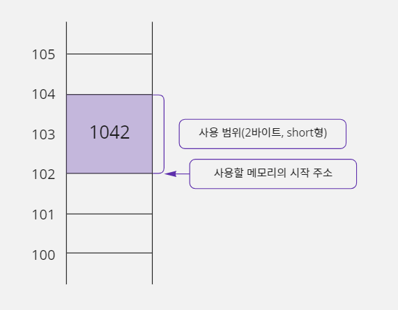

- 메모리를 사다리 모양으로 그려서 하나씩 검증해 보는 것이 개념을 이해하는 데 도움이 된다.
- 102번지에 1042 값이 대입되었는데 이 값이 2바이트에 걸쳐서 표현되어 있다.
- 그런데 위 그림은 단순화하여 그린 것이라 실제 메모리의 형태는 아니다.
- 실제 메모리에서 10진수 1042는 두 개의 바이트에 각각 4와 18로 나뉘어 저장되기 때문에 다음과 같이 그림을 그려야 한다.

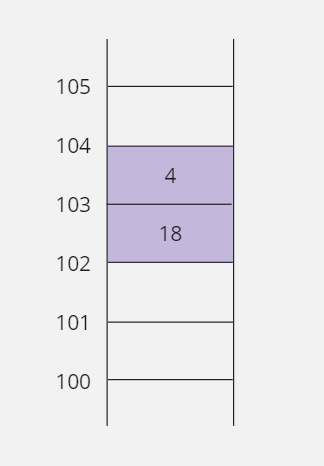

> #### 1042가 왜 4와 18로 나누어질까?
>
> - 1042값이 왜 4와 18로 나뉘어서 저장되는지 이해하려면 1042값을 2진수 값으로 바꿔 보면 된다.
> - 2진수 한 자리를 저장하기 위해서는 1비트가 필요하기 때문에 2바이트(16비트)에 맞도록 총 16자리의 2진수로 표시하면 다음과 같다.
> ```text
> 0000 0100   0001 0010  // 1024
>    (4)        (18)
> ```
> - 결국 1042 값은 8비트에 저장할 수 없기 때문에 두 개의 8비트에 4와 18로 나뉘어 저장되는 것이다.
> - 그런데 위의 그림에서 8비트씩 메모리에 옮길 때 102번지에 18, 103번지에 4가 대입되어 있다.
> - 숫자를 적을 때 큰 숫자부터 적는 게 일반적이라서 102번지에 4가 저장되는 게 맞다고 생각할 수도 있지만, 이 그림은 윈도우 운영체제를 기준으로 그린 것이다.
> - 윈도우 운영체제는 리틀 엔디언이라는 바이트 정렬을 사용하여 숫자를 표현하기 때문에 우리가 생각하는 것과 반대 방향으로 숫자가 배열된다.

#### 16진법으로 메모리 형태 표시하기

- 우리가 자주 쓰는 숫자는 대부분 10진수이다.
- 컴퓨터 내부에서는 0과 1, 즉 2진수로 정보를 처리한다.
- 파일을 압축하는 연산이나 동영상 처리, 심지어 전화 통화까지도 모두 비트 단위인 2진수 패턴으로 작업할 수 있다.
- 그런데 C 언어에서는 2진수를 직접 사용하는 방법을 제공하지 않는다.
- 따라서 C 언어로 프로그래밍할 때는 2진수에 가장 가까운 표현법인 16진수를 자주 사용한다.
- 16진법은 한 자릿수를 표현하는 데 16개의 문자를 사용하기 때문에 16진수의 한 자릿수는 4비트(2<sup>4</sup>=16)로 표시할 수 있다.
- 결국 16진수로 표현된 숫자는 두 자리씩 자르면 1바이트를 의미하므로 숫자를 바이트 단위로 나누기가 편리하다.
- 예를 들어 10진법으로 쓰인 숫자 1042를 바이트 단위로 나누려면 2진법으로 먼저 변환하고, 또 다시 바이트 단위로 나누어야 한다.
- 10진수 1042를 처음부터 16진수로 저장했다면 어떨까?
- 1042값은 16진수 표기법으로 `0x0412`이므로 한 바이트에 `0x04`가 저장되고 나머지 바이트에 `0x12`가 저장된다.
- 이렇게 C 언어로 프로그래밍할 때 바이트 단위로 작업을 하면, 데이터를 저장할 때 메모리 공간을 훨씬 효율적으로 사용할 수 있다.
- 메모리에 저장하는 값들과, 주소도 16진수로 표기해보자.

```text
0x0412 값을 0x00000066 번지에 2바이트 크기로 대입하라.
```

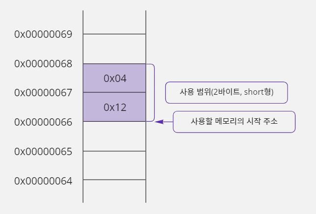

### 직접 주소 방식은 C 언어의 '변수' 문법과 같다

- 지금까지 메모리에서 '직접 주소 지정 방식'을 살펴보았다.
- '0x00000066 번지에 0x0412 값을 2바이트 크기로 대입하라.'는 명령을 좀 더 정확하게 이해하기 위해 컴퓨터가 사용하는 기계어와 가장 가까운 어셈블리 언어로 표현해 보면 다음과 같다.

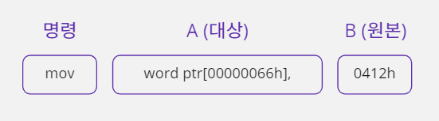

- 어셈블리어에서 `mov`명령은 move의 줄임 표현이고 `mov A, B`명령은 A에 B값을 대입하라는 뜻이다.
- `word ptr[]`명령은 `[]`에 명시된 주소에 가서 word(2바이트) 단위로 값을 읽거나 쓰겠다는 의미이다.
- C 언어와 달리 어셈블리어에서는 16진수를 표시할 때 숫자 끝에 `h`를 붙인다.
- C 언어는 '변수'라는 개념으로 직접 주소 지정 방식을 사용한다.
- C 언어에서 변수를 사용하면 변수에 값을 대입하는 소스 코드가 위와 같은 어셈블리어 형태의 기계어로 번역된다.

> #### 기계어와 어셈블리어가 무엇인지 좀 더 알아보자
>
> - 컴퓨터가 사용하는 2진 숫자로 나열된 언어를 기계어(Machine Language)라고 한다.
> - 실행 파일(Executable File, *.exe)이라고 부르는 것이 기계어로 구성된 파일이다.
> - 하지만 이 파일은 숫자로 이루어져 있어서 이해하기 어렵기 때문에, 형식은 비슷하면서 숫자로 배열된 명령을 영단어로 변경해서 보여주는 언어가 어셈블리(Assembly) 언어이다.
> - 어셈블리 언어는 기계어에 가장 가까운 저급 언어(Low-level language)이므로 성능 평가나 시스템 원리를 설명할 때 많이 사용한다.
> - `mov`, `word`처럼 자주 사용하는 몇 가지 명령과 레지스터(Register, CPU 내부에 있는 연산 가능한 메모리)를 공부해서 어셈블리 언어로 작성된 소스 코드를 보고 이해할 정도까지만 알아두자.

- C 언어는 변수라는 개념으로 메모리 주소를 직접 적지 않으면서도 직접 주소 지정 방식을 사용한다.
- 번역기의 도움을 받아서 내부적으로 변수가 주소로 변환되어 결과적으로는 직접 주소 지정 방식을 사용하게 되는 것이다.
- 앞에서 어셈블리어로 작성한 명령을 C 언어의 변수 문법으로 재구성해 보면 다음과 같다.

```c
short birthday;     // birthday가 메모리 주소 0x00000066에 위치한다고 가정함
birthday = 0x0412;  // mov word ptr[00000066h], 0412h 로 번역함
```

- C 언어는 왜 어셈블리어나 기계어처럼 주소를 직접 사용하지 않고 변수라는 개념을 사용할까?
- 메모리에 정보를 저장할 때 어셈블리어처럼 메모리 주소를 직접 표기하는 것보다 전체 코드를 더 쉽게 이해할 수 있게 된다.
- 또한 변수 이름을 잘 정하면 정보를 잘못 대입하는 실수도 줄어들게 된다.

### C 언어에서 직접 주소 지정 방식의 한계

- C 언어는 직접 주소 지정 방식을 변수 문법으로 사용하기 때문에 사용에 한계가 있다.
- 왜냐하면 함수 안에 선언한 변수는 해당 함수에서만 사용할 수 있고, 다른 함수에 선언한 변수가 메모리에 존재해도 문법적으로 접근할 수 없기 때문이다.

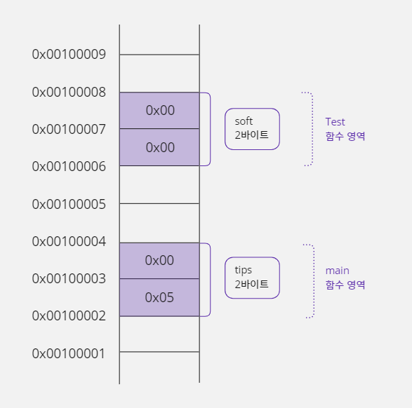

```c
#include <stdio.h>

void Test() {
    short soft = 0x0000;
    soft = tips;  // 오류
}

void main() {
    short tips = 0x0005;
    Test();
}
```

- 위 코드는 `main`, `Test`함수로 구성되어 있고 `main`함수가 `Test`함수를 호출하는 구조로 되어 있다.
- `Test`함수가 호출되면 `main`함수의 `tips`변수와 `Test`함수의 `soft`변수가 메모리에 위치한다.
- 하지만 `Test`함수에서 `tips`변수를 사용하려면 오류가 난다.
- 각 함수의 지역 변수는 해당 함수 안에서만 사용 가능하기 때문이다.
- 즉 `tips`변수는 `main`함수에서만 사용할 수 있고 `soft`변수는 `Test`함수에서만 사용할 수 있다.
- 이렇게 C 언어의 직접 주소 지정 방식은 변수 개념을 사용하기 때문에 문법 구조상 서로 다른 함수에 존재하는 변수를 참조할 수 없다.
- 그렇다고 지역 변수 간에 값을 전달하지 못하는 것은 아니다.
- 함수의 매개변수와 반환값을 이용하면 약간의 절차는 거치겠지만 서로 다른 함수에 존재하는 지역 변수들 간에 값을 주고받을 수 있다.
- 다음과 같이 메모리 주소를 사용하여 수정하면 `main`함수에 선언한 `tips`변수의 값을 `Test`함수의 `soft`변수에 오류 없이 대입할 수 있다.

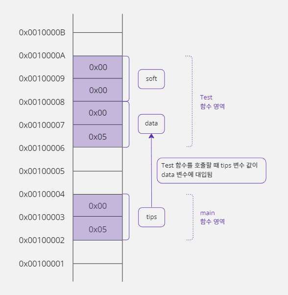

```c
#include <stdio.h>

void Test(short data) {
    short soft = 0x0000;
    soft = data;
}

void main() {
    short tips = 0x0005;
    Test(tips);
}
```

### 간접 주소 지정 방식

- 직접 주소 지정 방식은 주소를 직접 명시한다.
- 간접 주소 지정 방식은 메모리를 매개체로 이용해 주소를 간접적으로 명시한다.
- 이 메모리는 주소를 저장하기 위해 크기를 4바이트로 고정해야 한다.
- 왜냐하면 32비트 운영체제는 주소를 32비트(4바이트)로 표현하기 때문이다.

```text
102번지에 4바이트 크기의 '주소'가 저장되어 있는데
이 주소에 가서 '값' 1042를 2바이트 크기로 대입하라.
```

- 102번지에는 값을 저장할 메모리 주소인 108이 적혀있고, 1042값은 108번지에 2바이트 크기로 저장된다.
- 결국 간접 지정 방식을 사용하면 1042값을 저장할 실제 메모리 주소는 명령에 적지 않아도 된다.

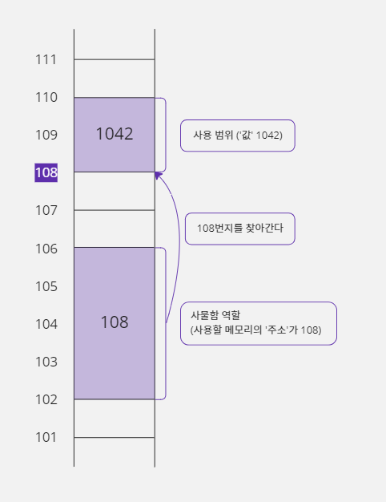

- 이렇게 간접 주소 지정 방식을 사용하면 1042값이 108번지가 아니라 120번지로 변경되더라도 명령을 바꾸지 않아도 된다.
- 왜냐하면 102번지에 저장되어 있는 주소를 108번지에서 120번지로 바꾸면 되기 때문이다.
- 명령을 바꾼다는 뜻은 기계어를 바꿔야 한다는 뜻이고 이것은 코드를 다시 번역해서 실행 파일을 만들어야 한다는 뜻이다.
- 하지만 메모리에 있는 주소를 변경하는 것은 단순한 데이터 조작이기 때문에 코드를 다시 번역할 필요가 없고 프로그램이 실행되는 중에도 변경할 수 있다.
- 그래서 프로그래머 입장에서는 좀 더 복잡하더라도 간접 주소 지정 방식을 활용하는 것이 좋다.

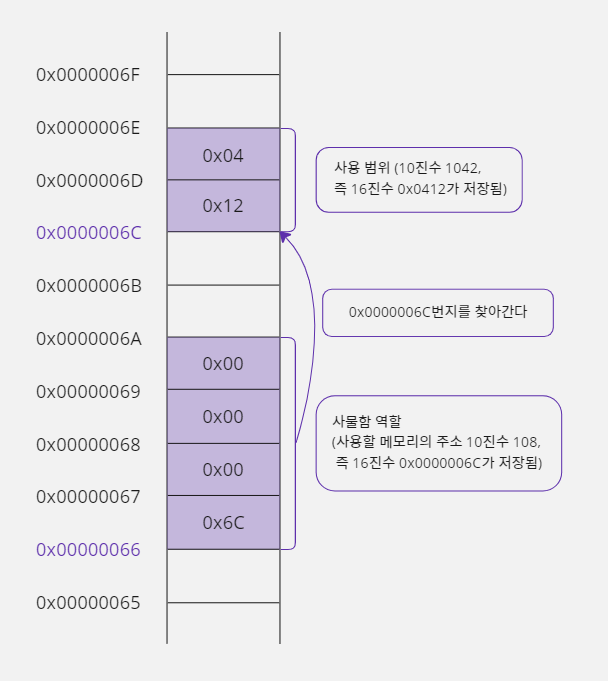

- 위 그림처럼 바이트 단위까지 정확하게 표시해야 나중에 포인터의 다양한 기능을 정확하게 이해할 수 있다.
- 위 그림을 의미하는 간접 주소 지정 방식 명령은 다음과 같다.

```text
0x00000066번지에 4바이트 크기의 '주소'가 저장되어 있는데
이 주소에 가서 '값' 0x0412를 2바이트 크기로 대입하라.
```

> #### 간접 주소 지정 방식을 어셈블리어로 표현해 보자.
>
> - 포인터 문법을 사용할 때 실제로 번역되는 코드를 보면 포인터에 대해 더 명확하게 이해할 수 있다.
> ```text
> 명령          A(대상)             B(원본)
> mov          cx,                dword ptf[0000006Ch]
> mov          word ptr[cx],      0412h
> ```
> - 직접 주소 지정 방식에서는 하나의 `mov`명령을 사용했지만 간접 주소 지정 방식에서는 두 개의 `mov`명령을 사용한다.
> - 사물함에 해당하는 메모리에서 주소를 읽는 것이 첫 `mov`명령에 해당하고 `0x0412`값을 사물함에 들어 있는 주소에 저장하는 것이 두 번째 `mov`명령에 해당한다.
> - 이렇게 명령을 나누어서 처리하는 이유는 CPU가 하나의 명령으로 메모리에서 메모리로 값을 복사할 수 없기 때문이다.
> - CPU내부에 있는 CX 레지스터에 `0x0412`를 저장할 주소(사물함에 들어 있는 주소)를 옮기고 CX 레지스터에 저장된 메모리 주소에 가서 `0x0412`를 저장해야 한다.
> - 첫 번째 `mov`명령의 `dword`는 double word의 줄임 표현이며 4바이트를 의미하고, 사물함에 해당하는 메모리에 주소가 4바이트 크기로 저장되기 때문에 4바이트 크기로 읽기 위해 `dword`를
    사용한 것이다.
> - 두 번째 `mov`명령에서 `word`를 사용한 이유는 `0x0412`값이 2바이트 크기로 메모리에 저장되어야 하기 때문이다.

## 13-2. 포인터

### 포인터란?

- C 언어에서 직접 주소 지정 방식은 변수 문법이다.
- 그러면 간접 주소 지정 방식은 C 언어에서 어떻게 표현할까?
- 4바이트 정수형으로 `addr`변수를 선언하고 `addr`변수에 `0x0000006C`값(`0x0412`를 저장할 주소, 108번지)을 대입해 보자

```c
unsigned int addr = 0x0000006C;
```

- `unsigned int`자료형을 사용한 이유는, 주소는 음수가 나올 수 없기 때문이다.
- 이렇게 선언한 `addr`변수에 주소를 저장할 수는 있다.
- 하지만 일반 변수라서 실제로 해당하는 주소의 메모리에 가서 값을 읽거나 저장할 수 있는 기능이 없다.
- 이것은 C 언어의 일반 변수가 자신이 위치한 메모리에서만 값을 읽거나 쓸 수 있는 직접 주소 지정 방식으로 동작하기 때문이다.
- 그래서 C 언어는 간접 주소 지정 방식으로 동작하는 특별한 변수를 선언하기 위해 포인터(Pointer)문법을 추가로 제공한다.
- 포인터 문법을 사용해 선언한 포인터 변수는 메모리 주소만을 저장하기 위해 탄생한 특별한 변수이다.
- 앞에서 사물함에 비유했던 메모리가 C 언어에서는 포인터 변수이다.
- 즉 자신이 사용하고 싶은 메모리의 '주소'를 저장하고 있는 메모리가 포인터이다.
- 포인터 변수는 일반 변수와 다르게 `*`기호를 추가로 사용하여 다음과 같이 선언한다.

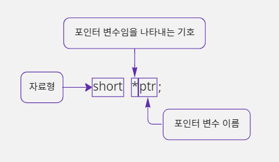

- `ptr`은 포인터 변수의 이름이고 이 변수가 포인터라는 것을 번역기에게 알려주기 위해 `ptr`앞에 `*`를 사용한다.
- 그리고 자료형을 적는 위치에 `short`를 사용했다.
- 그럼 포인터 변수 `ptr`의 크기가 2바이트일까? No...
- 일반 변수는 자료형이 변수의 크기를 의미하지만, 포인터 변수는 자료형을 선언하지 않아도 무조건 크기가 4바이트(32비트 운영체제 기준, 주소의 크기가 4바이트)로 정해져 있기 때문에 포인터 변수의 크기를 적을
  필요가 없다.
- 그렇다면 `*`앞의 자료형은 무엇을 의미할까?
- `short`는 `ptr`변수에 저장된 주소에 저장될 값의 자료형을 의미한다.

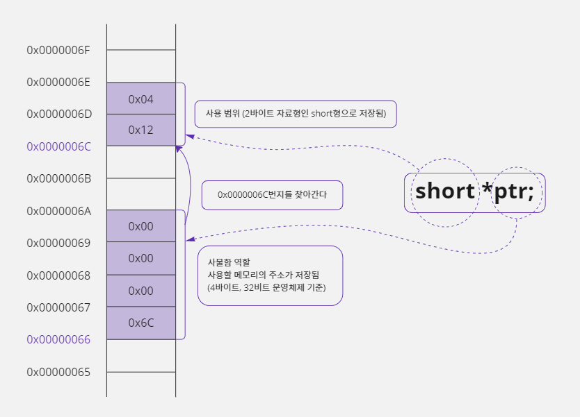

- 앞에서 간접 주소 지정 방식을 설명하면서 사용한 메모리 그림에 포인터 변수 `ptr`를 적용해 보면 위와 같다.

### 변수가 저장된 메모리 공간의 주소 얻기

- 프로그램은 실행될 때마다 사용할 메모리 공간의 주소가 달라진다.
- 따라서 프로그램에 선언된 변수의 주소는 프로그램이 실행될 때마다 다른 주소에 할당된다.
- 예를 들어 `a`변수가 지금 100번지에 할당되어 있어도 다음번 실행할 때는 200번지에 할당될 수도 있다는 뜻이다.
- 그래서 '포인터가 가리키는 대상'의 주소를 직접 입력하여 항상 같은 주소를 사용하게 하면 대부분 오류가 발생하게 된다.
- 따라서 주소를 직접 입력하는 것보다 프로그램 안에 선언한 다른 변수의 주소를 받아와서 사용하는 것이 안전하다.
- 변수는 해당 프로그램의 메모리 영역에 만들어지기 때문에 다른 프로그램의 메모리 영역에 잘못 접근할 일이 없다.
- 변수의 주소는 변수 앞에 '`&`연산자'를 사용하여 구할 수 있다.

```c
short birthday;   // short형 변수 birthday를 선언함
short *ptr;       // 포인터 변수 선언함
ptr = &birthday;  // birthday 변수의 주소를 ptr변수에 대입함
```

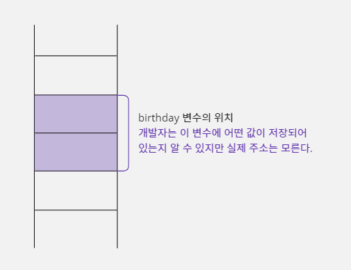

- 변수가 위치한 메모리의 주소를 출력해 보는 예제를 코딩해 보자.

```c
#include <stdio.h>

void main() {
    short birthday;
    short *ptr;  // 포인터 변수 선언함
    ptr = &birthday;  // birthday 변수의 주소를 ptr 변수에 대입함

    // %p 형식은 메모리 주소를 16진수 형식으로 출력함
    printf("birthday 변수의 주소는 %p, %08X, %16X입니다.\n", ptr, ptr, ptr);
}
```

```text
birthday 변수의 주소는 00000031d65ffd26, D65FFD26,         D65FFD26입니다.
```

- 64비트 운영체제라서 주소가 16자리로 출력된다.

###                   * 키워드의 또 다른 이름, 번지 지정 연산자

- C 언어에서 `*`키워드는 여러 가지 용도로 쓰기 때문에 각각의 용도를 잘 기억해야 한다.

```c
short birthday;   // short형 변수 birthday를 선언함
short *ptr;       // 포인터가 가리키는 대상의 크기가 2바이트인 포인터 변수를 선언함
ptr = &birthday;  // birthday 변수의 주소를 ptr 변수에 대입함(주소는 108번지라고 가정함)
*ptr = 1042;      // ptr에 저장된 주소에 가서 값 1042를 대입함. 즉 birthday = 1042
```

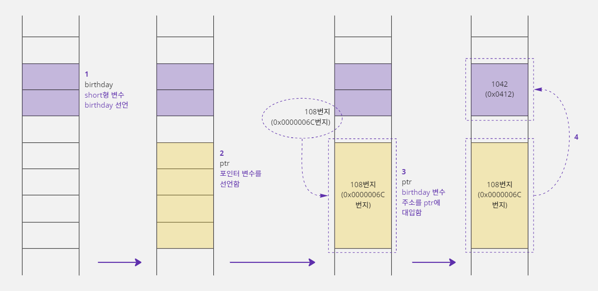

- 위 코드에서 `short *ptr;`와 `ptr = &birthday;`는 `short *ptr = &birthday;`라고 줄여서 적을 수 있다.
- 여기에서 주의할 점은 `short *ptr = &birthday;`가 값을 대입하는 형태와 비슷해서 `*`키워드를 `*ptr = 1042;`에서 번지를 지정하기 위해 사용한 `*`연산자와 같다고 착각해서는
  안된다.
- `short *ptr = &birthday;`에서 `*`키워드는 포인터 변수를 선언하기 위해 사용한 것이고 `*ptr = 1042;`의 `*`연산자는 `ptr`포인터가 가리키는 주소의 변수(대상)에
  가서 `1042`(0x0412)값을 대입하겠다는 의미이다.

```c
short *ptr = &birthday;  // 여기서의 *는 포인터 변수를 선언하기 위해 사용하는 키워드
*ptr = 1042;  // 여기서의 *는 번지 지정 연산자. ptr 포인터가 가리키는 대상에 가서 1042값을 대입하겠다는 의미
```

```c
#include <stdio.h>

void main() {
    short birthday;
    short *ptr;
    ptr = &birthday;  // birthday 변수의 주소를 ptr 변수에 대입함
    *ptr = 0x0412;  // birthday = 0x0412;와 같은 결과

    printf("birthday = %d (0x%04X)\n", birthday, birthday);
}
```

```text
birthday = 1042 (0x0412)
```

- `%04X`는 `birthday`변수에 저장되는 값을 16진수 형태로 출력해서 보여주기 위한 키워드이다.
- 전체 자릿수가 4자리를 차지하도록 출력하는데, 숫자가 4자리를 채우지 못하는 경우에는 빈자리에 0을 채운다.
- 위 예제에서 `birthday`변수는 선언 후 직접 사용된 적이 없지만, `ptr`포인터 변수에 의해 간접적으로 값 `0x0412`가 대입되었다.
- `printf`로 `birthday`값을 출력해 보면 10진수로는 1042가 출력되고 16진수로는 0x0412가 출력된다.

### 'ptr = '과 '*ptr = '의 차이점

- 포인터 문법은 두 개의 메모리 공간과 관련이 있다.
- '포인터 변수가 저장된 메모리'와 '포인터가 가리키는 대상 메모리'이다.
- `ptr = `형태로 사용하면 포인터 변수의 값(가리키는 대상의 주소)이 변경되고 `*`(번지 지정)연산자를 붙여서 `*ptr = `형태로 사용하면 '포인터가 가리키는 대상'의 값이 변경된다.

#### 'ptr = ' 형태는 포인터 변수에 주소를 저장한다

- 포인터 변수도 일반 변수처럼 자신을 위한 메모리 공간이 있다.
- 일반 변수와 차이가 있다면 포인터 변수는 주소를 저장하기 때문에 메모리 크기가 4바이트로 고정된다는 것이다.
- 포인터 변수에 저장된 주소는 '포인터가 가리키는 대상 메모리'의 시작 주소를 의미한다.
- `ptr = `형태를 사용해서 주소를 직접 대입하는 방법은 다음과 같다.

```c
short *ptr;
ptr = (short *)0x0000006C;  // 포인터 변수 ptr에 주소를 직접 대입한다
```

- `int`형 데이터가 저장되는 메모리는 `short *`형 포인터 변수가 저장된 메모리와 4바이트로 크기는 같다.
- 하지만 컴파일러는 크기를 가지고 자료형이 같다고 판단하지 않기 때문에 `int`형 정수 값 `0x0000006C`를 `ptr`변수에 맞는 자료형으로 변환하여 대입해야 한다.
- 따라서 `0x0000006C`를 `short *`형으로 형 변환한다.
- 위 코드처럼 포인터 변수 `ptr`를 선언하고 `0x0000006C`의 주소를 대입하면 `ptr`포인터 변수가 차지하고 있는 4바이트 메모리 공간에 `0x0000006C`값이 저장된다.
- 그러면 이제 포인터 변수 `ptr`은 `0x0000006C`번지를 가리키게 되어 `0x0000006C`번지에서 값을 읽거나 쓸 수 있다.
- 변수의 실제 메모리 주소는 `&`연산자로 얻을 수 있다.

#### '*ptr = ' 형태는 포인터가 가리키는 대상에 값을 저장한다

- 포인터 문법과 관련된 두 번째 메모리 공간인 '포인터가 가리키는 대상'의 값을 다루는 방법에 대해 알아보자.
- '포인터가 가리키는 대상'을 사용하려면 당연히 포인터 변수에 대상의 주소가 먼저 저장되어야 하기 때문에 앞에서 설명한 방법으로 `ptr`변수에 값 `0x0000006C`를 넣었다고 가정한다.
- 앞에서 포인터 변수에 주소를 대입할 때는 일반 변수처럼 `ptr = `이라고 사용했지만 '포인터가 가리키는 대상'의 값을 변경할 때는 `ptr`변수 앞에 `*`(번지 지정)연산자를 추가하여 `*ptr = `이라고
  사용해야 한다.

```c
short *ptr;
ptr = (short *)0x0000006C;  // ptr 변수에 0x0000006C 값을 대입함
*ptr = 0x0412;  // 0x0000006C 번지에 0x0412 값을 대입함
```

- 위 코드처럼 `*ptr = 0x0412;`라고 하면 `ptr`변수가 저장하고 있는 주소(0x0000006C)에 가서 2바이트 크기로 값 0x0412를 대입하라는 뜻이다.
- 지금까지는 설명을 위해서 주소를 저장하는 메모리 `ptr`에 `0x0000006C`를 넣어서 사용했지만, 실제로는 이렇게 코드를 구성할 수 없다.
- 왜냐하면 자신의 프로그램이 어떤 주소 영역에 할당될지 예측할 수 없기 때문이다.
- 이렇게 고정 주소를 사용하면 자신의 프로그램 영역이 아닌 다른 프로그램의 메모리 영역에 접근을 시도할 것이고, 이런 동작은 잘못된 접근으로 처리되어 오류가 발생할 것이다.

> #### 고정 주소를 직접 표기할 수는 없을까?
>
> - `0x0000006C`처럼 주소를 직접 표기하는 것 자체가 잘못된 것은 아니다.
> - 유효한 주소라면 직접 표기해도 된다.
> - 그런데 유효한 주소는 따로 정해져 있는 것이 아니라 프로그래머가 판단하는 것이다.
> - 실력이 많이 쌓여서 메모리 주소를 사용하는 데 익숙해지면, 자신이 사용하는 메모리 영역의 주소를 알아내서 수학적 계산을 통해 사용할 주소를 직접 계산할 수도 있다.

### 다른 함수에 선언된 지역 변수 사용하기

```c
short birthday;   // short형 변수 birthday를 선언함
short *ptr;       // 포인터가 가리키는 대상의 크기가 2바이트인 포인터 변수 선언함
ptr = &birthday;  // birthday 변수의 주소를 ptr 변수에 대입함
*ptr = 0x0412;    // ptr에 저장된 주소에 가서 0x0412값을 대입함. birthday = 0x0412;
```

- 이렇게 포인터를 사용하여 간접 주소 방식으로 값을 대입하는 이유가 뭘까?
- 그 이유는 모든 변수가 같은 함수에 선언되는 것이 아니기 때문이다.
- 만약 `main`함수에서 `ptr`변수와 `birthday`변수를 함께 선언해서 사용하면 아무 문제가 생기지 않는다.
- 그러나 이 두 변수를 서로 다른 함수에 선언했다면 상당한 의미를 갖는다.
- 왜냐하면 일반 변수는 문법적으로 서로 다른 함수에 있는 변수를 사용할 수 없지만, 포인터는 변수 이름이 아니라 주소로 대상을 찾아가기 때문에 같은 함수가 아니더라도 대상 메모리의 값을 읽거나 쓸 수 있기
  때문이다.

#### 직접 주소 지정 방식으로 다른 함수에 선언한 변수 사용하기

> `A형 - 다른 함수의 변수 사용시 오류`
> ```c
> #include <stdio.h>
> 
> void Test() {
>     short soft = 0;
>     soft = tips;  // 오류 발생
> }
> 
> void main() {
>     short tips = 5;
>     Test();
> }
> ```
> `B형 - 매개변수로 다른 함수의 변수 값 받기`
> ```c
> #include <stdio.h>
> void Test(short data) {
>     short soft = 0;
>     soft = data;  // 가능, soft = 5;
> }
> 
> void main() {
>     short tips = 5;
>     Test(tips);
> }
> ```

- A형에서 `tips`변수는 `main`함수에서 선언된 변수이므로 `Test`함수에서 사용할 수 없다.
- 그래서 B형에서는 오류 없이 `tips`변수 값을 `soft`에 대입하기 위해 매개변수를 사용한 것이다.
- 하지만 B형 예제는 `main`함수의 `tips`변수 값을 넘겨받았을 뿐이기 때문에 `Test`함수에서 `main`함수의 `tips`변수 값을 직접 수정할 수는 없다.
- 이것은 매개변수가 대상 변수의 주소가 아니라 변수가 가지고 있는 값(5)을 넘겨받았기 때문이다.

#### 간접 주소 지정 방식(포인터)으로 다른 함수에 선언한 변수 사용하기

- C 언어에서 함수의 매개변수로 간접 주소 지정 방식(포인터 변수)을 사용할 수도 있다.
- 다음 C형과 같이 간접 주소 지정 방식의 포인터로 `main`함수에 선언한 `tips`변수를 `Test`함수에서 사용할 수 있다.

> `B형 - 매개변수로 다른 함수의 변수 값 받기`
> ```c
> #include <stdio.h>
> 
> void Test(short data) {
>     short soft = 0;
>     soft = data;  // 가능, soft = 5;
>     tips = 3;  // 오류 발생
> }
> 
> void main() {
>     short tips = 5;
>     Test(tips);
> }
> ```
> `C형 - 매개변수로 다른 함수의 변수 주소 받기`
> ```c
> #include <stdio.h>
> 
> void Test(short *ptr) {
>     short soft = 0;
>     soft = *ptr;  // soft = tips;
>     *ptr = 3;  // tips = 3;
> }
> 
> void main() {
>     short tips = 5;
>     Test(&tips);
> }
> ```

- C형은 B형과 달리 매개변수로 포인터 변수 `ptr`를 선언해서 `main`함수의 `tips`변수 주소를 받았다.
- 따라서 `Test`함수에서 `tips`변수 이름은 사용할 수 없지만 `tips`변수의 주소를 `ptr`포인터가 가지고 있기 때문에 `*ptr`를 사용해서 해당 주소에 저장된 값을 가져오거나, 대입할 수 있다.
- 결국 간접 주소 지정 방식을 사용하면 `Test`함수를 호출한 `main`함수에 선언된 변수의 값만 받아 오는 것이 아니라 해당 변수이 값을 변경할 수도 있다.

### 두 변수의 값 서로 바꾸기

- 프로그래밍을 하다 보면 두 변수의 값을 서로 바꿔야 하는 경우가 생긴다.
- 이런 경우 값을 임시로 보관하는 변수를 하나 더 추가해야 한다.
- 이 변수의 이름을 `temp`라고 하자.
- `start`와 `end`라는 변수의 값을 바꾸기 위해 `temp`변수를 추가하면 `end`값에 `start`값을 대입하기 전에 `temp`에 `end`값을 보관해서 값이 사라지는 것을 막을 수 있다.

```c
int start = 96, end = 5;
int temp;
if(start > end) {
    temp = end;
    end = start;
    start = temp;
}
```

- `Swap`함수를 따로 분리해서 다시 코드를 작성해 보자.

```c
#include <stdio.h>

// temp 변수를 이용하여 a와 b의 값을 서로 바꾸는 함수
void Swap(int a, int b) {
    int temp = a;  // a = 96, b = 5
    a = b;         // a = 5, b = 5
    b = temp;      // a = 5, b = 96
}

void main() {
    int start = 96, end = 5;

    printf("before : start = %d, end = %d\n", start, end);
    if (start > end) {
        Swap(start, end);  // start와 end의 값을 바꾸기 위해서 Swap 함수를 호출함
    }
    printf("after : start = %d, end = %d\n", start, end);
}
```

```text
before : start = 96, end = 5
after : start = 96, end = 5  // 값이 바뀌지 않았다
```

- 예제의 실행 결과를 보면 기대와 달리 `start`와 `end`값이 변경되지 않았다.
- 분명히 `start`값이 `end`값보다 크기 때문에 조건문이 만족하여 `Swap`함수가 호출되었다.
- 그리고 `Swap`함수에서는 `start`, `end`변수 값을 매개변수 `a`, `b`로 전달받아서 `a`, `b`값을 서로 교환까지 했다.
- 하지만 `main`함수의 `start`, `end`와 상관 없이 변경된 변수가 `a`, `b`라는 것이 이 예제의 문제점이다.
- 그림으로 그려보자.
- 사격형 한 칸은 4바이트를 의미한다.

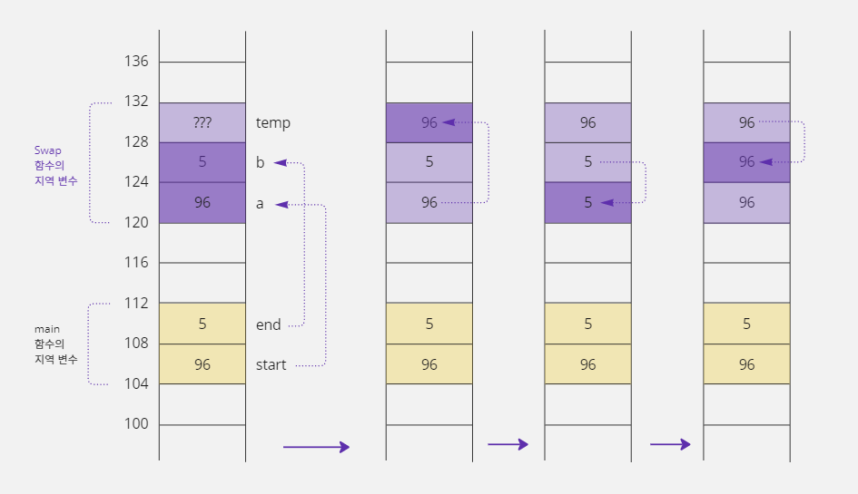

- 이 그림을 보면 `main`함수의 지역 변수인 `start`, `end`변수 값은 계속 96과 5로 유지되고 있다.
- 결국 예제에서 사용한 방법으로는 `main`함수의 `start`, `end`값을 변경할 수 없기 때문에 다른 함수의 지역 변수 값을 변경할 수 있는 포인터 문법을 사용하여 이 문제를 해결해야 한다.

### 포인터를 이용해 두 변수 값 바꾸기

- 이번에는 포인터 문법을 이용해서 값 대신 각 변수의 '주소'를 넘겨 이 문제를 해결해 보자.
- `main`함수의 `start`, `end`변수 주소를 `Swap`함수로 전달하려면 `Swap`함수의 매개변수에는 포인터 변수가 와야 한다.

```c
#include <stdio.h>

// temp 변수를 이용하여 a와 b의 값을 서로 바꿈
void Swap(int *pa, int *pb) {
    int temp = *pa;  // *pa(start) = 96, *pb(end) = 5
    *pa = *pb;       // *pa(start) = 5, *pb(end) = 5
    *pb = temp;      // *pa(start) = 5, *pb(end) = 96
}

void main() {
    int start = 96, end = 5;

    printf("before : start = %d, end = %d\n", start, end);

    if (start > end) {
        Swap(&start, &end);  // start와 end의 값을 바꾸기 위해서 Swap을 호출함
    }
    printf("before : start = %d, end = %d\n", start, end);
}
```

```text
before : start = 96, end = 5
before : start = 5, end = 96
```

- `Swap`함수에서 `pa`, `pb`포인터를 `*pa`, `*pb`와 같이 사용하면 `pa`, `pb`포인터가 가리키는 대상 메모리인 `start`, `end`의 값을 변경할 수 있다.
- 함수의 `return`키워드를 사용해서 함수의 작업 결과 값을 함수를 호출한 쪽으로 전달할 수는 있다.
- 하지만 `return`은 한 번에 한 개의 값만 반환하고 지금처럼 두 값 `start`, `end`을 동시에 반환할 수 없기 때문에 `return`문을 사용하는 것보다 포인터를 사용하는 것이 더 효과적이다.

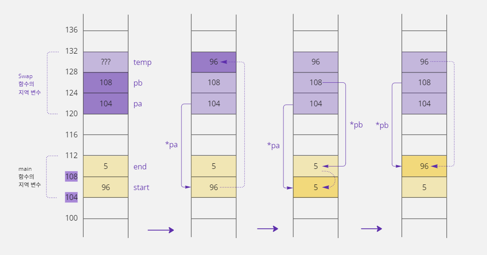

- 이처럼 함수에 포인터 문법을 함께 사용하면 다른 함수에 선언한 지역 변수 값도 수정할 수 있다.

## 13-3. 포인터와 const 키워드

### const 키워드로 주소 변경 실수 막기

- `Swap`함수도 마찬가지겠지만 불린 쪽(피호출자)에서 부른 쪽(호출자)으로부터 전달받은 주소를 변경하는 경우는 거의 없다.
- 즉 `pa`와 `pb`에 저장된 주소가 바뀔 이유가 없다는 뜻이다.
- 따라서 주소를 바꾸는 코드가 있다면 이것은 프로그래머의 실수일 확률이 높기 때문에 `const`키워드를 이용하여 명시적으로 주소가 바뀌는 실수를 막을 수 있다.

```c
void Swap(int *const pa, int *const pb) {
    int temp = *pa;
    pa = pb;  // pa는 const 변수라서 값을 변경할 수 없기 때문에 오류가 발생함
    *pb = temp;
}
```

- 위 코드와 같이 `Swap`함수의 매개변수 형태를 변경하면 둘 다 `const`키워드에 의해 번역할 때 오류가 발생한다.
- 그래서 실수로 `*`를 생략하는 경우에 좀 더 쉽게 문제점을 찾아낼 수 있다.

### 포인터 변수에서 const 키워드를 사용하는 여러 가지 방법

- 포인터 변수는 일반 변수와 `const`키워드를 사용하는 위치가 좀 다르다.
- 왜냐하면 포인터 변수는 포인터 변수에 저장된 값을 변경하거나 포인터 변수가 가리키는 대상의 값을 변경하는 두 가지 형태로 사용할 수 있기 때문에 다음과 같이 `const`키워드를 사용할 수 있는 위치도 두
  곳이다.

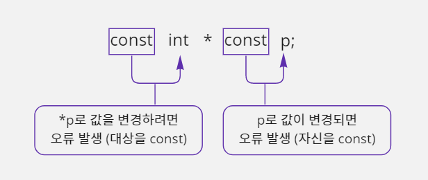

- 이렇게 `const`키워드를 사용할 수 있는 위치가 두 곳이기 때문에, 이 위치를 조합하면 포인터 변수를 세 가지 방법으로 선언할 수 있다.

#### int *const p;

- `p`앞에 `const`키워드를 사용했다.
- 따라서 `p`가 가지고 있는 주소를 변경하면 번역할 때 오류가 발생한다.

```c
int data = 5, temp = 0;
int *const p = &data;  // 변수 p는 data 변수의 주소를 저장한다.
                       // 포인터 변수를 선언할 때 한 번만 p에 주소 값을 대입할 수 있다.
*p = 3;  // p 변수가 저장하고 있는 주소에 가서 3을 대입하면 data 변수의 값이 3으로 변경됨
p = &temp  // 오류 발생: 변수 p에 const 속성이 적용되어 p에 저장된 주소는 변경할 수 없음
```

#### const int *p;

- `p`가 주소에 접근할 때 사용하는 크기 앞에 `const`키워드를 사용했기 때문에 `*p`를 사용하여 대상의 값을 변경하면 번역할 때 오류가 발생한다.

```c
int data = 5;
const int *p = &data;  // 변수 p는 data 변수의 주소를 저장함
*p = 3;  // 오류 발생: 변수 p가 가리키는 대상에 const 속성이 적용되어 대상의 값을 변경할 수 없음
```

#### const int *const p;

- 자신과 대상에 모두 `const`키워드를 사용했기 때문에 `p`가 가지고 있는 주소를 바꾸거나 `*p`를 사용하여 대상의 값을 바꾸면 번역할 때 오류가 발생한다.

```c
int data = 5, temp = 0;
const int * const p = &data;
*p = 3;  // 오류 발생: 변수 p가 가리키는 대상에 const 속성이 적용되어 대상의 값을 변경할 수 없음
p = &temp;  // 오류 발생: 변수 p에 const 속성이 적용되어 p에 저장된 주소는 변경할 수 없음
```

- 결론적으로 일반 변수를 다룰 때보다 포인터 변수를 다룰 때 실수할 확률이 더 높기 때문에, `const`키워드를 적절하게 잘 활용하면 실수로 인한 버그(의미상 오류)를 줄일 수 있다.

## 13-4. 포인터 변수의 주소 연산

### 사용할 메모리의 범위를 기억하는 방법

- 자신이 사용할 메모리의 범위를 기억하는 방법은 크게 두 가지이다.
- 첫 번째 방법은 시작 주소와 끝 주소를 기억하는 것이고 두 번째 방법은 시작 주소와 사용할 크기를 기억하는 것이다.

#### 시작 주소와 끝 주소로 메모리 범위 기억하기

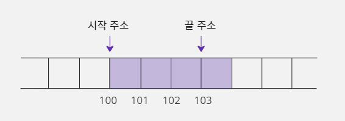

- 시작 주소와 끝 주소로 메모리 범위를 기억하려면 각각의 주소를 기억하는 데 총 8바이트가 필요하다.
- 시작 주소인 100번지를 저장하는 데 4바이트가 필요하고 끝 주소인 103번지를 저장하는 데 또 4바이트가 필요하기 때문이다.

#### 시작 주소와 사용할 크기로 메모리 범위 기억하기

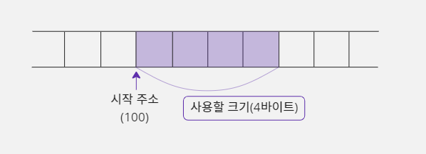

- '시작 주소'와 '사용할 크기'로 메모리 범위를 기억하는 것도 두 가지 정보를 기억해야 한다.
- 시작 주소인 100번지를 저장하는 데 4바이트가 필요할 것이고, 사용할 크기를 저장하는 데 4바이트가 필요할 것이다.
- 그런데 C 언어 문법은 메모리를 사용할 때 항상 그 메모리의 크기를 먼저 결정하도록 되어 있다.
- 예를 들어 정수 값 5를 저장하고 싶다면 `int data;`와 같이 변수를 선언해야 하는데 이때 사용할 메모리의 크기는 `int`형으로 선언했기 때문에 4바이트로 결정된다.
- 그리고 `data = 5;`명령을 사용하면 컴파일러는 `data`라는 변수가 4바이트라는 것을 이미 알고 있기 때문에 메모리에 4바이트 크기로 5를 대입하도록 명령을 구성하게 된다.
- 결국 사용할 메모리 크기는 명령문에 포함되어 있기 때문에 자신이 사용할 메모리의 시작 주소만 기억하면 된다는 뜻이다.
- 이런 프로그래밍 언어의 특성 때문에 포인터도 자신이 가리킬 대상에 대해 사용할 범위는 저장하지 않고 사용할 메모리의 시작 주소만 기억하면 된다.

```c
short data = 0;
short *p = &data;  // p 변수에 data 변수의 시작 주소를 저장한다
*p = 5;  // 포인터 변수 p가 가리킬 대상의 크기는 short이기 때문에 p에 저장된
         // 시작 주소부터 2바이트 크기의 공간에 값 5를 저장한다.
```

- 컴파일러가 `data = 5;`를 기계어로 번역하면 `mov dword ptr [0000006Ch], 5h`가 된다.
- 여기서 `dword`명령을 통해 사용할 크기를 명시하는 것을 볼 수 있다.
- 즉 컴파일러가 기계어 명령을 구성하는 단계에서 '사용할 메모리 크기'가 결정된다.

### 포인터 변수의 주요 연산

- 포인터가 자신이 가리킬 대상 메모리의 시작 주소만 기억하면 되기 때문에 갖게 되는 특성이 있다.

```c
short data = 0;
short *p = &data;
p = p + 1;  // 포인터 변수에 저장된 주소 값을 1만큼 증가시킴
```

- 포인터 변수에 저장된 주소도 정수 값이기 때문에 일반 변수처럼 연산할 수 있다.
- 그런데 주소를 1만큼 증가시킨다는 의미가 일반 수학 연산과 다르기 때문에 주의해야 한다.
- 포인터 변수 `p`에 저장된 주소가 100번지인 경우에 이 변수를 1만큼 증가시키면 변수에 저장되어 있던 주소 값은 101번지가 되는 게 아니라 102번지가 된다.
- 왜냐하면 포인터에서 +1의 의미는 단순히 주소 값에 1을 더한다는 뜻이 아니고 그다음 데이터의 주소를 의미하기 때문이다.
- 위 예시에서 포인터 변수 `p`가 가리키는 대상의 크기가 2바이트인데 이 포인터로 다음 데이터를 가리키려면 주소 값이 1이 아닌 2가 증가되어야 정상적으로 그다음 데이터를 가리킬 수 있다.
- 이처럼 포인터 변수에 +1을 하면 자신이 가리키는 대상이 크기만큼 증가하는데 이것을 '포인터 변수의 주소 연산'이라고 한다.

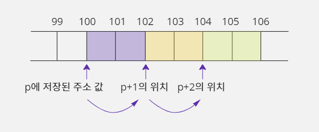

- `p`가 `short` 크기의 데이터를 사용하기 때문에 주소 값이 2씩 증가해야 안전하게 사용할 수 있다.
- 다음 코드를 보자.
- 포인터 변수의 주소 연산 특성 때문에, 사용할 크기가 다른 네 개의 포인터에 모두 100번지를 대입하고 `++`연산을 하면 각 포인터에 저장된 주소 값이 모두 달라지게 된다.

```c
char *p1 = (char *) 100;      // p1에 100번지를 저장함
short *p2 = (short *) 100;    // p2에 100번지를 저장함
int *p3 = (int *) 100;        // p3 에 100번지를 저장함
double *p4 = (double *) 100;  // p4에 100번지를 저장함
p1++;  // 가리키는 대상의 크기가 char형(1바이트)이기 때문에 p1에 저장된 주소 값이 101이 됨
p2++;  // 가리키는 대상의 크기가 short형(2바이트)이기 때문에 p2에 저장된 주소 값이 102가 됨
p3++;  // 가리키는 대상의 크기가 int형(4바이트)이기 때문에 p3에 저장된 주소 값이 103가 됨
p4++;  // 가리키는 대상의 크기가 double형(8바이트)이기 때문에 p4에 저장된 주소 값이 108이 됨
```

- 즉 우리가 사용하려는 메모리의 시작 주소를 가리키는 포인터의 주소만 알고 있다면, 주소 연산을 통해 그다음 메모리를 사용할 수 있다.

## 13-5. 포인터와 대상의 크기

### 포인터가 가리키는 대상의 크기

- `int *p`라고 포인터 변수를 선언할 때 `int`자료형은 포인터 변수의 크기를 의미하는 것이 아니라 포인터 변수가 가리키는 대상의 크기를 의미하는 것이다.
- 따라서 포인터 변수 `p`에 일반 변수 `data`의 주소 값을 저장하고 포인터 변수 `p`를 사용하여 `data`변수의 값을 변경하는 경우에는 두 변수의 자료형을 같게 지정하는 것이 일반적이다.
- 즉 실제 대상의 크기가 4바이트라면 포인터 변수의 자료형도 4바이트 크기로 지정하는 게 일반적이라는 뜻이다.

```c
int data = 0;
int *p = &data;
```

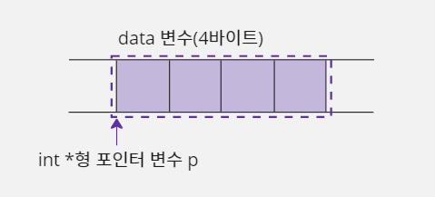

- 포인터 변수 `p`는 4바이트 크기의 메모리를 가리킨다.

#### 포인터가 가리킬 수 있는 크기와 실제 대상의 크기가 다른 경우

- 포인터가 가리킬 수 있는 크기와 실제 대상의 크기가 꼭 같아야 하는 것은 아니다.
- 프로그래머가 의도적으로 이 두 크기를 다르게 사용하는 경우도 있다.

```c
int data = 0;
short *p = (short *) &data;  // 포인터 변수 p는 2바이트 크기의 메모리를 가리킬 수 있는 능력을
                             // 가지고 있지만 4바이트 크기인 data 변수를 가리킬 수도 있다
```

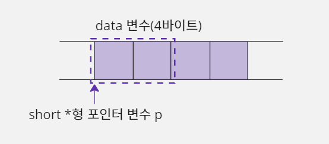

- 포인터 변수가 가리킬 수 있는 크기는 2바이트이지만, 4바이트 크기의 대상을 가리켜도 문제가 발생하지 않는다.
- 이러한 포인터의 특성을 활용하면 4바이트 크기의 변수에 저장된 값을 1바이트 단위로 출력할 수도 있다.

```c
#include <stdio.h>

void main() {
    int data = 0x12345678, i;
    char *p = (char *) &data;
    // &data는 int *형. 그런데 이 주소를 저장할 포인터 p가 char *라서
    // 자료형이 맞지 않아 (char *) 형 변환을 사용한다.

    // 4바이트 데이터를 바이트 단위로 값을 출력하기 위해 4번 반복함
    for (i = 0; i < 4; i++) {
        // p는 char *형이라서 시작 주소부터 1바이트 크기만 사용함
        printf("%X, ", *p);
        p++;  // p가 char *형이라서 1바이트 뒤에 있는 주소로 값이 변경됨
    }
}
```

```text
78, 56, 34, 12,
```

- 이 예제에서 `data`변수는 `int`형으로 선언되어 4바이트 크기인데 `data`변수를 가리킬 포인터 `p`변수는 `char *`로 선언했다.
- 따라서 `*p`를 사용하면 `data`변수의 시작 주소에서 1바이트 크기만 사용할 수 있다.
- 그렇다고 해서 `data`의 시작 1바이트만 사용할 수 있는 것이 아니라 포인터의 주소 연산을 활용하면 `data`변수의 나머지 부분도 1바이트씩 사용할 수 있다.

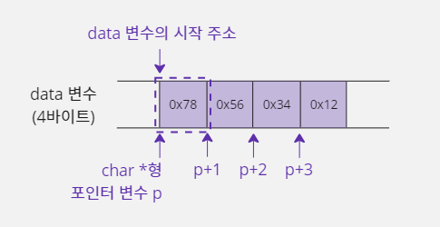

- 위 예제는 `p`가 가지고 있는 주소 값을 옮기는 방식으로 작업했는데, `p`의 주소 값을 변경하지 않고 `data`변수 값을 1바이트씩 출력하고 싶다면 반복문 코드만 다음과 같이 변경하면 된다.

```c
for (i = 0; i < 4; i++) {
    // 첫 바이트는 *(p+0), 두 번째는 *(p+1), 세 번째는 *(p+2), ...
    printf("%X, ", *(p + i));
}
```

## 13-6. void * 형 포인터

### 대상의 크기가 정해져 있지 않은 void * 형 포인터

- 지금까지는 항상 포인터 변수가 가리키는 대상의 크기를 지정해서 사용했었다.
- 하지만 대상의 크기를 모른다면 어떻게 해야 할까?
- 이때 사용하는 것이 바로 `void`키워드이다.
- `void`키워드는 '정해져 있지 않다'라는 의미를 가지고 있다.
- 따라서 다음과 같이 변수를 선언하면 포인터 변수 `p`에 주소 값을 저장할 수는 있지만 해당 주소에서 값을 읽거나 저장할 때 사용하는 크기는 정해져 있지 않다.

```c
void *p;
```

- 즉 사용할 메모리의 시작 주소만 알고 끝 주소를 모를 때 사용하는 포인터 형식이다.
- 그래서 `*p = 5;`라고 일반 포인터처럼 사용하면 자신이 사용할 주소의 대상 메모리 크기가 정해져 있지 않기 때문에 번역할 때 문법 오류가 발생한다.

```c
int data = 0;
void *p = &data;  // data의 시작 주소를 저장함
*p = 5;  // 오류 발생: 대상 메모리의 크기가 지정되지 않음
```

- `void *`는 포인터가 가리킬 대상의 크기를 정한 것이 아니라서 말 그대로 어떤 크기의 메모리가 오든지 상관없다.
- 그렇다고 `void *`로 선언한 포인터 변수를 주소 값만 저장하는 용도로 사용하는 것은 아니다.
- 포인터 변수 `p`를 사용하여 `data`변수에 값 5를 대입하고 싶은 경우에 형 변환 문법을 사용하여 '사용할 크기'를 표기해 주면 일반 포인터처럼 사용할 수 있다.
- `*(int *) p`라고 사용하면 일시적으로 포인터 변수 `p`이 형식이 `int *`가 되기 때문에 포인터 변수 `p`에 저장된 주소에 가서 4바이트(int) 크기로 5를 저장한다.

```c
int data = 0;
void *p = &data;
*(int *) p = 5;  // 형 변환 문법을 사용하여 대상의 크기를 4바이트로 지정하므로 data 변수에 5가 저장됨
```

### void * 형 포인터 활용하기

- `void *`는 포인터의 기능을 사용할 수 없는 것이 아니라 자신이 사용할 대상의 크기 지정을 잠시 미룰 수 있다는 장점을 가지고 있다.
- 예를 들어 `char *`형 주소 값을 저장하려면 `char *`형 포인터 변수가 있어야 하고 `int *`형 주소 값을 저장하려면 `int *`형 포인터 변수가 있어야 한다.
- 하지만 `void *`형 포인터 변수는 `char *`형이든 `int *`형이든 형 변환 없이 모두 저장할 수 있기 때문에 더 편리하다.
- 다음은 `main`함수에 선언한 지역 변수의 주소 값을 매개변수로 받아서 그 주소에 해당하는 메모리에 값 1을 대입하는 `MyFunc`함수이다.
- 그런데 `MyFunc`으로 전달되는 주소의 형식이 `char *`, `short *`, `int *`중 하나이고 이 형식을 사용할 때마다 달라질 수도 있다면 어떻게 해야 할까?

```c
void MyFunc(char *p_char, short *p_short, int *p_int) {
    // 포인터 변수에 NULL이 저장되어 있으면 아직 주소를 저장하지 않고 초기화된 상태이다.
    // NULL이 아닌 다른 값을 가져야 제대로 사용할 수 있다.
    if (p_char != NULL) *p_char = 1;
    else if (p_short != Null) *p_short = 1;
    else *p_int = 1;
}

void main() {
    short data = 5;
    // data 변수는 short형이기 때문에 short *를 사용하는 두 번째 매개변수에 주소를 넘겨줌
    MyFunc(NULL, &data, NULL);
}
```

- 어떤 형식의 주소 값이 전달될지 모르기 때문에 위 예시처럼 세 개의 포인터를 매개변수에 추가해야 한다.
- 그리고 실제로 사용할 포인터에만 변수의 주소 값을 전달하고 나머지는 사용하지 않겠다는 뜻으로 `NULL`을 적는다.
- `NULL`은 C 언어 기본 헤더 파일에 `#define`으로 정의되어 있으며 0번지를 의미한다.
- 그래서 일반 변수는 초기화할 때 0을 대입하지만 포인터 변수는 초기화할 때 0번지를 의미하는 `NULL`을 사용해야 한다.
- 그런데 만약 `MyFunc`함수로 전달되는 주소의 형식이 더 많아지면 어떻게 될까?
- 매개변수가 너무 많아져서 불편할 것이다.
- 따라서 이 예제를 `void *`형을 사용하여 수정해 보자.

```c
void MyFunc(void *p, char flag) {
    // flag에 전달된 값에 따라 형 변환하여 전달된 주소에 1을 대입함
    if (flag == 0) *(char *) p = 1;  // flag가 0이면 char *형
    else if (flag == 1) *(short *) p = 1;  // flag가 1이면 short *형
    else *(int *) p = 1;  // flag가 0과 1이 아니면 int *형
}

void main() {
    short data = 5;
    // data 변수는 short형이기 때문에 short *를 의미하는 1을 같이 전달함
    MyFunc(&data, 1);
}
```

- `void *`형 포인터를 매개변수로 사용하면 어떤 형식의 주소이든 저장할 수 있지만 3가지 주소 형식 중에서 무엇을 사용했는지 알 수 없다.
- 따라서 `char *`는 0, `short *`는 1, `int *`는 2를 의미하는 값을 매개변수로 함께 전달해야 한다.
- 위 코드에서 `*(char *) p`라고 사용하면 `void *`형이었던 포인터 변수 `p`가 일시적으로 `char *`형으로 변환된다.
- `*(short *) p`도 마찬가지이다.
- 지금까지 설명한 두 가지 방법 중 어떤 것이 더 좋다고 이야기할 수는 없다.
- 매개변수로 전달되는 주소의 형식이 많아지면 `void *`를 사용하는 것이 좀 더 좋을 것 같다.

```c
#include <stdio.h>

int GetData(void *p_data, char type) {
    int result = 0;
    // type 변수에 저장된 값을 기준으로 형 변환을 다르게 함
    if (type == 1) result = *(char *) p_data;  // 0x78(1바이트)이 저장됨
    else if (type == 2) result = *(short *) p_data;  // 0x5678(2바이트)이 저장됨
    else if (type == 4) result = *(int *) p_data;  // 0x12345678(4바이트)이 저장됨
    return result;
}

void main() {
    int data = 0x12345678;
    // data 변수에서 2바이트 크기만 출력함
    printf("%X\n", GetData(&data, 2));
}
```

```text
5678

*리틀 엔디언 시스템의 출력 결과이다
```

- 이 예제는 4바이트 크기의 정수를 저장하는 `data`변수가 있는데 이 변수에 저장된 값을 그대로 출력하지 않는다.
- 사용자가 `type`변수에 값 1을 지정하면 `data`변수이 1바이트 값만 출력하고, 2를 지정하면 `data`변수의 2바이트 값을 출력하며, 4를 지정하면 `data`변수의 4바이트 값, 즉 전체 값을
  출력하도록 만든 것이다.

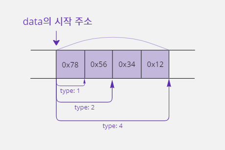

> #### 포인터 변수에서 형 변환 문법은 모든 자료형에서 사용할 수 있다
>
> - 포인터 변수에 직접 형 변환을 사용하는 형식은 `void *`에서만 사용할 수 있는 것이 아니라 모든 포인터에서 사용할 수 있는 개념이다.
> - 그래서 `void *`대신에 `char *`로 선언해 놓고 `void *`를 사용하는 것처럼 형 변환하여 구성된 코드도 많이 볼 수 있다.
>
> ```c
> int data = 0x12345678;
> char *p = (char *) &data;  // 서로 자료형이 맞지 않아서 (char *)로 형 변환함
> *p = 5;  // data 변수의 시작 1바이트에 값 5를 넣으면 data 는 0x12345605로 변경됨
> *(short *) p = 0;  // data 변수의 시작 2바이트에 값 0을 넣으면 data는 0x12340000로 변경됨
> ```
