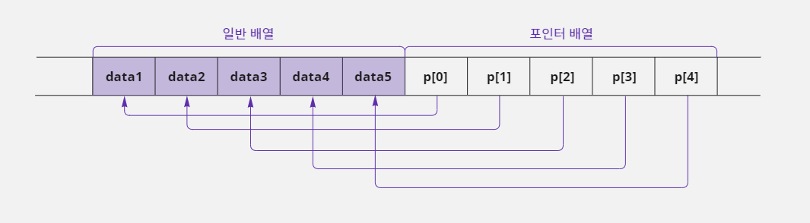

# 15. 배열과 포인터

- 배열은 `[]`연산자를 사용해서 `data[3]`과 같이 표기하고 포인터는 `*`연산자를 사용해서 `*data`와 같이 표기한다.
- 그런데 이 둘을 함께 사용하여 `*data[3]`과 같이 표기하는 경우가 있는데 이 문법은 배열일까? 포인터일까?
- 배열과 포인터의 표기상의 특징을 알아보고 이 두 문법을 섞어서 사용했을 때의 장점을 100% 활용하는 방법을 알아보자.
- 어떤 상황에서 이런 문법을 사용하면 좋은지도 함께 알아보자.

## 15-1. 배열과 포인터 표기법

### 배열 표기법과 포인터 표기법의 관계

- 배열은 `[]`연산자를 사용하여 표현하고 포인터는 `*`연산자를 사용하여 나타낸다.
- 변수를 선언할 때 변수의 역할이나 특성이 결정되기 때문에 표현 방식의 선택은 매우 중요하다.
- 포인터는 포인터 변수가 가리키는 메모리의 시작 주소를 기준으로 삼고, 배열도 해당 배열이 사용하는 메모리 그룹의 시작 주소를 기준으로 삼는다.
- 따라서 두 문법은 표기만 다를 뿐 문법 구조는 비슷하다.
- 그래서 다음과 같이 두 문법의 표기법을 바꿔서 사용할 수도 있다.

> `배열:`
> ```c
> char data[5];
> data[1] = 5;
> 
> // *(data + 1) = 5;는 data[1] = 5; 와 같음
> *(data + 1) = 5;
> ```
> `포인터:`
> ```c
> char data;
> char *p = &data;  // data 변수의 주소를 p에 저장함
> *p = 3;  // p가 가리키는 data 변수에 3을 대입함
> p[0] = 3;  // *p = 3; 과 같음
> ```


### 배열 표기법의 한계

- 배열 표기법인 `data[2]`가 포인터 표기법인 `*(data + 2)`에 비해 좀 더 간단해 보이기 때문에 배열 표기를 굳이 포인터 표기로 바꿔 사용할 이유가 없다고 생각할 수도 있다.
- 하지만 어떤 문법이든 표기가 간단하다는 뜻은 표현에 제약이 있다는 뜻과 같다.
- 어떤 표현의 제약이 있는지 예를 들어 보자.
- 다음과 같이 `data`라는 1차원 배열을 선언하고 각 요소를 값 0x12345678로 초기화 했다.

```c
int data[2] = {0x12345678, 0x12345678};
```


- 위와 같이 선언한 `data`배열에서 `data[0]`요소는 총 4바이트로 구성되어 있다.
- 그런데 첫 번째 바이트에 있는 값 `0x78`을 `0x22`로 변경하고 싶어서 배열 표기법으로 `data[0]`에 `0x22`를 대입하면 어떻게 될까?

```c
data[0] = 0x22;  // data 배열 항목이 크기가 4바이트이기 때문에 값 0x00000022가 대입됨
```

- 배열 표기법으로 `data[0]`이라고 적으면 4바이트 크기의 메모리를 의미하기 때문에 `0x22`를 대입한다고 해서 `data[0]`의 일부 값만 변경되는 것이 아니다.
- 다음 그림처럼 4바이트 값이 모두 변경되어 버려서 `data[0]`에는 `0x00000022`값을 대입한 것과 같다.


- 즉 배열 표기법은 요소를 구성하는 모든 바이트 값을 한 번에 수정한다.

#### 배열 표기법 대신 포인터 표기법을 사용하면?

- 이번에는 배열 표기법 대신 포인터 표기법으로 값 `0x22`를 대입해 보자.
- 앞의 코드를 포인터 표기법으로 변경하면 다음과 같다.

```c
*(data + 1) = 0x22;  // data[1] = 0x22; 를 포인터 표기법으로 나타냄
```

- 이렇게 변경하면 다음과 같이 `*`연산자와 `(data + 1)`사이에 형 변환(Casting) 문법을 사용할 수 있다.

```c
*(char *) (data + 1) = 0x22;  // 일시적으로 int *형을 char *형으로 변환함
```

- `data`배열을 `int`형으로 선언했기 때문에 포인터로 표기법을 변경하면 `int *`형이 되는데 위처럼 형 변환하면 일시적으로 `char *`형으로 변경하겠다는 뜻이다.
- `int *`형이 `char *`형으로 변경된다는 것은 포인터가 가리키는 대상의 크기가 4바이트에서 1바이트로 변경된다는 의미이다.
- 따라서 `0x22`값을 대입하면 4바이트 메모리 영역이 변경되는 것이 아니라 1바이트 메모리 영역만 변경된다.
- 즉 다음 그림처럼 `data[1]`영역의 첫 1바이트만 `0x22`값으로 변경되는 것이다.
- 포인터 표기법은 배열 항목의 크기와 상관없이 자유롭게 값을 수정할 수 있다.


- 이처럼 배열 표기법을 사용하면 명령문 자체가 단순해서 보기는 좋지만 좀 더 세밀한 표현을 하는 데는 한계가 있기 때문에 포인터 표기법을 사용하는 것이다.

> #### 복잡한 수식은 배열 표기를 사용하면 간단해진다
>
> - 포인터 문법은 `*(p + 1)`과 같이 두 개의 연산(포인터 연산과 덧셈 연산)이 합쳐 있는 형태이다.
> - 연산자 우선순위가 `*`연산자보다 괄호가 더 높기 때문에 `p + 1`연산을 수행한 후에 `*`연산을 수행한다.
> - 이처럼 포인터는 명령을 수행하기 위해 연산을 두 번 해야 하고, 연산자 우선순위 때문에 괄호까지 적어야 해서 복잡해 보일 수 있다.
> - 아래와 같이 포인터로 구성된 복잡한 수식은 배열로 표기하면 훨씬 직관적이고 코드가 간단해진다.
> - `int`형으로 선언한 `tips`변수의 주소를 1바이트 크기의 대상을 가리키는 포인터 변수 `p`에 저장한다.
>
> ```c
> int tips = 0x12345678, sum;
> char *p;  // int형 변수인 tips에 1바이트씩 접근하기 위해 char *형 포인터를 선언함
> p = (char *) &tips;  // &tips는 int *형이기 때문에 형 변환을 사용해서 char *로 맞춤
> sum = *(p + 0) + *(p + 1) + *(p + 2) + *(p + 3);  // 각 바이트별로 값을 합산함
> ```
>
> - 이렇게 하면 `*p`를 사용하여 `tips`변수의 값을 1바이트 단위로 구별하여 사용할 수 있다.
> - 그래서 `tips`변수를 구성하는 4개의 바이트에 저장된 각각의 값을 포인터 변수 `p`를 이용하여 합산하도록 구성했다.
>
> 
>
> - `sum = *(p+0) + *(p+1) + *(p+2) + *(p+3);`이라고 적은 코드를 배열 표기법으로 변경해 보자.
>
> ```c
> sum = p[0] + p[1] + p[2] + p[3];
> ```

## 15-2. 배열 시작 주소

### 배열 변수의 이름은 배열의 시작 주소

- 포인터는 일반 변수의 주소만 가질 수 있는 것이 아니라 배열과 같이 그룹으로 묶인 메모리의 주소도 가질 수 있다.
- 포인터 변수에 배열의 시작 주소를 대입할 때는 일반 변수와 마찬가지로 `&`연산자를 사용하면 된다.
- 그런데 배열의 경우에는 첫 요소인 `data[0]`이 시작 주소가 배열 전체의 시작 주소와 같기 때문에 다음과 같이 `&`연산자를 사용한다.

```c
char data[4];
char *p = &data[0];  // 배열이 첫 번째 항목이 주소가 배열 전체의 시작 주소와 같음
```


- 위 설명에서 사용한 `&data[0]`은 포인터 표기법을 사용하면 `& * (data + 0)`과 같이 표기할 수 있다.
- 그리고 +0은 생략할 수 있기 때문에 `& * data`라고 적어도 된다.

```c
char *p = &data[0];
char *p = & * (data + 0);  // 배열 표기법을 포인터 표기법으로 변경한다.
char *p = & * data;  // +0 생략
char *p = data;  // 번지(주소)를 얻는 & 연산자와 번지(주소)를 지정하는 * 연산자는
                 // 서로 반대 개념의 연산자이기 때문에 서로 상쇄된다.
```

- `& * data`의 의미는 무엇일까?
- `&`연산자와 `*`연산자는 연산자 우선순위가 같기 때문에 함께 사용하면 뒤쪽에서 앞쪽 방향으로 연산이 수행된다.
- 그래서 `&*data`는 `&(*data)`와 같다.
- `&(*data)`의 의미는 `data`가 가리키는 대상(`*data`)의 주소를 얻겠다(`&`)는 뜻이다.
- `data`가 가리키는 대상의 주소라는 의미는 결국 `data`변수가 저장된 메모리의 주소와 같다.
- 따라서 `&(*data)`는 `data`라고도 적을 수 있다.
- 정리해 보면 배열의 시작 주소를 얻을 때는 굳이 `&data[0]`이라고 쓰지 않고 그냥 `data`라고만 적어도 된다.
- 이런 이유 때문에 '배열 변수의 이름은 배열의 시작 주소'라고 말할 수 있다.

### 배열은 포인터가 아니다

- 배열이 포인터처럼 작동한다고 해서 완벽하게 포인터가 될 수는 없다.
- 문법적으로 포인터는 다른 변수의 주소를 저장할 수 있지만 배열은 컴파일러가 제공하는 메모리 그룹화 기술이다.
- 즉 배열 이름은 변수처럼 보이지만 내부를 들여다보면 실제로는 상수화된 주소이기 때문에 변경할 수 없다는 뜻이다.
- 즉 배열은 일반 변수들을 묶어 놓은 개념이기 때문에 변수가 자신이 위치한 주소를 변경할 수 없듯이 배열도 자신이 위치한 메모리 주소를 변경할 수 없다.
- 따라서 배열의 시작 주소도 변경할 수 없다.

#### 배열의 이름이 상수화된 주소일까?

- 배열의 이름이 상수화된 주소라는 것을 이해하기 위해 먼저 다음 코드를 보자.
- 상수 100을 `#define`전처리기를 사용하여 `ADDR`로 치환한 코드이다.

```c
#define ADDR 100
```

- 그러면 치환된 `ADDR`를 `data`변수에 대입할 수 있다.
- `ADDR`이 `#define`으로 치환된 값이라는 것을 모른다면 `ADDR`변수에 저장된 값을 `data`변수에 대입한다고 오해할 수도 있었을 것이다.

```c
int data = ADDR;  // int data = 100; 과 같음
```

- 상수화된 `ADDR`가 변수가 될 수는 없다.
- `ADDR`는 100이라는 상수가 치환된 것이기 때문에 변수처럼 값을 대입할 수 없다.

```c
ADDR = ADDR + 1;  // ADDR는 상수이기 때문에 대입 불가능함. 100 = 100 + 1; 과 같은 표현임
```

- 배열 이름도 이렇게 `#define`전처리기를 사용하는 것과 비슷하다.
- 배열 이름을 변수처럼 사용하지만 컴파일러가 배열 이름을 상수화된 주소로 치환해 주기 때문에 배열 이름 자체가 상수화 되어있다.
- 따라서 다음과 같은 표현은 사용할 수 없다.

```c
char data[5];  // data 배열의 시작 주소가 100번지라고 가정함
data = data + 1;  // 오류 발생. 배열은 자신에게 배정된 주소를 변경할 수 없다.
```

## 15-3. 배열을 사용하는 포인터

### 포인터로 배열의 주소를 저장하여 사용하기

- 배열은 해당 배열이 사용할 메모리 그룹의 시작 위치를 기준으로 색인 작업된 요소의 위치를 계산해 사용한다.
- 배열의 색인 작업도 연산이기 때문에 같은 요소를 반복적으로 사용하는 경우에 효율이 떨어진다.
- 예를 들어 다음은 `char`형으로 선언한 `data`배열의 3번째 요소(`data[2]`)를 `sum`변수에 10번 더하는 코드이다.

```c
char data[5] = {1, 2, 3, 4, 5};
int i, sum = 0, select = 2;

// sum 변수에 data[select]값을 10번 더함. 즉 data[2]요소 값을 10번 더하는 것과 같음
for (i = 0; i < 10; i++) sum = sum + data[select];  // data[select]는 select가 2이므로 data[2]
```

- 단순하게 생각하면 `data[select]`요소를 `sum`에 10번 더하는 연산이라고 생각할 수 있다.
- 하지만 `data[select]`요소를 사용하기 위해서는 내부적으로 `data + select`연산을 해야 하기 때문에 `+ select`연산도 10번 수행하는 것이다.
- 위 코드에서 `for`반복문을 포인터 표기법으로 변경해 보면 이렇게 반복 연산을 하는 상황을 좀 더 이해하기 쉬울 것이다.


```c
for (i = 0; i < 10; i++) sum = sum + *(data + select);
```

- `*(data + 2)`값은 3이기 때문에 `for`반복문을 실행한 후 `sum`에 저장된 값은 30이 된다.
- `data[select]`를 10번 반복해서 더하는 것처럼, 배열의 특정 요소들이 지속적으로 많이 사용되는 경우에는 좀 더 효율적인 표현을 위해 배열이 특정 요소 주소를 포인터 변수에 저장해 놓고 사용하기도
  한다.

```c
char data[5] = {1, 2, 3, 4, 5};
int i, sum = 0, select = 2;
char *p = data + select;  // p는 data[select] 요소의 주소를 가지므로
                          // char *p = &data[select]; 라고 사용한 것과 같다.
for (i = 0; i < 10; i++) sum = sum + *p;
```

- 위와 같이 코드를 구성하면 `data[select]`요소의 주소를 포인터 `p`가 저장하고 있다.
- 따라서 `data[select]`값을 나타내는 `*p`를 사용하여 `sum`에 10번 더하면 된다.
- 요즘과 같이 컴퓨터 성능이 좋아지고 컴파일러의 최적화 능력이 좋아진 시대에 이런 코드로 효율을 논하는 것은 별로 의미가 없긴 하다.
- 지금까지 본 코드도 컴파일러가 자동으로 최적화해 준다.
- 하지만 아주 작은 차이라도 이렇게 표현하는 습관이 자신의 코드를 좀 더 효율적으로 바꿔 주기 때문에 기회가 될 때마다 사용해 보려고 노력하는 것이 좋다.

### 배열 예제를 포인터 사용해서 바꾸기

- 12장에서 만들어 본 '배열의 각 요소에 저장된 값을 합산하는 예제(`12_01_05.c`)'를 포인터를 사용해서 만들어 보자.
- 이 예제는 `data`배열의 시작 주소를 포인터 변수 `p`에 저장한 뒤 반복문을 사용하여 가리키는 대상의 값을 `result`변수에 합산하는 코드이다.
- 포인터 변수 `p`가 `data`배열의 시작 주소를 가지고 있기 때문에 `*p`를 사용하면 `data`배열의 첫 번째 요소만 가리킨다.
- 반복문에서 `p++;`를 추가하여 `data`배열의 다음 요소로 이동할 수 있게 코드를 구성해 보자.

```c
#include <stdio.h>

void main() {
    char data[5] = {1, 2, 3, 4, 5};
    int result = 0, i;  // 합산에 사용할 result 변수는 0으로 초기화함
    char *p = data;  // data 배열의 시작 위치를 포인터 변수 p에 저장함

    // 5번 반복하면서 포인터 변수 p를 사용하여 배열의 각 요소를 result 변수에 합산함
    for (i = 0; i < 5; i++) {
        result = result + *p;  // 포인터 변수 p가 가리키는 대상의 값을 result에 합산함
        p++;  // data 배열의 다음 항목으로 주소를 이동: data[0] -> data[1] -> ...
    }

    // 합산한 결과 값을 출력함
    printf("data 배열의 각 요소의 합은 %d입니다\n", result);
}
```

```text
data 배열의 각 요소의 합은 15입니다
```

> #### 증감 연산자도 다른 연산과 함께 사용할 수 있다
>
> - 위 예제에서 다음 코드를 하나로 합쳐서 사용하는 경우도 있다.
>
> ```c
> result = result + *p;
> p++;
> ```
>
> ```c
> result = result + *p++;
> ```
>
> - 다음과 같이 `*p++;`라고 사용하면 `++`연산자가 후위 연산을 수행하기 때문에 `*p`작업을 수행한 뒤 `p++`작업을 수행한다.

## 15-4. 배열과 포인터의 합체

### 배열을 기준으로 포인터와 합체하기

- 지금까지는 배열 문법과 포인터 문법은 서로 독립적인 문법처럼 설명하였다.
- 소스 코드를 구성할 때 함께 사용한 적은 있지만 변수를 선언할 때에는 각자의 문법을 사용했다.
- 지금부터는 이 두 문법을 결합해서 사용하는 문법에 대해 알아보자.
- 서로 다른 두 문법이 만나면 어떤 문법이 기준이 되는지에 따라 의미가 달라질 수 있다.
- 배열 문법이 기준이 되는 경우부터 살펴보자.

```c
char *p1, *p2, *p3;
```

- `char *`형 포인터 변수가 3개 필요하다면 위와 같이 선언해서 포인터 변수를 만든다.
- 하지만 훨씬 많은 포인터가 필요한 경우에 하나씩 나열하는 것은 불편하다.
- 포인터 변수도 배열로 선언해서 사용할 수 있다.
- 예를 들어 `char *`형 포인터 5개가 필요하다면 다음과 같이 선언하면 된다.
- 이렇게 하면 포인터와 배열 문법이 결합된 것이다.

```c
char *p[5];  // char *p1, *p2, *p3, *p4, *p5; 라고 선언한 것과 같음
```

- 위와 같이 선언하면 포인터가 5개 선언된 것이기 때문에 `p`배열이 크기는 20바이트(포인터 변수는 주소를 저장하기 때문에 크기가 4바이트 * 5개)이다.
- 개별 포인터를 사용하고 싶다면 `p[0], p[1], p[2], p[3], p[4]`라고 사용하면 되고, 각 포인터가 가리키는 대상에 값을 읽거나 쓰고 싶다면 앞에 `*`연산자를
  추가하여 `*p[0], *p[1], *p[2], *p[3], *p[4]`라고 사용하면 된다.

```c
char data1, data2, data3, data4, data5, i;

// 포인터 배열을 선언하면서 각 포인터가 사용할 주소를 초기화한다.
// p[0]에는 data1의 주소, p[1]에는 data2의 주소, ... p[4]에는 data5의 주소를 저장한다.
char *p[5] = {&data1, &data2, &data3, &data4, &data5};
for (i = 0; i < 5; i++) *p[i] = 0;  // data1 ~ data5에 모두 0이 저장됨
```



- 포인터를 배열 형식으로 선언할 때 `char *p[5];`라고 선언한 것은 `char *(p[5]);`라고 선언한 것과 같다.
- 그 이유는 `[]`연산자가 `*`연산자보다 연산자 우선순위가 높기 때문이다.
- 따라서 `p[5]`가 우선이기 때문에 `p`변수는 5개의 항목을 가진 배열이라는 뜻이 되고, 그 다음 조건에 의해 각 항목이 `char *`형 포인터라고 정해진다.
- 결과적으로 배열을 기준으로 결합되는 것이다.


### 포인터를 기준으로 배열과 합체하기

- `char *p[5];`의 `*p`에 괄호를 사용하여 다음과 같이 변경하면 의미가 완전히 달라진다.

```c
char (*p)[5];
```

- 이렇게 선언해도 배열고 포인터가 결합되는 것인데, 이번에는 포인터 문법에 괄호를 사용했기 때문에 포인터가 기준이 된다.
- 이렇게 선언하면 괄호 속에 있는 `*p`가 먼저 처리되기 때문에 `p`변수는 배열이 아니라 포인터라는 뜻이다.
- 따라서 `p`변수의 크기는 4바이트이다.
- 그리고 그 다음 조건인 `char[5]`에 의해서 포인터 변수 `p`가 가리키는 대상의 크기가 5바이트라는 뜻이 된다.


- 일반 포인터는 `*p`라고 적으면 자신이 가리키는 대상에 가서 값을 읽거나 쓸 수 있지만, 위 포인터 변수는 가리키는 대상이 배열 형식(`char[5]`)으로 선언되어 있기 때문에 `[]`를 사용하여 대상을 한
  번 더 선택해야 한다.
- 예를 들어 `p`가 가리키는 대상의 4바이트 중 3번째 항목에 7을 넣고 싶다면 다음과 같이 사용한다.


- 그리고 포인터 변수 `p`는 다음과 같이 주소 연산을 하면 `p`에 저장된 주소가 5씩 증가하게 된다.
- `p`가 가리키는 대상의 크기가 `char[5]`, 즉 5바이트이기 때문이다.

```c
p++;  // p = p + 1; 과 같으므로 주소가 5 증가함
```

- 그러면 `char (*p)[5];`로 선언한 포인터는 어떤 상황에 사용할까?
- 이 형태는 `char data[5];`와 같은 1차원 배열을 가리키는 용도로 사용하기에는 어려워 보인다.
- 단순하게 1차원 포인터 `char *p;`로 선언해도 충분히 사용할 수 있기 때문이다.
- `char (*p)[5];`는 1차원 포인터(`*`)와 1차원 배열(`[]`)이 결합된 형태이기 때문에 두 차원이 합쳐져 2차원의 개념을 가지게 된다.
- 따라서 이 포인터는 2차원 배열을 가리키는 용도로 사용하는 것이 적합하다.
- 다음 예제는 2차원 배열로 선언한 `char data[3][5];`의 시작 주소를 `char (*p)[5];`포인터에 저장해서 포인터 `p`를 사용하여 `data`배열의 각 요소 값을 변경하는 코드이다.

```c
char data[3][5];
char (*p)[5];     // char[5] 크기의 대상을 가리킬 수 있는 포인터를 선언함
p = data;         // 포인터 변수 p는 2차원 배열 data 변수의 시작 주소를 저장함
(*p)[1] = 3;      // p가 가리키는 대상의 2번째 항목에 3을 대입함 p[0][1];과 같음
(*(p+1))[2] = 4;  // p+1이 가리키는 대상의 3번째 항목에 4를 대입함 p[1][2]=4;와 같음
(*(p+2))[4] = 5;  // p+2가 가리키는 대상의 5번째 항목에 5를 대입함 p[2][4]=5;와 같음
```

- 이 코드에서 포인터 변수 `p`가 사용되는 형식을 보면 2차원 배열과 비슷하게 2차원 개념을 사용하고 있다.
- 물론 연산자 우선순위 때문에 괄호를 좀 많이 사용해야 하는 불편함이 있다.
- 코드를 더 간단하게 적으려면 포인터 표기법을 배열 표기법으로 변경할 수도 있다.


- 위 코드를 보고 스스로 그릴 수 있을 때까지 충분히 반복해서 그려보자.
- 그래야 배열이나 포인터의 구조를 확실하게 이해할 수 있다.
