# 16. 메모리 할당

- 컴퓨터의 메모리는 운영체제가 관리한다.
- 그래서 프로그램이 실행되면 운영체제는 프로그램에게 메모리를 주어('메모리를 할당한다'라고 표현) 해당 프로그램이 메모리를 사용하게 해준다.
- 하지만 프로그램에게 허락된 메모리는 크기가 한정되어 있으므로 계획성 없이 사용하면 메모리가 부족할 수 있다.
- 운영체제가 메모리를 어떤 형식으로 프로그램에 제공하는지 그리고 이 메모리를 C 언어에서 어떻게 사용하는지 알아보자.

## 16-1. 프로세스와 메모리 할당

### 프로그램과 프로세스

- C 언어로 작성한 소스(`*.c`) 파일은 컴파일 작업과 링크 작업을 거쳐서 기계어로 이루어진 실행 파일(`*.exe`)이 된다.
- 이렇게 프로그래머가 만든 프로그램 실행 파일을 컴퓨터 사용자들은 프로그램(Program)이라고 부른다.
- 그런데 실행 파일에 있는 명령들은 CPU가 직접 실행할 수 없다.
- CPU가 이 명령들을 실행하려면 먼저 운영체제가 실행 파일의 명령들을 읽어서 메모리에 재구성하게 되는데, 이것을 프로세스(Process)라고 한다.
- 이렇게 메모리에 프로세스가 구성되면 CPU는 프로세스에 저장된 명령들을 실행할 수 있다.
- 프로세스는 단순히 실행할 명령들로만 이루어져 있는 것이 아니라 아래의 그림처럼 여러 가지 정보나 사용자가 입력한 데이터를 기억하는 메모리 공간도 포함하고 있다.
- 이러한 공간을 세그먼트(Segment)라고 한다.
- 프로세스는 세그먼트의 집합으로 구성되어 있으며, 코드 세그먼트(Code Segment, CS), 데이터 세그먼트(Data Segment, DS), 스택 세그먼트(Stack Segment, SS)는 각각 한 개
  이상의 세그먼트로 구성된다.
- 세그먼트는 64Kbytes 이하의 메모리 블록이다.


#### 코드 세그먼트

- 컴파일러는 C 언어 소스를 기계어로 된 명령문으로 번역해서 실행 파일을 만든다.
- 실행 파일이 실행되어 프로세스가 만들어지면 이 기계어 명령들은 프로세스의 '코드 세그먼트'에 복사되어 프로그램 실행에 사용된다.

#### 데이터 세그먼트

- 프로그램이 시작해서 끝날 때까지 계속 사용되는 데이터는 '데이터 세그먼트'에 보관된다.
- 이 영역에 있는 데이터는 컴파일할 때 정해지며 C 언어에서 사용한 문자열 상수나 전역 변수, static 변수가 이 영역을 사용한다.

#### 스택 세그먼트

- '스택 세그먼트'는 프로그램 실행 중에 필요한 임시 데이터를 저장하는 데 사용하는 메모리 영역이다.
- 함수가 호출될 때 함수 안에 선언한 지역 변수가 이 영역에 할당된다.
- 이번 장에서 배우게 될 동적 메모리 할당 기술을 사용해서 할당된 메모리도 이 영역에 할당된다.
- 스택 세그먼트는 지역 변수가 놓이는 스택(Stack)과 동적으로 할당되는 메모리 공간인 힙(Heap)으로 나뉜다.

### 메모리 할당이란?

- 데이터를 저장할 메모리 공간을 적절하게 나누는 작업이 '메모리 할당'(Memory Allocation)이다.
- 운영체제가 응용 프로그램에 일정 크기의 메모리를 배정해 주기 때문에 필요한 크기만큼 적절하게 사용해야 메모리가 부족하지 않는다.
- 그리고 배정 받은 메모리를 순차적으로 할당하지 않고 비효율적으로 배치하면, 프로그램의 수행 속도를 떨어뜨리는 요인이 될 수도 있다.

### 정적 메모리 할당

- 컴파일러가 C 언어 소스 코드의 변수 선언 부분을 번역할 때, 데이터 세그먼트나 스택 세그먼트에 해당 변수를 저장할 메모리 영역을 배정한다.
- 이렇게 컴파일러가 코드를 기계어로 번역하는 시점에 변수를 저장할 메모리 위치를 배정하는 것을 정적 메모리 할당(Static Memory Allocation)이라고 한다.
- 메모리 할당 기준이 C 언어 코드가 기계어로 번역되는 시점에 결정되기 때문에 정적 할당된 메모리 크기나 개수를 변경하려면 코드를 변경하고 다시 컴파일해야 한다.
- 즉 프로그램이 실행될 때 메모리의 크기가 이미 결정되어 있으며, 실행되는 중간에 크기를 변경할 수 없는 메모리를 정적으로 할당된 메모리라고 한다.

#### 변수가 메모리에서 유지되는 시간

- 이렇게 할당 받은 메모리는 지역 변수인지 전역 변수인지에 따라 유지되는 시간도 다르다.
- 그래서 메모리의 효율적인 관리를 위해 변수 종류에 따라 사용하는 메모리 공간의 위치도 달라진다.
- 전역 변수는 프로그램이 시작해서 종료할 때까지 할당 받은 메모리 상태를 계속 유지해야 하고, 프로그램이 실행되는 도중에는 새롭게 전역 변수를 추가하거나 삭제할 수 없다.
- 전역 변수를 저장하는 공간은 프로세스의 데이터 세그먼트에 별도로 마련되어 있다.
- 반면에 지역 변수는 함수가 호출될 때 메모리에 할당되었다가 함수가 끝나면 메모리 할당이 해제된다.
- 따라서 함수의 호출과 종료가 반복될 때마다 지역 변수의 메모리 할당과 해제 또한 반복된다.
- 이처럼 할당 받은 메모리 상태를 유지하지 못하는 지역 변수는 프로세스의 스택 세그먼트에 메모리가 할당된다.

### 정적으로 할당된 메모리를 관리하는 법

- 프로그램에서 변수를 사용하려면 자신이 사용할 변수의 주소를 알아야 한다.
- 컴파일러가 C 언어 코드를 번역하여 기계어로 변경할 때 주소를 포함하여 명령을 작성하는데 전역 변수는 프로그램이 시작해서 끝날 때까지 할당된 메모리 크기나 주소가 바뀌지 않기 때문에 전역 변수가 어디에 할당되어
  있는지에 대한 추가 정보가 필요 없다.
- 하지만 지역 변수는 함수 호출에 따라 메모리 할당과 해제가 반복되기 때문에 변수 주소가 계속해서 바뀐다.
- 따라서 지역 변수를 사용하려면 그 변수의 현재 주소를 알아야 한다.
- 그런데 각 지역 변수의 현재 주소를 기억하기 위해서는 지역 변수의 개수만큼 추가 메모리가 더 필요하다.
- 이렇게 되면 메모리 낭비가 심할 것이다.

```c
int Test() {
    int a, b, c, d;  // 컴파일할 때 변수가 4개이고 16바이트 크기라는 것을 알 수 있다.
    
    a = 5;  // START 주소에 5를 넣음
    c = 3;  // START + 8 주소에 3을 넣음
}
```

- C 언어는 코드를 번역하는 시점이 되어야 함수에 몇 개의 지역 변수가 선언되어 있는지 알 수 있다.
- 즉 같은 함수에 선언하는 변수들이 순차적으로 메모리에 할당되기 때문에 다음 그림처럼 하나의 메모리 그룹으로 관리할 수 있다.


- 함수에 선언한 지역 변수를 하나의 메모리 그룹으로 관리할 수 있다는 것은 지역 변수의 개수에 상관없이 시작 위치(START) 포인터와 끝 위치(END) 포인터를 사용해 관리할 수 있다는 것을 의미한다.

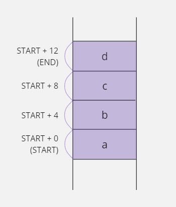

- 예를 들어 컴파일러가 Test 함수의 코드를 번역하는 시점에 `a = 5;`명령문은 'START 위치에 5를 저장하라'는 의미의 기계어로 번역된다.
- 그리고 `c = 3;`명령문은 'START + 8 주소에 3을 저장하라'는 의미의 기계어로 번역될 것이다.
- 즉 C 언어 소스 코드에서 사용한 `a`, `b`, `c`, `d`변수들은 `START + 0`, `START + 4`, `START + 8`, `START + 12`로 변경되어 사용되기 때문에 시작 위치 주소와
  끝 위치 주소를 기억하는 `START`, `END`포인터만 있으면 지역 변수 메모리 그룹을 관리할 수 있다.


- `START`포인터가 `END`포인터 위치까지 가리키면서 움직이면 될 것 같은데, `END`포인터가 필요한 이유는 무엇일까?
- 그 이유는 `Test`함수가 `A`라는 함수를 호출한 경우에 `A`함수에 선언한 지역 변수가 `END`이후의 메모리 공간에 놓이기 때문이다.
- 즉 `END`는 다음에 호출될 함수의 메모리 시작 위치를 결정한다.

```c
int Test() {
    int a, b, c, d;
    ...
    A();
}
```

```c
A() {
    int e;
}
```

## 16-2. 지역 변수와 스택

### 스택에 대하여

- 스택(Stack)은 자료 구조(Data Structure)의 한 종류이며 두 개의 포인터로 많은 양의 데이터를 효과적으로 관리하는 이론이다.
- 스택은 다음 그림처럼 베이스 포인터(Base Pointer, BP)를 기준으로 데이터가 추가될 때마다 순서대로 쌓아 올리는 구조이며 새로운 데이터가 추가될 위치를 스택 포인터(Stack Pointer, SP)가
  가리키게 된다.
- 지역 변수 관리 방식과 비교하자면 베이스 포인터가 `START`포인터, 스택 포인터가 `END`포인터가 되겠다.


- 스택에 데이터를 추가하면 스택 포인터가 가리키는 주소의 메모리에 대입되고 스택 포인터의 주소는 4(32비트 운영체제)만큼 증가한다.
- 이렇게 데이터를 추가하는 작업을 `PUSH`라고 한다.
- 그리고 데이터를 꺼낼 때는 가장 마지막에 추가된 값을 제거하고 스택 포인터 주소가 4만큼 감소한다.
- 이 작업은 `POP`이라고 한다.
- 스택 포인터와 베이스 포인터에 저장된 주소가 같다면 스택에는 데이터가 없다는 뜻이다.
- 갑자기 스택에 대해서 이야기한 이유는 C 언어에서 함수 안에 선언한 지역 변수를 관리할 때 스택을 사용하기 때문이다.


- 프로세스의 스택 세그먼트 영역을 보면 지역 변수가 놓이는 공간에 스택(Stack)이라고 적어 놓았다.
- 즉 스택 세그먼트의 지역 변수 영역은 앞에서 설명한 스택 이론으로 메모리를 관리할 수 있으며, `PUSH`와 `POP`을 이용해 데이터를 추가하거나 삭제할 수 있다.
- 기계어의 `push`명령을 사용하면 스택 메모리 공간에 데이터가 추가되고 `pop`명령을 사용하면 데이터를 꺼낼 수 있다.
- 그런데 스택에서 한 가지 주의해야 할 점이 있다.
- 이론적으로 스택을 표현할 때는 `PUSH`가 스택에 데이터를 추가한다는 뜻이기 때문에 스택 포인터(sp)에 저장된 주소가 증가하도록 만든다.
- 그런데 실제 컴퓨터 시스템에서 `PUSH`명령은 스택 포인터에 저장된 주소가 감소하도록 만들어져 있다.
- 따라서 앞에서는 `PUSH`명령을 수행하면 스택 포인터 주소가 증가하는 것으로 설명했지만 지금부터는 스택 포인터 주소가 감소한다고 설명할 것이다.

|      | 자료 구조(이론)    | 컴퓨터 시스템(실제)  |
|------|--------------|--------------|
| PUSH | 스택 포인터 주소 증가 | 스택 포인터 주소 감소 |
| POP  | 스택 포인터 주소 감소 | 스택 포인터 주소 증가 |


> #### 어셈블리어로 스택을 다룰 수 있다
>
> - C 언어 문법은 `PUSH`, `POP`명령을 직접 사용할 수 없기 때문에 어셈블리어로 살펴보자.
> - 스택에 데이터를 추가할 때는 `PUSH`명령을 사용하여 이 명령과 함께 사용한 값은 자동으로 스택에 추가되고 스택 포인터는 4만큼 감소한다.
> - 반대로 스택에서 데이터를 하나 가져오고 싶은 경우에는 `POP`명령을 사용하며 스택의 가장 위쪽에 있는 값(스택 포인터가 가리키는 값)이 제거되고, 32비트 시스템을 기준으로 하기 때문에 스택 포인터는 4만큼
    증가한다.
> - 그리고 스택에서 제거된 값은 `POP`명령과 함께 사용된 ax레지스터에 저장된다.
> - ax레지스터는 CPU내부에 있는 범용 메모리이다.
>
> ```text
> mov  ax, 4   // push는 레지스터를 이용하기 때문에 ax 레지스터에 값 4를 저장함
> push ax      // ax 레지스터에 저장된 값(4)을 스택에 추가하고 SP 자동으로 감소함
> pop  ax      // 스택에서 값 4를 꺼내서 ax 레지스터에 저장하고 SP 자동으로 증가함
> ```

### 컴파일러가 지역 변수를 저장할 메모리 공간을 확보하는 방법

- 앞에서 지역 변수는 스택 세그먼트의 스택 영역에 할당된다고 설명하였다.
- 아래와 같이 C 언어로 작성한 코드에 `Test`함수를 선언했다면 컴파일러는 코드를 번역하면서 이 함수가 세 개의 지역 변수를 사용한다는 것을 알게 된다.

```c
void Test() {
    int a, b, c;
    ...
}
```

- 즉 `Test`함수가 시작되는 시점에 `a`, `b`, `c`변수를 저장할 메모리 공간을 스택 영역에 확보해야 하므로 따라서 컴파일러는 변수를 위한 메모리 공간을 확보하기 위해 ax 레지스터를 세 번 `push`
  하는 코드를 기계어로 만든다.
- 이렇게 하면 프로그램이 실행될 때 `push`가 3번 수행되어 4바이트 크기의 메모리 공간 3개가 스택에 추가된다.
- 즉 스택 포인터의 주소가 4씩 세 번 감소하여 베이스 포인터와 스택 포인터 사이에 12바이트의 메모리 공간이 생긴다는 뜻이다.
- 그래서 `a`, `b`, `c`변수를 저장하는 데 이 메모리 공간을 사용할 수 있다.


- 그리고 `Test`함수가 종료되는 시점에 `pop`명령을 세 번 호출하여 `a`, `b`, `c`변수를 저장하기 위해 스택에 할당했던 공간을 제거하면 된다.
- 하지만 이런 방법을 사용하면 지역 변수가 많으면 많을수록 `push`코드와 `pop`코드도 많아진다.
- 그러면 당연히 프로그램 효율이 떨어질테고, 사실 컴파일러는 이 방법을 사용하지 않는다.

### sub 명령과 add 명령을 사용하는 방법

- 스택에 변수를 할당할 때 `push`명령을 사용하면 스택 포인터에 저장된 주소가 4씩 감소한다.
- `push`를 세 번 하면 스택 포인터에 저장된 주소가 12만큼 줄어들 것이다.
- 그런데 꼭 `push`명령을 사용해서 스택 포인터에 저장된 주소 값을 줄여야 할까?
- 스택 포인터에 저장된 주소는 기계어 명령으로 직접 변경할 수 있는 값이기 때문에 아래 코드처럼 `push`명령을 사용하지 않고 뺄셈을 실행하는 `sub`명령으로 스택 포인터 값에서 12를 빼도 된다.
- 이렇게 하면 베이스 포인터와 스택 포인터 주소 값의 차이가 12가 되면서 결과적으로 `push`명령을 세 번 수행한 것과 같아진다.

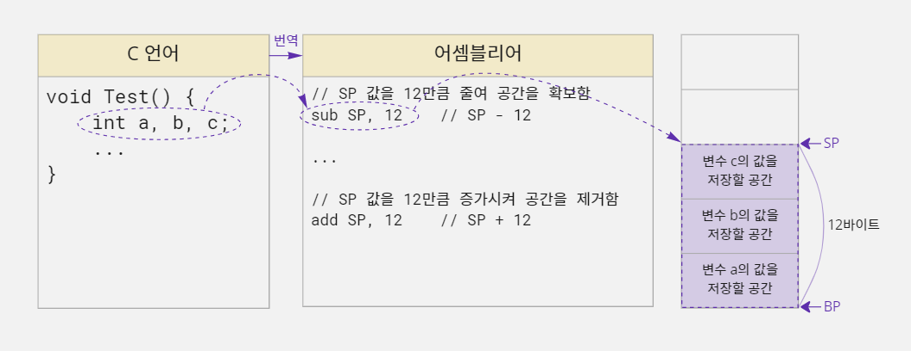

- 또 함수가 끝날 때 `pop`명령을 세 번 실행한 것은 스택 포인터에 저장된 주소 값을 12만큼 증가시키는 것과 같다.
- 따라서 컴파일러는 덧셈을 수행하는 `add`명령을 사용하여 스택 포인터 주소 값에 12를 더해주면 된다.

### 컴파일러가 스택에 할당된 지역 변수를 사용하는 원리

- C 언어 컴파일러는 지역 변수가 선언된 순서대로 메모리를 할당하기 때문에 앞의 그림처럼 스택에 블록 a, 블록 b, 블록 c 순서로 메모리를 할당한다.
- '블록'은 논리적으로 C 언어에서 선언한 변수를 위한 메모리 공간을 지칭한다.
- 공식적인 용어는 아니며 메모리 형태를 설명할때 이해를 편하게 하고자 사용한다.
- 그리고 스택에 저장된 데이터를 꺼내려면 가장 최근에 저장된 스택 포인터(SP) 바로 아래의 데이터부터 차례대로 꺼내야 한다.
- 예를 들어 데이터가 `a`, `b`, `c` 순서로 저장되어 있다면 `c`, `b`, `a`순서로 데이터를 꺼내야 한다는 뜻이다.
- 그러면 C 언어에서 소스 코드에서 변수 `b`의 값을 5로 변경하면, 컴파일러는 어떤 작업을 해야 할까?

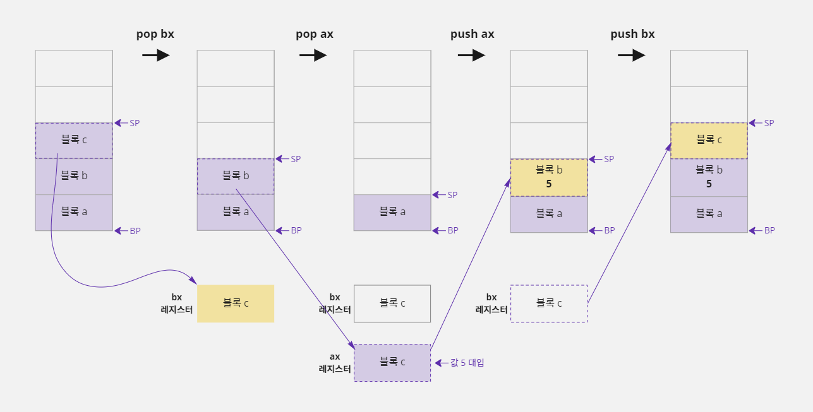

- ax, bx, cx 레지스터는 CPU 내부에 있는 범용 메모리이다.
- 변수 `b`의 값을 변경하려면 블록 c를 꺼내고 블록 b를 꺼내야 한다.
- `pop`명령을 사용하여 블록 c를 꺼내 bx 레지스터에 저장하고, 블록 b를 꺼내 ax 레지스터에 저장한다.
- 그리고 ax 레지스터에 블록 b 값을 5로 변경한 후 스택에 다시 `push`하고, `pop`했던 블록 c 값을 다시 스택에 `push`해줘야 한다.
- 이 작업들은 프로그래머가 직접 하는 것이 아니고, 컴파일러 내부에서 일어나는 작업이다.
- 위 그림을 어셈블리어 코드로 나열해 보자.

```text
pop   bx     // 스택의 가장 위에 있는 c 값을 bx에 저장하고 스택에서 c 영역을 제거함
pop   ax     // 스택의 가장 위에 있는 b 값을 ax에 저장하고 스택에서 b 영역을 제거함
mov   ax, 5  // b 값을 변경하기 위해 ax에 값 5를 대입함
push  ax     // ax 값을 스택에 추가하여 b 영역에 값 5가 저장됨
push  bx     // bx 에 보관하고 있던 c 값을 다시 스택에 추가함
```

- 하지만 이런 방법으로 C 언어의 지역 변수가 처리되었다면 지금처럼 수행 속도가 빠르지 않았을 것이다.
- 왜냐하면 함수에 지역 변수를 많이 선언하면 변수 값 하나를 변경하는 데 수십 개의 `push`, `pop`명령을 반복해야 하기 때문이다.
- `push`와 `pop`명령은 레지스터에만 사용할 수 있다.
- 의미상으로는 `push a`, `pop a`와 같이 변수 이름으로도 사용할 수 있지만 틀린 표현이다.

> #### 블록과 레지스터는 어떤 점이 다를까?
>
> - 블록 a, 블록 b, 블록 c는 논리적으로 C 언어에서 선언한 변수 `a`, `b`, `c`를 위한 메모리 공간을 의미한다.
> - 변수 `a`의 값이 저장되는 공간을 블록 a, 변수 `b`의 값이 저장되는 공간을 블록 b, 변수 `c`의 값이 저장되는 공간을 블록 c라고 생각하면 된다.
> - 반면에 ax 레지스터, bx 레지스터, cx 레지스터는 실제 CPU에서 연산을 수행할 때 사용되는 메모리이다.
> - CPU는 변수 `a`, `b`, `c`를 위해 할당된 메모리 공간에 값을 직접적으로 넣거나 빼지 않는다.
> - 즉 `a`, `b`, `c`에 값을 저장하거나 읽을 때 컴퓨터 내부에서 실제로는 ax, bx, cx 레지스터를 사용한다고 생각하면 된다.

#### 베이스 포인터를 사용하여 스택에 할당된 지역 변수 사용하기

- 컴파일러가 지역 변수를 사용하기 위해 `push`, `pop`명령을 수십 번 반복하는 것은 굉장히 비효율적인 작업이다.
- 스택 메모리도 결국 메모리이기 때문에 컴파일러가 해당 변수의 주소를 알면 간접 주소 지정 방식(포인터) 개념을 사용해서 `a`, `b`, `c`영역의 값을 읽거나 저장할 수 있다.
- 위의 `a`, `b`, `c`변수를 베이스 포인터 기준으로 표시해 보면 다음과 같다.


- 결국 `a`변수에 해당하는 메모리는 베이스 포인터에 저장된 주소로 사용할 수 있고 `b`변수에 해당하는 메모리는 `BP-4`에 해당하는 주소로 사용할 수 있다는 뜻이다.

> #### 스택 포인터를 사용해 스택에 할당된 지역 변수를 사용할 수 있을까?
>
> - 지금까지의 설명은 모두 베이스 포인터를 기준으로 `a`, `b`, `c`를 사용한다.
> - 그렇다면 스택 포인터도 기준이 될 수 있지 않을까?
> - `a`, `b`, `c`를 `SP+12`, `SP+8`, `SP+4`로 접근하면 가능해 보이긴 하다.
> - 하지만 이 방식은 추가적으로 `push`명령을 수행했을 때 스택 포인터 주소가 변경되기 때문에 사용하지 않는다.
> - 왜냐하면 CPU 내부에 있는 레지스터 메모리(ax, bx, cx, ⋯)의 개수가 적기 때문이다.
> - 명령을 수행하다 보면 레지스터 메모리 개수가 모자라서 기존에 사용하던 ax 값을 잠시 보관할 목적으로 `push` 또는 `pop`이 자주 일어난다.
> - 예를 들어 `b`영역을 스택 포인터 기준으로 처리하기 위해 `SP+8`주소를 사용했는데 이 명령을 처리하기 전에 `push`가 수행되면 어떻게 될까?
> - 스택 포인터에 저장된 주소가 4만큼 감소하여 `SP+8`이 `SP+4`처럼 동작한다.
> - 결과적으로 `c`영역에 값이 대입될 것이다.
>
> 

### 함수를 호출할 때 스택 메모리가 변화하는 과정

- C 언어로 작성한 프로그램은 한 개 이상의 함수로 이루어져 있고, 이 함수들 중에 `main`함수가 호출되면서 프로그램이 시작된다.
- 그리고 `main`함수가 다른 함수를 호출하고 호출된 함수가 또 다른 함수를 호출하면서 프로그램이 진행되는 것이다.

```c
#include <stdio.h>

void Show() {
    int n, i, j;
    printf("Show Function\n");
}

void Test() {
    int y;
    Show();
}

void main() {
    int a, b, c;
    Test();
}
```

- 예를 들어 다음과 같이 `main`, `Test`, `Show`함수로 구성된 프로그램이 있다면 `main`함수가 호출되면서 프로그램이 시작되고 `main`함수에서 `Test`함수를 호출한다.
- 그리고 `Test`함수에서는 `Show`함수를 호출한다.
- 마지막으로 `Show`함수에서는 `printf`함수를 호출하여 `Show Function`을 출력한다.
- `printf`함수 호출이 완료된 시점에서 각 함수들의 지역 변수가 스택 메모리에 어떻게 할당되어 있는지 살펴보면 다음과 같다.


- 위의 메모리 그림을 보면 각 함수별로 베이스 포인터와 스택 포인터로 구분해서 지역 변수가 할당되어 있다.
- 그런데 이 메모리 그림은 이상한 점이 있다.
- 스택 메모리의 시작과 끝을 기억하는 베이스 포인터와 스택 포인터는 전체 메모리에서 각각 한 개씩만 사용할 수 있다.
- 그런데 자세히 살펴보면 베이스 포인터와 스택 포인터가 3개씩 그려져 있다.
- 어떻게 하면 한 쌍의 베이스 포인터와 스택 포인터만 가지고 각 함수를 사용할 수 있을까?
- 함수가 호출되면서 스택이 변화되는 과정을 순서대로 살펴보자.
- 일단 한 쌍의 베이스 포인터와 스택 포인터만 사용해서 표시할 수 있는 상황에서부터 시작해보자.
- `main`함수가 `Test`함수를 호출하기 전 스택의 메모리 상태는 다음과 같다.

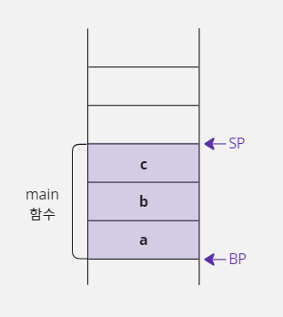

#### 1. main 함수가 Test 함수 호출하기

- `Test`함수를 호출하기 위해 제일 먼저 해야 할 일은 `Test`함수가 호출이 끝났을 때 다시 `main`함수의 실행 위치(`Test`함수를 호출한 다음 행)로 돌아오기 위해서 현재 실행 위치를 기억하는
  인스트럭션 포인터(Instruction Pointer, IP) 레지스터 값을 스택에 저장하는 것이다.

> - 프로세스의 코드 세그먼트 영역에는 프로그램 실행과 관련된 명령 목록이 저장되어 있다.
> - CPU는 이 명령 목록의 명령을 하나씩 실행하면서 프로그램을 진행하는데, CPU의 인스트럭션 포인터(IP) 레지스터가 현재 실행 위치를 기억하고 있다.
>
> 

- 그런 다음 베이스 포인터와 스택 포인터에 저장된 주소를 `Test`함수 기준으로 변경한다.
- 그런데 베이스 포인터(BP)의 주소를 `Test`함수 기준에 맞도록 다른 주소를 대입하면 원래 저장되어 있던 `main`함수의 베이스 포인터 주소를 잃어버리게 된다.
- `Test`함수의 실행이 끝났을 때 다시 `main`함수로 돌아가야 하는데 `main`함수의 베이스 포인터는 이미 잃어버렸기 때문에 문제가 생긴다.
- 이 문제는 베이스 포인터에 `Test`함수를 실행하기 위한 주소를 대입하기 전에, 현재 사용하던 `main`함수의 베이스 포인터 주소를 스택에 저장해 두면 해결할 수 있다.
- 그러면 `Test`함수의 호출이 끝났을 때 스택에 저장했던 베이스 포인터 주소를 가져올 수 있기 때문에 `Test`함수 호출 전에 사용하던 `main`함수의 베이스 포인터 주소가 자연스럽게 복구된다.

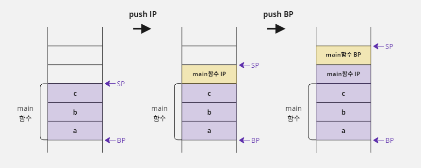

- `main`함수의 실행 위치를 기억하는 인스트럭션 포인터 레지스터와 `main`함수가 사용하던 베이스 포인터 위치를 스택에 `push`하여 보관했다.
- 따라서 위 그림 중 세 번째 그림에 있는 스택 포인터를 기준으로 `Test`함수의 베이스 포인터와 스택 포인터를 설정하면 된다.


- `Test`함수의 베이스 포인터는 현재 스택 포인터 위치를 이용해서 가리키면 되기 때문에 현재 스택 포인터의 주소를 베이스 포인터에 대입한다.
- 그리고 `Test`함수에는 지역 변수가 1개(4바이트)밖에 없으니 스택 포인터에 저장된 주소를 4만큼 감소시켜 `y`를 저장할 메모리를 할당한다.
- 이렇게 하면 `Test`함수를 실행하기 위한 설정이 완료된다.

#### 2. Test 함수가 Show 함수 호출하기

- 이제 `main`함수에서 `Test`함수를 호출한 것처럼 `Test`함수에서 `Show`함수를 호출하는 작업을 진행한다.
- 먼저 `Show`함수가 끝나면 `Test`함수로 복귀하기 위해 현재 사용 중이던 인스트럭션 포인터 레지스터의 값과 `Test`함수가 사용하던 베이스 포인터 주소 값을 스택에 저장한다.

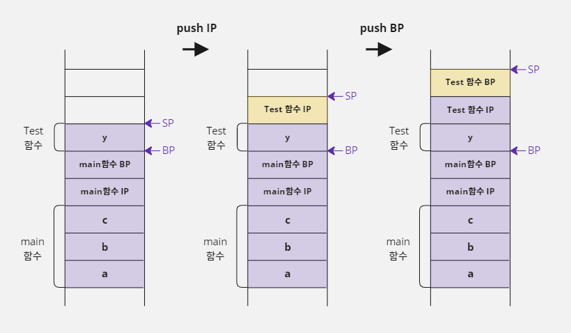

- `Test`함수의 인스트럭션 포인터 레지스터와 베이스 포인터를 스택에 `push`하여 보관했으니, 위 그림 중 세 번째 그림에 있는 스택 포인터를 기준으로 `Show`함수의 베이스 포인터와 스택 포인터를
  설정한다.
- `Show`함수의 베이스 포인터는 현재 스택 포인터 위치를 이용해서 가리키면 되기 때문에 현재 스택 포인터의 주소를 베이스 포인터에 대입한다.
- 그리고 `Show`함수에는 지역 변수가 3개(12바이트) 있기 때문에 스택 포인터에 저장된 주소 값을 12만큼 감소시켜서 `n`, `i`, `j`를 저장하기 위한 메모리를 할당한다.


- 이렇게 하면 `Show`함수를 실행하기 위한 베이스 포인터와 스택 포인터 설정이 완료된다.
- 이제 위의 메모리 그림을 보면 `main`, `Test`, `Show`함수의 지역 변수가 모두 할당되어 있는 것을 확인할 수 있다.
- 그리고 앞에서 문제가 되었던 베이스 포인터와 스택 포인터는 한 쌍만 사용하고 있다.

#### 3. Show 함수 종료하기

- 앞 예의 메모리 상태에서 `Show`함수가 끝나면 어떻게 될까?
- `Show`함수는 `Test`함수가 호출했었다.
- 따라서 `Show`함수가 사용하던 베이스 포인터와 스택 포인터를 `Test`함수가 사용하던 베이스 포인터와 스택 포인터로 복구시켜야 한다.
- 이 작업은 지금까지 한 작업을 거꾸로 진행하면 된다.

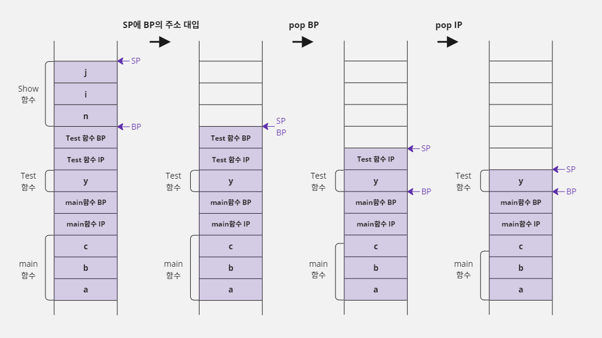

- 먼저 스택 포인터에 베이스 포인터의 주소를 대입한다.
- 그렇게 하면 `n`, `i`, `j`를 위해 할당되었던 메모리 공간이 사라진다.
- 그리고 `Test`함수의 베이스 포인터 값을 읽는다.
- 그리고 다시 한 번 `pop`명령을 사용하여 `Test`함수가 사용하던 IP값을 읽는다.
- 이렇게 하면 IP 레지스터 값이 복구되어 `Test`함수에서 `Show`함수를 호출한 다음 명령으로 이동하게 된다.
- 마지막 그림(`pop IP`이후)을 보면 `Test`함수가 `Show`함수를 호출하기 전으로 스택 메모리의 상태가 복구되었다.
- 그리고 `Test`함수가 끝나면 위 작업과 같은 방법으로 베이스 포인터의 주소를 스택 포인터에 대입하고 `main`함수의 베이스 포인터를 스택에서 읽어오면 된다.
- 그리고 `main`함수가 사용하던 인스트럭션 포인터 레지스터 값도 `pop`명령으로 스택에서 읽어 오면 `main`함수로 실행 위치가 복구된다.

### 스택 프레임이란?

- 이렇게 함수를 호출할 때 일어나는 스택의 변화를 스택 프레임(Stack Frame)이라고 한다.
- 앞에서 컴파일러가 C 언어로 작성한 소스 코드에서 변수를 선언한 부분을 기계어로 번역할 때, 변수를 저장할 메모리 위치를 배정하는 것을 '정적 메모리 할당'이라고 했다.
- 스택 프레임은 컴파일러가 C 언어 코드를 기계어로 번역하는 시점에 결정되기 때문에 이런 형식의 메모리 할당 역시 정적 메모리 할당이다.
- 그래서 지역 변수를 추가하거나 배열 크기를 변경하려면 스택 프레임이 수정되어야 하기 때문에 C 언어 코드를 다시 컴파일해야 한다.
- 그리고 앞에서도 이야기했지만 배열을 선언할 때 `[]`안에 반드시 상수를 적어야 하는 이유도 `[]`안에 변수가 오면 정적으로 할당할 크기를 고정할 수 없어서(스택 포인터 연산을 결정할 수 없어서) 스택 프레임을
  구성할 수 없기 때문이다.
- 내용이 어렵긴하지만, 함수를 호출할 때 내부적으로 어떤 일이 일어나는지 정도는 잘 알고 넘어가도록 하자!

> #### 스택 프레임을 어셈블리어로 살펴보자
>
> - 지금까지 이야기한 스택 프레임을 어셈블리 언어와 연결시켜서 살펴보자.
> - 어셈블리 언어로 작성한 코드는 보기 편하도록 실제와는 약간 다르게 순서가 배열되었다.
>
> ```c
> void myFunc() {
>     int k, m, n;
>     n = 1;
>     ...
> }
> 
> void main() {
>     int a, b;
>     myFunc();
>     ...
> }
> ```
>
> ```text
> push bp  // main 함수 시작
> mov  bp, sp
> sub  sp, 8
> mov  dword ptr[bp], 5
> call myFunc
> push bp  // myFunc 함수 시작
> mov  bp, sp
> sub  sp, 12
> mov  dword ptr[bp-8], 1
> ...
> mov  sp, bp
> pop  bp
> ret      // myFunc 함수 종료
> ...
> mov  sp, bp
> pop  bp
> ret      // main 함수 종료
> ```
>
> - 앞에서 설명할 때는 함수를 호출하기 전에 현재 인스트럭션 포인터 레지스터 값을 직접 `push`명령으로 스택에 저장한다고 했다.
> - 그런데 어셈블리 언어에서는 모듈(C 언어의 함수와 같은 개념)을 이동할 때 `call`명령을 사용하는데, 이 명령을 사용하면 현재 CPU의 인스트럭션 포인터 레지스터 값이 스택에 `push`된다.
> - 따라서 인스트럭션 포인터 레지스터 값을 스택에 `push`하는 코드가 없다.
> - `ret`명령은 함수의 호출이 끝나면 이 함수를 호출했던 위치로 돌아가기 위해서 스택에 저장했던 복귀 IP 주소를 읽는 명령이다.
> - `pop`명령처럼 스택에서 데이터를 하나 꺼내는 것은 비슷하지만, 읽은 정보를 반드시 IP 레지스터에 저장한다는 점이 다르다.
> - C 언어 소스 코드는 하나의 문장이라고 해도 여러 개의 기계어로 번역되기 때문에 실행 단위를 구분 짓기 어렵다.
> - 그래서 어셈블리 언어를 기준으로 하나의 명령이 실행될 때마다 스택의 변화를 보면 다음과 같다.
>
> 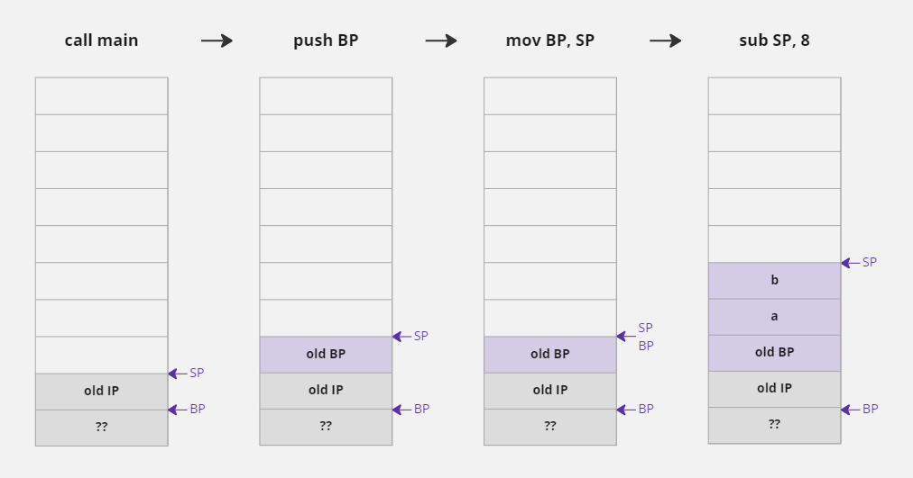
>
> 
>
> 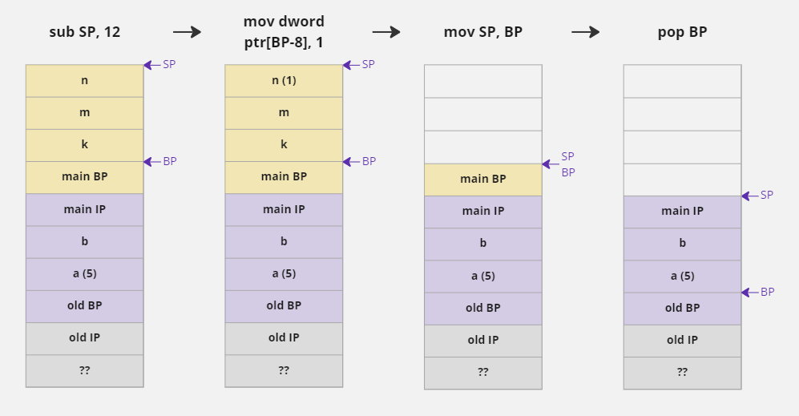
>
> 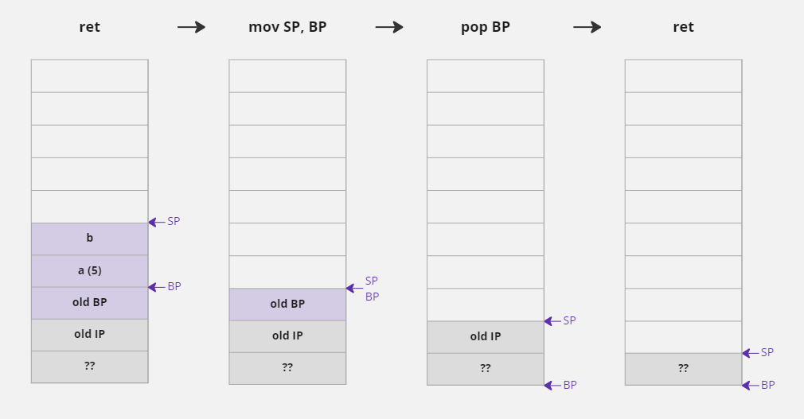

## 16-3. 동적 메모리 할당 및 해제

### 정적 메모리 할당의 한계

- 컴파일러의 설정을 변경하지 않았다면 프로세스 안에서 지역 변수가 저장되는 기본 스택(Stack) 메모리의 크기는 1Mbyte이다.
- 따라서 함수를 호출할 때 지역 변수가 할당되는 메모리 공간은 최대 1Mbyte를 넘을 수 없다.
- 예를 들어 아래와 같이 배열을 선언하면 스택에 1Mbyte가 할당되기 때문에 오류가 발생한다.

```c
char data[1024 * 1024];
```

- 그러면 프로그림이 사용하는 스택의 크기는 어떻게 계산할까?
- 프로그램 코드를 함수 안에 선언한 지역 변수 크기를 모두 더하면 될까? No...
- 왜냐하면 역할에 따라서 한 번 호출되는 함수도 있지만, 수십 번 반복해서 호출되는 함수도 있고, 프로그램이 실행될 때 조건문에 의해 호출 여부가 결정되는 함수도 있기 때문이다.
- 즉 함수가 호출되는 여부나 횟수를 미리 파악할 수 없기 때문에 프로그램이 사용할 전체 스택이 크기는 단순히 각 함수에 선언한 지역 변수의 크기를 합산해서 예측할 수는 없다.
- 이 말은 실제로 프로그램이 실행되어 함수가 호출될 때까지 스택 크기를 예측하기 어렵다는 뜻이다.
- 결국 스택의 실제 크기는 프로그램이 실행될 때가 돼서야 알 수 있기 때문에 컴파일러는 자신이 컴파일한 프로그램이 스택을 얼마나 사용할지 예상할 수 없다.
- 그래서 단일 배열의 크기나 단일 자료형의 크기가 1Mbyte를 넘는 경우에만 오류 메시지를 출력하고 각 함수에 선언한 변수의 크기를 합산해서 1Mbyte를 넘을 때는 오류로 처리되지 않는다.
- 하지만 컴파일에 성공한다고 해도 프로그램을 실행할 때 스택을 사용하는 크기가 1Mbyte를 넘게 되면 다음과 같이 실행 오류가 발생한다.

```text
"예외가 있습니다. 0xC00000FD: Stack overflow(매개변수: 0x00000000, 0x00372000)"
```

- 따라서 프로그래머는 자신의 프로그램이 스택을 1Mbyte 이상 사용하지 않도록 주의해야 한다.
- 그런데 프로그램에서 사용하는 데이터는 당연히 1Mbyte보다 훨씬 더 큰 경우가 많다.
- 예를 들어 우리가 보고 있는 스마트폰이나 모니터에 출력된 한 점(Pixel)의 데이터가 보통 4바이트 크기이다.
- 이런 픽셀들의 모임인 Full-HD 영상 한 장을 저장하려면 1920 x 1080 x 4바이트, 대략 7Mbytes 정도의 크기가 필요하다.
- 결국 프로세스 안의 기본 스택으로는 Full-HD 영상 한 장조차 저장하지 못한다는 뜻이다.
- 따라서 더 큰 메모리를 사용할 수 있는 방법이 필요하다.

### 동적 메모리 할당이란?

- 프로세스는 더 큰 메모리를 할당해서 사용할 수 있도록 힙(Heap)이라는 공간을 제공한다.
- 16-1에서 보았던 프로세스 그림을 보면 스택 세그먼트에 힙 영역이 있다.


- 스택은 '스택 프레임' 규칙을 통해 코드가 컴파일될 때 사용할 메모리 크기를 결정한다.
- 하지만 힙은 스택 프레임과 같은 형식이 적용되지 않으며 프로그래머가 원하는 시점에 원하는 크기만큼 메모리를 할당할 수 있다.
- 그리고 메모리 사용이 끝나면 언제든지 할당한 메모리 공간을 해제할 수 있다.
- 이런 형식의 메모리 할당을 '동적 메모리 할당'(Dynamic Memory Allocation)이라고 한다.
- 또 힙은 Mbyte 단위가 아닌 Gbyte 단위까지 할당할 수 있기 때문에 메모리를 할당할 때 크기 문제가 거의 발생하지 않는다.

### malloc 함수로 동적 메모리 할당하기

- 힙은 스택처럼 관리되는 공간이 아니라서 변수를 선언하는 행위로 메모리를 할당할 수 없다.
- 그래서 동적 메모리 할당을 지원하는 C 표준 함수인 `malloc`을 사용해서 메모리를 할당해야 한다.
- `malloc`은 memory allocation의 약자이다
- 이 함수는 사용자가 `size`변수에 지정한 크기만큼 힙 영역에 메모리를 할당하고 그 할당된 주소를 `void *`형식으로 반환해 준다.

```c
함수 원형: void *malloc(size_t size);  // size_t는 unsigned int 와 같은 자료형
함수 사용 형식: void *p = malloc(100);  // 100바이트의 메모리를 할당하여 포인터 p에 저장함
```

- 메모리 크기를 지정할 때 `size_t`자료형을 사용하는데 이 자료형은 `unsigned int`형과 같으며, 메모리 할당은 항상 양수로만 가능하기 때문에 음수를 고려하지 않겠다는 뜻이다.

> - `size_t`자료형은 C 언어에서 제공하는 헤더 파일에 `typedef unsigned int size_t;`라고 정의되어 있다.
> - 따라서 `size_t`는 `unsigned int`와 같은 자료형이다.
> - `typedef`에 대해서는 18장에서 자세하게 배우도록 하자.

- 그런데 사용자가 `malloc`함수로 100바이트 메모리를 할당하더라도 이 메모리를 2바이트(short) 단위의 50개 데이터 그룹으로 사용할지, 4바이트(int) 단위의 25개의 그룹으로 사용할지는 예상할 수 없다.
- 그래서 `malloc`함수가 메모리의 사용 단위를 결정하지 않고 `void *`형식으로 주소를 반환해 주는 것이다.
- 그런데 `void *`를 사용하면 사용할 때마다 형 변환(Casting)을 해야 하는 불편함이 있다.
- 그래서 다음과 같이 `malloc`함수를 사용하여 주소를 받는 시점에 사용할 포인터에 미리 형 변환을 사용하는 것이 좋다.
- 예를 들어 힙 영역에 할당된 100바이트의 메모리를 2바이트(short) 단위로 사용하고 싶거나 4바이트(int) 단위로 사용하고 싶다면 `malloc`함수를 다음처럼 사용하면 된다.

```c
short *p = (short *) malloc(100);  // 100바이트 (2바이트 50개 그룹)

int *p = (int *) malloc(100);  // 100바이트 (4바이트 25개 그룹)
```

> #### malloc 함수가 메모리 할당에 실패하는 경우도 있다
> 
> - `malloc`함수가 항상 메모리 할당에 성공하는 것은 아니다.
> - 한 번에 너무 큰 크기(2Gbytes 이상)를 명시하거나 계속된 메모리 할당으로 힙에 공간이 부족하면 메모리 할당에 실패할 수도 있다.
> - 이런 경우 `malloc`함수는 할당된 메모리 주소 대신에 `NULL`을 반환한다.
> - 따라서 `malloc`함수가 메모리 할당에 실패하는 경우를 대비하여 다음과 같이 넘겨받은 주소가 `NULL`인지 체크하는 것이 좋다.
> 
> ```c
> short *p = (short *) malloc(100);
> if (NULL != p) {
>     // 메모리 할당에 성공함. 이 시점부터 100바이트 메모리 사용 가능함
> } else {
>     // 메모리 할당에 실패함
> }
> ```

### free 함수로 할당된 메모리 해제하기

- 스택에 할당한 지역 변수는 함수 호출이 끝나면 스택 프레임에 의해 자동으로 해제된다.
- 하지만 힙에 할당된 메모리는 프로그램이 끝날 때까지 자동으로 해제되지 않는다.
- 사용하던 메모리가 해제되지 않으면 힙에 메모리를 할당할 공간이 부족해질 수 있다.
- 따라서 다음과 같이 `free`함수를 사용하여 힙에 할당했던 메모리를 명시적으로 해제해주어야 한다.

```c
free(p);  // p가 가지고 있는 주소에 할당된 메모리를 해제함
```

- 예를 들어 `malloc`함수를 사용하여 할당 받는 메모리의 주소 값을 포인터 변수 `p`가 가지고 있다고 하자.
- 그러면 위와 같이 포인터 변수 `p`가 가지고 있는 주소 값을 `free`함수에 매개변수로 넘겨서 해당 주소에 할당된 메모리를 해제해야 한다.
- `malloc`함수와 `free`함수의 정보가 `malloc.h`에 정의되어 있기 때문에 이 함수들을 사용하려면 `#include <malloc.h>` 전처리기를 코드에 추가해야 한다.

```c
/* 동적 메모리 할당을 사용하여 이름 입력 받고 출력하기 */

#include <stdio.h>
#include <malloc.h>  // malloc, free 함수를 사용하기 위해 추가함

void main() {
char *p_name;
p_name = (char *) malloc(32);  // 32바이트의 메모리를 동적 할당한다

if (p_name != NULL) {
// 메모리 할당에 성공한 경우
printf("Your name :");
gets(p_name);  // 이름을 입력 받음

printf("Hi! %s\n", p_name);  // 입력 받은 이름을 출력함
free(p_name);
} else {
// 메모리 할당에 실패한 경우
printf("Memory allocation error!!");
}
}
```

```text
Your name :Jerok, Kim
Hi! Jerok, Kim
```

### malloc 함수를 사용할 때 주의할 점

- 동적으로 할당한 메모리는 `malloc`함수를 사용할 때부터 `free`함수를 사용할 때까지 계속 힙 영역에 할당되어 있다.
- 따라서 다음과 같이 동적 메모리 할당을 사용하는 프로그램에서 실수로 메모리 할당을 해제하는 `free`함수를 사용하지 않았다면 `Test`함수가 호출될 때마다 힙에 100바이트씩 추가로 메모리가 할당된다.
- 그래서 반복문이 완료된 시점에는 100 x 100바이트 메모리가 힙에 할당되어 버린다.

```c
#include <malloc.h>  // malloc, free 함수를 사용하기 위해 추가함

void Test() {
    short *p = (short *) malloc(100);  // 힙에 100바이트 할당함
    // free(p);  // 실수로 메모리 할당을 해제하지 않았다
}

void main() {
    int i;
    for (i = 0; i < 100; i++) Test();  // 메모리가 100바이트씩 100번 동적 할당됨
}
```

- 그리고 힙에 할당된 주소를 기억하고 있는 포인터 변수 `p`는 지역 변수이기 때문에 `Test`함수의 종료와 함께 메모리에서 제거된다.
- 그런데 제거된 포인터 변수 `p`가 동적 할당된 메모리의 주소 값을 저장하고 있었기 때문에 포인터 변수 `p`가 제거되면 동적 할당된 메모리의 주소 값을 알 수 있는 방법이 없어서 해당 메모리를 사용할 수도 없고 해제할 수도 없다.
- 이런 상태를 메모리가 손실되었다고 이야기 한다.

#### 할당되지 않은 메모리를 해제하는 경우

- 동적 메모리 할당을 많이 사용하는 프로그램은 메모리 손실이 나지 않도록 `free`함수를 빼놓지 않고 신경을 많이 써야 한다.
- 그렇다고 해서 할당도 되지 않은 메모리를 해제하면 컴파일은 성공하더라도 실행할 때 오류가 발생한다.

```c
char *p;
// p = (char *) malloc(32);  // 포인터 변수 p에 메모리가 할당되지 않았다
free(p);  // p는 할당된 메모리의 주소를 가지고 있지 않아서 실행할 때 오류 발생함
```

#### 정적으로 할당된 메모리를 해제하는 경우

- 포인터가 정적으로 할당된 지역 변수의 주소를 가지고 있는데 이 주소를 사용하여 `free`함수를 호출해도 실행할 때 오륙 발생한다.

```c
int data = 5;
int *p = &data;  // p는 지역 변수 data의 주소를 가지게 됨
free(p);  // p는 힙에 할당된 주소가 아니기 때문에 실행할 때 오류 발생함
```

#### 할당된 메모리를 두 번 해제하는 경우

- `malloc`함수를 사용해 정상적으로 할당한 주소를 `free`함수로 해제하고 나서 실수로 한 번 더 해제하는 경우에도 프로그램을 실행할 때 오류가 발생한다.

```c
int *p = (int *) malloc(12);  // 12바이트 메모리를 힙에 정상적으로 할당함
free(p);  // 할당했던 메모리를 정상적으로 해제함
free(p);  // 이미 해제한 주소를 다시 해제하기 때문에 실행할 때 오류 발생함
```

- 이처럼 포인터나 동적 할당은 소스 코드를 작성하다가 실수를 하더라도 컴파일할 때 오류가 나지 않고 프로그램이 실행될 때 오류가 발생한다.
- 문법의 원리를 정확하게 이해하고 사용해야 하며 `malloc`함수를 사용하여 동적 할당을 하는 경우에는 `free`함수로 할당된 메모리를 해제하는 코드를 먼저 자신의 코드에 추가해 놓고 작업하는 것이 좋다.

### 동적 메모리 할당의 장단점

- 힙에 동적으로 할당하는 메모리는 스택에 비해 큰 크기의 메모리를 할당할 수 있으며 메모리를 할당하고 해제하는 시점도 프로그래머가 직접 정할 수 있다.
- 그리고 할당되는 메모리 크기도 프로그램 실행 중에 변경할 수 있다.
- 그래서 할당되는 메모리 크기가 변경되어도 소스 코드를 다시 컴파일하지 않아도 된다.
- 하지만 힙에 동적으로 메모리를 할당하고 해제하는 작업을 프로그래머가 직접 관리해야 하기 때문에 코드가 복잡해지며 작은 메모리를 할당해서 사용할 때는 오히려 비효율적일 수도 있다.
- 아래 코드는 1바이트 메모리를 정적 할당하는 코드와 동적 할당하는 코드를 비교한 것이다.

```c
/* 스택에 메모리 정적 할당 */

char data;  // 스택에 1바이트 사용함
data = 5;
```

```c
/* 힙에 메모리 동적 할당 */

// p는 지역 변수라서 스택에 정적 할당함
char *p;

// 1바이트 메모리를 힙에 동적 할당함
p = (char *) malloc(1);
*p = 5;
free(p);  // 동적 할당한 메모리 해제함
```

- 정적 할당은 스택에 1바이트만 할당된다.
- 하지만 동적 할당은 스택 대신 힙에 1바이트를 할당하며, 할당받은 힙의 메모리 주소를 저장하기 위해 스택에 4바이트(포인터 변수의 크기)를 할당한다.
- 따라서 총 5바이트가 필요하다.
- 이런 상황에 굳이 동적 할당을 고집하는 것은 좋지 않다.

## 16-4. 동적 메모리 사용하기

### 배열과 비슷한 형식으로 동적 메모리 사용하기

- 1바이트, 2바이트처럼 크기가 작은 데이터 여러 개를 동적으로 할당해서 사용하는 것은 번거롭고 불편할 수 있다.
- 그래서 동적 할당도 메모리를 배열처럼 그룹으로 묶어서 많이 사용한다.

```c
int *p = (int *) malloc(12);
```

- 위 코드에서 포인터 변수 `p`가 가리킬 대상의 크기는 4바이트(`int`)이다.
- 즉 `p`변수가 저장하고 있는 주소에 가서 4바이트 크기로 데이터를 저장하거나 읽을 수 있다는 뜻이다.
- 그런데 `malloc`함수를 사용하여 4바이트보다 큰 12바이트 크기로 동적 메모리를 할당했다.
- 12바이트 크기의 메모리를 세 그룹으로 나누어서 사용하는 것이다.
- 그러면 처음 4바이트를 제외한 나머지 8바이트는 어떻게 사용할 수 있을까?


- 포인터 문법은 포인터 변수에 저장되어 있는 주소로 연산할 수 있다.
- 그래서 처음 4바이트는 `*p`형식으로 사용하고, 그다음 4바이트는 `*(p+1)`형식으로 사용할 수 있으며, 마지막 4바이트는 `*(p+2)`형식으로 사용할 수 있다.
- 결국 이런 형식으로 메모리를 동적으로 할당하면 `int`형으로 그룹지어진 메모리를 사용하는 것과 같기 때문에 다음과 같이 선언한 배열(정적 할당)과 같은 목적으로 사용할 수 있다.

```c
int data[3];
```

#### 동적 메모리를 할당하는 또 다른 방법

- 동적 메모리를 할당할 때 앞에서 본 것처럼 `malloc(12)`라고 호출하면 할당할 전체 메모리의 크기를 명시하는 형태이다.
- 그런데 `sizeof`연산자를 사용하면 메모리 사용 단위까지 적을 수 있다.

```c
int *p = (int *) malloc(sizeof(int) * 3);  // sizeof(int) * 3 == 12
```

- `sizeof`연산자는 자료형이나 변수의 크기를 계산해 주는 연산자이다.
- 예를 들어 `sizeof(int)`라고 하면 `int`자료형의 크기가 4바이트이기 때문에 결과 값이 4가 된다.
- `malloc(12)`라고만 적어 놓으면 12바이트를 동적 할당한다는 정도로 이해할 수 있다.
- `malloc(sizeof(int) * 3)`이라고 적으면 12바이트를 할당하면서 대상 메모리를 4바이트(`int`) 단위로 나누어서 사용하려는 의도까지 좀 더 쉽게 파악할 수 있다.
- 그리고 같은 12바이트를 사용하더라도 다음과 같이 사용하면 메모리를 사용하는 방법이 달라진다.

```c
short *p = (short *) malloc(sizeof(short) * 6);  // sizeof(short) * 6 == 12
```

- 위 형태로 사용하면 포인터 `p`는 주소에 접근하여 2바이트(`short`) 단위로 메모리를 읽고 쓰기 때문에 12바이트를 6개의 항목으로 나누어 사용하게 된다.

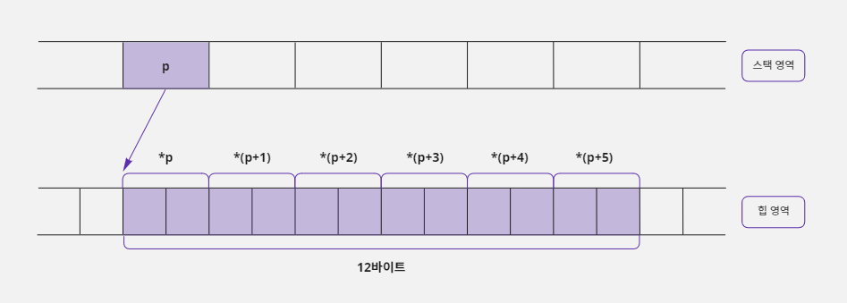

- 이 구조도 `short`형 변수 6개로 이루어진 배열과 같은 목적으로 사용할 수 있다.
- 결국 포인터와 동적 할당 문법을 사용하면 배열과 같은 목적으로 사용할 수 있는 메모리를 구성할 수 있다.

```c
short data[6];
```

### 정적 메모리 할당을 사용했을 때 발생할 수 있는 문제점

- 배열을 사용하면 메모리가 스택에 정적으로 할당되기 때문에 항목의 개수를 상수로만 할당할 수 있다.
- 따라서 다음과 같이 선언하면 오류가 발생한다.

```c
int data_size = 3;
int data[data_size];  // 배열의 요소 개수는 상수로만 명시할 수 있기 때문에 오류 발생함
```

- 즉 배열의 크기는 상수로만 적을 수 있기 때문에 자신이 사용할 데이터의 최대 개수에 반드시 신경을 써야 한다.
- 예를 들어 친구 관리 프로그램을 만드는 데 배열을 사용하고 이 배열의 한 요소에 한 명의 친구 정보가 저장된다고 하자.
- 그러면 친구가 몇 명인지에 따라서 배열의 크기가 달라져야 한다.
- 사용자에 따라 배열 크기가 10으로도 충분한 경우가 있고 300이 필요한 경우도 있다.
- 그러면 프로그래머는 어쩔 수 없이 최대 크기인 300으로 배열 크기를 정해야 한다.
- 이 프로그램을 친구가 10명인 사람이 사용하면 290개의 배열 요소를 낭비하는 셈이다.
- 친구가 500명인 사용자는 이 프로그램을 사용할 수 조차 없다.
- 결국 이 문제는 배열이 정적 메모리 할당 방식을 사용하기 때문에 배열의 크기를 상수로만 받아서 생기는 것이다.
- 