# 17. 다차원 포인터

- 포인터는 일반 변수를 가리킬 수도 있지만 또 다른 포인터를 가리킬 수도 있다.
- 이렇게 포인터가 포인터를 가리키는 것을 '다차원 포인터'라고 부른다.
- 다차원 포인터는 다차원 배열과 함께 자주 쓰인다.
- C 언어로 프로그래밍할 때 어떤 경우에 다차원 포인터를 사용하고, 어떻게 문법을 구성하는지 알아보자.

## 17-1. 다차원 포인터 개념

### 다차원 포인터란?

- '내'가 '길동이'라는 친구를 부를때 '친구야'라고 표현하는 상황을 상상해보자.
- '길동아'라고 부르는 것은 직접 표현을 사용하는 것이고, '친구야'라고 부르는 것은 간접 표현을 사용하는 것이다.
- 이 경우 '내'가 '길동이'를 가리키는 포인터가 된 것이다.
- '나의 친구의 친구'처럼 두 번 연속으로 간접 표현을 사용하는 것처럼 간접으로 여러번 가리키는 포인터를 '다차원 포인터'라고 부른다. 

```c
short *p, data = 5;
p = &data;  // 포인터 변수 p는 data 변수의 주소 값을 기억함
```

- 차원은 '자신이 가리키는 대상'의 개수만큼 증가한다.
- 가리키는 대상이 없는 경우 즉, 대상 그 자체는 가리키는 대상이 없기 때문에 0차원이다.

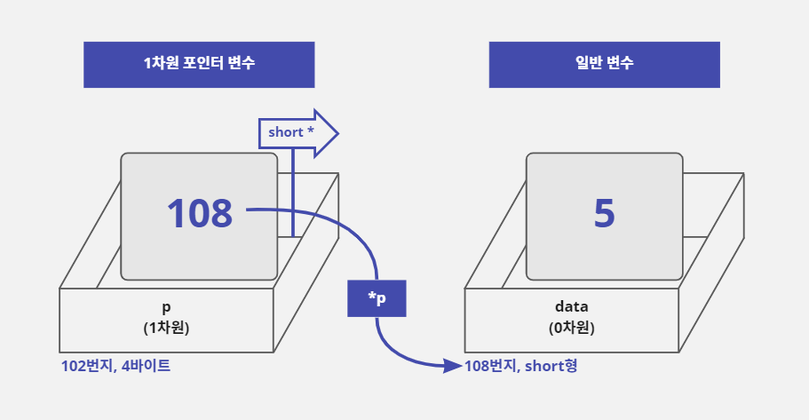

- 위의 그림에서 메모리 상자의 앞면에 변수 이름과 차원을 표시했다.
- 그리고 상자 아래에 변수가 할당된 주소와 메모리의 크기(또는 자료형)을 표시했다.

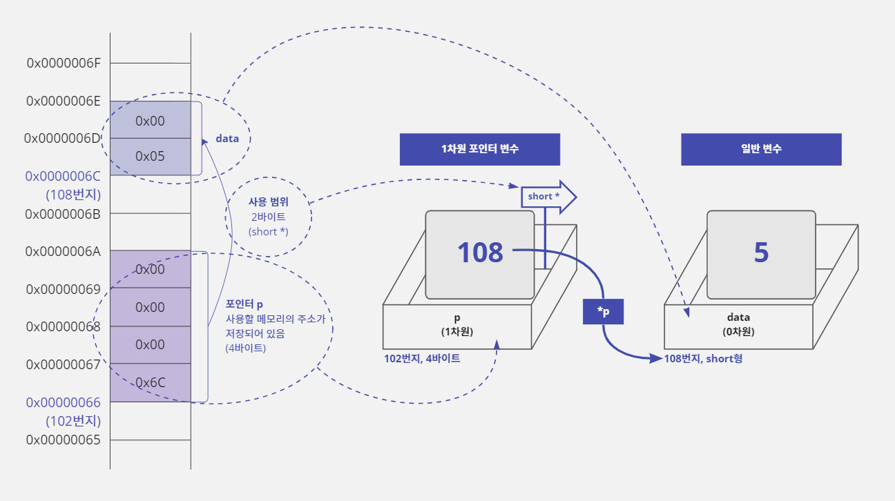

### 다차원 포인터 정의하기

- 앞에서 배운 차원 개념과 포인터 문법을 연결해 보자.
- 포인터 변수를 선언할 때 `*`키워드를 한 개만 사용한 포인터를 1차원 포인터라고 이야기하며 `*`키워드를 하나씩 더 사용할 때마다 차원이 하나씩 증가한다.
- 그리고 `*`키워드를 두 개 이상 사용해서 선언한 포인터를 '다차원 포인터'라고 한다.
- 포인터 변수를 선언할 때 사용하는 `*`키워드는 최대 7개(컴파일러마다 다름)까지 사용할 수 있다.
- 그리고 포인터 변수를 선언할 때 사용한 `*`키워드의 개수만큼 포인터를 사용할 때 `*`연산자를 사용할 수 있다.
- 예를 들어 `char *p;`라고 선언하면 포인터 변수 자체를 의미하는 `p`또는 포인터 변수가 가리키는 곳에 값을 저장하기 위한 `*p`, 이렇게 두 가지 표현을 사용할 수 있다.
- 따라서 `char ***p3;`라고 `*`키워드를 3개 사용해서 선언하면 `p3`, `*p3`, `**p3` 또는 `***p3`라는 네 가지 표현을 사용할 수 있다.

```c
char *p1;    // 1차원 포인터: p1, *p1
char **p2;   // 2차원 포인터: p2, *p2, **p2
char ***p3;  // 3차원 포인터: p3, *p3, **p3, ***p3
```

### 일반 변수의 한계와 다차원 포인터

- 주소 값을 저장할 수 있는 크기(4바이트)의 변수라면 포인터 변수가 아니더라도 주소를 저장할 수는 있다.
- 따라서 다음과 같이 4바이트 크기의 자료형인 `int`형으로 `my_ptr`변수를 선언하고 `&`연산자를 사용하여 `data`변수의 주소 값을 `my_ptr`변수에 저장할 수 있다.

```c
short data = 0;
int my_ptr = (int) &data;  // &data는 short *형식의 값을 가지기 때문에
                           // int형 변수인 my_ptr에 저장하기 위해서 (int)로 형 변환한다
                           // my_ptr는 4바이트 크기라서 정상적으로 주소를 저장한다
*my_ptr = 3;  // 오류 발생: my_ptr는 포인터가 아니라서 *연산자를 사용할 수 없음
```

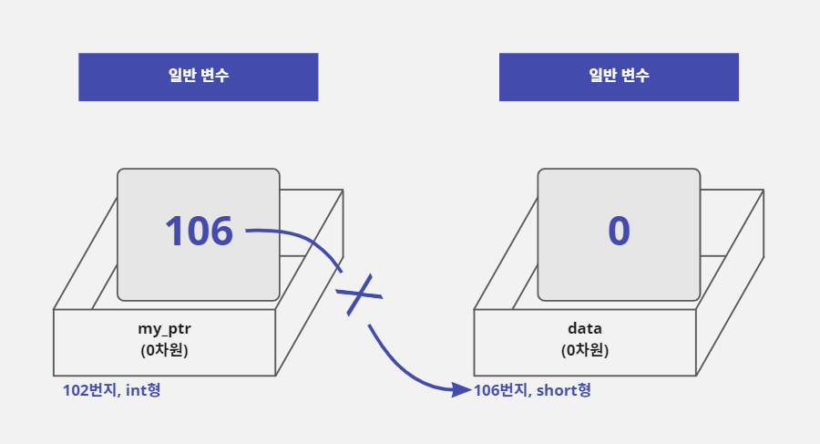

- 하지만 `my_ptr`변수는 포인터 변수가 아니기 때문에 `*`(번지 지정)연산자를 사용할 수 없다.
- 이것은 `my_ptr`변수에 저장된 주소로 이동하여 값을 대입하거나 읽을 수 없다는 뜻이다.
- 그래서 일반 변수에 주소 값을 저장하지 않고 `*`연산자를 사용해서 포인터 변수에 주소 값을 저장하는 것이다.
- 포인터 변수는 자신이 저장하고 있는 주소에 가서 값을 읽거나 쓸 수 있는 기능을 가지고 있기 때문이다.
- 정리하자면 일반 변수에도 주소 값을 저장할 수는 있지만, 자신이 저장하고 있는 주소에 가서 값을 읽거나 쓸 수 없기 때문에 의미가 없다.
- 이 개념을 잘 이해해야 이후에 배울 다차원 포인터 문법을 쉽게 이해할 수 있다.

## 17-2. 2차원 포인터

### 2차원 포인터의 선언과 사용

- 다차원 포인터 중 가장 자주 사용하는 것은 2차원 포인터이다.
- 2차원 포인터를 사용하면 2차원 배열을 다루는 게 훨씬 쉬워진다.
- 3차원 포인터부터는 2차원 포인터에서 단계가 하나씩 추가될 뿐 원리는 같다.
- 2차원 포인터는 다음과 같이 `*`키워드를 두 개 사용해서 선언한다.

```c
short **pp;
```

- 그래서 포인터를 사용할 때 `pp`, `*pp` 또는 `**pp`처럼 `*`연산자를 최대 2개까지 사용할 수 있다.
- 다음 그림처럼 2차원 포인터 변수는 `*pp`를 사용하면 변수 `pp`에 저장되어 있는 106번지로 이동해서 값을 읽거나 저장할 수 있다.

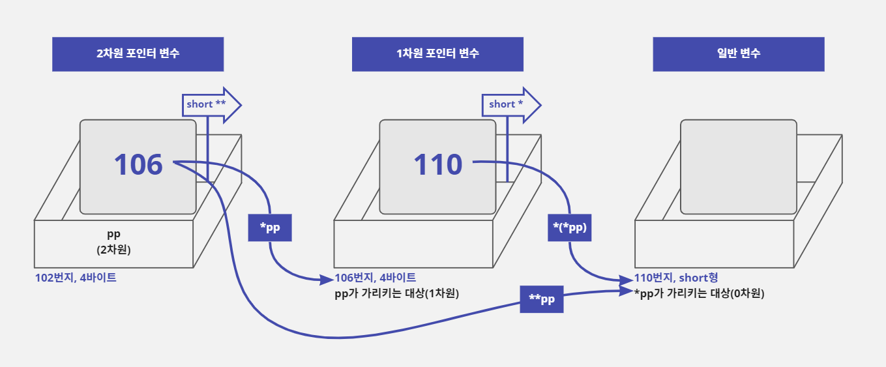

- 그리고 `**pp`를 사용하면 포인터 변수 `pp`가 가리키는 대상(106번지)에 저장된 주소 값(110번지)을 대상으로 사용한다.
- 그래서 110번지에 있는 값을 읽거나 저장할 수 있다.

### 2차원 포인터의 구성

- 앞의 그림을 보면 `**pp`라고 사용하면 두 번째 상자에 들어 있는 110을 주소로 사용해서 세 번째 상자를 가리킨다.
- 그런데 만약 다음과 같이 두 번째 상자에 주소가 아닌 다른 의미의 값(3)이 저장되어 있다면 프로그램이 엉뚱한 메모리를 사용해서 오류가 발생한다.

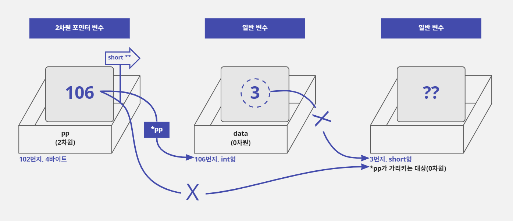

- 즉 두 번째 상자에 저장되어 있는 `3`은 `data`변수에 저장된 일반 숫자 값인데 이 값을 주소로 사용해서 3번지로 이동하여 값을 읽거나 저장하려고 하면 오류가 발생한다는 것이다.

```c
short **pp;
int data = 3;  // &data로 얻은 주소의 자료형이 int *이기 때문에
               // 포인터 변수 pp와 자료형을 맞추기 위해서 short **로 형 변환한다
pp = (short **) &data;
```

- 이처럼 2차원 포인터는 세 번째 상자로 한 번 더 이동할 수 있기 때문에 두 번째 상자에 최종 대상(세 번째 상자)의 주소 값이 저장되어야 한다.
- 따라서 두 번째 상자는 다음과 같이 1차원 포인터 변수가 되어야 안정적인 구조가 된다.

```c
short **pp, *p, data = 3;
p = &data;  // data 변수의 주소 값이 포인터 변수 p에 저장됨
pp = &p;    // 1차원 포인터 변수 p의 주소 값이 2차원 포인터 변수 pp에 저장됨
**pp = 5;   // data 변수의 값이 3에서 5로 변경됨
```

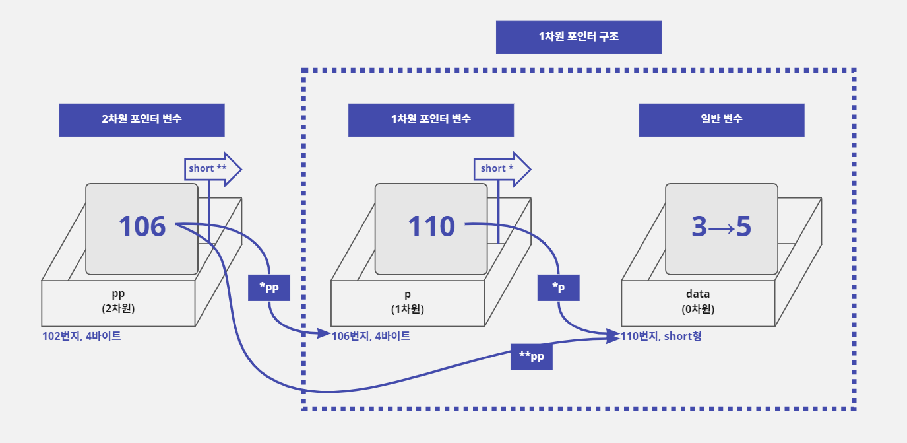

- 위의 그림처럼 주소를 저장하려면 두 번째 상자와 세 번째 상자를 1차원 포인터 구조로 만드는 것이 좋다.
- 그리고 위와 같은 구조가 되면 `data`변수는 `**pp`로도 값을 변경할 수 있고 1차원 포인터 변수 `p`를 사용하여 `*p`로도 값을 변경할 수 있다.
- 결론적으로 다차원 포인터 구조는 오른쪽으로 하나씩 이동할 때마다 차원을 하나씩 줄여 주는 것이 좋은 구조이다.
- 위와 같은 구조를 유지하면 강제적인 형 변환을 할 필요도 없고 자연스럽게 코드를 구성할 수 있다.
- 2차원 포인터를 이용하여 일반 변수의 값을 수정하는 예제를 작성해보자.

```c
/* 2차원 포인터를 사용하여 일반 변수의 값 대입하기 */

#include <stdio.h>

void main() {
    short data = 3;
    short *p = &data;  // data 변수의 주소 값을 1차원 포인터 p에 저장함
    short **pp = &p;  // 1차원 포인터 p변수의 주소 값을 2차원 포인터 pp에 저장함

    printf("[Before  ] data : %d\n", data);  // 3을 출력함
    *p = 4;  // 1차원 포인터 p를 사용하여 data 변수 값을 4로 수정함
    printf("[Use *p  ] data : %d\n", data);
    **pp = 5;  // 2차원 포인터 pp를 사용하여 data 변수 값을 5로 수정함
    printf("[Use **pp] data : %d\n", data);
}
```

```text
[Before  ] data : 3
[Use *p  ] data : 4
[Use **pp] data : 5
```

### 1차원 포인터 변수에 1차원 포인터 변수의 주소를 저장하면?

- 앞에서 2차원 포인터를 사용해 1차원 포인터의 주소 값을 저장하는 구조가 좋다고 했다.
- 그러면 1차원 포인터를 사용해서 1차원 포인터의 주소 갑을 저장하는 구조는 어떨까?

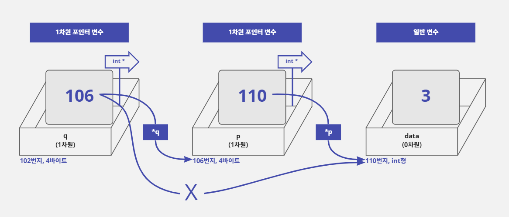

- 위 그림처럼 1차원 포인터 변수 `q`를 사용하여 1차원 포인터 변수 `p`의 주소 값을 저장할 수는 있다.
- 하지만 1차원 포인터 변수 `q`는 `*`연산자를 한 개만 사용할 수 있기 때문에 포인터 변수 `p`까지만 이동할 수 있고 `data`변수까지는 이동할 수 없다.
- 따라서 2차원 포인터를 사용하는 것과 구조는 비슷하지만 실용성은 떨어진다.

```c
int *q, *p, data = 3;
p = &data;  // 포인터 변수 p는 data 변수의 주소 값을 기억함
q = (int *) &p;  // 포인터 변수 q는 포인터 변수 p의 주소 값을 기억함
```

- 또한 이렇게 사용하면 차원이 맞지 않는 문제가 발생한다.
- 일반 변수의 주소를 `&`연산자를 사용하여 계산하면 1차원 형식의 포인터 값으로 반환된다.
- 1차원 포인터의 주소 값을 `&`연산자를 사용해서 계산하면 차원이 하나 증가하여 2차원 형식의 포인터 값으로 반환된다.
- 따라서 차원을 맞추기 위해서 `(int *)`형식으로 형 변환을 해주어야 한다.

### 2차원 포인터가 가리키는 첫 대상이 일반 변수인 경우

- 2차원 포인터가 가리키는 첫 대상이 일반 변수이면 주소 값이 아닌 일반 숫자 값을 저장하고 있을 확률이 높다.
- 일반 숫자 값을 주소로 사용하면 `**`연산자를 사용할 때 문제가 발생할 수도 있다.
- 그러므로 2차원 포인터가 가리키는 첫 대상은 1차원 포인터가 되는 게 일반적이다.
- 그러면 2차원 포인터의 첫 번째 대상으로 일반 변수를 사용하면서, 그 변수에 정상적인 주소 값을 저장해 사용하면 어떻게 될까?
- 다음과 같이 2차원 포인터 변수 `pp`가 일반 변수의 주소 값(106번지)을 저장하더라도, 그 일반 변수가 다른 변수의 주소 값(110번지)을 저장하고 있다면 구조적으로는 문제가 되지 않는다.
- 다만 차원이 하나씩 감소하는 일반적인 구조가 아니기 때문에 각 변수 간에 자료형이 맞지 않아서 형 변환을 많이 해주어야 한다.

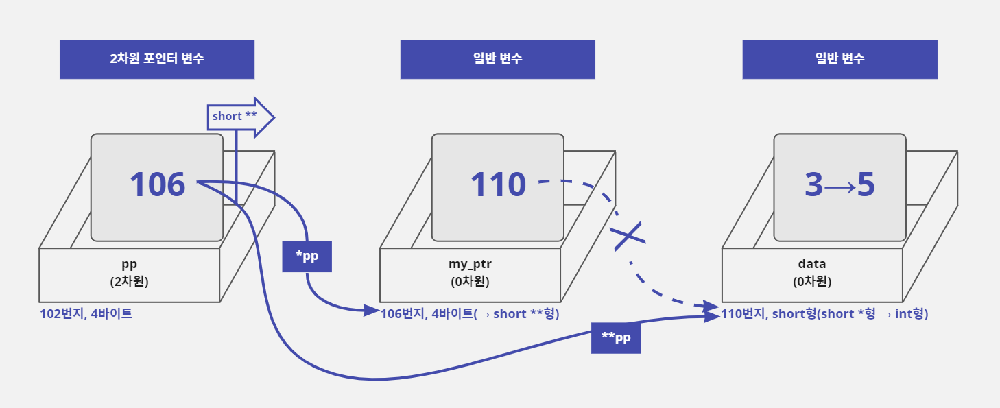

- 게다가 일반 변수 `my_ptr`는 `*`연산자를 사용할 수 없기 때문에 `data`변수의 주소 값을 저장하고 있더라도 이 주소로 이동할 수 없다.
- 하지만 2차원 포인터 변수인 `pp`는 `**pp`를 사용하여 두 번째 대상인 `data`변수를 가리킬 때 첫 번째 대상에 저장된 주소 값을 읽어서 `data`변수를 가리킬 수 있다.
- 즉 첫 번째 대상인 `my_ptr`가 어떤 형식의 변수이든 상관없이 4바이트 크기의 메모리이고 주소 값만 정상적으로 저장되어 있다면 그 주소 값을 사용하여 두 번째 대상을 가리킬 수 있다는 뜻이다.
- 따라서 2차원 포인터 변수인 `pp`는 `**pp = 5;`라고 사용했을 때 `my_ptr`변수가 1차원 포인터가 아니더라도 4바이트 크기의 메모리이고 정상적인 주소 값을 저장하고 있기 때문에 110번지로 한 번에 이동하여 값 5를 대입할 수 있다.

```c
short **pp, data = 3;
int my_ptr = (int) &data;  // &data는 short *형식의 값을 가지기 때문에
                           // int형 변수인 my_ptr에 저장하기 위해서 (int)로 형 변환한다
                           // my_ptr는 4바이트 크기라서 정상적으로 주소를 저장한다
pp = (short **) &my_ptr;  // my_ptr의 주소 값이 2차원 포인터 변수 pp에 저장됨
                          // &my_ptr로 얻는 주소 값의 자료형이 int *이기 때문에
                          // 포인터 변수 pp와 자료형을 맞추기 위해서
                          // short **로 형 변환을 한다
**pp = 5;  // data 변수의 값이 3에서 5로 변경됨
```

- 결론적으로 첫 번째 상자가 2차원 포인터 변수이고 두 번째 상자는 어떤 형식의 변수가 오든지 4바이트 크기이기만 하면 무조건 세 번째 상자로 이동하여 값을 변경할 수 있다.

### 2차원 포인터가 가리키는 대상을 동적으로 할당하기

- 1차원 포인터는 동적으로 할당한 메모리의 주소 값을 받아 사용할 수 있다.
- 따라서 2차원 포인터도 다음과 같이 두 번째 상자에 해당하는 4바이트 메모리를 `malloc`함수로 동적으로 할당해서 사용할 수 있다.
- 2차원 포인터는 자신이 가리키는 첫 대상이 어떤 종류의 변수인지 상관없이 4바이트 크기의 주소 값만 저장되어 있으면 최종 대상을 사용할 수 있기 때문이다.

```c
short **pp, data = 3;
pp = (short **) malloc(4);  // 두 번째 상자로 사용할 4바이트 메모리를 할당하고
                            // 그 주소 값을 2차원 포인터 pp에 저장한다
*pp = &data;  // data 변수의 주소 값을 두 번째 상자(동적으로 할당된 메모리)에 저장함
**pp = 5;  // data 변수의 값이 3에서 5로 변경됨
```

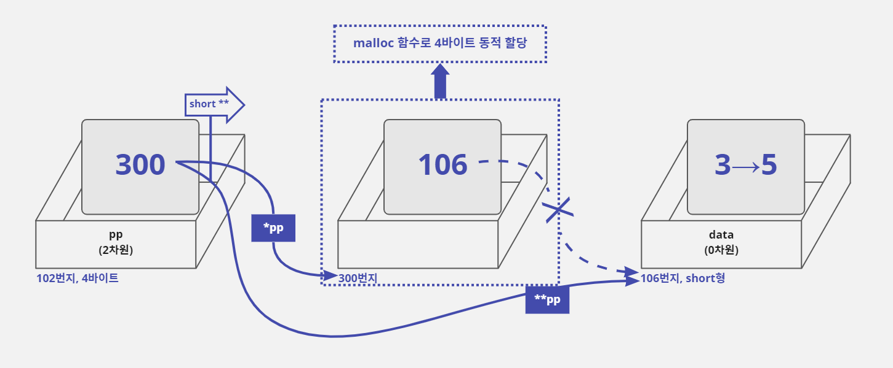

- 결국 이 예시에서 동적으로 할당된 4바이트 메모리는 포인터가 아니라서 `*`(번지 지정)연산자를 사용할 수 없기 때문에 스스로는 아무것도 할 수 없다.
- 하지만 `**pp`라고 사용할 때 이 4바이트 메모리에 저장된 주소 값을 사용하여 세 번째 상자로 이동하기 때문에 이 4바이트 메모리는 간접적으로 1차원 포인터처럼 사용된다.
- 즉 2차원 포인터 기준으로 봤을 때 이 4바이트 메모리는 `short *`로 선언한 포인터처럼 사용되기 때문에 `malloc(4)`로 적는 것보다 다음과 같이 적는 것이 코드의 의미를 더 분명하게 전달할 수 있다.

```c
pp = (short **) malloc(sizeof(short *));  // short *는 포인터이기 때문에 크기가 4바이트임
```

- 결국 이 형식은 `short *`형식의 포인터를 동적으로 할당하여 그 주소 값을 2차원 포인터 `pp`에 저장하는 형태이다.
- 그래서 위와 같이 적으면 1차원 포인터 한 개를 동적 할당한다고 이야기한다.
- 마지막으로 다음 예제는 두 번째 상자와 세 번째 상자까지 동적 메모리 할당을 사용하여 2차원 포인터 구조를 구성한 것이다.
- 이렇게 구성하면 스택 공간에는 포인터 변수 `pp`만 할당되고 `pp`에 할당 받은 동적 메모리(나머지 상자에 해당하는 메모리)는 힙에 할당된다.

```c
/* malloc 함수를 사용하여 2차원 포인터 구조 만들기 */

#include <stdio.h>
#include <malloc.h>

void main() {
    short **pp;
    pp = (short **) malloc(sizeof(short *));  // 4바이트를 할당함. 두 번째 상자 만듦
    *pp = (short *) malloc(sizeof(short));  // 2바이트를 할당함. 세 번째 상자 만듦

    **pp = 10;  // 2차원 포인터를 사용하여 세 번째 상자에 10을 대입함
    printf("**pp : %d\n", **pp);  // 10을 출력함
    free(*pp);  // 세 번째 상자에 해당하는 메모리 해제함
    free(pp);  // 두 번째 상자에 해당하는 메모리 해제함
}
```

```text
**pp : 10
```

- 이 예제에서 동적으로 할당한 메모리를 해제하는 순서가 정말 중요하다.
- 왜냐하면 두 번째 상자가 세 번째 상자의 주소 값을 가지고 있기 때문에 두 번째 상자를 먼저 해제하면 세 번째 상자의 주소 값을 잃어버리기 때문이다.
- 그러면 세 번째 상자에 해당하는 메모리를 해제하지 못하게 되므로, 반드시 세 번째 상자의 메모리를 먼저 해제하고 두 번째 상자의 메모리를 해제해야 한다.

#### 2차원 포인터가 가리키는 대상을 동적으로 할당하면 좋은 점

- 위의 예제에서는 2차원 포인터 개념을 설명하기 위해서 2차원 포인터가 가리키는 첫 번째 대상(두 번째 상자)을 4바이트(`short *`)로 동적 메모리 할당하고 두 번째 대상(세 번째 상자)을 2바이트(`short`)로 동적 메모리 할당했다.
- 즉 첫 번째 대상은 4바이트 1개이고 두 번째 대상은 2바이트 1개를 할당한 것이다.
- 하지만 꼭 이렇게 가리키는 대상을 1개로 구성해야 하는 것은 아니다.

```c
short **pp = (short **) malloc(3 * sizeof(short *));  // 12바이트(3*4) 크기로 메모리가 할당됨
```

- 이 코드처럼 첫 번째 대상을 4바이트가 아닌 12바이트(4바이트 3개)로 할당해도 된다.
- 12바이트이면 4바이트 크기로 메모리를 나눠서 사용할 수 있기 때문에 총 세 개의 주소를 저장할 수 있다.
- 그리고 첫 번째 대상의 첫 번째 주소에 접근하고 싶으면 포인터의 주소 연산을 사용해서 `*(pp + 0)`이라고 써 주면 된다.
- 그리고 첫 번째 대상의 두 번째 주소에 접근하고 싶으면 `*(pp + 1)` 그리고 세 번째 주소에 접근하려면 `*(pp + 2)`라고 쓰면 된다.

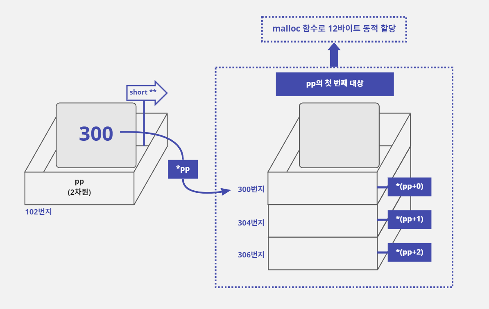

- 2차원 포인터 `pp`가 가리키는 두 번째 대상도 2바이트(`short`)가 아닌 4바이트로 할당해서 `short`형식의 정수 값을 한 개가 아닌 두 개 저장할 수도 있다.

```c
*pp = (short *) malloc(2 * sizeof(short));  // 4바이트(2*2) 크기로 메모리가 할당됨
```

- 위와 같이 4바이트가 할당되면 2바이트(`short`)씩 나눠서 2개의 정수를 저장할 수 있다.
- 첫 번째 정수 값을 저장하기 위해서는 `*(*pp + 0)`또는 `**pp`라고 사용하면 되고 두 번째 정수 값을 저장하기 위해서는 `*(*pp + 1)`이라고 사용하면 된다.
- 이렇게 2차원 포인터가 가리키는 첫 번째 대상과 두 번째 대상에 값을 한 개 이상 저장할 수 있도록 구성하면, 2차원 배열과 비슷한 형식의 메모리를 구성할 수 있다.
- 2차원 배열을 사용하는 경우에는 행의 갯나 열의 개수가 변경되면 반드시 다시 컴파일을 해서 변경 사항을 반영해야 한다.
- 하지만 2차원 포인터와 동적 메모리 할당을 사용해서 2차원 메모리 구조를 만들면 행의 개수나 열의 개수가 변경되더라도 컴파일을 다시 하지 않아도 된다.
- 조건이 변할 때 마다 매번 다시 컴파일해야 하는 프로그램보다는 별다른 변경 없이 그대로 사용할 수 있는 프로그램이 당연히 더 좋을 것이다.
- 따라서 2차원 포인터와 동적 메모리 할당을 사용하여 2차원 데이터 구조를 만드는 것이 좋다.

## 17-3. 2차원 포인터와 함수의 매개변수

### 매개변수에 포인터 변수를 잘못 사용한 경우

- 프로그래밍을 하다 보면 중복된 코드를 줄이고 변화에 효과적으로 대처하기 위해서 함수를 만들어 사용하는 경우가 많다.
- 그런데 함수의 매개변수로 포인터를 사용하는 경우에 차원 개념을 잘못 적용하면 원하는 값을 제대로 반환 받지 못해 오류가 발생할 수 있다.
- 이런 종류의 오류는 컴파일할 때는 문제가 없지만 실행할 때 오류가 발생할 확률이 높다.
- 다음과 같이 8바이트의 메모리를 동적으로 할당하는 `GetMyData`함수를 만들고 이 함수를 호출하는 예제 코드를 구성해 보자.
- 이 예제는 컴파일은 성공하지만 프로그램이 실행될 때 오류가 발생한다.

```c
/* 8바이트의 동적 메모리를 할당하는 함수 만들기 */

#include <malloc.h>

void GetMyData(int *q) {
    q = (int *) malloc(8);  // 8바이트의 메모리를 동적 할당하여 포인터 q에 저장함
}

void main() {
    int *p;        // p는 초기화되지 않아서 쓰레기(유효하지 않은) 값을 저장함
    GetMyData(p);  // 함수를 호출하여 p에 8바이트 메모리를 할당함
    *p = 5;        // 오류 발생: 할당된 메모리의 첫 4바이트에 값 5를 넣음
    free(p);       // 동적으로 할당된 메모리를 해제함
}
```

```text
Process finished with exit code -1073741819 (0xC0000005)
```

#### 문제가 발생하는 이유

- 이 문제가 발생한 이유는 `main`함수의 포인터 변수 `p`에서 `GetMyData`함수의 포인터 변수 `q`로 원하지 않는 주소 값이 전달되었기 때문이다.
- 이 상황을 명령이 실행되는 순서대로 적어 보면 다음과 같다.

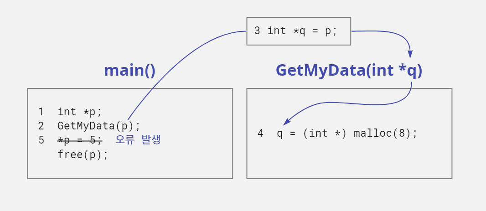

> 1. `p`는 초기화되지 않아서 쓰레기(유효하지 않은) 값을 저장함.
> 2. `GetMyData`함수의 매개변수로 `p` 전달함.
> 3. `p`에 저장된 주소 값을 `q`에 대입함. `p`와 `q`는 같은 주소 값(쓰레기 값)을 저장하고 있음.
> 4. 8바이트 동적 메모리 할당. 할당된 메모리의 주소 값은 `q`에 저장함. 결국 `q`에는 새로 할당된 메모리의 주소가 저장되었을 뿐 `p`포인터 변수에는 별다른 영향을 미치지 않음.
> 5. `p`는 처음 가지고 있던 쓰레기 값을 그대로 가지고 있는 상황인데, 그 주소에 `5`를 저장하려고 하면 원하지 않는 주소 값을 대입하는 것이기 때문에 오류 발생함.

- 앞의 코드를 보면 포인터 변수 `p`에는 실제 메모리 주소 값이 대입된 적이 없다.
- 초기화되지 않은 쓰레기 값만 들어갔을 뿐이다.
- 그런데 이 포인터 변수를 `*p = 5;`라고 사용했으니 유효하지 않은 주소로 이동해서 값 `5`를 대입하기 때문에 문제가 발생하는 것이다.

#### 동적으로 할당된 주소 값을 포인터 변수에 대입하면 문제를 해결할 수 있을까?

- 먼저 `malloc`함수를 사용하여 8바이트 메모리를 할당하자.
- 그리고 할당된 메모리의 주소 값은 포인터 변수 `q`에 저장하고, `q`가 저장하고 있는 주소 값을 포인터 변수 `p`에 대입해 보자.

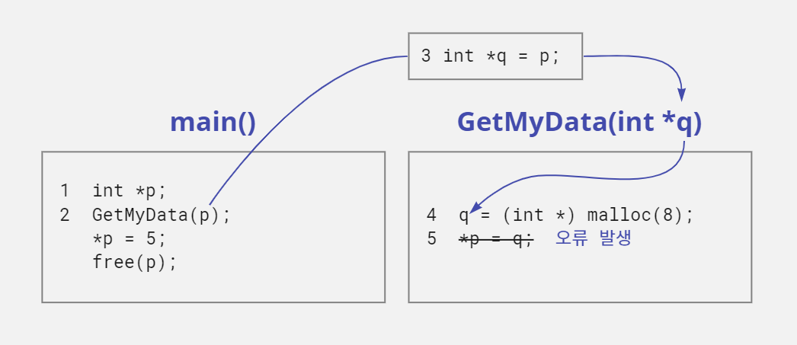

> 1. `p`는 초기화되지 않아서 쓰레기(유효하지 않은) 값을 저장함.
> 2. `GetMyData`함수의 매개변수로 `p` 전달함.
> 3. `p`에 저장된 주소 값을 `q`에 대입. `p`와 `q`는 같은 주소 값을 저장하고 있음.
> 4. 8바이트 동적 메모리 할당. 할당된 메모리의 주소 값은 `q`에 저장함. 결국 `q`에는 새로 할당된 메모리의 주소가 저장되었을 뿐 `p` 포인터 변수에는 별다른 영향을 미치지 않음.
> 5. `GetMyData`함수에 선언한 지역 변수 `q`는 다른 함수에 선언한 지역 변수 `p`를 사용할 수 없어 오류 발생함.

- 위와 같이 소스 코드를 수정하면 포인터 변수 `p`와 `q`는 같은 주소 값을 저장하게 된다.
- 결국 동적으로 할당된 8바이트 메모리의 주소 값을 둘 다 가지고 있는 셈이다.
- 하지만 이런 해결책은 `GetMyData`함수에 적용할 수 없다.
- 왜냐하면 `GetMyData`함수에 선언한 지역 변수 `q`는 다른 함수(`main`)에 선언한 지역 변수 `p`에 값을 대입할 수 없어서 `p = q;`라고 적으면 컴파일할 때 오류가 발생하기 때문이다.
- 결국 이 방법으로도 문제를 해결할 수가 없다.

### 함수의 매개변수로 2차원 포인터 사용하기

- `main`함수의 지역 변수 `p`의 값을 변경하고 싶다면 `GetMyData`함수에서 변수 `p`의 주소 값을 전달 받아 처리해야 한다.
- 다른 함수에 선언한 지역 변수의 '이름'은 사용할 수 없지만 '주소'는 사용할 수 있기 때문이다.
- 그런데 변수 `p`가 일반 변수가 아니고 1차원 포인터 변수이기 때문에, `p`변수의 주소 값을 전달 받는 변수 `q`를 2차원 포인터로 선언해서 사용해야 한다.

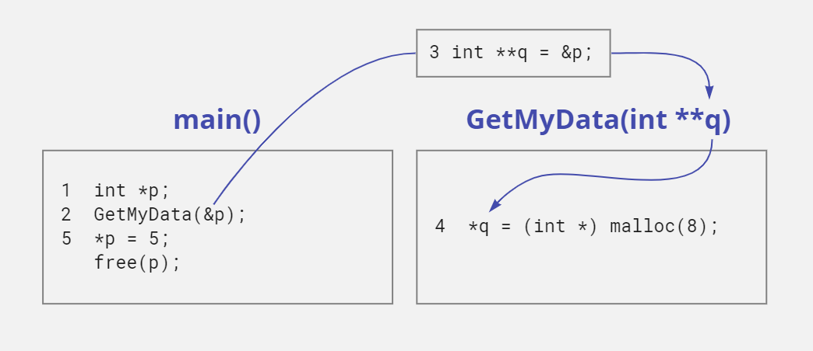

> 1. `p`는 초기화되지 않아서 쓰레기(유효하지 않은) 값을 저장함.
> 2. `GetMyData`함수의 매개변수로 `&p` 전달함.
> 3. 2차원 포인터 `q`에 1차원 포인터 `p`의 주소 값을 저장함.
> 4. 8바이트 동적 메모리 할당. 할당된 메모리의 주소 값은 `q`가 가리키는 대상인 포인터 변수 `p`에 저장함.
> 5. `p`에 저장된 주소에 가서 값 5를 대입함.

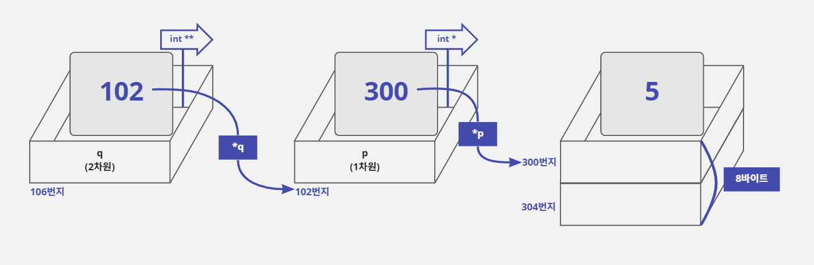

- 위와 같이 2차원 포인터와 함수의 매개변수 개념을 사용하면 변수 `p`와 `q`가 서로 다른 함수의 지역 변수라도 `main`함수에 선언된 포인터 변수 `p`의 주소 값을 변경할 수 있다.
- 이제 이 개념을 `GetMyData`함수에 적용해 보자.

```c
/* 2차원 포인터로 8바이트 동적 메모리를 할당하는 함수 만들기 */

#include <stdio.h>
#include <malloc.h>

void GetMyData(int **q) {  // 포인터 변수 q는 p 변수의 주소 값을 저장함
    // 할당된 메모리의 주소 값을 포인터 q가 가리키는 main 함수의 p에 저장함
    *q = (int *) malloc(8);
}

void main() {
    int *p;         // p는 초기화되지 않아서 쓰레기(유효하지 않은) 값을 저장함
    GetMyData(&p);  // 포인터 변수 p의 주소 값을 매개변수로 전달함
    *p = 5;         // 할당된 메모리의 첫 4바이트에 값 5를 넣음
    free(p);        // 할당된 동적 메모리를 해제함
}
```

- 16장에서 동적 메모리 할당을 설명할 때 `malloc`함수와 `free`함수를 한 쌍으로 사용하는 것이 좋다고 했는데 위의 예제에서는 분리해서 사용했다.
- 그 이유는 `GetMyData`함수에서 동적으로 할당한 메모리의 주소 값을 `main`함수의 포인터 변수 `p`에 저장하여 사용하기 때문이다.
- 따라서 `GetMyData`함수에서 `free`함수를 사용해서 메모리를 해제하면 `GetMyData`함수에서 할당한 메모리가 해제되어 버린다. 
- 즉 `main`함수의 포인터 변수 `p`에 전달된 주소 값은 이미 해제된 메모리의 주소 값인 것이다.
- 따라서 `GetMyData`함수에서 할당된 메모리를 해제하면, `main`함수에서 포인터 변수 `p`를 사용하는 곳에서 문제가 발생하므로 주의해야 한다.

## 17-4. 2차원 포인터와 2차원 배열

### 여러 개의 1차원 포인터를 정적으로 할당하기

- `short *`형식의 1차원 포인터가 100개 필요하다면 배열 문법을 사용하여 다음과 같이 선언할 수 있다.

```c
short *p[100];  // short *형식의 1차원 포인터를 100개 선언함
```

- 배열의 요소가 100개이고 각 요소의 크기가 4바이트(포인터)이기 때문에 이 배열에 할당된 전체 메모리 크기는 400바이트이다
- 이렇게 선언하면 `p[0]`부터 `p[99]`까지 총 100개의 포인터를 사용할 수 있다.
- 하지만 위와 같은 표현에는 두 가지 비효율성이 있다.
- 첫 번째는 배열을 사용했기 때문에 컴파일할 때 변수 `p`의 메모리 크기가 400바이트로 고정되어 버린다.
- 만약 포인터 200개를 사용하도록 수정해야 한다면 변수 `p`를 `p[100]`대신 `p[200]`으로 바꿔서 선언해야 한다.
- 그리고 소스 코드를 변경했기 때문에 소스 파일을 다시 컴파일해야 하는 불편함이 있다.
- 두 번째는 메모리가 낭비될 수 있다.
- 변수 `p`는 100개의 포인터가 메모리에 할당되기 때문에 실제로 포인터를 5개만 사용하는 경우에 95개의 포인터를 저장할 수 있는 메모리가 낭비된다.
- 결국 이 문제는 배열을 선언할 때 배열 크기가 반드시 상수로 적어야 하기 때문에 발생하는 것이다.

### 여러 개의 1차원 포인터를 동적 할당하기

- 17-2에서 2차원 포인터가 가리키는 첫 번째 대상에는 1차원 포인터의 주소 값을 저장해서 사용하는 것이 가장 좋지만, 4바이트 크기의 메모리에 주소 값을 저장해서 사용해도 된다고 하였다.
- 그래서 `malloc`함수로 4바이트 메모리를 할당하여 2차원 포인터에 저장하면 그 메모리를 1차원 포인터처럼 활용할 수 있기 때문에 다음과 같이 적을 수 있다.
- 결국 아래 코드는 1차원 포인터 1개를 할당하는 내용이다.

```c
short **pp;
pp = (short **) malloc(sizeof(short *));  // pp = (short **) malloc(4); 와 같은 표현
```

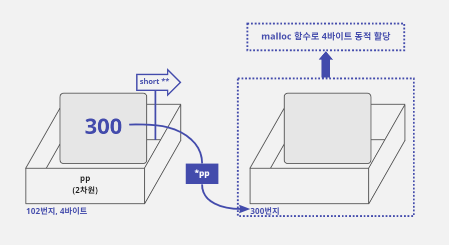

- `malloc`함수의 매개변수에 동적으로 할당할 메모리의 크기를 적을 때는 상수 뿐만 아니라 변수를 사용할 수 있다.
- 따라서 다음과 같이 `short *`형식의 1차원 포인터를 n개 할당할 수 있고 이렇게 할당된 메모리는 `*(pp + 0)`부터 `*(pp + n - 1)`까지 1차원 포인터 n개를 사용할 수 있다.

```c
int n;
short **pp;
scanf("%d", &n);  // 사용할 1차원 포인터의 개수를 사용자에게 받음
pp = (short **) malloc(sizeof(short *) * n);
// malloc 함수의 매개변수로 short *형식의
// 1차원 포인터 n개를 할당합니다
```

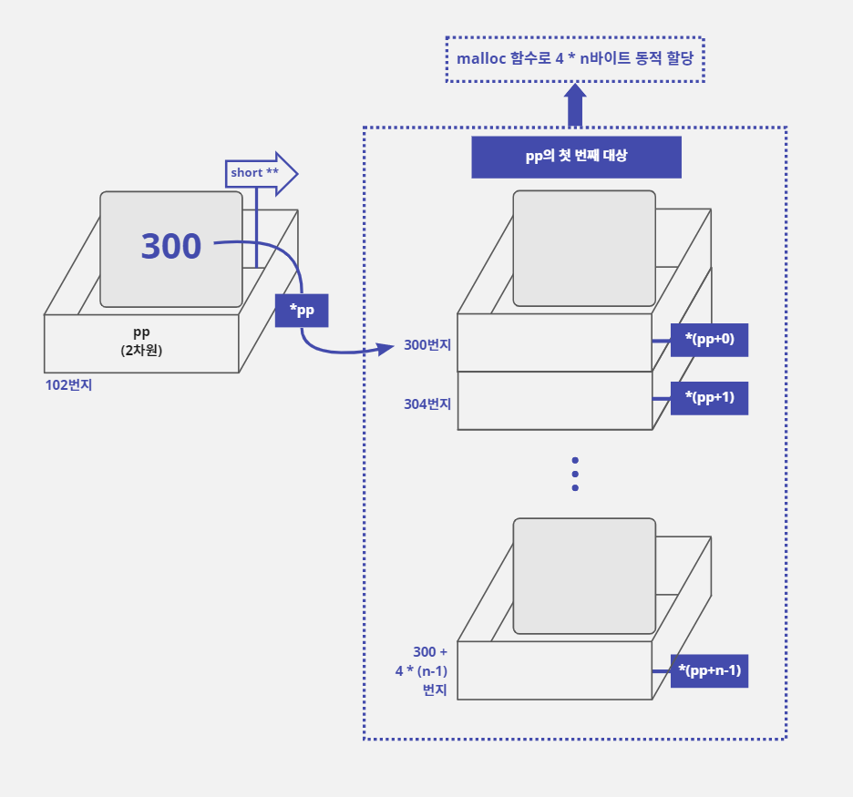

- 이렇게 2차원 포인터와 `malloc`함수를 사용하면 배열을 사용하는 것보다 코드는 좀 더 복잡해지지만 프로그램 실행 중에 1차원 포인터의 개수가 바뀌어도 소스 파일을 다시 컴파일할 필요가 없다.
- 그리고 사용자가 메모리를 사용하고 싶은 크기만큼 선택할 수 있기 때문에 배열을 사용하는 것보다 메모리 효율성이 좋다.

### 2차원 배열과 동적 메모리 할당

- 2차원 배열과 같은 용도로 사용할 수 있는 메모리를 동적으로 할당하는 방법을 살펴보자.
- 어떤 회사에서 직원들의 체력을 테스트한 결과를 저장하는 프로그램을 만들어 볼 것이다.
- 이 회사의 연령별 인원수는 20대가 4명, 30대 2명, 40대 3명이다.
- 1분간 윗몸 일으키기를 하고, 이 횟수를 연령별로 저장하는 데 필요한 메모리는 어떻게 할당하는 것이 가장 효과적일까?

#### 2차원 배열로 메모리를 할당하는 방법

- 먼저 1명이 1분 동안 수행한 윗몸 일으키기 횟수를 저장하기 위한 자료형(메모리 크기)을 결정해야 한다.
- 이 횟수는 정수 값이고 음수가 나올 수 없으며 200개를 넘을 가능성도 없다.
- 따라서 0~200 사이의 값을 저장하면 되기 때문에 `unsigned char`자료형(0~255)으로도 충분히 데이터를 저장할 수 있다.
- 어떤 배열 구조를 사용할지 정해보자.
- 연령별 그룹이 2그룹이고 각 그룹별로 2명에서 4명까지 포함될 수 있다.
- 따라서 2차원 배열 구조가 효율적일 것이다.
- 2차원 배열을 사용하려면 그룹별 크기가 같아야 하므로 최대 인원수인 4명으로 배열의 크기를 정해야 한다.
- 이 내용을 종합해서 2차원 배열을 변수로 선언해 보면 다음과 같다.

```c
unsigned char count[3][4];  // 3개의 그룹에 최대 4명의 사람을 관리함
```

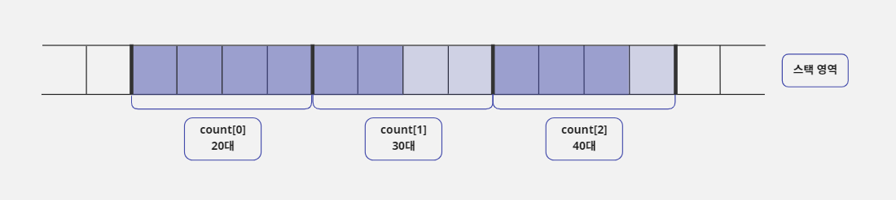

- 이렇게 선언한 배열에 직원들의 윗몸 일으키기 횟수를 대입해 보자.

```c
count[0][1] = 49;  // 20대 연령의 두 번째 사람
count[1][0] = 45;  // 30대 연령의 첫 번째 사람
count[2][2] = 42;  // 40대 연령의 세 번째 사람
```

```c
/* 2차원 배열로 연령별 윗몸 일으키기 횟수 관리하기 */

#include <stdio.h>

void main() {
    // 연령별 인원수. 20대 4명, 30대 2명, 40대 3명
    unsigned char limit_table[3] = {4, 2, 3};

    // 연령별 윗몸 일으키기 횟수를 저장할 배열
    unsigned char count[3][4];
    int age, member, temp, sum;

    // 연령별로 윗몸 일으키기 횟수를 입력 받음
    for (age = 0; age < 3; age++) {
        // '각 연령의 윗몸 일으키기 횟수'라고 출력함
        printf("\n%d0대 연령의 윗몸 일으키기 횟수\n", age + 2);
        // 해당 연령에 소속된 사람들을 순서대로 입력 받음
        for (member = 0; member < limit_table[age]; member++) {
            // '1th :, 2th :, ...'라고 출력함
            printf("%dth :", member + 1);
            // 윗몸 일으키기 횟수를 정수로 입력 받음
            scanf("%d", &temp);
            // scanf로 unsigned char 변수에 직접 정수를 받을 수 없어서 temp 변수에
            // 정수로 입력 받은 후에 count 배열 요소에 저장한다
            count[age][member] = (unsigned char) temp;
        }
    }

    printf("\n\n연령별 평균 윗몸 일으키기 횟수\n");
    // 연령별로 입력된 횟수를 합산하여 평균 값을 출력함
    for (age = 0; age < 3; age++) {
        sum = 0;
        // '20대 :, 30대 :, 40대 :'라고 출력함
        printf("%d0대 : ", age + 2);
        // 해당 연령에 소속된 사람들의 횟수를 합산함
        for (member = 0; member < limit_table[age]; member++) {
            sum = sum + count[age][member];
        }
        // 합산 값을 인원수로 나누어서 평균을 냄
        printf("%5.2f\n", (double) sum / limit_table[age]);
    }
}
```

```text
20대 연령의 윗몸 일으키기 횟수
1th :57
2th :52
3th :55
4th :50

30대 연령의 윗몸 일으키기 횟수
1th :48
2th :41

40대 연령의 윗몸 일으키기 횟수
1th :35
2th :52
3th :43


연령별 평균 윗몸 일으키기 횟수
20대 : 53.50
30대 : 44.50
40대 : 43.33
```

### 조건 추가 1: 각 연령층에 포함된 인원수가 변한다면?

- 회사에 직원들이 변동하여 각 연령층에 포함된 인원수에 변화가 생길 수 있다는 조건을 추가해 보자.
- 이 조건을 만족하려면 `limit_table`에 고정되어 있는 4, 2, 3값을 정해 놓지 않고 프로그램이 시작할 때 사용자에게 입력 받으면 된다.
- 하지만 `count`배열에서 고려한 최대 인원수가 4명이기 때문에 사용자가 입력한 인원수가 4명보다 많아지면 `count`배열에 문제가 생긴다.
- 배열은 요소의 개수를 상수로만 입력받을 수 있기 때문에 최대 인원수를 4보다 큰 숫자로 변경하려면 소스 코드에서 `count`배열의 크기를 직접 변경해야 한다.
- 이렇게 되면 소스 코드 또한 다시 컴파일해야 한다.

#### 포인터 배열 사용하여 메모리 할당하기

- 이 문제를 해결하려면 사용자가 입력한 인원수만큼 메모리를 동적으로 할당해야 한다.
- 연령층에는 변화가 없기 때문에 다음과 같이 포인터 배열을 사용하여 3개의 포인터를 선언한다.
- 그리고 각 포인터에 `malloc`함수를 사용하여 사용자가 입력한 연령별 인원수로 메모리를 동적으로 할당하면 된다.

```c
unsigned char limit_table[3] = {4, 2, 3};  // 사용자가 연령층별로 입력한 인원수
unsigned char *p[3];  // 1차원 포인터 3개를 선언함
int age;

// 연령층별로 입력된 인원수만큼 동적으로 메모리를 할당함
for (age = 0; age < 3; age++) {
    p[age] = (unsigned char *) malloc(limit_table[age]);
}
...
// 프로그램이 끝나기 전에 동적으로 할당된 메모리를 정리함
for (age = 0; age < 3; age++) free(p[age]);
```

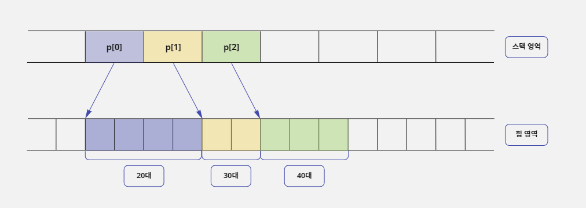

```c
#include <stdio.h>
#include <malloc.h>

void main() {
    // 연령별 인원수를 저장할 배열 - 사용자에게 입력 받음
    unsigned char limit_table[3];

    // 연령별 윗몸 일으키기 횟수를 저장할 배열
    unsigned char *p[3];
    int age, member, temp, sum;

    // 연령별로 윗몸 일으키기 횟수를 입력 받음
    for (age = 0; age < 3; age++) {
        // '20대 연령의 윗몸 일으키기 횟수'라고 출력하기 위해서 설정함
        printf("\n%d0대 연령의 윗몸 일으키기 횟수\n", age + 2);
        printf("이 연령대는 몇 명입니까 :");

        // 해당 연령에 소속된 인원수를 입력 받음
        scanf("%d", &temp);
        // scanf로 unsigned char 변수에 직접 정수를 받을 수 없어서
        // temp변수에 정수로 입력 받은 후 limit_table 배열에 넣어 줍니다
        limit_table[age] = (unsigned char) temp;

        // 입력 받은 인원수만큼 메모리를 할당함
        p[age] = (unsigned char *) malloc(limit_table[age]);

        // 해당 연령에 소속된 사람들을 순서대로 입력 받음
        for (member = 0; member < limit_table[age]; member++) {
            // '1th :, 2th :, ...'라고 출력하기 위해서 설정함
            printf("%dth :", member + 1);
            // 윗몸 일으키기 횟수를 정수로 입력 받음
            scanf("%d", &temp);
            // scanf로 unsigned char 변수에 직접 정수를 받을 수 없어서
            // temp 변수에 정수로 입력 받은 후에 *(p[age] + member)에 저장합니다
            *(p[age] + member) = (unsigned char) temp;
        }
    }

    printf("\n\n연령별 평균 윗몸 일으키기 횟수\n");
    // 연령별로 입력된 횟수를 합산하여 평균 값을 출력함
    for (age = 0; age < 3; age++) {
        sum = 0;

        // '20대 :, 30대 :, 40대 :'라고 출력하기 위해 설정함
        printf("%d0대 : ", age + 2);
        // 해당 연령에 소속된 사람들의 횟수를 합산함
        for (member = 0; member < limit_table[age]; member++) {
            sum = sum + *(p[age] + member);
        }
        // 합산 값을 인원수로 나누어서 평균을 냄
        printf("%5.2f\n", (double) sum / limit_table[age]);
        // 이 연령에 할당했던 동적 메모리를 해제함
        free(p[age]);
    }
}
```

```text
20대 연령의 윗몸 일으키기 횟수
이 연령대는 몇 명입니까 :4
1th :57
2th :61
3th :53
4th :59

30대 연령의 윗몸 일으키기 횟수
이 연령대는 몇 명입니까 :2
1th :49
2th :51

40대 연령의 윗몸 일으키기 횟수
이 연령대는 몇 명입니까 :3
1th :45
2th :37
3th :51


연령별 평균 윗몸 일으키기 횟수
20대 : 57.50
30대 : 50.00
40대 : 44.33
```

### 조건 추가 2: 직원의 연령층이 다양해진다면?

- 이렇게 되면 연령별 윗몸 일으키기 횟수를 저장할 포인터가 3개에서 4개 또는 5개로 변경될 수 있다는 뜻이 된다.
- 그리고 이 정보도 사용자에게 입력 받아서 처리할 수 있어야 하므로 연령층의 개수도 변수로 선언해서 사용해야 한다.
- 따라서 포인터 개수를 고정해서 만드는 포인터 배열은 이제 더 이상 사용할 수 없다.

#### 2차원 포인터를 사용하여 2차원 데이터 형식 만들기

```c
unsigned char *p_limit_table;  // 사용자가 연령층별로 입력한 인원수를 저장할 포인터
unsigned char **p;  // 1차원 포인터를 n개 선언할 2차원 포인터
int age_step = 3;  // 연령대의 개수, 10대, 20대, 30대
int age;

// 연령층별 인원수를 저장할 메모리를 동적으로 할당함
p_limit_table = (unsigned char *) malloc(age_step);
p_limit_table[0] = 4;  // 20대 4명
p_limit_table[1] = 2;  // 30대 2명
p_limit_table[2] = 3;  // 40대 3명

// 연령층별로 윗몸 일으키기 횟수를 저장할 포인터를 연령층 개수만큼 만듦
p = (unsigned char **) malloc(sizeof(unsigned char *) * age_step);

// 연령층별로 입력된 인원수만큼 동적으로 메모리를 할당함
for (age = 0; age < age_step; age++) {
    *(p + age) = (unsigned char *) malloc(*(p_limit_table + age));
}

// 프로그램이 끝나기 전에 동적 할당된 메모리를 정리함
for (age = 0; age < age_step; age++) free(*(p + age));
free(p);  // 동적 할당된 1차원 포인터 메모리를 해제함
free(p_limit_table);  // 연령별 인원수를 저장하기 위해 만든 메모리를 해제함
```

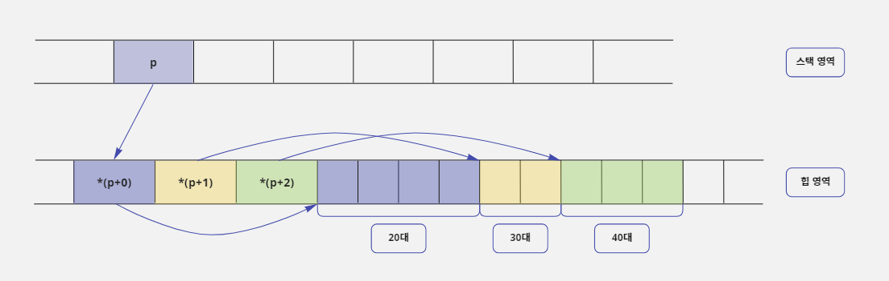

- 연령층의 개수가 사용자의 입력에 따라 달라질 수 있도록 만들어야 하기 때문에 연령층의 개수를 저장할 `age_step`변수를 추가했다.
- 그리고 연령층별 인원수를 관리하던 `p_limit_table`배열 크기는 더 이상 3(20대, 30대, 40대)으로 고정할 수 없기 때문에 `age_step`변수를 `malloc`함수에 사용하여 동적으로 메모리를 할당하도록 변경했다.
- 그리고 2차원 포인터 `p`도 연령층의 개수에 따라 만들어지는 1차원 포인터의 개수가 달라지기 때문에 `age_step`변수를 `malloc`함수에 사용하여 동적으로 메모리를 할당하도록 변경했다.
- 이와 같이 메모리를 구성하면 첫 예제에서 `unsigned char count[3][4];`라고 선언한 2차원 배열 구조와 같은 용도로 사용할 수 있도록 2차원 포인터로 메모리를 할당한 것이다.
- 이렇게 2차원 포인터를 사용하면 소스 코드는 좀 복잡해지더라도 프로그램이 훨씬 유연해진다.

```c
/* 2차원 포인터로 연령별 윗몸 일으키기 횟수 관리하기 */

#include <stdio.h>
#include <malloc.h>

void main() {
    // 연령별 인원수를 저장할 포인터 - 사용자에게 입력 받음
    unsigned char *p_limit_table;

    // 연령별 윗몸 일으키기 횟수를 저장할 2차원 포인터
    unsigned char **p;
    int age, age_step, member, temp, sum;

    printf("20대부터 시작해서 연령층이 몇 개인가요 :");
    scanf("%d", &age_step);

    // 연령별 인원수를 저장할 메모리를 만듦
    p_limit_table = (unsigned char *) malloc(age_step);
    p = (unsigned char **) malloc(sizeof(unsigned char *) * age_step);

    // 연령별로 윗몸 일으키기 횟수를 입력 받음
    for (age = 0; age < age_step; age++) {
        // '각 연령의 윗몸 일으키기 횟수'라고 출력함
        printf("\n%d0대 연령의 윗몸 일으키기 횟수\n", age + 2);
        printf("이 연령대는 몇 명입니까? :");
        // 해당 연령에 소속된 인원수를 입력 받음
        scanf("%d", &temp);

        // scanf로 unsigned char 변수에 직접 정수를 받을 수 없어서 temp변수에 정수로 입력 받은 후에
        // p_limit_table이 가리키는 메모리에 넣어 줍니다
        *(p_limit_table + age) = (unsigned char) temp;
        // 입력 받은 인원수만큼 메모리를 할당함
        *(p + age) = (unsigned char *) malloc(*(p_limit_table + age));

        // 해당 연령에 소속된 직원들을 순서대로 입력 받음
        for (member = 0; member < *(p_limit_table + age); member++) {
            // '1th :, 2th :, ...'라고 출력함
            printf("%dth :", member + 1);
            // 윗몸 일으키기 횟수를 정수로 입력 받음
            scanf("%d", &temp);
            // scanf로 unsigned char 변수에 직접 정수를 받을 수 없어서 temp변수에 정수로 입력 받은 후에
            // p가 가리키는 메모리에 넣어 줍니다
            *(*(p + age) + member) = (unsigned char) temp;
        }
    }

    printf("\n\n연령별 평균 윗몸 일으키기 횟수\n");
    // 연령별로 입력된 횟수를 합산하여 평균 값을 출력함
    for (age = 0; age < age_step; age++) {
        sum = 0;
        // '20대 :, 30대 :, 40대 :'라고 출력함
        printf("%d대 : ", age + 2);
        // 해당 연령에 소속된 사람들의 횟수를 합산함
        for (member = 0; member < *(p_limit_table + age);
             member++) {
            sum = sum + *(*(p + age) + member);
        }
        // 합산 값을 인원수로 나누어서 평균을 냄
        printf("%5.2f\n", (double) sum / *(p_limit_table + age));
        // 이 연령에 할당했던 동적 메모리를 해제함
        free(*(p + age));
    }

    // 윗몸 일으키기 횟수를 저장하기 위해서 구성했던 메모리를 해제함
    free(p);
    // 연령별 인원수를 기억하기 위해서 사용했던 메모리를 해제함
    free(p_limit_table);
}
```

```text
20대부터 시작해서 연령층이 몇 개인가요 :3

20대 연령의 윗몸 일으키기 횟수
이 연령대는 몇 명입니까? :4
1th :55
2th :51
3th :63
4th :59

30대 연령의 윗몸 일으키기 횟수
이 연령대는 몇 명입니까? :2
1th :43
2th :40

40대 연령의 윗몸 일으키기 횟수
이 연령대는 몇 명입니까? :3
1th :41
2th :35
3th :38


연령별 평균 윗몸 일으키기 횟수
2대 : 57.00
3대 : 41.50
4대 : 38.00
```

- 많은 프로그래머들이 2차원 포인터의 동적 할당 구조를 이해하는 것이 어려워서 사용하지 못하고 포기한다고 한다.
- 하지만 2차원 배열이나 포인터 배열을 사용하는 것보다 2차원 포인터를 이해하고 사용하면 프로그램을 훨씬 유연하게 만들 수 있으니 꼭 이해하고 넘어가자.
