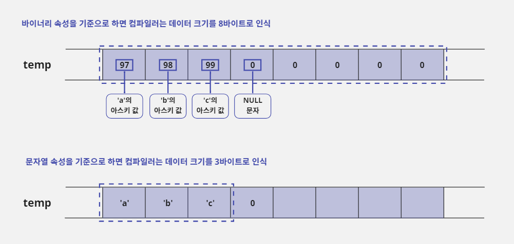
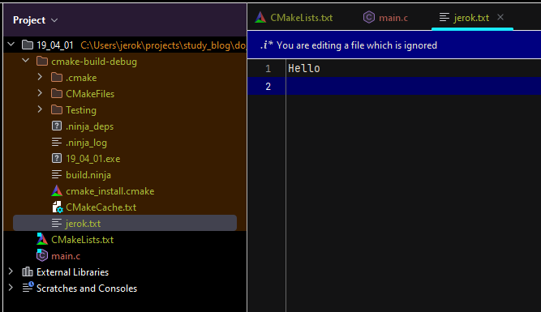
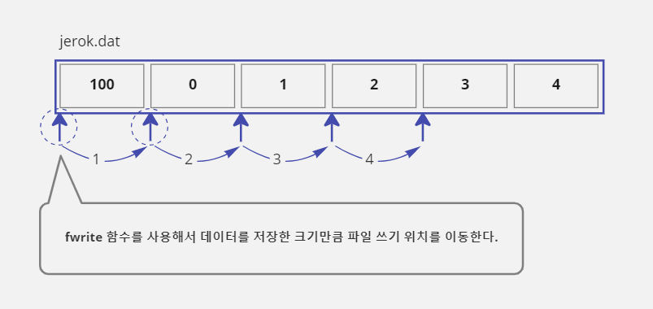

# 19. 파일 입출력

- 대부분의 프로그램은 사용자가 입력한 데이터를 계속 유지하기 위해 파일에 정보를 저장하는 기능을 제공하낟.
- 프로그램에서 사용하던 데이터를 어떻게 파일에 저장하는지, 그리고 저장된 파일에서 데이터를 어떻게 읽어 오는지에 대해 배워보자.

## 19-1. 표준 입출력 라이브러리

### 표준 입출력 라이브러리란?

- 컴퓨터의 주기억 장치인 램(RAM, Random Access Memory)은 컴퓨터의 전원이 켜져 있을 때만 데이터를 유지할 수 있다.
- 전원이 꺼져도 데이터를 유지할 수 있는 보조기억 장치(디스크, HDD, SSD)가 필요하다.
- 많은 프로그램이 사용자가 입력한 데이터를 보관하기 위해 보조기억 장치에 데이터를 저장하고 있다.
- 하지만 보조기억 장치의 종류가 너무 다양하기 때문에 프로그래머가 일일이 보조 기억 장치의 특성을 파악해서 프로그래밍한다는 것은 불가능하다.
- 그래서 운영체제는 보조기억 장치의 종류에 상관없이 같은 함수로 데이터를 저장할 수 있도록 파일 입출력 라이브러리를 제공하고 있다.
  <br><br>
- 그런데 파일 입출력 라이브러리도 운영체제에 따라 조금씩 차이가 있다.
- 운영체제별로 제공하는 입출력 함수는 이름뿐만 아니라 사용법도 다르다.
- 윈도우 환경에서 파일 입출력 프로그래밍을 하다가 리눅스 환경에서 작업하게 되면 파일 입출력을 다시 공부해야 할 정도로 운영체제에 따라 차이가 있다.
- 이런 문제를 해결하기 위해 C 언어는 '표준 입출력 라이브러리'(Standard I/O Library)를 제공한다.
- 이 라이브러리를 사용하면 보조기억 장치에 파일 단위로 데이터를 저장하거나 읽을 수 있다.
- 그리고 많은 운영체제에서 이 라이브러리를 제공하기 때문에 호환성이 높다.
- 따라서 이 방식으로 파일 입출력을 배우게 되면 운영체제에 상관없이 같은 이름의 함수로 보조기억 장치를 사용하는 프로그램을 개발할 수 있다.
  <br><br>
- 표준 입출력 라이브러리는 데이터의 형식에 따라 다른 함수를 제공한다.
- 프로그램이 사용하는 데이터 형식은 '텍스트(문자열)'와 '바이너리(이진)'로 나누어지는데, 자신이 다루는 데이터가 텍스트 형식이면 텍스트 관련 함수를 사용해야 하고, 바이너리 형식이면 바이너리 관련 함수를
  사용해야 한다.
- 그래서 자신이 사용할 데이터가 어떤 형식의 데이터인지 구별할 줄 알아야 한다.

## 19-2. 텍스트 파일과 바이너리 파일

### 바이너리 속성과 문자열 속성

- 프로그램이 사용하는 데이터 속성은 크게 두 가지로 나눌 수 있다.
- 데이터에 다른 의미를 부여하지 않고 숫자 그 자체로 보는 바이너리(Binary) 속성과 숫자를 아스키(ASCII) 값으로 변환해서 사용하는 문자열(String, Text) 속성이다.
- 예를 들어 97이라는 데이터를 단순히 숫자 97이 들어 있는 1바이트 크기의 정보라고 처리하는 것이 바이너리 속성이고, 아스키 값 'a'로 처리하는 것이 문자열 속성이다.
- 데이터를 이해하는 기준에 따라 97을 처리하는 방법이나 결과 값이 달라진다.
- 다음과 같이 배열로 선언한 크기가 8바이트인 `temp`변수가 있다.
- `temp`변수에는 `"abc"`문자열이 저장되어 있다.

```c
/* 마지막 ,(쉼표) 이후의 값은 모두 NULL 문자를 의미하는 아스키 값으로 0으로 초기화됨 */

char temp[8] = { 'a', 'b', 'c', 0, };
```

- 먼저 바이너리 속성을 기준으로 하면 `temp`변수를 8바이트 크기 데이터로 생각하고 그 데이터에는 8개의 아스키 값 `97`, `98`, `99`, `0`, `0`, `0`, `0`, `0`이 들어 있다고
  생각한다.
- 반면에 문자열 속성은 `temp`변수 크기에 별로 의미를 두지 않는다.
- 그 대신 `temp`변수에 저장된 값을 아스키 값으로 생각하고 `temp`변수에 저장된 값에서 `NULL`문자인 `0`(EOL, End Of Line)이 나올 때까지 찾는다.
- 즉 문자열 속성을 기준으로 할 때는 `temp`변수의 네 번째 요소에서 `0`을 찾ㄷ으면 데이터 크기가 3바이트고 데이터 내용은 `"abc"`라고 생각한다.



### 두 속성의 차이점 살펴보기

- 데이터 속성에 따라 사용하는 기준이 다르기 때문에 코드를 작성할 때 각 속성별로 사용하는 함수가 다를 수밖에 없다.

#### 변수에 저장된 데이터의 크기를 구할 때의 차이점

- 예를 들어 `temp`변수에 저장된 데이터의 크기를 구하는 경우에 바이너리 속성은 메모리의 크기를 구해야 변수의 크기를 구할 수 있기 때문에 `sizeof`연산자를 사용한다.

```c
int data_size = sizeof(temp);  // 변수 크기를 구함. data_size에는 값 8이 저장됨
```

- 반면에 문자열 속성은 `temp`변수에 저장된 문자열의 길이를 구하면 변수의 크기를 구할 수 있기 때문에 `string.h`에서 제공하는 `strlen`함수를 사용하여 문자열 길이를 구한다.

```c
int data_size = strlen(temp);  // 문자열 길이를 구함. data_size에는 값 3이 저장됨
```

#### 변수에 저장된 값을 다른 변수에 복사할 때의 차이점

- 바이너리 속성과 문자열 속성은 `temp`변수에 저장된 데이터를 다른 변수에 복사할 때도 서로 다른 함수를 사용한다.
- 바이너리 모드는 변수에 들어 있는 값을 그대로 복사하는 개념을 사용하기 때문에 `temp`변수의 값을 `dest`변수로 복사하려면 `memcpy`함수를 사용한다.
- 바이너리 속성은 `mem`으로 시작하는 함수를 사용한다.

```c
char temp[8] = {'a', 'b', 'c', 0,};
char dest[8];
memcpy(dest, temp, sizeof(temp));  // temp에서 dest로 8바이트 크기만큼 메모리를 복사함
```

- 반면에 문자열 속성은 `temp`변수에 저장되어 있는 문자열만 복사하면 되기 때문에 `strcpy`함수를 사용한다.
- 문자열 속성은 `str`로 시작하는 함수를 사용한다.

```c
char temp[8] = {'a', 'b', 'c', 0,};
char dest[8];
strcpy(dest, temp);  // temp에서 dest로 4바이트 크기(NULL 문자 0까지 포함)만큼 복사한다
/// 문자열을 복사할 때는 temp에 NULL 문자 0이 나올 때까지 복사하므로 strcpy 함수를 호출할 때 복사할 길이를 적지 않는다
```

- `memcpy`와 `strcpy`함수를 비교해 보면 `strcpy`가 더 간단하고 메모리를 복사하는 양도 적다.
- 그래서 프로그램 효율이 더 좋다고 오해하는 경우가 있다.
- 하지만 `memcpy`는 특별한 체크나 데이터 가공 없이 메모리를 그대로 복사하는 함수이고 `strcpy`는 내부적으로 문자를 하나 복사할 때마다 문자열이 끝이 났는지 제대로 된 문자인지를 계속 체크하면서
  복사하는 함수이다.
- 따라서 `memcpy`함수가 `strcpy`함수보다 더 빠르게 동작할 수밖에 없다.
- 결론적으로 어떤 속성을 사용할지를 결정하면 그에 맞는 함수를 사용해서 프로그래밍해야 원하는 결과를 얻을 수 있다.
- 그리고 어떤 속성을 사용하든지 데이터 자체가 변경되는 것이 아니라 데이터를 해석하는 개념이 달라지기 때문에 프로그램 개발 상황에 맞게 잘 판단해서 사용하면 된다.

### 바이너리 파일과 텍스트 파일

- 바이너리 속성 개념이 적용된 파일을 바이너리(Binary) 파일이라고 하며, 문자열 속성이 적용된 파일을 텍스트(Text) 파일이라고 한다.
- 보통 이미지 파일, 음악 파일, 동영상 파일, 실행 파일은 바이너리 파일로 구성되고 간단한 문서 파일이나 프로그램에서 사용하는 소스 파일은 텍스트 파일로 구성된다.
- 대부분의 프로그램이 바이너리 파일을 더 많이 사용하고 있다.
- 그 이유는 텍스트 파일보다 저장 방식이나 처리 효율이 더 좋기 때문이다.
- 그런데도 텍스트 파일이 공존하는 이유는 무엇일까?
- 바이너리 파일은 해당 파일을 사용할 수 있는 프로그램이 설치되어 있어야 제대로 사용할 수 있기 때문이다.
- 소스 파일과 같이 텍스트로 되어 있는 파일은 아스키라는 표준으로 파일이 이루어져 있기 때문에 시스템에 특별한 프로그램이 설치되어 있지 않아도 텍스트 파일에 적힌 문자열을 확인할 수 있다.

## 19-3. 파일 열기와 닫기

### 파일 입출력 함수의 도우미! FILE 구조체

- 표준 입출력 라이브러리를 사용하여 파일에 데이터를 저장하거나 읽는 방법에 대해 알아보자.
- 표준 입출력 라이브러리는 'FILE 구조체'로 포인터 변수를 선언하고 파일 입출력 함수를 호출할 때마다 이 변수를 넘겨주도록 만들어져 있다.
- FILE 구조체는 사용하려는 디스크(DISK)상의 파일이 어떤 상태로 사용 중인지에 대한 정보를 담고 있으며, 파일을 좀 더 편하게 사용할 수 있도록 도와준다.

```c
FILE *p_file;

// 파일 열기 생략
fseek(p_file, 0, SEEK_SET);
```

- FILE 구조체의 기본형은 `FILE *변수 이름`형태이다.
- 이렇게 'FILE 구조체로 선언한 포인터 변수'를 줄여서 '파일 포인터'라고 한다.
- 위와 같은 방법으로 `fseek`함수를 호출하면, 프로그램에서 파일을 사용하며 기억해야 할 내부 상태 값을 `p_file`파일 포인터에 저장한다.
- 즉 프로그래머가 파일 처리에 관련된 내부 정보를 몰라도 파일 포인터만 넘겨주면 파일 입출력 함수가 알아서 처리하도록 만들어져 있다.

> #### FILE 구조체의 내부는 어떤 모습일까
>
> - FILE 구조체는 `stdio.h`파일에 다음과 같이 선언되어 있다.
> - 사실 FILE 구조체를 사용하지 않더라도 C 언어의 표준 입출력 라이브러리에서 제공하는 파일 입출력 함수들을 사용하면 구조체의 요소들을 직접 관리할 수 있다.
> - 하지만 FILE 구조체를 사용하는 표준 입출력 함수가 주기억 장치(램)에 비해 속도가 느린 보조기억 장(하드디스크)의 단점을 보완하기 때문에 나같은 초보 프로그래머가 사용하기에 좋다.
> - 그리고 이런 기술은 표준 입출력 함수의 내부에서 이루어지는 것이라서 이 함수들이 사용하는 FILE 구조체의 요소들을 모두 이해할 필요는 없다.
>
> ```c
> struct _iobuf {
>     char *_ptr;
>     int  _cnt;
>     char *_base;
>     int  _flag;
>     int  _file;
>     int  _charbuf;
>     int  _bufsiz;
>     char *_tmpfname;
> };
> 
> typedef struct _iobuf FILE;
> ```

### 파일 열기: fopen 함수

- 파일 열기를 할 때는 사용할 '파일 이름'과 '파일을 어떤 형식으로 사용할 것인지'를 먼저 결정하고 `fopen`함수를 사용하면 된다.
- `fopen`함수는 이 두 가지 정보를 문자열 형식이 매개변수로 받아서 처리한다.

```c
함수 원형: FILE *fopen(const char *filename, const char *mode);
함수 사용 형식: fopen(사용할 파일 이름, 파일 사용 형식)
```

- 파일을 성공적으로 열면 `FILE *`형식의 메모리 주소 값을 반환한다.
- 만약 파일이 존재하지 않거나 파일 형식을 잘못 사용해서 파일 열기에 실패하면 `NULL`값을 반환한다.

```c
// 프로그램 작업 경로에 해당 파일이 있는 경우에 읽기 모드(r)로 jerok.dat 파일을 연다
FILE *p_file = fopen("jerok.dat", "r");

if (NULL != p_file) {
// 파일 열기에 성공한 경우
} else {
// 파일 열기에 실패한 경우
}
```

- `fopen`함수에 사용할 파일 이름은 문자열로 지정해야 하며 시스템은 프로그램의 작업 경로(Working Directory, 파일이 실행된 경로)에서 해당 파일을 찾게 된다.
- 예를 들어 `c:\temp` 경로에서 `exam.exe`파일을 실행했다면 `exam`프로그램의 작업 경로는 `c:\temp`이다.
- 그리고 이 작업 경로에서 `fopen`함수에 사용한 `jerok.dat`파일을 찾게 된다.
- 즉 `c:\temp\jerok.dat`경로에서 파일을 찾는다.
- 그런데 만약 사용할 파일이 현재 작업 경로에 없다면 파일 이름을 표기할 때 경로까지 같이 표기해 주면 된다.
- 현재 작업 경로가 `c:\temp`인데 자신이 사용할 `tips.dat`파일이 `c:\jerok`경로에 있다면 `"c:\\jerok\\jerok.dat"`라고 표기하면 된다.

```c
// 프로그램 작업 경로에 해당 파일이 없는 경우에 절대 경로를 사용하여 읽기 모드로 jerok.dat 파일을 연다
FILE *p_file = fopen("c:\\jerok\\jerok.dat", "r");

if (NULL != p_file) {
// 파일 열기에 성공한 경우
} else {
// 파일 열기에 실패한 경우
}
```

### 파일 사용 형식 알아보기

- 파일 사용 형식이란 파일을 어떻게 사용할 것인지 지정하는 형식을 말한다.
- 즉 '파일 읽기'를 할 것인지, '파일 쓰기'를 할 것인지를 정하는 것이다.
- 파일 사용 형식은 `fopen`함수의 두 번째 매개변수인 문자열 형식으로 지정한다.

> #### 파일 입출력은 반드시 정해진 형식을 지켜야 한다
>
> - 파일을 어떤 형식으로 사용할 것인지를 결정하는 작업은 표준 입출력 라이브러리가 정한 형식을 따라야 한다.
> - 따라서 정해 놓은 규칙을 지키지 않거나 자신이 사용할 파일에 다른 프로그램이 제한을 걸어 놓았다면 파일 열기에 실패할 수 있다.
> - 예를 들어 A 프로그램이 `jerok.dat`파일에 쓰기 금지 모드를 설정해 놓고 있는데 B 프로그램이 `jerok.dat`파일을 쓰기 모드로 열려고 시도하면 파일 열기에 실패한다는 뜻이다

- 먼저 파일이 다루는 속성에 따라 기본적으로 나누어지는 형식을 알아보자.
- 이 두 가지 형식은 단독으로 쓸 수는 없고 뒤에 배우게 될 다른 형식들과 함께 써야 한다.

| 형식  | 설명                                                                                                                                                                                                                                                  |
|:---:|-----------------------------------------------------------------------------------------------------------------------------------------------------------------------------------------------------------------------------------------------------|
|  t  | - 텍스트 속성으로 파일을 사용하겠다는 뜻이다.<br>- 만약 이 형식으로 바이너리 파일을 열면 파일 열기는 성공하겠지만 파일 입출력 함수를 사용하면 오류가 발생한다.<br>- 그 이유는 바이너리 파일은 파일의 실제 크기를 사용하고 텍스트 파일은 EOF(파일의 끝, End Of File)라는 아스키 값을 사용해서 파일의 끝을 구별하기 때문이다.<br>- 그래서 바이너리 파일을 텍스트 속성으로 열면 파일의 끝을 찾는데 문제가 생긴다. |
|  b  | - 바이너리 속성의 파일을 사용한다는 뜻이다.<br>- 이 형식이 기본값이기 때문에 형식을 지정할 때 `t`또는 `b`를 포함하고 있지 않다면 기본적으로 이 형식을 사용한다고 보면 된다.                                                                                                                                            |

#### 파일 내용 읽기 모드 "r"

- 이 형식을 사용하면 파일의 내용을 읽기(Read) 위한 목적으로 파일을 연다.
- 이 형식을 지정하여 `fopen`함수를 사용했는데 파일이 없으면 파일 열기에 실패하고 `NULL`값을 반환한다.
- 바이너리 파일을 여는 경우에 다음과 같이 `"rb"`를 사용한다.

```c
FILE *p_file = fopen("jerok.dat", "rb");  // "rb" 대신 "r"만 사용해도 됨
```

- 텍스트 파일을 열 때는 다음과 같이 `"rt"`를 사용한다.

```c
FILE *p_file = fopen("jerok.txt", "rt");
```

#### 파일에 데이터 쓰기 모드 "w"

- 이 형식을 사용하면 파일에 데이터를 쓰기(Write) 위한 목적으로 파일을 연다.
- 만약 `fopen`함수에 명시한 파일이 작업 경로에 없다면 그 이름으로 파일을 만든 후에 파일을 열기 때문에 `"w"`형식을 사용하면 파일 열기에 실패하지 않는다.
- 하지만 같은 이름을 가진 파일이 이미 존재하는 경우에는 파일을 열면서 그 파일이 가지고 있던 내용을 모두 지우고 시작하기 때문에 주의해야 한다.
- 바이너리 파일을 여는 경우에 다음과 같이 `"wb"`를 사용한다.

```c
FILE *p_file = fopen("jerok.dat", "wb");  // "wb" 대신 "w"만 사용해도 됨
```

- 텍스트 파일을 열 때는 다음과 같이 `"wt"`를 사용한다.

```c
FILE *p_file = fopen("jerok.dat", "wt");
```

- 그런데 쓰기 모드 형식을 제대로 사용해도 디스크(Disk)에 용량이 부족해서 파일을 만들 수 없거나, CD와 같이 읽기 전용 디스크에 쓰기 모드로 사용하면 파일 열기에 실패한다.

#### 파일에 데이터 이어 쓰기 모드 "a"

- 이 형식을 사용하면 파일에 데이터를 확장(Append, 이어 쓰기)하기 위한 목적으로 파일을 연다.
- 만약 `fopen`함수에 명시한 파일이 작업 경로에 없다면 그 이름으로 파일을 만든 후에 파일을 열기 때문에 `"a"`형식을 사용하면 파일 열기에 실패하지 않는다.
- 하지만 `"w"`속성과 달리 기존에 파일이 존재하더라도 파일 내용을 지우지 않고 기존 파일 내용에 이어 쓰기를 한다.
- 바이너리 파일을 여는 경우에 다음과 같이 `"ab"`를 사용한다.

```c
FILE *p_file = fopen("jerok.dat", "ab");  // "ab" 대신 "a"만 사용해도 됨
```

- 텍스트 파일을 열 때는 다음과 같이 "at"를 사용한다.

```c
FILE *p_file = fopen("jerok.dat", "at");
```

- 이 형식도 디스크에 용량이 부족하거나 읽기 전용 디스크에 사용하면 파일 읽기에 실패한다.

### 파일 사용 형식에서 읽기와 쓰기를 같이 사용하기

#### 읽기 강조 "r+"

- 읽기와 쓰기를 같이 사용할 때 '읽기'를 더 강조하는 형식이다.
- 이 형식으로 파일을 여는 경우 기존 파일이 없으면 파일을 새로 만들지 않고 파일 읽기에 실패한다.
- 기존 파일이 있는 경우에는 해당 파일의 내용을 지우지는 않지만 기존 데이터의 위치로 이동해서 해당 위치의 내용을 덮어쓸 수 있다.
- 이 형식을 바이너리 파일에 사용하는 경우에 `"r+"`, `"rb+"`또는 `"r+b"`라고 쓰며, 텍스트 파일에 사용하는 경우에는 `"rt+"`또는 `"r+t"`라고 쓴다.

#### 쓰기 강조 "w+"

- 읽기와 쓰기를 같이 사용할 때 '쓰기'를 더 강조하는 형식이다.
- 이 형식으로 파일을 여는 경우 기존 파일이 없으면 파일을 새로 만들고, 파일이 이미 존재하면 기존 파일의 내용을 모두 지우고 시작한다.
- 이 형식을 바이너리 파일에 사용하는 경우에 `"w+"`, `"wb+"`또는 `"w+b"`라고 쓸 수 있으며 텍스트 파일에 사용하는 경우에는 `"wt+"`또는 `"w+t"`라고 쓴다.

#### 읽기와 이어 쓰기를 같이 사용하기 "a+"

- 읽기 모드와 이어 쓰기 모드를 같이 사용해야 하는 경우에 사용하며 '확장'을 더 강조하는 형식이다.
- 확장을 더 강조한다는 뜻은 이 형식으로 파일을 여는 경우에 기존 파일이 없으면 파일을 새로 만들고 파일이 존재하면 파일의 내용을 지우지 않고 기존 내용에 이어서 시작한다는 뜻이다.
- 하지만 `"r+"`와 달리 기존 데이터 위치로 이동할 수 있고 읽기도 가능하지만 쓰기를 사용하면 현재 위치와 상관없이 파일의 끝에 내용이 추가된다.
- 이 형식을 바이너리 파일에 사용하는 경우에 `"a+"`, `"ab+"`또는 `"a+b"`라고 쓸 수 있으며 텍스트 파일에 사용하는 경우에는 `"at+"`또는 `"a+t"`라고 쓴다.
- `"r+"`모드처럼 기존 데이터 위치로 이동하거나 읽는 것은 가능하다.
- 읽기나 쓰기를 같이 사용하려면 `"r+"`나 `"w+"`와 같이 적어야 하는데 `"rw"`라고 적기도 한다.
- 하지만 `"rw"`는 표준이 아니기 때문에 컴파일러에 따라 `"r+"`나 `"w+"`로 자동 변환하거나 `fopen`함수의 실행이 실패한다.
- 따라서 가능하면 위에 나열한 형식 중 하나를 선택해서 사용하는 것이 좋다.

### 파일 닫기: fclose 함수

- 이렇게 `fopen`함수를 사용하여 파일을 열어서 사용하다가 사용이 끝나면 `fclose`함수를 사용하여 파일을 닫아야 한다.
- 만약 파일을 열어 놓고 파일을 닫지 않으면 파일의 내용이 지워지거나 파일을 사용할 수 없는 상태가 될 수 있으니 주의하자.
- 그리고 파일을 열지 않은 상태에서 파일 닫기를 시도하거나 이미 닫은 `FILE *`주소(파일 포인터 주소)로 파일 닫기를 다시 시도하면 프로그램 실행에 오류가 발생할 수 있으니 이 또한 주의하자.

```c
FILE *p_file = fopen("jerok.dat", "r+b");  // 읽기+쓰기 모드로 바이너리 파일을 오픈함

if(NULL != p_file) {  // 파일 열기에 성공한 경우
    fclose(p_file);  // 파일을 닫음
} else {
    // 파일 열기에 실패한 경우
}
```

## 19-4. 텍스트 파일에 데이터 읽고 쓰기

### 텍스트 파일에 문자열 저장하기: fprintf 함수(1)

- 텍스트 파일에 데이터를 읽고 쓰는 개념은 콘솔에서 문자열을 입력 또는 출력하는 개념과 비슷하기 때문에 매우 쉽다.
- 모니터 화면에 문자 또는 숫자를 출력하고 싶으면 `printf`함수를 사용한다.
- 파일 입출력 함수에는 `print`함수와 모든 기능이 비슷하고 이름까지 비슷한 `fprintf`함수가 있다.
- `fprintf`함수는 첫 매개변수에 파일 포인터를 받아서 출력할 문자열을 파일에 저장한다.
- 예를 들어 화면에 `abc`문자열을 출력하고 싶으면 `printf("abc");`라고 사용하지만 파일에 `abc`문자열을 저장하고 싶다면 `fprintf(파일 포인터, "abc");`라고 사용한다.

```c
함수 원형: int fprintf(FILE *stream, const char *format [, argument ] ... );
함수 사용 형식: fprintf(파일 포인터, 파일에 입력할 문자열 형식, 출력할 값들, ... )
```

- 다음은 파일 포인터가 가리키는 파일에 `Hello`문자열을 출력하고 줄을 바꾸는 코드이다.

```c
fprintf(p_file, "Hello\n");  // 파일에 "Hello" 문자열을 쓰고 줄 바꿈을 함
```

- `fprintf`함수를 사용해서 파일에 문자열을 출력하는 예제를 하나 만들어 보자.
- 다음은 `jerok.txt`파일에 `Hello`문자열을 저장하는 예제이다.
- 그리고 `fopen`함수에서 파일 사용 형식에 `"w"`가 있을 경우에 첫 번째 매개변수로 넘겨준 파일(`jerok.txt`)이 없으면 파일을 만들어서 사용하고 파일이 존재하면 덮어쓰기를 한다.
- 파일에 문자열을 출력한다는 것은 문자열을 저장한다는 뜻과 같다.

```c
#include <stdio.h>

void main() {
    FILE *p_file = fopen("jerok.txt", "wt");  // 쓰기 모드로 텍스트 파일을 오픈함
    if (NULL != p_file) {                          // 파일 열기에 성공한 경우
        fprintf(p_file, "Hello\n");  // 파일에 "Hello" 문자열을 쓰고 줄 바꿈을 함 
        fclose(p_file);                       // 파일을 닫음
    }
}
```

```text
Hello
```



- 위와 같이 `jerok.txt`파일이 생성되고 파일 안에 `Hello`라는 문자열이 저장된 것을 볼 수 있다.

### 바이너리 형태를 문자열 형태로 저장하기: fprintf 함수(2)

- `int`형 변수에 들어 있는 값은 바이너리 데이터이기 때문에 텍스트 파일에 저장하려면 문자열 형식으로 변환해서 저장해야 한다.
- `fprintf`함수는 `printf`함수와 마찬가지로 변수 값을 문자열로 출력할 수 있다.
- 따라서 표준 입출력 함수에서 제공하는 `%d`, `%f`같은 형식 지정 키워드를 사용해 파일에 문자열 형태로 저장한다.
- 다음처럼 코드를 작성하면 별도의 변환 작업 없이 `data`변수의 값을 파일에 저장할 수 있다.

```c
short int data = 0x0412;
fprint(p_file, "%x\n", data);  // 파일에 "412"라고 저장하고 줄 바꿈을 함
```

- `fprintf`함수는 호출될 때마다 자신이 파일에 저장한 문자열의 개수만큼 파일 포인터를 이동시킨다.
- 즉 파일의 현재 사용 상태를 가리키는 정보 중에서 '파일 내부 데이터를 읽거나 쓰기 시작하는 위치'가 문자열의 개수만큼 이동한다는 뜻이다.
- 따라서 연속적으로 `fprintf`함수를 호출하면 문자열이 차례대로 각 파일에 저장된다.

```c
short int data = 0x0412;
fprintf(p_file, "Hello\n");     // 파일에 "Hello" 문자열을 쓰고 줄 바꿈을 함
fprintf(p_file, "%x\n", data);  // 파일에 "412" 문자열을 저장하고 줄 바꿈을 함
```

### 텍스트 파일에서 문자열 읽기: fscanf 함수

- 텍스트 파일에서 문자열을 얻으려면 `fscanf`함수를 사용하면 된다.
- 이 함수는 키보드로 문자 또는 숫자를 입력 받는 `scanf`함수와 비슷하지만 첫 번째 매개변수에 어떤 파일에서 입력 값을 가져올 것인지를 명시하는 점이 다르다.

```c
함수 원형: int fscanf(FILE *stream, const char *format [, argument ] ... );
함수 사용 형식: fscanf(파일 포인터, 파일에서 데이터를 입력 받을 형식, 입력 받을 변수 목록);
```

- 아래는 파일에 저장된 문자열을 읽어 10진 정수 값으로 변환하여 `data`변수에 대입하는 코드이다.

```c
int data;
fscanf(p_file, "%d", &data);
```

- 파일에 저장된 문자열을 `fscanf`함수로 읽어 오는 예제에 사용하기 위해 아래 이미지 처럼 `jerok.txt`파일을 만들었다.
- 이 파일은 예제 소스 파일과 같은 경로에 있어야 프로그램이 정상적으로 수행되기 때문에 경로에 주의하자.

```c
#include <stdio.h>

void main() {
    int num1, num2, num3;

    FILE *p_file = fopen("jerok.txt", "rt");  // 읽기 모드로 텍스트 파일을 오픈함

    if (NULL != p_file) {  // 파일 열기에 성공한 경우
        // num1에 412, num2에 100, num3에 123 값을 저장함
        fscanf(p_file, "%d %d %d", &num1, &num2, &num3);
        // 파일에서 읽은 값을 화면에 출력함
        printf("%d %d %d\n", num1, num2, num3);
        fclose(p_file);  // 파일을 닫음
    }
}
```

```c
#include <stdio.h>

void main() {
    int num;
    
    FILE *p_file = fopen("jerok.txt", "rt");  // 읽기 모드로 텍스트 파일을 오픈함
    
    if(NULL != p_file) {  // 파일 열기에 성공한 경우
        /// 텍스트 파일의 끝은 EOF(End Of File) 문자로 구별하는데 fscanf 함수가 EOF 문자를 만나면 EOF값을 반환한다
        /// 따라서 EOF를 반환할 때까지 반복하면서 숫자 값을 읽어온다
        while(EOF != fscanf(p_file, "%d", &num)) {
            printf("%d\n", num);
        }
        fclose(p_file);
    }
}
```

#### fscanf 함수로 문자열을 읽을 때 주의 사항

- `fscanf`함수는 기본적으로 공백(Space) 문자를 만나면 다음 입력이 시작된 것으로 처리한다.
- `fscanf`함수를 사용했을때 한 줄씩 출력될 것으로 예상했지만, 공백으로 입력을 구별하는 `fscanf`함수의 특성 때문에 예상과 다른 결과를 볼 수 있다.

```c
#include <stdio.h>

void main() {
    char temp[64];  // 파일에서 문자열을 입력 받을 배열 변수

    FILE *p_file = fopen("jerok.txt", "rt");  // 읽기 모드로 텍스트 파일 오픈함

    if (NULL != p_file) {  // 파일 열기에 성공한 경우
        while (EOF != fscanf(p_file, "%s", temp)) {  // temp는 &temp[0]과 같다
            // 파일에서 읽은 문자열을 화면에 출력함
            printf("%s\n", temp);
        }
        fclose(p_file);  // 파일을 닫음
    }
}
```

```text
Hello,
Jerok
Text
file
input
```

### 텍스트 파일에서 한 줄 단위로 문자열 읽기: fgets 함수

- `fscanf`함수는 문자열 사이에 공백이 있기 때문에 한 줄 단위로 입력 받지 못하고 단어 단위로 파일에서 읽어온다.
- 따라서 텍스트 파일에서 한 줄 단위로 문자열을 처리하고 싶은 경우에는 `fgets`함수를 사용한다.
- 이 함수는 `gets`함수와 비슷하며 함수의 세 번째 매개변수에 어떤 파일에서 입력 값을 가져올 것인지 파일 포인터를 표기하면 된다.

```c
함수 원형: char *fgets(char *string, int n, FILE *stream);
함수 사용 형식: fgets(파일에서 읽은 문자열을 저장할 메모리의 주소, 첫 번째 매개변수로 사용한 메모리의 크기, 파일 포인터);
```

- 아래는 텍스트 파일에서 문자열 한 줄을 읽어 와서 `temp`배열에 저장하는 코드이다.

```c
char temp[64];
fgets(temp, sizeof(temp), p_file);
```

- `fgets`함수를 사용하여 `jerok.txt`파일을 읽으면 어떻게 되는지 확인해 보자.

```c
#include <stdio.h>

void main() {
    char temp[64];  // 파일에서 문자열을 입력 받을 배열 변수

    FILE *p_file = fopen("jerok.txt", "rt");  // 읽기 모드로 텍스트 파일을 오픈함

    if (NULL != p_file) {  // 파일 열기에 성공한 경우

        /// fgets 함수의 두 번째 매개변수는 첫 번째 매개변수에 사용되는 메모리의 크기를 표기한다
        while (NULL != fgets(temp, sizeof(temp), p_file)) {

            /// 파일에서 읽은 문자열을 화면에 출력한다.
            /// fgets 함수는 fscanf 함수와 달리 줄의 끝에 있는 \n도 읽어서 temp 배열 마지막에 넣어 주기 때문에
            /// printf 함수를 사용할 때 \n을 적지 않는다.
            printf("%s", temp);
        }
        
        fclose(p_file);
    }
}
```

```text
Hello, Jerok
Test file input
```

- 출력 결과를 비교해 보면 알 수 있듯이 `fscanf`함수는 줄 바꿈뿐만 아니라 공백 문자 입력도 구별한다.
- 하지만 `fgets`함수는 입력이 구분을 줄 바꿈으로만 판단하기 때문에 파일에 저장된 문자열을 한 줄 단위로 읽어 온다.
- 그 외에도 `fscanf`함수는 EOF 문자를 만나면 EOF를 반환하지만 `fgets`함수는 EOF 문자를 만나면 `NULL`을 반환한다.
- 그리고 `fscanf`함수는 읽은 문자열에서 `\n`을 제외하는데 `fgets`함수는 `\n`을 문자열에 포함한다는 것이 다르다.

## 19-5. 바이너리 파일에 데이터 읽고 쓰기

### 문자열 속성과 바이너리 속성의 차이점

- 문자열 속성은 문자열에 포함된 `NULL`문자 0을 찾아서 데이터 크기를 체크하기 때문에 문자열 길이를 추가로 적을 필요가 없다.
- 예를 들어 `abc`문자열이 있으면 a, b, c다음에 `NULL`문자인 0이 있으므로 문자열을 체크하여 데이터 크기가 3이라는 것을 알 수 있다.
- 하지만 바이너리 속성은 데이터를 그냥 숫자로만 판단하기 때문에 표준 입출력 함수가 데이터를 분석해서 길이나 크기를 알아낼 수 없다.
- 따라서 바이너리 속성으로 데이터를 읽거나 쓰려면 반드시 프로그래머가 직접 크기를 적어주어야 한다.
- 이런 특성은 바이너리 속성을 사용하는 바이너리 파일에서도 마찬가지로 적용된다.
- 따라서 바이너리와 관련된 파일 입출력 함수는 대부분 데이터 크기를 적도록 되어 있다.

### 바이너리 파일에 데이터 저장하기: fwrite 함수

- `fwrite`함수는 다음과 같은 형식으로 호출해서 데이터를 저장한다.

```c
함수 원형: size_t fwrite(const void *buffer, size_t size, size_t count, FILE *stream);
사용 형식: fwrite(저장할 데이터의 시작 주소, 저장할 데이터의 기준 단위 크기, 반복 횟수, 파일 포인터);
```

- 예를 들어 `int`형 변수 `data`에 저장되어 있는 16진수 값을 파일에 저장하고 싶다면 다음과 같이 코드를 구성하면 된다.

```c
int data = 0x00000412;

// data 변수가 할당된 메모리를 4바이트 크기만큼 1회만 p_file 포인터가 가리키는 파일에 저장함
fwrite(&data, sizeof(int), 1, p_file);
```

- 이렇게 `fwrite`를 사용하면 `p_file`파일 포인터가 가리키는 바이너리 파일에 `data`변수의 값이 4바이트 크기로 복사된다.
- `fwrite`함수는 저장할 데이터의 시작 주소부터 데이터의 기준 단위 크기로 반복 횟수만큼 파일에 데이터를 쓰게 된다.
- 따라서 실제로 파일에 저장되는 크기는 '기준 단위 크기 x 반복 횟수'이다.
- 따라서 앞의 예시에서 4바이트가 저장된 이유는 `fwrite`함수를 호출할 때 사용한 두 번째와 세 번째 매개변수를 곱한 크기만큼 데이터가 저장되기 때문이다.
- 즉 데이터가 `sizeof(int) x 1`크기로 저장된다.
- `fwrite`함수를 사용해서 바이너리 파일에 `int`형으로 만든 변수의 값을 저장하는 예제를 만들어 보자.
- 다음은 `jerok.dat`파일을 바이너리 속성으로 열어서 `data`변수에 `0x00000412`값을 저장하는 예제이다.

```c
#include <stdio.h>

void main() {
    int data = 0x00000412;

    FILE *p_file = fopen("jerok.dat", "wb");  // 쓰기 모드로 바이너리 파일을 오픈함

    if (NULL != p_file) {  // 파일 열기에 성공한 경우

        /// data의 시작 주소부터 4바이트 크기만큼 한 번만 p_file 파일 포인터가 가리키는 파일에 저장한다.
        fwrite(&data, sizeof(int), 1, p_file);
        fclose(p_file);  // 파일을 닫음
    }
}
```

- 위의 예제를 실행했을 때 소스 파일이 있는 경로에 `jerok.dat`파일이 없다면 파일이 새로 만들어지고, `jerok.dat`파일이 있다면 내용이 전부 지워진 채로 열릴 것이다.
- 하지만 이 파일이 바이너리 파일이기 때문에 `0x00000412`값이 제대로 저장되었는지 확인하기 어렵다.
- 뒤에서 배우게 될 `fread`함수를 사용하면 작성한 프로그램으로 값이 제대로 저장되었는지 확인할 수 있다.

#### fwrite 함수의 세 번째 매개변수 '반복 횟수'의 용도

- `fwrite`함수를 사용하여 `int`형 배열의 내용을 파일에 저장하고 싶다면 다음과 같이 사용한다.

```c
int data[5] = {0, 1, 2, 3, 4};

// data 배열의 시작 주소부터 4바이트 단위로 5회 반복해서 파일에 저장함
fwrite(data, sizeof(int), 5, p_file);
```

- 위 코드에서 `data`는 `&data[0]`의 줄임 표현이다.
- 즉 `data`배열의 시작 주소를 의미한다.
- 위 예제에서 배열로 선언한 `data`변수는 `int`크기의 변수 5개를 의미한다.
- 따라서 `fwrite`함수를 사용할 때 두 번째 매개변수에는 `int`형 크기를 적고, 세 번째 매개변수에는 5번 반복을 의미하는 값 5를 적었다.
- 하지만 `fwrite`함수를 사용해서 배열을 저장한다고 해서 저장할 크기를 반드시 '단위 크기'와 '반복 횟수'로 나누어야 하는 것은 아니다.
- 다음과 같이 사용하는 경우가 더 많다.

```c
fwrite(data, sizeof(int) * 5, 1, p_file);
```

- 단위 크기를 `sizeof(int)`, 반복 횟수를 5라고 적은 경우는 배열 요소에 의미를 더 부여한 것이고, 단위 크기를 `sizeof(int) * 5`, 반복 횟수를 1이라고 적은 것은 20바이트 메모리라는
  것을 더 강조하는 형태이다.
- 그렇지 않고 배열의 크기를 사용해서 다음과 같이 적기도 한다.
- `sizeof(data)`를 사용하면 `data`배열의 크기를 의미하기 때문에 20으로 번역된다.

```c
fwrite(data, sizeof(data), 1, p_file);
```

#### fwrite 함수의 작업이 실패할 때도 있다

- `fwrite`함수는 반드시 작업에 성공하는 함수가 아니다.
- 디스크 용량이나 파일 속성(쓰기 제한) 때문에 실패할 수 있다.
- 따라서 `fwrite`함수의 반환값을 체크해서 파일에 데이터를 제대로 저장했는지 확인해야 한다.
- `fwrite`함수가 작업에 성공하면 실제로 반복한 횟수를 반환하기 때문에 이 값을 체크하여 오류를 처리하는 것이 좋다.

```c
if(5 == fwrite(&data, sizeof(int), 5, p_file)) {
    // 쓰기에 성공한 경우 수행할 명령문
}
```

- `fwrite`함수를 사용해서 데이터를 저장하면 파일 포인터가 가리키는 정보 중에서 '파일 내부 데이터를 읽거나 쓰기 시작하는 위치'가 데이터를 저장한(단위 크기 x 횟수) 크기만큼 자동으로 증가한다.
- 따라서 파일에 데이터를 저장한 만큼 이동하는 함수를 추가로 사용할 필요가 없다.
- 즉 현재 열어 놓은 파일의 내부 위치를 이동시키는 작업을 하지 않고 나열식으로 `fwrite`함수를 사용하더라도 같은 위치에 계속 데이터를 덮어쓰지 않고 순차적으로 저장된다.
- 파일 포인터는 파일의 현재 사용 상태를 나타내는 메모리의 주소를 가지고 있다.
- 예를 들어 다음 예제처럼 나열식으로 `fwrite`함수를 사용하면 바이너리 파일에는 4바이트 크기로 100값이 저장되고 그 다음 위치에 20바이트만큼 0, 1, 2, 3, 4값이 저장된다.

```c
#include <stdio.h>

void main() {
    int data = 100, data_list[5] = {0, 1, 2, 3, 4};

    FILE *p_file = fopen("jerok.dat", "wb");  // 쓰기 모드로 바이너리 파일을 오픈함

    if (NULL != p_file) {  // 파일 열기에 성공한 경우
        fwrite(&data, sizeof(int), 1, p_file);
        fwrite(data_list, sizeof(int), 5, p_file);
        fclose(p_file);  // 파일을 닫음
    }
}
```

- 아래 그림처럼 파란색 화살표가 파일 안에서 쓰기 작업을 할 위치를 표시한 것인데, `fwrite`함수가 호출될 때마다 이 위치가 자동으로 이동해서 파일 안에 데이터를 쓴다는 뜻이다.



### 바이너리 파일에서 데이터 읽기: fread 함수

- 바이너리 파일에서 데이터를 읽을 때에는 `fread`함수를 사용하여 다음처럼 호출한다.

```c
함수 원형: size_t fread(void *buffer, size_t size, size_t count, FILE *stream);
사용 형식: fread(읽은 데이터를 저장할 주소, 저장할 데이터의 기준 단위 크기, 반복 횟수, 파일 포인터);
```

- 예를 들어 파일에 저장되어 있는 데이터를 읽어서 `int`형 변수 `data`에 저장하고 싶다면 다음과 같이 코드를 구성하면 된다.

```c
int data;

// p_file이 가리키는 파일에서 4바이트 크기만큼 1회만 데이터를 읽어 와서 data 변수에 저장함
fread(&data, sizeof(int), 1, p_file);
```

- 이렇게 `fread`함수를 사용하면 `p_file`파일 포인터가 가리키는 바이너리 파일에서 4바이트 크기로 데이터를 읽어서 `data`변수에 저장한다.
- `fread`함수를 다시 한 번 정리해 보면 파일에서 기준 단위 크기로 반복 횟수만큼 데이터를 읽어 와서 '데이터를 저장할 주소'에 읽은 데이터를 저장한다.
- 따라서 실제로 파일에서 읽은 데이터의 크기는 '단위 크기 x 반복 횟수'이다.
- 위의 예시에서 4바이트를 파일에서 읽은 이유는 `fread`함수를 호출할 때 사용한 두 번째 매개변수와 세 번째 매개변수를 곱한 크기만큼 읽어 오기 때문이다.
- 즉 `sizeof(int) * 1` 크기만큼 읽는다.
- `fread`함수를 사용해 바이너리 파일의 첫 4바이트를 읽어 와서 `int`형으로 만든 변수에 값을 저장하는 예제를 만들어 보자.
- 다음은 `jerok.dat`파일에 있는 첫 4바이트 데이터를 읽어 와서 `data`변수에 저장하는 예제이다
- 이 예제에서 `jerok.dat`파일을 제대로 읽기 위해서는 소스 파일이 저장된 경로에 `jerok.dat`파일을 복사해야 한다.

```c
#include <stdio.h>

void main() {
    int data;

    FILE *p_file = fopen("jerok.dat", "rb");  // 읽기 모드로 바이너리 파일을 오픈함

    if (NULL != p_file) {  // 파일 열기에 성공한 경우

        /// 읽기 모드(r)로 파일을 열면 파일의 처음 위치부터 데이터를 읽을 수 있다.
        /// 파일의 첫 4바이트(int)만큼 읽어 와서 data의 시작 주소에 넣는다.
        fread(&data, sizeof(int), 1, p_file);
        fclose(p_file);  // 파일을 닫음
        printf("file data : %d(0x%08x)", data, data);  // 파일에서 읽은 값을 출력함
    }
}
```

```text
file data : 100(0x00000064)
```

- `fread`함수를 호출하면 실제로 데이터를 읽어 온 크기만큼 '파일 내부 데이터를 읽거나 쓰기 시작하는 위치'가 증가한다.
- 그 다음 `fread`함수를 호출하면 증가한 위치에서부터 파일 읽기를 시작한다.
- 따라서 `fread`함수도 특별한 위치 지정 없이 파일에서 데이터를 순차적으로 읽어 올 수 있다.

#### fread 함수의 세 번째 매개변수 '반복 횟수'의 용도

- `fread`함수를 사용하여 파일에서 20바이트의 데이터를 읽어 와서 `int`형 배열에 저장하고 싶다면 다음과 같이 코드를 구성하면 된다.

```c
int data[5];

// 파일에서 4바이트 단위로 5회 반복해서 데이터를 읽어와 data 배열에 저장함
fread(data, sizeof(int), 5, p_file);
```

- 배열로 선언한 `data`변수는 `int`크기의 변수 5개를 의미한다.
- 따라서 `fread`함수를 사용할 때 두 번째 매개변수에는 `int`형의 크기를, 세 번째 매개변수에는 5회 반복을 의미하는 값 5를 적었다.
- 하지만 `fread`함수가 배열을 사용한다고 해서 읽어 올 전체 데이터 크기를 반드시 '단위 크기'와 '반복 횟수'로 나누어야 하는 것은 아니다.
- 사실 다음과 같이 사용하는 경우가 더 많다.

```c
fread(data, sizeof(int) * 5, 1, p_file);
```

- 단위 크기를 `sizeof(int)`로 적은 경우는 배열 요소에 의미를 더 부여한 것이고, 앞 예제처럼 `sizeof(int) * 5`라고 적은 것은 전체 데이터 크기가 20바이트 메모리라는 것을 더 강조하는
  형태이다.
- 아니면 배열의 크기를 사용해서 다음과 같이 적기도 한다.
- `sizeof(data)`라고 사용하면 `data`배열의 크기를 의미하기 때문에 값 20으로 번역된다.

```c
fread(data, sizeof(data), 1, p_file);
```

> #### fread 함수의 작업도 실패할 수 있다
>
> - `fread`함수도 반드시 작업에 성공하는 함수가 아니다.
> - 디스크 섹터에 문제가 발생하여 파일 읽기에 실패하거나 실제 파일에 있는 데이터보다 더 많이 읽으라고 명령하면 작업에 실패할 수 있다.
> - 예를 들어 실제 파일에는 데이터가 10바이트밖에 없는데 `fread`함수를 사용할 때 20바이트를 읽으라고 설정하면 읽기 작업에 실패한다.
> - 따라서 `fread`함수의 반환값을 체크해 파일에서 데이터를 제대로 읽어 왔는지 확인하는게 좋다.
> - 다음과 같이 `fread`함수는 작업에 성공하면 실제로 반복한 횟수만큼 반환하기 때문에 이 값을 확인하여 오류를 처리한다.
>
> ```c
> if(5 == fread(&data, sizeof(int), 5, p_file)) {
>     // 읽기 성공
> }
> ```

### 파일 내부의 작업 위치 탐색하고 확인하기: fseek, ftell 함수

- 파일에 저장된 데이터를 꼭 순차적으로 읽을 필요는 없다.
- 필요에 따라 `fseek`함수를 사용하여 원하는 위치로 건너뛰거나, 읽은 위치로 돌아가서 읽었던 데이터를 다시 읽을 수도 있다.
- `fseek`함수는 다음과 같은 형식으로 호출한다.

```c
함수 원형: int fseek(FILE *stream, long offset, int origin);
함수 사용 형식: fseek(파일 포인터, 이동 거리, 기준 위치);
```

- 이 함수는 파일의 데이터를 읽을 기준 위치로 `SEEK_SET`(파일의 시작), `SEEK_END`(파일의 끝), `SEEK_CUR`(현재 위치)를 사용할 수 있고 지정한 기준 위치로부터 사용자가 지정한 '이동
  거리'만큼 이동한다.
- 이동 거리는 양수 또는 음수로 지정할 수 있으며 양수를 명시하면 지정한 기준 위치에서 뒤로 이동하며 음수를 명시하면 앞으로 이동한다.
- 그리고 실제로 이동한 위치는 파일 포인터에 저장된다.
- `fseek`함수를 사용하는 예시 코드는 다음과 같다.

```c
fseek(p_file, 0, SEEK_SET);  // 파일의 시작 위치로 이동함
```

```c
fseek(p_file, 32, SEEK_CUR);  // 현재 위치에서 32바이트만큼 뒤로 이동함
```

- 이렇게 이동한 위치를 값으로 확인하고 싶으면 `ftell`함수를 사용하면 된다.
- `ftell`함수가 반환하는 값은 시작 위치를 0으로 계산한 값이기 때문에 파일의 끝으로 이동한 후에 `ftell`함수를 사용하면 파일의 전체 크기를 알아낼 수도 있다.

```c
함수 원형: long ftell(FILE *stream);
함수 사용 형식: 현재 열려 있는 파일 내에서 데이터를 읽거나 저장할 위치 = ftell(파일 포인터);
```

```c
#include <stdio.h>

void main() {
    int file_size = 0;

    FILE *p_file = fopen("jerok.dat", "rb");  // 읽기 모드로 바이너리 파일을 오픈함

    if (NULL != p_file) {  // 파일 열기에 성공한 경우 
        fseek(p_file, 0, SEEK_END);  // 파일의 끝을 이동함
        file_size = ftell(p_file);  // 현재 파일 위치로 파일의 크기를 구함
        printf("파일 크기: %d\n", file_size);
        fclose(p_file);  // 파일을 닫음
    }
}
```

```text
파일 크기: 24
```
