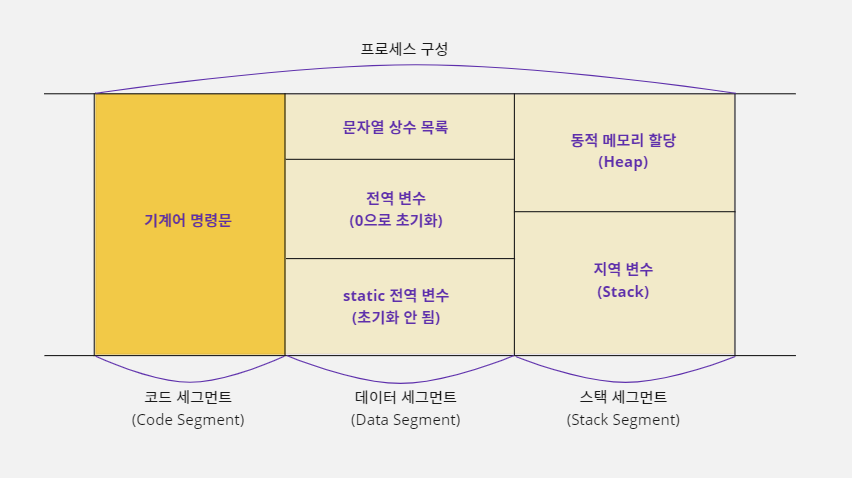
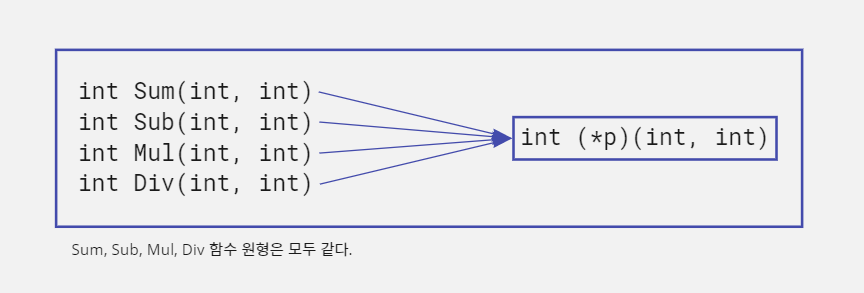
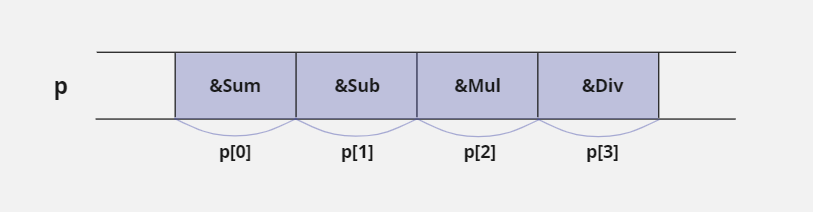

# 20. 함수 포인터

## 20-1. 함수 포인터

### 프로세스 메모리 영역에 저장되는 명령

- C 언어로 작성한 소스 코드가 컴파일러에 의해 기계어로 번역되면 실행 파일이 된다.
- 이 실행 파일은 CPU가 처리할 수 있는 '기계어 명령문' 단위로 이루어진다.
- 그리고 해당 프로그램이 실행되어 프로세스 형태로 메모리에 저장되면 프로그램의 명령문들은 코드 세그먼트(CS, Code Segment)에 옮겨진다.



- 결국 이 말은 명령문들도 메모리에 저장되어 있기 때문에 각 명령문마다 주소를 갖는다는 뜻이다.
- 메모리의 주소 값을 알고 있다면 당연히 포인터를 사용할 수 있을 것이다.
- 포인터 개념을 사용하면 특정 명령문이 저장된 메모리의 주소로 바로 이동해서 그 명령문을 실행할 수 있다.
- 하지만 제멋대로 메모리의 위치를 이동하면서 명령문을 실행하면 C 언어의 스택 프레임이 엉망이 되기 때문에 스택 프레임이 유지될 수 있도록 함수 단위로만 이동해야 한다.
- 스택 프레임이란 스택을 함수 단위로 구역을 나눠서 사용할 수 있도록 C 언어에서 제공하는 스택 관리 방식이다.
- 지금까지 배운 포인터는 데이터 세그먼트 또는 스택 세그먼트에 있는 변수의 주소나 메모리 주소를 저장해서 사용하는 데이터 포인터에 대한 이야기였다.
- 지금부터는 코드 세그먼트에 있는 명령문이 주소를 저장해서 포인터로 사용하는 방법에 대해 알아보자.

### 함수 포인터란?

- 함수 포인터(Function Pointer)란 특정 함수를 구성하는 시작 명령의 위치를 가리키는 포인터이다.
- 함수 포인터를 사용하면 해당하는 함수를 호출하여 실행할 수 있다.
- 함수 포인터에 대해 알아보기 위해 다음과 같이 두 개의 매개변수로 값을 받아서 이 값을 합산한 뒤 반환하는 `Sum`함수를 만들어보자.

```c
int Sum(int a, int b) {
    int result = 0;
    result = a + b;
    return result;
}
```

- 이 함수를 호출해서 사용하는 코드는 다음과 같다.

```c
int result = Sum(2, 3);  // result에는 2+3의 결과 값 5가 저장됨
```

- 이렇게 함수를 호출해서 사용하는 것이 일반적이다.
- 함수는 여러 개의 명령문으로 구성된다.
- 위 예시에서도 `Sum`함수는 3개의 명령문으로 구성되어 있다.
- 그래서 `Sum`함수 안에서 첫 번째 문장에 해당하는 `int result = 0;`이 저장된 메모리 위치의 주소가 `Sum`함수의 시작 주소가 된다.
- 하지만 명령문 자체는 얼마든지 중복될 수 있기 때문에 명령문을 기준으로 주소 값을 얻는 것은 어렵다.
- 즉, `Sum`함수에 사용한 `int result = 0;`코드는 다른 함수인 `Sub`함수에서도 `int result = 0;`이라고 사용할 수 있기 때문에, 이 코드를 함수 구별 기준으로 삼는 것은 적합하지
  않다는 뜻이다.
- 그래서 함수의 첫 번째 명령문을 기준으로 주소 값을 얻지 않고, 함수의 이름 앞에 `&`를 적으면 함수에 포함되는 첫 번째 명령문의 주소 값을 얻을 수 있다.

```c
&Sum;  // Sum 함수의 첫 번째 명령문 주소를 의미함. &를 적지 않아도 같게 처리됨
```

#### 함수의 주소 값으로 함수 실행하기

- 이제 이 주소 값을 저장할 수 있는 포인터를 선언해야 한다.
- 데이터를 가리키는 포인터가 자신이 가리킬 대상의 크기를 명시하듯이 함수 포인터는 함수 원형(Function Prototype)을 사용해서 포인터를 선언한다.
- 함수 포인터가 함수 원형을 사용하는 이유는 함수 원형을 알아야 함수를 호출할 때 스택 프레임을 구성할 수 있기 때문이다.
- 예를 들어 `Sum`함수의 원형은 `int Sum(int, int);`이기 때문에 다음과 같이 선언할 수 있다.

```c
int (*p)(int, int);  // Sum 함수를 가리킬 수 있는 함수 포인터를 선언함
p = &Sum;  // Sum 함수의 주소를 p에 저장함
```

- 이렇게 함수 포인터를 선언하여 자신이 호출할 함수의 주소를 저장했다면 다음과 같이 함수를 호출할 수 있다.

```c
int result = (*p)(2, 3);  // int result = Sum(2, 3); 과 같으므로 result에는 5가 저장됨
```

## 20-2. 함수 그룹

### 원형이 같은 함수들을 묶기

- 함수의 포인터를 사용하는 가장 단순한 이유는 같은 형식의 함수를 그룹으로 묶을 수 있기 때문이다.
- 여기에서 같은 형식이란 같은 수의 매개변수와 자료형 그리고 같은 형태의 반환값을 갖는 함수들을 말한다.
- 다음과 같이 사칙 연산을 하는 4개의 함수가 있다고 가정해보자.

```c
int Sum(int a, int b) { return a + b; }
```

```c
int Sumb(int a, int b) { return a - b; }
```

```c
int Mul(int a, int b) { return a * b; }
```

```c
int Div(int a, int b) { return a / b; }
```

- 위 4개의 함수를 사용하여 숫자 8과 2를 연산한 결과 값을 얻으려면 다음과 같이 코드를 구성할 것이다.

```c
int result1, result2, result3, result4;
result1 = Sum(8, 2);  // result1에는 값 10이 저장됨
result2 = Sub(8, 2);  // result2에는 값 6이 저장됨
result3 = Mul(8, 2);  // result3에는 값 16이 저장됨
result4 = Div(8, 2);  // result4에는 값 4가 저장됨
```

- 일반적으로 함수를 호출할 때는 이름을 사용하기 때문에 위 코드처럼 나열식으로 작성할 수 밖에 없다.
- 그런데 이 함수들을 잘 살펴보면 함수 이름만 다를 뿐 함수의 원형은 모두 같다.
- 따라서 다음처럼 함수의 포인터를 선언하면 이 함수들의 주소 값을 저장해서 사용할 수 있다.



- 같은 형태의 자료형을 묶을 때는 배열을 사용한다.
- 이 작업에서는 같은 함수 원형을 갖는 4개의 함수를 사용하기 때문에 배열을 사용하여 다음과 같이 선언할 수 있다.
- 그리고 각 함수의 주소 값으로 초기화했다.

```c
int (*p[4])(int, int) = {&Sum, &Sub, &Mul, &Div};
```

- 위 모드를 메모리 그림으로 보면 다음과 같다.



- 이렇게 함수 포인터를 배열 형식으로 묶으면 이 함수들을 연속해서 호출할 때 다음과 같이 반복문을 사용하여 코드를 단순화시킬 수 있다.
- 다음 예제는 함수 포인터를 배열로 선언해서 8과 2를 더하고 빼고 곱하고 나누는 작업을 반복문으로 처리하고 있다.

```c
int (*p[4])(int, int) = {&Sum, &Sub, &Mul, &Div};
int result[4], i;  // 함수를 호출하면 반환되는 결과 값 4개를 저장할 배열을 선언함

// Sum, Sub, Mul, Div 순으로 호출되어 10, 6, 16, 4 값이 result 배열에 차례대로 저장된다
for(i = 0; i < 4; i++) result[i] = (*p[i])(8, 2);
```

> #### 복잡한 선언은 typedef 문법으로 코드를 단순화시켜 사용하자
>
> ```c
> typedef int (*OP_TYPE)(int, int);  // OP_TYPE라는 새로운 자료형을 정의함
> OP_TYPE p[4] = {&Sum, &Sub, &Mul, &Div};
> ```

```c
#include <stdio.h>

int Sum(int a, int b) { return a + b; }

int Sub(int a, int b) { return a - b; }

int Mul(int a, int b) { return a * b; }

int Div(int a, int b) { return a / b; }

void main() {
    int (*p[4])(int, int) = {&Sum, &Sub, &Mul, &Div}, i;
    char op_table[4] = {'+', '-', '*', '/'};

    // Sum, Sub, Mul, Div 순으로 호출함
    for (i = 0; i < 4; i++) printf("%d %c %d = %d\n", 8, op_table[i], 2, (*p[i])(8, 2));
}
```

```text
8 + 2 = 10
8 - 2 = 6
8 * 2 = 16
8 / 2 = 4
```

## 20-3. 콜백 함수

### 라이브러리를 만드는 라이브러리 프로그래머

- 함수 포인터는 도대체 어디에 쓰는 것일까?
- 모든 프로그래머가 완제품 형식의 프로그램을 만들지는 않는다.
- 예를 들어 음성 데이터를 압축하거나 영상 데이터를 변환하는 작업들은 특별한 지식이 필요하기 때문에 쉽게 구현할 수 없다.
- 그래서 이런 기능을 쉽게 사용할 수 있도록 함수로 만들어서 판매하는 프로그래머들도 있다.
- 이들 프로그래머는 자신의 코드가 노출되면 안 되기 때문에 해당 코드를 컴파일해서 라이브러리(library, `*.lib`)형식의 파일로 제공한다.
- 그리고 라이브러리 안에 있는 함수들이 어떤 형태로 선언된 함수인지 알아야 코드를 자세히 볼 수 없는 사용자들도 사용할 수 있기 때문에 함수의 원형들을 헤더(header, `*.h`)파일에 적어서 함께 제공한다.
- 예를 들어 두 개의 정수 값을 넘겨 받아서 합산하는 `Sum`함수를 라이브러리 형태로 제공한다고 생각해보자.
- 그러면 라이브러리 사용자에게는 파일 내부를 볼 수 없는 라이브러리 파일 `sum.lib`와 라이브러리 파일을 설명하는 헤더 파일 `sum.h`를 모두 제공해야 한다.
- `#pragma`전처리기를 사용하면 컴파일러의 여러 가지 설정 값을 수정할 수 있다.
- 다음과 같이 사용하면 `sum.lib`파일을 이 프로그램에서 사용하겠다는 뜻이다.

> `sum.h`
>
> ```c
> // Sum 함수의 원형
> int Sum(int a, int b);
> ```
>
> `sum.lib`
>
> ```c
> // 두 값을 합산하는 함수
> int Sum(int a, int b) { return a + b; }
> ```
>
> ```c
> #include "sum.h"
> #pragma comment(lib, "sum.lib")
> 
> void main() {
>     int result = Sum(2, 3);
> }
> ```

### 라이브러리 프로그래머의 고민

- 라이브러리에 포함된 `Sum`함수를 사용하던 사용자(일반 프로그래머)가 `Sum`함수에 전달되는 두 숫자 값이 음수인 경우에 양수로 변환해서 합산하는 함수도 추가로 만들어 달라고 요청했다고 해보자.
- 그러면 라이브러리 프로그래머는 `SumABS`라는 새로운 함수를 추가한 후 다시 라이브러리 파일로 만들어서 사용자에게 제공해야 한다.

> `sum.h`
>
> ```c
> // Sum의 원형
> int Sum(int a, int b);
> 
> // SumABS의 원형
> int SumABS(int a, int b);
> ```
>
> `sum.lib`
>
> ```c
> // 두 값을 합산하는 함수
> int Sum(int a, int b) { return a + b; }
> 
> // 두 절대값을 합산하는 함수
> int SumABS(int a, int b) {
>     // 음수이면 -1을 곱해서 양수로 만듦
>     if(a < 0) a = a * (-1);
>     if(b < 0) b = b * (-1);
>     
>     return a + b;
> }
> ```
>
> ```c
> #include "sum.h"
> #pragma comment(lib, "sum.lib")
> 
> void main() {
>     int result1, result2;
>     
>     // result1에는 -1이 저장됨
>     result1 = Sum(2, -3);
>     
>     // result2에는 5가 저장됨
>     result2 = SumABS(2, -3);
> }
> ```

- 라이브러리 사용자가 계속 새로운 기능을 또 추가해 달라고 요청하면 어떻게 해야 할까?
- 함수가 계속 늘어나고, 라이브러리가 사용자의 요구에 점점 종속되는 결과를 가져온다.
- 그래서 라이브러리에 포함된 함수는 본래의 기능을 유지하고 사용자가 원하는 경우에 스스로 함수의 기능을 일부 수정할 수 있도록 제공하는 것이 더 좋다.
- 하지만 라이브러리 소스 코드 전체를 줄 수는 없을 것이다.
- 그러면 라이브러리 사용자는 어떻게 소스 코드 없이 라이브러리를 수정해서 사용할 수 있을까?

### 함수의 매개변수로 함수 포인터 사용하기

- 앞의 예시에서 `SumABS`함수에는 `a`값과 `b`값을 수정하는 작업이 추가되어 있다.
- 조건문으로 처리된 두 코드가 비슷하기 때문에 라이브러리 소스 코드에서 다음과 같이 함수로 만들어서 처리할 수도 있다.

```c
void MyAbsolute(int *p) {
    if (*p < 0) *p = (*p) * (-1);
}

int SumABS(int a, int b) {
    MyAbsolute(&a);  // if(a < 0) a = a * (-1); 과 같음
    MyAbsolute(&b);  // if(b < 0) b = b * (-1); 과 같음
    
    return a + b;
}
```

- 만약 라이브러리 사용자가 `MyAbsolute`같은 기능의 함수를 만들어서 기존 라이브러리에 있는 `SumABS`함수를 호출할 때 함께 사용하고 싶다면 어떻게 해야 할까?
- 기존 라이브러리에는 라이브러리 사용자가 새로 만들고자 하는 `MyAbsolute`라는 이름의 함수가 없기 때문에 함수 이름으로는 호출할 수 없다.
- 함수 포인터를 활용하면 함수 이름이 없어도 함수를 호출할 수 있다.
- 예를 들어 `MyAbsolute`함수는 함수의 원형이 `void MyAbsolute(int *);`이기 때문에 라이브러리 소스 코드에서 다음과 같이 포인터를 사용하면 이 함수의 주소를 받아서 사용할 수 있다.

```c
void (*p)(int *);
```

- 따라서 `SumABS`함수는 함수 포인터를 사용하여 다음과 같이 변경할 수 있다.
- 매개변수에서 `fp_abs`라고 사용할 때 `fp`는 함수 포인터(Function Pointer)의 약어이다.
- 프로그래밍할 때 변수 이름에 변수의 특징을 드러내 주면 다른 사람이 코드를 이해하기가 훨씬 수월하다.

```c
int SumABS(int a, int b, void (*fp_abs)(int *)) {
    (*fp_abs)(&a);  // MyAbsolute(&a)와 같음
    (*fp_abs)(&b);  // MyAbsolute(&b)와 같음
    
    return a + b;
}
```

- 라이브러리 프로그래머가 함수 포인터를 사용해 `SumABS`함수를 구성하면 사용자가 원하는 `MyAbsolute`함수가 없더라도 정상적으로 컴파일이 완료된다.
- 그리고 라이브러리 사용자가 `MyAbsolute`함수를 만들어서 자신이 사용하고 싶은 시점에 다음과 같이 `SumABS`함수를 사용할 수도 있다.

```c
SumABS(5, -1, &MyAbsolute);  // SumABS 함수에서 MyAbsolute 함수를 호출한 것과 같음
```

- `SumABS`함수를 이렇게 구성하면 `MyAbsolute`를 사용하고 싶을 때는 위의 예시처럼 `&MyAbsolute`를 세 번째 매개변수로 전달하면 된다.
- `MyAbsolute`함수를 사용하지 않는 경우에는 다음처럼 `SumABS`함수의 세 번째 매개변수에 `NULL`을 입력한다.

```c
SumABS(5, -1, NULL);  // SumABS 함수에서 MyAbsolute 함수를 사용하지 않는 경우
```

- `NULL`이 매개변수로 넘어오는 상황을 처리해보자.

```c
int SumABS(int a, int b, void (*fp_abs)(int *)) {
    if(fp_abs != NULL) (*fp_abs)(&a);
    if(fp_abs != NULL) (*fp_abs)(&b);
    
    return a + b;
}
```

- 조건문을 통해 `fp_abs`에 저장된 주소가 `NULL`인지 먼저 확인한 후 `(*fp_abs)(&a)` 또는 `(*fp_abs)(&b)`라고 사용해서 매개변수로 전달되는 함수를 호출한다.
- 그러면 `SumABS`함수를 사용할 때 `MyAbsolute`함수를 호출할 것인지 선택할 수 있게 된다.
- 이렇게 소스 코드를 수정하고 나면, `Sum`함수는 `SumABS`함수의 세 번째 매개변수에 `NULL`을 전달해서 사용하는 것과 같다.
- 따라서 함수의 이름을 `Sum`으로 통일하고 기능을 합칠 수 있다.
- 그리고 `a`변수 값과 `b`변수 값에 적용되는 기준이 다를 수도 있기 때문에 함수 포인터를 `a`, `b`변수마다 다르게 사용할 수 있도록 설정한다.
- 즉, 다음과 같이 함수 포인터를 하나 더 추가해서 `pa`와 `pb`로 변경한다.

> `sum.h`
>
> ```c
> /* Sum 함수의 원형 */
> 
> int Sum(int a, int b, void (*pa)(int *), void (*pb)(int *));
> ```
>
> `sum.lib`
>
> ```c
> /* 두 값을 합산하는 함수 */
> 
> int Sum(int a, int b, void (*pa)(int *), void (*pb)(int *)) {
> 
>     // pa 또는 pb에 함수의 주소 값이 할당되어 있으면 해당 함수를 호출한다.
>     if(NULL != pa) (*pa)(&a);
>     if(NULL != pb) (*pb)(&b);
>     
>     return a + b;
> }
> ```

- 예를 들어 `Sum`함수를 사용하는 사용자가 함수의 기능은 변경하지 않고 데이터 합산만 하고 싶다면 다음과 같이 사용하면 된다.

```c
#include "sum.h"
#pragma comment(lib, "sum.lib")

void main() {
    int result = Sum(-3, -2, NULL, NULL);  // result에 값 -5가 저장됨
}
```

- 이렇게 사용하면 `Sum`함수에 세 번째, 네 번째 매개변수의 함수 포인터에 `NULL`값이 대입되어 `Sum`함수의 `if`문은 둘 다 처리되지 않는다.
- 따라서 `-3`과 `-2`는 양수로 변환되지 않고 `a + b`결과 값 `-5`를 반환한다.

### 함수의 매개변수로 함수의 주소를 전달하여 호출하기

- 만약 라이브러리 사용자가 `Sum`함수의 첫 번째 매개변수에만 음수가 전달되는 경우에 양수로 바꿔서 더하고 싶다면 다음과 같이 함수를 사용하면 된다.

```c
#include "sum.h"
#pragma comment(lib, "sum.lib")

// 정수 변수 값의 주소를 넘겨주면 해당 값이 음수이면 양수로 변환하는 함수
// 이 함수를 Sum 함수가 사용할 수 있도록 함수의 원형을 void (*)(int *)형식으로 맞춰야 한다
void MyAbsolute(int *p) {
    
    // 전달된 주소에 있는 값이 음수이면 -1을 곱해서 양수로 만듦
    if(*p < 0) *p = (*p) * (-1);
}

void main() {
    int result = Sum(-3, -2, MyAbsolute, NULL);  // result에 값 1이 저장됨
}
```

- 단계별로 뜯어보자.<br>

1. `main`함수에서 `Sum`함수를 호출한다.
2. `Sum`함수의 세 번째 매개변수에 `MyAbsolute`함수의 주소 값이 넘어가서 `Sum`함수의 함수 포인터 `pa`에 저장된다.
3. `Sum`함수의 `pa`변수가 `NULL`이 아니기 때문에 `if(NULL != pa) (*pa)(&a);` 문장이 수행된다.
4. `Sum`함수의 `pa`변수가 `MyAbsolute`함수의 주소 값을 가지고 있기 때문에 `(*pa)(&a);`는 `MyAbsolute(&a);`라고 사용한 것과 같다.
5. 따라서 `Sum`함수의 매개변수 `a`의 주소 값이 `MyAbsolute`함수의 포인터 변수 `p`에 저장된다.
6. `MyAbsolute`함수의 포인터 변수 `p`는 변수 `a`이 주소 값을 저장하고 있다.
7. 포인터 변수 `p`가 가리키는 값은 음수인 `-3`이라서 `if(*p < 0) *p = (*p) * (-1);` 조건문이 실행된다.
8. 따라서 `-3`에 `-1`이 곱해져서 양수로 변환된 결과 값 `3`이 `Sum`함수의 변수 `a`에 저장된다.
9. 함수의 포인터 `pb`에는 `NULL`값이 저장되어 있기 때문에 `if(NULL != pb) (*pb)(&b);` 조건문은 실행되지 않는다.
10. `Sum`함수의 변수 `a` 값이 `-3`에서 `3`으로 변경되었기 때문에 `3 + (-2)`가 수행되어 `1`이 반환된다.

- 결과적으로 라이브러리 안에 있는 `Sum`함수는 수정되지 않았지만, 함수 포인터를 사용해서 `MyAbsolute`함수를 호출했기 때문에 다음고 같이 사용한 것과 같다.

```c
int Sum(int a, int b) {
    MyAbsolute(&a);  // if(NULL != pa) (*pa)(&a);
    return a + b;
}
```

### 함수의 암시적 호출: 콜백

- 이렇게 함수 포인터를 사용하면 `Sum`함수는 `a`, `b`변수에 대한 어떤 요구 조건이 생겨도 다 처리할 수 있다.
- 라이브러리에 포함된 `Sum`함수에 새로운 기능이 필요하더라도 사용자가 라이브러리 프로그래머에게 기능을 추가해 달라는 요구를 하지 않아도 되는 것이다.
- 왜냐하면 자신이 직접 `MyAbsolute`함수를 만들어서 이 함수의 주소 값을 `Sum`함수에 매개변수로 전달하면 되기 때문이다.
- 하지만 `sum.lib`를 사용하는 사용자 입장에서는 `Sum`함수 내부의 소스 코드를 볼 수 없다.
- 그렇기 때문에 라이브러리를 사용하는 프로그래머의 소스 코드에는 `MyAbsolute`함수가 구현만 되어 있지 실제로 언제, 어떻게 호출되는지 알 수 없다.
- 즉 `Sum`함수가 적절한 시점에 매개변수로 전달된 `MyAbsolute`함수를 호출해서 결과 값을 만들어 준다고 예상만 할 뿐이다.
- 이런식으로 자신이 사용할 함수가 명시적으로 호출되지 않고 함수 포인터에 의해서 호출되는 방식을 암시적 호출, '콜백'(Callback)이라고 한다.
- 그리고 이때 암시적으로 호출되는 `MyAbsolute`함수를 '콜백 함수'라고 한다.
- 암시적 호출이란 구체적으로 함수를 명시 하지는 않지만 주어진 상황을 통해 판단해서 함수를 사용(호출)하는 방식이다.
- 예를 들어 윈도우 운영체제에서 모니터에 어떤 화면이 출력되는 프로그램을 개발한다면 반드시 콜백을 사용해야 한다.

> #### 콜백 함수는 미래를 준비하는 함수이다
>
> - 라이브러리 프로그래머들은 자신의 라이브러리를 사용할 많은 사용자들을 위해 다양한 조건을 미리 예측해야 한다.
> - 그러나 예측을 많이하고, 예측한 내용을 모두 함수에 반영하다 보면 조건문이 많아져서 해당 함수는 비효율적인 함수가 될 수도 있기 때문에 다 좋은 것은 아니다.
> - 그래서 정말 필요한 기능만 함수에 구현하고 나머지 예상되는 조건은 함수 포인터를 사용하여 이 함수를 사용할 사용자들에게 도움을 요청하는 것이 바로 콜백 구조이다.
> - 예측할 수 없는 여러 가지 조건을 미리 조건문으로 처리하는 것은 현실적으로 어렵지만 콜백 구조를 사용하면 이후에 어떤 문제가 생기든 콜백 함수를 사용해서 대처할 수 있다.
> - 이것이 운영체제가 콜백 구조를 많이 사용하는 이유이다.
