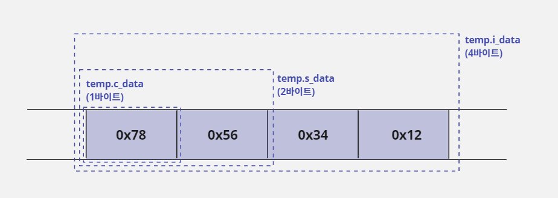
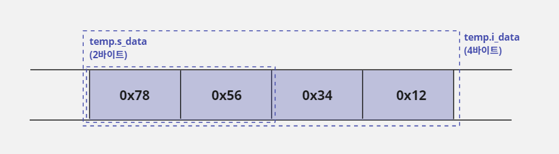
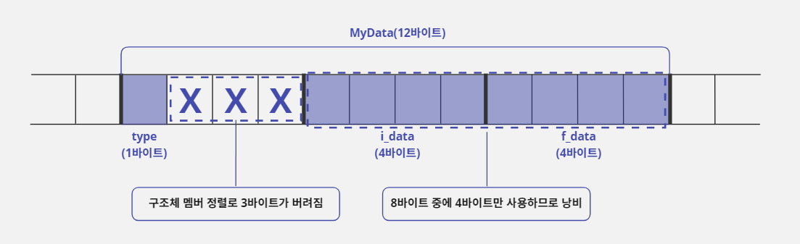
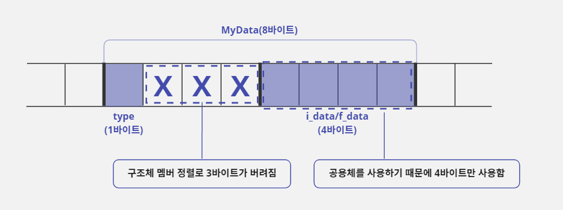
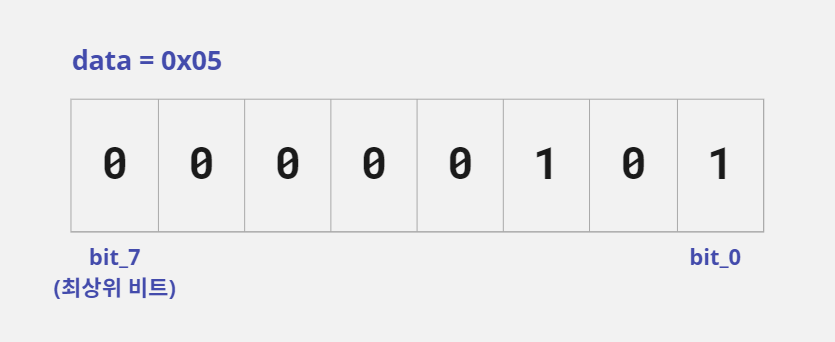
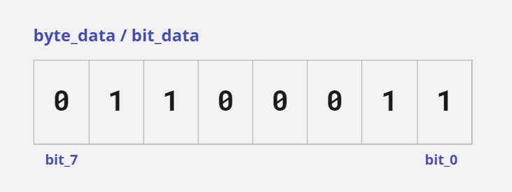
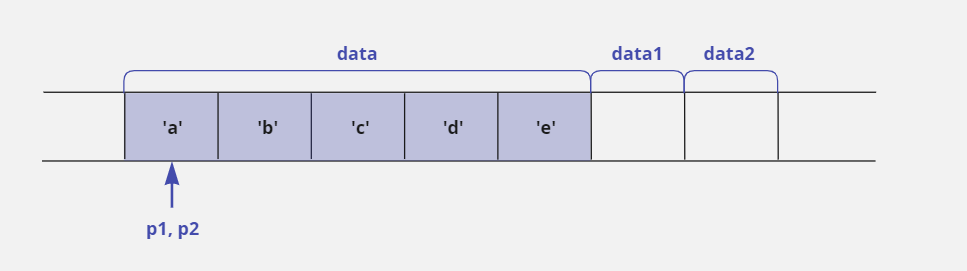
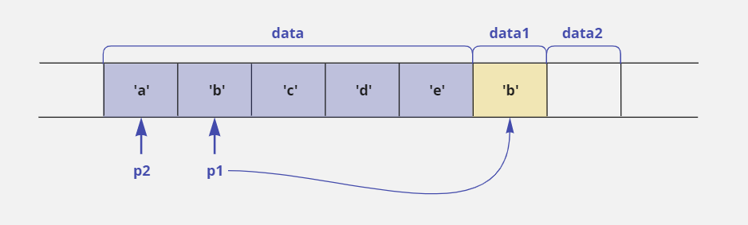
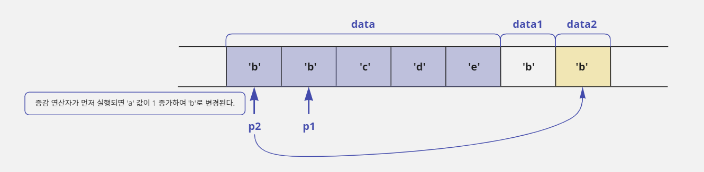

# 주니어 프로그래머 딱지 떼는 일곱 가지 팁!

## Tip 1. 공용체를 적재적소에 활용하면 메모리를 절약할 수 있다

### 구조체 문법과 비슷한 공용체

- 사용자 정의 자료형을 만드는 구조체와 문법 구조가 비슷한 공용체(union) 문법이 있다.
- 구조체에서 `struct`키워드를 적는 위치에 공용체는 `union`이라고 적는다.
- 그 외 공용체의 문법은 구조체의 문법과 거의 비슷하다.
- 다음은 공용체 문법과 `typedef`를 사용해서 `Convert Data`라는 새로운 자료형을 만드는 예제이다.

```c
typedef union ConvertData {
    char c_data;       // 1바이트
    short int s_data;  // 2바이트
    int i_data;        // 3바이트
} CD;
```

- 공용체도 구조체와 마찬가지로 새로운 자료형을 만들거나 그 자료형으로 변수를 선언하려면 항상 `union`키워드를 적어주어야 한다.
- 위 예제에서는 `typedef`문법을 함께 사용해서 `CD`라는 자료형을 추가로 만들었다.
- 따라서 다음과 같이 `CD`를 사용하면 `union`키워드를 사용하지 않고도 간단하게 변수를 선언할 수 있다.

```c
CD temp;  // union ConvertData temp; 와 같음
```

### 공용체의 요소들은 할당된 메모리를 공유한다

- 이렇게 구조체 문법과 비슷한 공용체 문법이 있는 이유는 무엇일까?
- 구조체로 만든 자료형의 크기는 구조체를 구성하는 요소들의 크기를 모두 더한 것과 같다.
- 하지만 공용체로 만든 자료형의 크기는 공용체를 구성하는 요소들 중에서 가장 큰 크기와 같다.
- 따라서 이전에 선언한 `ConvertData` 공용체는 `i_data`요소가 4바이트로 가장 크기 때문에 `CD`로 선언한 `temp`변수의 크기는 4바이트가 된다.
- 공용체 내부에 선언한 나머지 요소 `c_data`와 `s_data`는 메모리를 할당 받지 않았으니 사용할 수 없는 것인가? Nope.
- 공용체라는 이름이 말해 주듯이 공용체를 구성하는 각 요소들은 서로 같은 메모리를 공유하는 형태로 되어 있다.
- 즉 `ConvertData` 공용체의 `i_data`요소는 4바이트 전체를 사용하고, `s_data`요소는 4바이트에서 첫 2바이트를 사용하며, `c_data`요소는 처음 1바이트만을 사용하는 개념이다.
- 그래서 다음과 같이 제일 큰 `i_data`요소에 값을 대입하면 `s_data`와 `c_data`에도 영향을 미친다.

```c
temp.i_data = 0x12345678;
```



- 공용체는 각 요소들이 같은 메모리를 공유하기 때문에 위의 그림에서처럼 `temp.i_data`에 값을 대입했을 때 `temp.s_data`에는 `0x5678`, `temp.c_data`에는 `0x78`을 대입한 것과 같은 효과가 있다.
- 그래서 이런 공용체의 기능을 잘 이용하면 4바이트 크기를 갖는 정수 값에서 2바이트나 1바이트의 값을 추출할 수 있다.
- 예를 들어 4바이트 크기의 값을 입력 받아 앞에서 2바이트 크기만 사용하고 싶다면 다음과 같이 `temp.i_data`로 값을 입력 받고 `temp.s_data`로 사용하면 되는 것이다.

```c
CD temp;
short int s;
temp.i_data = 0x12345678;  // 4바이트 공간에 정수 값을 대입함
s = temp.s_data;           // 변수 s에 0x5678이 저장됨
```



### 공용체는 메모리 절약의 끝판왕

- 공용체는 메모리를 절약하는 용도로 더 많이 사용한다.
- 아래에 `MyData`라는 구조체를 선언했다.
- 구조체의 요소 중 `type`요소의 값이 `0`이면 `i_data` 변수에 정수 값을 저장하고, `type`요소의 값이 `1`이면 `f_data`에 실수 값을 저장한다고 가정해보자.
- 그리고 `i_data`와 `f_data`가 동시에 사용되는 경우는 없다고 가정하자.

```c
struct MyData {
    char type;
    int i_data;    // type 요소 값이 0이면 사용함
    float f_data;  // type 요소 값이 1이면 사용함
};
```

- `MyData`구조체로 변수를 선언하면 `type`요소의 값이 무엇인지에 따라 `i_data`또는 `f_data`중에 하나만 사용되기 때문에 항상 4바이트를 낭비하게 된다.
- 왜냐하면 `type`요소의 값이 `0`이면 `f_data`가 선언된 메모리는 사용되지 않을 것이고, `type`요소의 값이 `1`이면 `i_data`가 선언된 메모리가 사용되지 않기 때문이다.



- 위 상황처럼 구조체의 각 요소가 함께 사용되지 않고 서로 반대되는 경우에만 사용될 때, 두 요소가 메모리를 공유한다면 공간을 낭비하지 않을 것이다.
- 따라서 다음과 같이 공용체 문법을 사용해서 새로운 자료형을 만들고, 그 자료형으로 `MyData`구조체에 요소를 추가하면 위에서 발생한 메모리 낭비 문제를 해결할 수 있다.

```c
// i_data와 f_data가 4바이트 메모리를 공유하는 공용체 자료형을 정의함
union SharedType {
    int i_data;    // 정수 값을 저장할 변수
    float f_data;  // 실수 값을 저장할 변수
};

struct MyData {
    char type;
    union SharedType data;
};

void main() {
    struct MyData a, b;
    a.type = 0;  // a 구조체의 type 요소에 0을 저장함
    a.data.i_data = 100;
    b.type = 1;  // b 구조체의 type 요소에 1을 저장함
    b.data.f_data = 3.14f;
}
```

- `type`요소의 값이 `0`일 때는 `data.i_data`요소를 사용해서 정수를 저장하고, `type`요소의 값이 `1`일 때는 `data.f_data`요소를 사용해서 실수를 저장하면 된다.
- 이렇게 하면 앞에서 구조체를 사용했던 것과 같은 기능을 할 것이다.
- 그리고 `SharedType`자료형이 공용체이기 때문에 결과적으로 동시에 사용하지 않는다는 조건만 만족한다면 몇 개의 변수를 사용하든지 상관없이 공용체로 해당 변수들을 묶어서 메모리를 절약할 수 있다.



## Tip 2. 비트 단위 연산이 복잡하다면? 구조체와 공용체를 쓰자

### 구조체 문법으로 비트 단위 분리하기

- 변수에 입력된 정보를 비트 단위로 값을 확인하거나 변경하고 싶은 경우에는 비트 연산자를 사용하면 된다.
- C 언어는 구조체 문법에서 비트 단위로 데이터를 사용하는 기능을 추가로 제공하고 있다.
- 아래와 같이 구조체를 선언하면 새로운 자료형 `BitType`이 1바이트 크기로 만들어진다.

```c
// 비트 단위 정보를 다룰 수 있도록 구조체를 선언함
struct BitType {
    unsigned char bit_0 : 1;
    unsigned char bit_1 : 1;
    unsigned char bit_2 : 1;
    unsigned char bit_3 : 1;
    unsigned char bit_4 : 1;
    unsigned char bit_5 : 1;
    unsigned char bit_6 : 1;
    unsigned char bit_7 : 1;
};
```

- 각 요소(`bit_0`~`bit_7`)의 오른쪽에 `: 1`이라고 적은 것은 비트 크기를 의미한다.
- 예를 들어 `unsigned char bit_0 : 1;`이라고 적으면 `bit_0`은 1비트 값을 사용한다는 뜻이다.
- 따라서 `BitType`구조체는 `bit_0`부터 `bit_7`까지 1비트 값을 총 8개 정의했기 때문에 크기가 1바이트(8비트)가 된다.
- 다음과 같이 `BitType`으로 `data`변수를 선언하면 `data`변수는 1바이트 크기로 메모리가 할당된다.
- 그리고 구조체의 요소에 비트 값을 대입하면 `data`변수에는 값 `0x05`가 저장된다.
- 따라서 비트 연산자를 사용하는 것보다는 좀 더 편하게 비트 값을 사용할 수 있다.

```c
struct BitType data;

data.bit_0 = 1;
data.bit_1 = 0;
data.bit_2 = 1;
data.bit_3 = 0;
data.bit_4 = 0;
data.bit_5 = 0;
data.bit_6 = 0;
data.bit_7 = 0;
```



#### 구조체 비트 분리 기능을 사용한 변수는 다른 일반 변수와 값을 주고받기 어렵다

- `data`변수에 입력된 값을 다음처럼 `unsigned char`형으로 선언한 `temp`변수에 대입하려고 하면 오류가 발생한다.

```c
unsigned char temp;
temp = data;  // 오류 발생: data는 BitType 구조체로 만든 변수임
```

- `temp`도 1바이트이고 `data`변수도 1바이트이기 때문에 `data`값을 `temp`에 대입하면 문제가 없을 것이라 생각할 수도 있지만 구조체 변수는 `data.bit_0`과 같이 `.`(요소 지정) 연산자와 요소(`bit_0`)를 함께 사용해야만 대입 연산을 할 수 있다.
- 예외적으로 같은 구조체로 선언한 변수 간에는 변수 이름만으로도 복사가 된다.
- 위의 예제는 형 변환을 사용해도 오류를 해결할 수 없다.
- 왜냐하면 이 문제는 단순히 데이터 크기의 차이가 원인이 아니라 구조체의 비트 분리 문법을 사용해서 데이터 형식이 달라져버려서 발생한 것이기 때문이다.
- 예를 들어 `int`형과 `float`형의 경우에 데이터 크기는 같지만 데이터를 구성하는 형식이 다르기 때문에 `float`값을 `int`에 대입하면 값이 제대로 대입되지 않는 것과 비슷한 상황인 것이다.

```c
unsigned char temp;
temp = (unsigned char) data;  // 오류 발생: 데이터 형식이 달라서 형 변환에 실패함
```

- 따라서 다음과 같이 메모리를 강제로 복사하는 `memcpy`함수를 사용해 문제를 해결할 수 있다.

```c
unsigned char temp;

// data 변수의 시작 주소에서 temp 변수의 시작 주소로 1바이트 크기만큼 메모리를 복사함
memcpy(&temp, &data, 1);
```

### 공용체를 사용해서 좀 더 편하게 비트 단위 분리하기

- 다음과 같이 공용체를 선언하면 `BitData`자료형의 크기는 1바이트가 되고 `bit_data`요소와 `byte_data`요소는 1바이트 크기의 메모리를 공유하게 된다.

```c
union BitData {  // 1바이트 크기의 자료형
    struct BitType bit_data;  // 1바이트
    unsigned char byte_data;  // 1바이트
};
```

- 따라서 다음과 같이 `BitData`자료형으로 `temp`변수를 선언하고 `temp`변수의 `byte_data`요소에 값 `0x63`을 대입하면, 메모리를 공유하는 `temp`변수의 `bit_data`요소에도 비트 단위로 값을 대입한 것과 같다.

```c
union BitData = temp;
temp.byte_data = 0x63;
```



```c
/* 구조체의 비트 분리 기능을 사용하여 변수의 비트 값 출력하기 */

#include <stdio.h>

struct BitType {  // 구조체를 비트 단위의 정보를 다룰 수 있도록 선언함
    unsigned char bit_0: 1;
    unsigned char bit_1: 1;
    unsigned char bit_2: 1;
    unsigned char bit_3: 1;
    unsigned char bit_4: 1;
    unsigned char bit_5: 1;
    unsigned char bit_6: 1;
    unsigned char bit_7: 1;  // 최상위 비트
};

union BitData {  // 1바이트 크기의 자료형
    struct BitType bit_data;
    unsigned char byte_data;
};

void main() {
    union BitData temp;
    temp.byte_data = 0x63;

    printf("byte_data : %x\n", temp.byte_data);
    printf("bit_data : %d%d%d%d %d%d%d%d\n", temp.bit_data.bit_7, temp.bit_data.bit_6, temp.bit_data.bit_5,
           temp.bit_data.bit_4, temp.bit_data.bit_3, temp.bit_data.bit_2, temp.bit_data.bit_1, temp.bit_data.bit_0);
}
```

```text
byte_data : 63
bit_data : 0110 0011
```

- 위 예제를 반대로 구성하여 `bit_data`에 비트 값을 넣고 `byte_data`로 확인하는 것도 가능하다.
- 연산 능력은 비트 연산자가 더 좋다.
- 개인적으로 비트 연산자를 사용하는 것을 더 추천한다.

## Tip 3. #define과 typedef를 헷갈리지 말자

- 전처리기인 `#define`문법과 사용자 정의 자료형을 만드는 `typedef`문법은 다음처럼 A를 B로 치환하는 형식을 가지고 있다.

```c
typedef unsigned short int * PSI;  // PSI라는 새로운 자료형을 정의함
```

```c
#define PSI unsigned short int *  // 전처리기라서 끝에 ;이 필요 없음
```

- `typedef`를 사용하면 `unsigned short int *`자료형을 `PSI`자료형으로 새롭게 정의할 수 있다.
- 그리고 `#define`문법을 사용하고 소스 코드에 `PSI`라고 쓰면 컴파일할 때 `PSI`가 `unsigned short int *`로 치환된다.
- 따라서 다음과 같이 사용하면 두 문법은 아주 비슷해 보인다.

```c
typedef unsigned short int *PSI;
PSI p_temp;  // unsigned short int *p_temp; 와 같음
```

```c
#define PSI unsigned short int *

PSI p_test;  // unsigned short int *p_test; 와 같음
```

### #define을 사용해 자료형을 치환하면 문제가 생긴다

- 단순하게 사용했을 때는 두 문법이 비슷하게 보이지만 내용을 조금 더 추가해 보면 두 문법이 다르다는 것을 알 수 있다.

```c
typedef unsigned short int *PSI;
PSI p_temp, p1;  // unsigned short int *p_temp, unsigned short int *p1; 을 의미함
```

```c
#define PSI unsigned short int *

PSI p_test, p2;  // unsigned short int *p_test, unsigned short int p2; 를 의미함
```

- `typedef` 문법을 사용하면 자료형을 새로 만든 것이기 때문에 `PSI`가 `unsigned short int *`를 의미한다.
- 따라서 `PSI p_temp, p1;`이라고 사용하면 `unsigned short int *p_temp, *p1;`을 의미한다.
- 즉 `p_temp, p1`변수 모두 `unsigned short int *`형식의 포인터로 선언된다.
- 하지만 `#define`을 사용하면 `p_test`만 `unsigned short int *`로 바뀐다.
- 따라서 `PSI p_test, p2;`라고 사용하면 `unsigned short int *p_test, p2;`를 의미한다.
- 즉 `p_test`는 `unsigned short int *`형식의 포인터로 선언되지만 `p2`는 `unsigned short int`형 일반 변수로 선언된다.
- 자료형을 치환하기 위해 `#define`을 사용하는 것은 편법일 뿐이다.
- 따라서 자료형을 치환할 때는 원칙을 지켜서 `typedef`문법을 사용하자.

### typedef 문법으로 상수 치환은 불가능하다

- 반대의 경우도 마찬가지이다.
- 두 문법이 비슷하다고 `typedef`문법을 자료형 치환이 아닌 단순 치환 형태로 사용하면 안된다.

```c
typedef 100 MAX_COUNT;  // 오류 발생: 상수는 자료형이 아님
```

- `typedef`문법은 `typedef`키워드를 제거했을 때 변수를 선언하는 형식을 유지해야 한다.

## Tip 4. 열거형: 상수를 좀 더 효과적으로 치환하는 방법

```c
#define BLACK    0
#define WHITE    1
#define RED      2
#define GREEN    3
#define BLUE     4
#define YELLOW   5
```

- 이렇게 나열해서 적으면 불편할 것이다.
- 상수를 연속적으로 치환하는 경우에는 열거형(enum) 상수를 사용해서 선언하자.

```c
enum MY_COLOR { BLACK, WHITE, RED, GREEN, BLUE, YELLOW };
```

- 이렇게 열거형 상수를 사용하면서 상수 값을 따로 적지 않으면 처음 위치에 있는 `BLACK`값이 0으로 치환되고 그 뒤에 있는 치환문(`WHITE`, `RED`, ⋯)들은 차례대로 1씩 증가한다.
- 이렇게 선언한 열거형 상수는 `#define`을 선언한 것과 같은 형태로 사용할 수 있다.

```c
int my_data = GREEN;  // my_data 에 0을 대입함
```

## Tip 5. 조건부 컴파일: 자기가 만든 코드를 테스트하는 것이 프로그래머의 기본이다

- 프로그램을 만들다 보면 소스 파일의 여러 곳에 자신의 코드를 체크하기 위한 테스트 코드를 추가하게 된다.

```c
int ProcessData(int data) {
    int result;
    if(data < 256) {            // 예외 확인을 위한 테스트 코드
        result = data * 100;
    } else {                    // 예외 확인을 위한 테스트 코드
        printf("Error!!\n");
    }
    return result;
}
```

- 테스트 코드를 한 곳에만 사용한 것이 아니고 소스 코드 전체에 여기저기 사용했다면 코드 정리가 어려울 것이다.

### 전처리기를 사용해서 조건에 따라 필요한 문장만 골라 컴파일하기

- C 언어는 주어진 조건에 따라 컴파일할 수 있도록 다양한 전처리기를 제공한다.

#### #ifdef 전처리기와 #endif 전처리기

- `ifdef`는 if define의 줄임 표현이고 `endif`는 end of ifdef의 줄임 표현이다.
- 아래이 두 코드는 컴파일된 결과가 같다.

```c
int ProcessData(int data) {
    int result;
    if(data < 256) {            // 예외 확인을 위한 테스트 코드
        result = data * 100;
    } else {                    // 예외 확인을 위한 테스트 코드
        printf("Error!!\n");
    }
    return result;
}
```

```c
#define MY_DEBUG

int ProcessData(int data) {
    int result;
#ifdef MY_DEBUG                  // 이 구간은 MY_DEBUG가
    if(data < 256)               // #define문으로 선언되어 있어야
#endif                           // 컴파일된다.
        result = data * 100;
#ifdef MY_DEBUG                  // 이 구간은 MY_DEBUG가
    else                         // #define문으로 선언되어 있어야
        printf("Error!!\n");     // 컴파일된다.
#endif                           //
    return result;
}
```

- 결론적으로 소스 코드에서 `#define MY_DEBUG` 치환문만 제거하면 소스에 있는 모든 `#ifdef MY_DEBUG` ~ `#endif`가 주석으로 처리되는 효과가 생겨서 테스트 코드를 관리하기 편해진다.
- 이렇게 테스트 코드를 관리하는 방법을 '조건부 컴파일'이라고 부른다.

#### #ifdef와 반대인 #ifndef 전처리기

- `#ifdef`와 반대되는 의미로 `#ifndef`가 제공되는데 이 전처리기는 if not define을 의미한다.
- 다음 예시에서 `MY_DEBUG`가 `#define`되지 않았기 때문에 `#ifndef MY_DEBUG`에서 `#endif`까지 컴파일에 포함된다.

```c
#ifndef MY_DEBUG  // if not define의 뜻
        
// 사용하고 싶은 코드(생략)

#endif
```

### 헤더 파일 중복 참조를 막는 방법

- 위에서 이야기한 조건부 컴파일 전처리기들은 실무에서 헤더 파일을 선언할 때 더 많이 사용한다.
- `#include`를 중복 사용해서 발생하는 오류는 `#ifndef`~`#endif`문을 사용하여 해결할 수 있다.

> `test.h`
> 
> ```c
> #ifndef _TEST_H_  // _TEST_H_ 가 정의되어 있지 않다면 이후 코드를 컴파일함
> #define _TEST_H_  // _TEST_H_ 를 정의함
> 
> struct MyData {
>     int a;
>     int b;
> };
> 
> #endif
> ```

- 위와 같이 헤더 파일을 구성하면 `test.h`헤더 파일이 처음 `#include`될 때는 `_TEST_H_`가 정의되어 있지 않아서 `#ifndef`를 처리한다.
- 그리고 `#define _TEST_H_`코드를 수행해서 `_TEST_H_`가 정의된다.
- 따라서 `test.h`헤더 파일이 다시 `#include`되더라도 `_TEST_H_`가 이미 정이되어 있기 때문에 `#ifndef`에서 `#endif`까지 컴파일에서 제외된다.

## Tip 6. 포인터와 증감 연산자를 잘 써야 명령문이 간단해진다

- 포인터를 사용하다 보면 비슷하게 생긴 명령문이 완전히 다르게 동작해서 오류가 발생하는 경우가 많다.
- 그 중에서도 포인터와 증감 연산자를 함께 사용하면 연산자 우선순위와 증감 연산자의 전위·후위 연산 특성 때문에 실수를 많이 할 수밖에 없습니다.
- 하지만 포인터와 증감 연산자를 잘 활용하면 명령문을 간단한 형태로 만들 수 있기 때문에 실무에 있는 프로그래머들이 즐겨 사용한다.
- 아래의 표현들을 정확하게 알아두자!

### *p++와 *++p의 의미

- `*p++`는 자신이 가리키는 주소에 저장된 값을 사용한 후 자신의 주소를 증가시킨다는 의미이고 `*++p`는 자신의 주소를 증가시킨 후에 그 주소에 가서 값을 사용한다는 뜻이다.

```c
char data[5] = {'a', 'b', 'c', 'd', 'e'};
char *p1 = data, *p2 = data, data1, data2;

// *p1이 먼저 처리되어 data1에는 'a'값이 저장된다.
// 저장 후에 p1++가 처리되어 주소가 증가하면 p1은 'b'의 위치로 이동하지만 data1에는 영향이 없다.
data1 = *p1++;

// p2의 주소가 먼저 증가되어 p2는 'b'이 위치로 이동한다.
// 이동후에 *p2가 처리되어 data2에는 'b'값이 저장된다.
data2 = *++p2;
```

- 작업 후에 포인터 변수 `p1`과 `p2`는 둘 다 `data`배열의 두 번째 요소 주소를 가리킨다.
- 하지만 작업 순서 때문에 `data1`에는 값 `a`가, `data2`에는 값 `b`가 저장된다.

### *++p와 ++*p는 서로 다른 의미

- `*++p`는 `p`가 가지고 있는 주소를 증가시킨 후 그 주소에 저장된 값을 사용한다는 뜻이다.
- `++*p`는 `p`가 가지고 있는 주소에 저장된 값을 1만큼 증가시키겠다는 뜻이다.
- 따라서 `*++p`는 `p`의 주소가 변경되고, `++*p`는 `p`가 가리키는 대상의 값이 변경된다.

```c
char data[5] = {'a', 'b', 'c', 'd', 'e'};
char *p1 = data, *p2 = data, data1, data2;
```



```c
// ++p1이 먼저 처리되어 p1은 'b'의 위치로 이동한다.
// 이동 후에 *p1이 처리되어 data1에는 값 'b'가 저장된다.
data1 = *++p1;
```



```c
// p2가 가리키는 주소에 가서 해당 주소에 저장된 값을 1만큼 증가시키고
// 그 값을 data2에 저장한다.
// p2는 주소가 변경되지 않는다.
data2 = ++*p2;
```



- 결과적으로 `data1`, `data2`에는 값 `b`가 똑같이 들어갔지만 처리 과정에 차이가 많이 난다.

## Tip 7. 개발 도구의 도움말 웹 페이지를 활용하자

- 문자열을 복사하는 함수, 문자열 길이를 얻는 함수를 프로그래머가 일일이 만들어 사용할 필요가 없다.
- C 언어에서 제공하는 `strcpy`, `strlen`같은 런타임 함수를 사용하면 된다.
